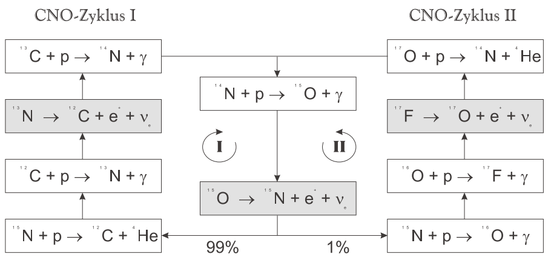
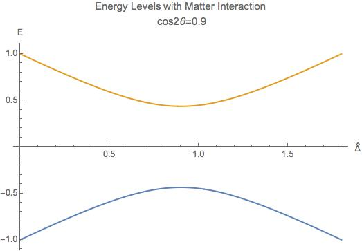
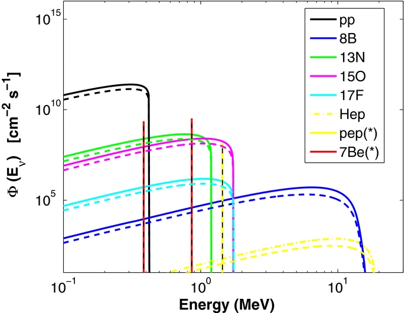

Stars as Neutrino Factories
=======================================


Here we review the physics of solar neutrinos, with neutrino production, neutrino flavor mixing which is modified by matter interactions and thermal motion of nuclei, and finally the neutrino energy spectra of different nuclear reactions. A simple analysis of supernova neutrino spectra shows that neutrino spectra for supernova are not well understood.


Neutrinos in Astrophysics
-------------------------------


Neutrinos and anti-neutrinos are particles produced in many nuclear reactions such as beta decays,

.. math::
   {}^A_Z X \to {}_{Z+1}^AX + e^- +\bar \nu_e .


In such reactions, charged current weak interaction plays a role which takes a down quark in neutron to a up quark while releasing electrons and anti-electron neutrino,

.. math::
   n\to p + e^- + \bar \nu_e .


.. _fig-Beta_Negative_Decay:


   Feynman diagram of beta decay. The charged current weak interaction boson in this case is a :math:`W^-`. Credit: Joel Holdsworth, within public domain.


More generally, positron emission and electron capture are also neutrino related nuclear reactions which is explained in table :ref:`table:Neutrino_Reactions`. In the context of astrophysics, (anti-)neutrinos also participate in nuclear reaction chains in stars, synthesis of heavy and rare elements and more.


.. _table-Neutrino_Reactions:

.. figure:: assets/stars-as-neutrino-factories/neutrino-related-reactions.png
   :align: center

   Neutrino related nuclear or leptonic reactions.


.. admonition:: LaTeX Code for The Table
   :class: toggle

   .. code:: tex

      \begin{table}[ht]
      \centering
       \begin{tabular}{|c | c | c|}
       \hline
       Reaction & Equation & Boson   \\ [0.5ex]
       \hline
       Electron emission & ${}^A_Z X \to {}^A_{Z+1}X + e^- +\bar \nu_e$ & $W$  \\
       Positron emission & ${}^A_Z X \to {}^A_{Z-1}X + e^+ + \nu_e$ & $W$  \\
       Electron capture & ${}^A_Z X + e^- \to {}^A_{Z-1}X  + \nu_e$ &  $W$ \\
       Positron capture & ${}^A_Z X + e^+ \to {}^A_{Z+1}X  + \bar\nu_e$ &  $W$ \\
       [0.5ex]
       \hline

       Electron annihilation &  $e^- + e^+  \to \nu_e + \bar\nu_e $  & $W$ \\
       Electron annihilation &  $e^- + e^+  \to \nu + \bar\nu $  & $Z$ \\
       [0.5ex]
       \hline

        Neutrino capture & ${}^A_{Z}X + \overset{(-)}{\nu_e} \to {}^A_{Z\mp 1}X + e^\pm $ & W\\
        [1ex]
       \hline
       $e^-\nu$ scattering & $e^- + \overset{(-)}{\nu_e} \to e^- + \overset{(-)}{\nu_e} $ &  $W$ \\
       $e^-\nu$ scattering & $e^{\pm} + \overset{(-)}{\nu_e} \to e^{\pm} + \overset{(-)}{\nu_e} $ &  $Z$ \\
       Neutrino scattering & $ {}^A_Z X + \overset{(-)}{\nu} \to {}^A_Z X + \overset{(-)}{\nu} $ &  Z\\
       [0.5ex]
       \hline
       \end{tabular}
       \caption{Neutrino related nuclear or leptonic reactions}
      \end{table}


Astrophysical neutrino sources such as cores of stars, AGN, Gamma-ray bursts, and supernovae, reveals a lot of information about the sources. Though neutrinos are are weakly interacting particles thus rendering them hard to detect, it is an important subject to theoretically inspect neutrino productions in astrophysical processes.

One of the neutrino factories is the stellar core. Numerous nuclear reactions as well thermal neutrino production produce high number density neutrinos emissions. In this section, the nuclear reactions in stars are reviewed as well as the neutrino oscillation in the stars.


Nuclear Reactions in Sun and Neutrino Flux
~~~~~~~~~~~~~~~~~~~~~~~~~~~~~~~~~~~~~~~~~~~~~

pp chain and CNO cycle are the most important nuclear reactions in a star. Through different stages of its life, a star experience different nuclear reactions. :numref:`fig-pp_Chain_Branching` shows the dominant energy source of solar mass stars. In order to calculate the neutrino spectrum we need the neutrino production rate in each reaction and the branching ratios. The processes that emits neutrinos are the red reactions in :numref:`fig-pp_Chain_Branching`, which explicitly are

.. math::
   \begin{align}
   &\mathrm{p+p\to {}^2H + e^+ +\nu_e},  & \mathrm{\leq 0.422MeV}\\
   &\mathrm{{}^7Be + e^- \to {}^7Li + \nu_e} , &\text{0.862MeV for 90%}\\
   &&\qquad \text{0.384MeV for 10%} \\
   &\mathrm{{}^8B \to {}^8Be^* +e^+ +\nu_e},  & \mathrm{\leq 15 MeV}
   \end{align}


.. _fig-pp_Chain_Branching:

.. figure:: assets/stars-as-neutrino-factories/pp-chain-branching.png
   :align: center

   pp chain with branching ratio1


.. admonition:: LaTeX Code for The Diagram
   :class: toggle

   .. code:: tex

      \begin {figure*}%[!hbtp]
      \centering
      \begin{adjustbox}{width=\textwidth}
      \begin{tikzpicture}[sibling distance=15em,
        every node/.style = {shape=rectangle,
          draw, align=center}
        edge from parent/.style = {draw, -latex},]]
        \node {\color{red}$\mathrm{p+p\to {}^2H + e^+ +\nu_e}$ }
          child { node {$\mathrm{p+{}^2H \to {}^3He + \gamma}$}
            child { node {$\mathrm{{}^3He+{}^3He \to {}^4 He + 2p }$}
                edge from parent node [left] {83.30\% (pp-I) } }
            child { node {$\mathrm{{}^3He+{}^4He \to {}^7 Be + \gamma }$}
              child { node {
      \color{red}$\mathrm{{}^7Be + e^- \to {}^7Li + \nu_e}$
              }
              child { node { $\mathrm{{}^7Li + p \to 2{}^4He }$} }
              edge from parent node [left] {99.88\% (pp-II) } }
              child { node { $\mathrm{{}^7 Be + p \to {}^8 B + \gamma}$}
              child { node { \color{red}$\mathrm{{}^8B \to {}^8Be^* +e^+ +\nu_e}$ }
      		child { node { $\mathrm{{}^8Be^* \to 2 {}^4He }$ } }}
              edge from parent node [right] {0.12\% (pp-III) } }
              edge from parent node [right] {16.70\%  } }};
      \end{tikzpicture}
      \end{adjustbox}
      \caption{ pp chain with branching ratio. From Altmann 2001. }
      \end{figure*}


.. _fig-cno_cycle:



   CNO cycle illustration. From Adelberger 2011


Solar neutrinos are mostly produced in pp reaction, Be electron capture and B decay, which are called pp neutrinos, Be neutrinos and B neutrinos. Even without knowledge of the detailed reactions, the conservation of lepton numbers will lead to the overall neutrino production

.. math::
   \mathrm{4p+2e^- \to {}^4He + 2\nu_e },


where it is important to notice that two neutrinos are produced in each reaction. This overall reaction can either be pp chain or CNO cycle.

Using this simple relation, we can estimate the neutrino flux emitted by our sun. Given the kinetic energy produced in each reaction is the difference between the initial masses and the final masses, :math:`Q_{pp}=4m_p+2m_e-m_{He4}=26.7\mathrm{MeV}` where the mass of neutrinos are neglected since they are small compared with every other particle. On average, each neutrino carries away 0.2MeV energy and the rest will be mostly in the form of thermal energy :math:`Q_\gamma=26.3\mathrm{MeV}`. Number flux of thermal photons near Earth can be calculated using the solar constant :math:`S_0`,

.. math::
   \Phi_\gamma = \frac{S_0}{Q_\gamma}.


Since we know each reaction produces 2 neutrinos while producing :math:`Q_\gamma`, which means that the number flux of neutrinos near Earth is roughly twice of the number flux of photons, i.e.,

.. math::
   \Phi_\nu = 2 \Phi_\gamma \approx 6\times 10^{10} \mathrm{cm^{-2}s^{-1}}.


For such a large flux, understanding the role in stellar nuclear reaction and spectra is important.

Inside our Sun, two additional reactions also produce neutrinos which are called pep and hep neutrinos.


* pep neutrinos are produced in

  .. math::
     \mathrm{p + e^- + p \to {}^2H +\nu_e},

  which is only has a branching ratio 0.4\% instead of the 99.6\% of pp reaction.
* hep neutrinos are produced in

  .. math::
     \mathrm{ {}^3He + p \to {}^4He + e^+ \nu_e },

  which has a branching ratio of :math:`2\times 10^{-5}\%`. As a comparison, the :math:`\mathrm{{}^3He + {}^3He}` has a branching ratio 85% and :math:`\mathrm{{}^3He + {}^4He}` has a branching ratio 15%.


Neutrino Oscillation
~~~~~~~~~~~~~~~~~~~~~~~~~~~~~~


Neutrinos are special particles that their flavor eigenstates are not the propagation eigenstates, which leads to neutrino flavor oscillations. Since neutrinos with different flavor interact with matter with different cross section, we need to investigate the neutrino flavor carefully. Even though only electron flavor neutrinos are produced, what we detect on Earth is different in flavor, which depends on two phenomena, neutrino vacuum oscillation and Mikheyev–Smirnov–Wolfenstein effect.

Vacuum Oscillation
`````````````````````````````````

To understand the neutrino vacuum oscillation phenomenon, we use two flavor neutrino as an example. In vacuum, propagation states are mass eigenstates, which is different from flavor eigenstates. The wave function in flavor eigenstates basis is related to wave function in mass eigenstates through an unitary matrix :math:`\mathbf U`,

.. math::
   \Psi_f = \mathbb{U}_{\alpha i}\Psi_{v},


where :math:`\Psi_f` is wave function in flavor basis and :math:`\Psi_v` is the wave function in vacuum mass eigenstate basis. The rotation matrix is

.. math::
   U = \begin{pmatrix} \cos\theta_v & \sin \theta_v \\ -\sin \theta_v & \cos \theta_v \end{pmatrix}.


In vacuum basis, the Hamiltonian is free propagation, which is given by

.. math::
   H_v^{(v)} = \begin{pmatrix} E_1 & 0 \\
   0 & E_2
   \end{pmatrix},


where

.. math::
   E_i^{(v)} & = \sqrt{m_i^2 + p_i^2 } \\
   & = p_i \sqrt{\frac{m_i^2}{p_i^2} + 1} \\
   & \approx p_i + \frac{1}{2} \frac{m_i^2}{p_i}.


We assume the neutrinos have almost the same momentum, which is true since their mass is small, i.e., :math:`p_i \approx E`. To first order, the Hamiltonian becomes

.. math::
   H_v^{(v)} &= \frac{1}{2E} \begin{pmatrix}
   m_1^2 & 0 \\
   0 & m_2^2
   \end{pmatrix} + p \mathbb{I}\\
   & =  \frac{1}{4E} \begin{pmatrix}
   m_1^2 - m_2^2 & 0 \\
   0 & m_2^2 - m_1^2
   \end{pmatrix} \\
   &\phantom{=}+ \frac{m_2^2 + m_1^2}{4E} \begin{pmatrix}
   1 & 0 \\
   0 & 1
   \end{pmatrix} + \mathbf{I},


where the identity matrices only give us an overall phase so we drop them. With the definition that :math:`\Delta m^2 = m_2^2 - m_1^2` The vacuum Hamiltonian in vacuum basis is simplify

.. math::
   H_v^{(v)} =  \frac{\Delta m^2}{4E} \begin{pmatrix}
   -1 & 0 \\
   0 & 1
   \end{pmatrix},


which leads to the simple solution for the wave function in vacuum basis

.. math::
   \Psi_v(t)^{(v)} = \begin{pmatrix}
   c_1(0) e^{i\Delta m^2 t } \\
   c_2(0) e^{ -i\Delta m^2 t }
   \end{pmatrix},

where the initial condition is

.. math::
   \Psi_v(0)^{(v)} = \begin{pmatrix}
   c_1(0) \\
   c_2(0)
   \end{pmatrix}.


In flavor basis, the wave function at anytime is

.. math::
   \Psi_f(t) &= \mathbf{U}\Psi_v(t) \\
   & = \begin{pmatrix} \cos\theta_v & \sin \theta_v \\ -\sin \theta_v & \cos \theta_v \end{pmatrix} \begin{pmatrix} c_1(0) e^{i\Delta m^2 t } \\
   c_2(0) e^{ -i\Delta m^2 t }    \end{pmatrix} .


As seen in the nuclear reactions in the solar core, electron neutrinos are most abundant flavor. Initial condition is assumed to be electron flavor in the calculation which leads to the survival probability of electron flavor

.. math::
   P(\nu_e,t) = \Psi_f(0)^\dagger \Psi_f(t) = 1-\sin^2(2\theta_v)\sin^2\left( \frac{\Delta m^2 t}{4E} \right).


Since neutrinos travel with velocity approximately the speed of light, we use :math:`L = t` where L is the distance travelled. The survival probability is

.. math::
   P(\nu_e,L) =  1-\sin^2(2\theta_v)\sin^2\left( \frac{\Delta m^2 L}{4E} \right).


The important parameter is the oscillation length of the neutrino flavor conversion. Here we have the oscillation frequency :math:`\omega = \frac{\Delta m^2}{2E}`.


.. todo::

   Need a figure about the oscillation lengh here.


Mikheyev - Smirnov - Wolfenstein Effect
```````````````````````````````````````````````

The nature of neutrino oscillation means that flavor conversion occurs as long as their propagation eigenstates are not flavor eigenstates. We expect neutrino propagation eigenstates in matter are different from flavor states in general. [wolf78]_ Using the fact that neutral current interactions between different flavor neutrinos and matter is independent of flavor, we only include the charged current, which will produce a effective potential for electron flavor. In flavor basis, the effective potential is

.. math::
   V=\frac{\sqrt{2}G_F n_e}{2} \sigma_3,


where :math:`G_F` is Fermi constant, :math:`n_e` is number density of electrons. We also removed the identity in this matrix since it doesn't change our survival probability. The Hamiltonian with matter effect is the combination of vacuum oscillation and matter effect, which is, in flavor basis, explicitly,

.. math::
   H_m = \frac{ \Delta m^2 }{2E}\frac{1}{2}\begin{pmatrix} -\cos 2\theta_v & \sin 2 \theta_v \\ \sin 2\theta_v & \cos 2\theta_v  \end{pmatrix} + \frac{\sqrt{2}G_F n_e}{2} \sigma_3,


where we used the result of flavor basis vacuum oscillation Hamiltonian

.. math::
   H_v^{(f)}& = \mathbf{U} H_v^{(v)}\mathbf{U^\dagger} \\
   &= \frac{ \Delta m^2 }{2E}\frac{1}{2}\begin{pmatrix} -\cos 2\theta_v & \sin 2 \theta_v \\ \sin 2\theta_v & \cos 2\theta_v  \end{pmatrix}.


Applying Pauli matrices and :math:`\lambda = \frac{\sqrt{2}G_F n_e}{2}` to this total Hamiltonian, it is rewritten as

.. math::
   H_m = \left(\frac{\lambda}{2} -\frac{ \omega }{2} \cos 2\theta_v \right) \boldsymbol{\sigma}_3  + \frac{ \omega }{2} \sin 2\theta_v \boldsymbol{\sigma}_1.


Due to the off-diagonal terms in the Hamiltonian, the system will experience oscillations in flavor. A resonance, i.e., maximum mixing, dominates the system when the diagonal terms becomes zero,

.. math::
   \frac{\lambda}{2} -\frac{ \omega }{2} \cos 2\theta_v  = 0,


which gives us the MSW resonance condition.

The importance of matter effect to our understanding of solar neutrinos is that it modifies the oscillation, which depends on the matter profile. For a solar mass star, we have almost adiabatic evolution of the neutrinos, which means that the instantaneous eigenstates and eigenvectors of Hamiltonian is good enough for the time dependent Schrodinger equation.


For simplicity, we define the vacuum frequency and the hatted quantities

.. math::
   \omega &= \frac{\Delta m^2}{2E} \\
   \hat\lambda & = \frac{\lambda}{\omega}.


The eigenstates, derived by diagonalizing the Hamiltonian, are

.. math::
   E_1 &= \frac{\omega}{2}\sqrt{ \hat\lambda +1 -  2\hat\lambda \cos 2\theta_v }\\
   E_2 &= -\frac{\omega}{2}\sqrt{ \hat\lambda +1 -  2\hat\lambda \cos 2\theta_v }.


.. _fig-mswEnergyLevels:



   The two energy levels in matter effect. The energy has unit :math:`\omega/2` while the potential has unit :math:`\omega`.


:numref:`fig-mswEnergyLevels` shows the two energy levels. For very high matter density, which interact with electron neutrinos more through charged current, electron flavor is composed almost with heavy propagation eigenstate. However, as the matter density becomes lower, the heavy propagation state will be gradually transformed to the other flavors since electron flavor in vacuum is composed mostly the light mass state. The resonance, which is the closest point of energy levels, happens at density :math:`n_e = 2\omega \cos(2\theta_v)/\sqrt{2}G_F` which depends on :math:`\omega = \Delta m^2/2E`. Neutrinos with different energies have different resonance, which will significantly reshape the neutrino spectra for different flavors. More explicitly, the conversion of flavor is shown in
:numref:`fig-msw_and_density` which is taken from Smirnov. [Smirnov2003]_ Since we are discussion adiabatic evolution, the probability of each energy eigenstates doesn't change, as the boxes of each energy eigenstates shown in :numref:`fig-msw_and_density` doesn't change in size. The extreme dense case shows that matter converts a lot of electron flavor to muon flavor.


.. _fig-msw_and_density:

.. figure:: assets/stars-as-neutrino-factories/msw_and_density.png
   :align: center

   Flavor mixing of large vacuum mixing angle from a dense region to vacuum. :math:`n_e^R` is the resonance density. Yellow bar is the resonance point. In each panel, the upper color bar is for heavier eigen-energy while the lower color bar is for the lower eigen-energy. The first panel is the case of neutrino production in a region that has much larger density than resonance density. Neutrinos are produced as electron flavor in the dense region. Through adiabatic MSW effect, the flavor converts mostly the other. The other two panels shows the case of lower matter density. Figure taken from Smirnov 2003.


In summary, even though only electron flavor neutrinos are produced in the core of a solar mass star, the neutrino flavor conversion to the other flavors is enhanced by matter interaction, in addition to the vacuum oscillation. However, the actual neutrino flavor conversion is much more complicated than just MSW effect and almost impossible to calculate without knowing the very exact matter profile of the Sun even with the time-dependent small perturbations to the density. As an approximation, MSW transition is good enough for the solar neutrinos. [Lopes2013a]_ In the case of the sun, the flavor conversion is calculated by Ilídio Lopes and shown in :numref:`fig-solar_neutrino_flavor_conversion`. [Lopes2013]_


.. _fig-solar_neutrino_flavor_conversion:

.. figure:: assets/stars-as-neutrino-factories/solar_neutrino_flavor_conversion.png
   :align: center

   Neutrino flavor conversion of the Sun. Color meaning refer to :numref:`fig-solar_neutrino_spectra_flavor_conversion`. [Lopes2013]_


Solar Neutrino Spectrum
-------------------------


The simplest model for the total neutrino flux generated due to solar nuclear reaction is simple linear superposition of solar neutrino flux from each reactions, since solar neutrinos are not dense enough to have a significant self-interaction. For the total neutrino flux F,

.. math::
   F(E) = \sum_i F_\alpha (E),


where :math:`{}_{\alpha}` stands for flavor and E is the energy of neutrinos. To generate the final solar neutrino spectra, the neutrino energy for each reaction should be examined.


Neutrino Spectrum with Thermal and Relativistic Modifications
---------------------------------------------------------------------------------

For each reaction, the spectral shape of solar neutrinos are mostly spectrum inferred from lab experiments, with modifications of thermal motion and slight modifications from relativistic effect. [Bahcall1991]_

In the lab experiments, we only have low energy nuclei and less dens environment, while in the solar core, the temperature is high and the density is large. The first question to ask is whether the neutrino production is modified by a thermal equilibrium environment or it is too fast that no equilibrium can not be maintained by the electromagnetic scattering. The answer is that the neutrino production is in equilibrium which ensures the equilibrium statistics of the neutrino spectra. [Bahcall1991]_ The two quantities that is related to this problem is the characteristic time of neutrino production and the characteristic electromagnetic scattering. The time scale of electromagnetic scattering is [Bahcall1991]_

.. math::
   \tau_{EM} \sim 10^{-12} \mathrm{s} \left( \frac{E}{20\mathrm{keV}} \right)^{3/2}\left( \frac{150 \mathrm{g \cdot cm^{-3}} }{\rho} \right),


where E is the energy of ions which is in a bath of p plasma and :math:`\rho` is the density of plasma. For the sun, this is of order :math:`10^{-12}\mathrm{s}`. Meanwhile, the time scale of neutrino production :math:`\tau_{\nu}` is shown in table :ref:`tab-neutrino_production_characteristic_time`.

.. _tab-neutrino_production_characteristic_time:

.. figure:: assets/stars-as-neutrino-factories/neutrino_production_characteristic_time.png
   :align: center

   Neutrino production characteristic time. Reproduced from J. N. Bahcall, “Shapes of solar-neutrino spectra: Unconventional tests of the standard electroweak model,” (1991).

.. admonition:: LaTeX Code for The Table
   :class: toggle

   .. code:: tex

      \begin{table}[ht]
      \centering
      \begin{tabular}{|c|c|}
      \hline
       Nuclear Reaction &  $\tau_{\nu}$ \\
       \hline
      pp  & $10^{10}$ years \\
      $\mathrm{ {}^7Be }$ & $10^{12}$ years \\
      $\mathrm{ {}^8B }$ & $1$ second \\
      $\mathrm{ {}^{13}N }$ & $10^3$ seconds \\
      $\mathrm{ {}^{15}O }$ & $10^2$ seconds \\
      $\mathrm{ {}^{17}F }$ & $10^2$ seconds\\
      \hline
      \end{tabular}
      \caption{Neutrino production characteristic time.}
      \end{table}

This huge difference between :math:`\tau_{EM}` and :math:`\tau_{neutrino}` keeps the thermal equilibrium of the ions that produces neutrinos.

Therefore we consider the neutrino spectra of all the reactions with thermal motions of the nuclei in a thermal bath. John Bahcall explained thermal corrections to neutrino spectra of beta decay using a simple argument that [Bahcall1991]_

.. math::
   F(q) dq = \int F_{lab}(q') dq' f(v_z) dv_z,


where :math:`v_z` is the velocity that causes the spectrum redshift, i.e., recoil velocity, and the integral should be over :math:`v_z` not :math:`q'`. :math:`F_{lab}` is the spectrum in lab experiments. :math:`f(v_z)` is the corrections due to thermal motion of the nuclei. The relation between :math:`dq` and :math:`dq'` is set up using relativistic velocity transformation

.. math::
   dq' = ( 1+ v_z ) dq.


The final result for the spectrum is

.. math::
   F(q) = \int_{-\infty}^{v_m} d v_z (1+v_z) F_{lab}f(v_z).


The upper limit of the integral is given by the cut off of momentum :math:`q'_m`,

.. math::
   v_m = 1 - \frac{q}{q'_m},


where :math:`q'_m:math:` is given by the Q values of the nuclear reactions. The maximum momentum is limited by the energy released in the reaction.

Since the core temperature is not high enough to make the heavy nuclei relativistic, we expand the spectrum using Taylor expansion and keep only first order,

.. math::
   F(q) = F_{lab}(q) (1 + \int_{\infty}^{v_m} f(v_z) dv_z).


Thus the correction depends on the energy of neutrinos. The correction only plays a role when the energy of neutrino is close to endpoint energy of the beta decay. The energy of the neutrinos will be blue-shifted beyond the beta decay spectrum endpoint in lab experiments. However, the correction is as small as :math:`10^{-6}` of the lab spectrum in the case of solar core. [Bahcall1991]_

The other correction is due to the gravitational redshift. Combining the thermal correction and gravitational redshift, we get the neutrino spectrum that should be observed on the Earth. As an example, John Bahcall calculated the pp reaction spectrum, which is given in :numref:`fig-bahcall_pp_nu_spectrum`.

.. _fig-bahcall_pp_nu_spectrum:

.. figure:: assets/stars-as-neutrino-factories/bahcall_pp_nu_spectrum.png
   :align: center

   Comparison of pp reaction neutrino spectrum in the lab experiments and predicted solar spectrum. From Bahcall 1991. The correction is very small. The picture for this phenomenon is that the endpoint energy is the nuclear reaction energy released plus the thermal energy.


Solar Neutrino Spectra
~~~~~~~~~~~~~~~~~~~~~~~~~


This overall spectra are the summation of neutrinos produced at different radius where the temperature and density are different. One of them is the fact that nuclear reactions happen at different rates when the temperature changes. Adelberger et al calculated the stellar energy contribution of pp chain and CN cycle at different temperatures. [Adelberger2011]_

.. _fig-pp_chain_vs_cno:


   The contribution to the luminosity by pp chain and CNO cycle as a function of temperature. From Adelberger 2011. The black dot is at the solar core temperature. :math:`L_{\odot}` is solar luminosity. In high mass stars where the temperature is high, CN cycle is the dominant source of energy. Thus for a large mass star we expect the neutrinos from CNO cycle would have a larger flux with respect to neutrinos from pp chain.


Standard solar model produces a complete set of neutrino spectra from different reactions, which is shown in :numref:`fig-solar_neutrino_spectra_flavor_conversion`. The total neutrino spectrum we expect from the sun is the superposition of all the neutrino spectra from different reactions. From :numref:`fig-pp_chain_vs_cno` we expect the pp chain neutrino flux is $2\sim 3$ orders of magnitude larger than CNO cycle neutrino flux, which is checked in :numref:`fig-solar_neutrino_spectra_flavor_conversion`. Meanwhile, another interesting question to look into is the neutrino production at different radius. Since nuclear reaction rates depend on temperature and density, neutrino flux generated at different radius inside the Sun is very different. A calculation done by Ilídio Lopes shows that most neutrinos are produced at 0.05 radius of the Sun, which is in :numref:`fig-solar_neutrino_production_radius`. [Lopes2013]_


.. _fig-solar_neutrino_spectra_flavor_conversion:



   Solar neutrino spectra with flavor conversion. Solid lines are spectra without flavor conversion while the dashed lines are spectra with flavor conversion. The difference comes from the neutrino mixing. Figure taken from Ilidio Lopes. From I. Lopes and S. Turck-Chieze 2013, I. Lopes 2013. The neutrino flavor conversion is calculated using MSW transition.


.. _fig-solar_neutrino_production_radius:


   Solar neutrino flux at different radius. Color meaning refer to :numref:`fig-solar_neutrino_spectra_flavor_conversion`.


Supernova Neutrinos and Conclusion
---------------------------------------------


The solar neutrino spectra is not very different from lab experiments since solar neutrino flux is not high enough to interact with solar medium significantly. However, in a supernova explosion, :math:`10^{58}` neutrinos are released from the proto-neutron star, which is of radius :math:`10\mathrm{km}`, in a few seconds. The huge number density of neutrinos and large density of matter have a huge effect on the neutrino spectra, especially for different flavors since matter has a huge effect on flavor conversion as we have already seen in MSW effect. The matter effect will be much more than MSW since the violent matter motion. In addition, neutrino neutrino interaction will be efficient because of the high neutrino number density.

Apart from the emission of neutrinos from nuclear reactions of electron capture and positron emission in the solar interior, supernova environment also gives rise to Bremsstrahlung pair neutrino production, electron-positron neutrino pair production, which brings all three flavors and also anti-neutrinos into the spectra. However, even the with the presence of intensive interaction between neutrinos and the leptons and hadrons, which thermalize the neutrinos in the supernova core, the neutrino spectrum escaping from the supernova core is not completely Fermi-Dirac spectrum. Nonetheless, it is possible to parametrize it using nominal Fermi-Dirac distribution, [raffelt2004]_

.. math::
   f(E)\propto \frac{E^2}{1+\exp ( E/kT - \mu )}.


However, numerical results show that there is a deviation from this Fermi-Dirac distribution. [Totani1998]_  [Keil2003]_ Keil Mathias and Georg Raffelt showed that it is good enough to approximate the neutrino spectrum from supernova in Monte Carlo simulations using the so called "alpha fit",

.. math::
   f(E)\propto E^\alpha \exp\left( -(\alpha+1)\frac{E}{\langle E\rangle} \right),


where :math:`\langle E\rangle` is the average energy, or the first moment of energy. The values from Monte Carlo simulations falls into the range :math:`\alpha = 2.5\sim 5`, which clearly shows the spectra are pinched as explained in :numref:`fig-neutrino_spectra_sn_simulations`. Detection of deviation from nominal Fermi-Dirac distribution will show evidence of core-collapse information.

.. _fig-neutrino_spectra_sn_simulations:


   Alpha fit and nominal Fermi-Dirac fit comparison. The top panel is alpha fit results while the middle panel is from nominal Fermi-Dirac distribution fit. The broadest curve are for :math:`\alpha=2`. The width :math:`w=\sqrt{\langle E^2 \rangle - \langle E\rangle^2}` decrease 10% for each curve. The bottom panel is the ratio of the two fit functions.


In this review, we presented the solar neutrino production, thermal modification, gravitational effect and flavor conversion, which leads to the theoretical predicted solar neutrino spectra for each reaction. Even though we understand solar neutrino well, overall the neutrino spectra of supernova are not so to our complete knowledge. Phenomena such as spectral split due to neutrino-neutrino interaction and matter effect reshape the spectra significantly. Future supernova neutrino observation data is needed to a better understanding of the supernova physics.


Refs & Notes
------------------

.. [Smirnov2003] A. Y. Smirnov, “The MSW effect and Solar Neutrinos,” , 23 (2003), arXiv:0305106 [hep-ph].
.. [Adelberger2011] E. Adelberger and A. Garcia, “Solar fusion cross sections. II. The pp chain and CNO cycles,” Reviews of Modern Physics 83 (2011), arXiv:arXiv:1004.2318v3.
.. [wolf78] L. Wolfenstein, “Neutrino oscillations in matter,” Physical Review D 17, 2369–2374 (1978).
.. [lopes2013a] I. Lopes, “Probing the Sun's inner core using solar neutrinos: A new diagnostic method,” Physical Review D 88, 045006 (2013).
.. [lopes2013] I. Lopes and S. Turck-Chieze, “Solar Neutrino Physics Oscillations: Sensitivity To the Electronic Density in the Sun’S Core,” The Astrophysical Journal 765, 14 (2013).
.. [raffelt2004] G. G. Raffelt, M. T. Keil, R. Buras, H.-T. Janka, and M. Rampp, “Supernova neutrinos: Flavor-dependent fluxes and spectra,” in Neutrino oscillations and their origin. Proceedings, 4th International Workshop, NOON2003, Kanazawa, Japan, February 10-14, 2003 (2003) pp. 380–387, arXiv:astro-ph/0303226 [astro-ph]
.. [Bahcall1991] J. N. Bahcall, “Shapes of solar neutrino spectra: Unconventional tests of the standard electroweak model,” Phys. Rev. D44, 1644–1651 (1991).
.. [Totani1998] T. Totani, K. Sato, H. E. Dalhed, and J. R. Wilson, “Future Detection of Supernova Neutrino Burst and Explosion Mechanism,” The Astrophysical Journal 496, 216–225 (1998).
.. [] 0M. T. Keil, Supernova Neutrino Spectra and Applications to Flavor Oscillations, Ph.D. thesis (2003), arXiv:0308228 [astro-ph].
