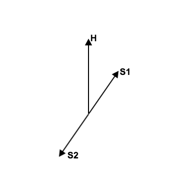

Collective Behavior
=================

In a dense neutrino environment, neutrino oscillations could exhibit collective behaviors or synchronized behaviors.

The key of such a behavior is the self interaction between neutrinos.

.. admonition:: Phonon
   :class: note

   In solid state physics, phonons are the collective behavior of atom or molecule oscillations. The necessary condition for such a behavior is the interaction between atoms or molecules.

Equation of Motion in Matter
--------------------------------------

Hamiltonian
~~~~~~~~~~~~~~~

We have already derived the Hamiltonian for vacuum oscillatioin,

.. math::
   H_v=\frac{\delta^2m}{2E}\frac{1}{2}\begin{pmatrix} -\cos 2\theta_v & \sin 2 \theta_v \\ \sin 2\theta_v & \cos 2\theta_v  \end{pmatrix},

where we would like to define a new matrix,

.. math::
   \mathbf B = \frac{1}{2}\begin{pmatrix}  -\cos 2\theta_v & \sin 2 \theta_v \\ \sin 2\theta_v & \cos 2\theta_v  \end{pmatrix},

so that the vacuum Hamiltonian can be written as

.. math::
   H_v = \frac{\delta^2m}{2E}\mathbf B

The **effect of matter**, as we have already discussed before, adds an extra term

.. math::
   H_m = \sqrt{2}G_F n_e L.

Here we have

.. math::
   L = \begin{pmatrix} 1 & 0 \\ 0 & 0 \end{pmatrix}.

.. note::

   Previously in the MSW effect section, we have :math:`L=\frac{1}{2}\sigma_3`. The reason, as explained there, is that we can always write down a 2 by 2 matrix using Pauli matrices and indentity matrix and identity matrix only shifts the overall eigenvalue not the eigenvector so we can just drop the identity term.

One other term is the self-interaction of neutrinos, i.e., neutral-current neutrino-neutrino forward exchange scattering,

.. math::
   H_\nu =\sqrt{2}G_F \int d^3\mathbf p' (1-\hat {\mathbf p}\cdot \hat{\mathbf p}')(\rho_{p'}-\bar \rho_{p'}).

The overall Hamiltonian is

.. math::
   H = H_0 + H_m + H_\nu ,

where the vacuum Hamiltonian is

.. math::
   H_0 &= \frac{\delta^2 m}{2E} \mathbf B \\
   & = \frac{\delta^2 m}{2E} U \left(\frac{1}{2}\sigma_3 \right) U^\dagger .

Equation of Motion
~~~~~~~~~~~~~~~~

From the Hamiltonian, Von Neumann equation is

.. math::
   i \frac{\partial}{\partial t}\rho = \left[ H , \rho\right]

In `Picture <.picture.html>`_ chapter we have seen the definition of a polarization matrix. The components of a polarization vector (**for neutrinos**) is given by

.. math::
   P_{\omega,i} &\propto \mathrm{Tr} (\rho_E \sigma_i) \\
   & = \frac{1}{n_\nu} \frac{\lvert \delta^2 m \rvert}{2\omega^2} \times  \mathrm{Tr} (\rho_E \sigma_i) .

For anitneutrinos, we have a negative :math:`\omega` which is defined as :math:`\omega = \frac{\delta^2m}{2E}` (neutrinos) and :math:`\omega_{\bar\nu}= - \frac{\delta^2m}{2E}` (anitneutrinos). The polarization is defined as

.. math::
   P_{\omega,i} = - \frac{1}{n_\nu} \frac{\lvert \delta^2 m \rvert}{2\omega^2} \times  \mathrm{Tr} (\bar \rho_E \sigma_i) .

With all these definitions, Von Neumann equation multiply by :math:`\vec{\sigma} = \sigma_1 \hat e_1 + \sigma_2 \hat e_2 + \sigma_3 \hat e_3`, we have

.. math::
   i \dot \rho \sum_i \sigma_i \hat e_i = \left[H, \rho\right] \sum_i\sigma_i \hat e_i.

Notice that Pauli matrices are Hermitian and Unitary, we can alway insert the identity :math:`\mathbf I = \sigma_j \sigma_j^\dagger`.

.. admonition:: Commutator and Cross Product
   :class: note

   Commutator of two vectors,

   .. math::
      \vec A \times \vec B & = (A_2 B_3 - A_3 B_2) \hat e_1 + (A_3 B_1 - A_1 B_2)\hat e_2 + (A_1 B_2 - A_2 B_3)\hat e_3

.. admonition:: Trace of Pauli Matrices
   :class: note

   All Pauli matrices have vanishing trace. And what makes our calculation more convinient is that the trace of matrices is invariant under cyclic permutation, that is

   .. math::
      \mathrm{Tr}(\sigma_i \mathbf H \sigma_j) = \mathrm{Tr}(\mathbf H \sigma_j\sigma_i)

   Notice that to have a non-vanishing trace we need :math:`i=j`. This property really saves our life.

As the definition, we have

.. math::
   \mathbf H &= \vec H\cdot \vec\sigma \\
   \rho & = \vec \rho \cdot \vec \sigma

Using these we can rewrite the commutator

.. math::
   [H,\rho] & = [\vec H \cdot \vec\sigma, \vec \rho \cdot \vec \sigma] \\
   & = \sum_{ik}(H_i \sigma_i \rho_k \sigma_k - \rho_k \sigma_k H_i \sigma_i )\\
   & = \sum_{ik}(H_i\rho_k \sigma_i\sigma_k - \rho_k H_i \sigma_k \sigma_i) \\
   & = \sum_{ik} H_i\rho_k (\sigma_i\sigma_k-\sigma_k\sigma_i) \\
   & = \sum_{ik} H_i \rho_k [\sigma_i,\sigma_k] \\
   & =  \sum_{ik} H_i \rho_k 2i \epsilon_{ikn}\sigma_n \\
   & =  2i \sum_{ik}\epsilon_{ikn}\sigma_n H_i \rho_k

Multiply by :math:`\sigma_j` and take the trace, we get,

.. math::
   \mathrm{Tr}(\sigma_j [H,\rho]) & =  2i \mathrm{Tr}(\sum_{ik}\epsilon_{ikn}\sigma_j\sigma_n H_i \rho_k )\\
   &= 2i \sum_{ik} \mathrm{Tr}(\epsilon_{ikj} \mathrm I  H_i \rho_k  ) \\
   & = - 2i \sum_{ik} \epsilon_{jik} H_i\rho_k  \mathrm{Tr}(\mathbf I)

The corresponding LHS after these work becomes

.. math::
   i\mathrm{Tr}(\sigma_j \dot \rho_i \sigma_i) & = i \partial_t \rho_j \mathrm{Tr}( I)

Bipolar Model
-----------------------

The neutrinos are generated in two classes with the same number density thus making up two total flavour isospins.

Dense Homogeneous Isotropic Neutrino Gas
----------------------------------------------------------

The total flavour isospin could precess around effective hamiltonian like the precession of gyroscope with all the indvidual flavour isospin precess around the total flavour isospin.

Refs & Notes
------------------

Some papers:

1. `Collective neutrino flavor transformation in supernovae <http://link.aps.org/pdf/10.1103/PhysRevD.74.123004>`_
