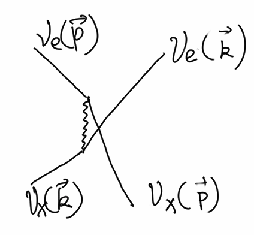

Collective Behavior
==================================

In a dense neutrino environment, neutrino oscillations could exhibit collective behaviors or synchronized behaviors.

The key of such a behavior is the self interaction between neutrinos.

.. admonition:: Phonon
   :class: note

   In solid state physics, phonons are the collective behavior of atom or molecule oscillations. The necessary condition for such a behavior is the interaction between atoms or molecules.

Backgrounds of collective effect:

1. Matter background
2. Neutrino background

   a. sychronized oscillations: neutrino neutrino interaction potential is large compared toordinary oscillation frequencies in vacuum/medium + large asymmetry between neutrino and antineutrino distributions

   b. bipolar oscillations: neutrino and antineutrino oscillate in opposite directions; non-zero vacuum mixing angle + some conditions of mass hierarchy. neutrino-neutrino interaction ( :math:`\mu=\sqrt{2}G_F n_\nu` ) is larger than vacuum oscillatioin frequency :math:`\omega=\Delta m` . like a torque applys to a top where instabilities happpen as the torque force is too big (top wobbles and flips).

.. admonition:: References
   :class: note

   1. Raffelt, G. & Smirnov, A. `Self-induced spectral splits in supernova neutrino fluxes. <http://journals.aps.org/prd/abstract/10.1103/PhysRevD.74.105010>`_ *Phys. Rev. D* **76**, (2007). (This paper includes a very brief summary of sychronized and bipolar.)

Collective Phenomenon
--------------------------------

Neutrino-neutrino interaction can be described by the following Feymann diagram.

   They just exchange their momenta.

Electron neutrinos can exchange momentum with other neutrinos including itself. Suppose we have a muon neutrino moving forward, and vacuum oscillations,

.. figure:: assets/collective/collectiveToyModel.png
   :align: center

   Toy model to illustrate the basics of collective behavior.

At site 1, electron neutrino becomes muon neutrino after 1 oscillation length and moving top, while the muon neutrino coming from the left becomes electron neutrino. If they interact, their momenta will be exchanged, leaving a muon neutrino moving to the right and carrying the momentum of the neutrino moving up.

After the interaction at site 1, a electron neutrino is moving up and transforms to a muon neutrino at site 2. The interaction at site 1 will be repeated all the way along the trajectory. And we have all muon neutrinos coming out right of the sites which should be electron neutrinos if we only have vacuum oscillation.

This is a toy model of collective oscillation.

Why Do We Care About Collective Oscillations
~~~~~~~~~~~~~~~~~~~~~~~~~~~~~~~~~~~~~~~~~~~~~~~~~~~

When we are close to the surface to the protoneutron star, the neutrino number density and matter density are high, so that the collective oscillation could be suppressed. On the other hand, if we are too far away from the protoneutron star, the number density of neutrinos are too small for significant collective oscillations. [duan2010]_

   Regions for different neutrino oscillations for a supernova, for normal hierarchy. Figure from [duan2010]_

   Regions for different neutrino oscillations for a supernova, for inverted hierarchy. Figure from [duan2010]_

.. [duan2010] Duan, H., Fuller, G. M., & Qian, Y.-Z. (2010). `Collective Neutrino Oscillations. <http://doi.org/10.1146/annurev.nucl.012809.104524>`_

.. index:: Spectral Split

Spectral Split
~~~~~~~~~~~~~~~~~~~~~~~~~~~~~~~~~~~

A spectral split phenomenon has been observed in calculations. [1]_

.. figure:: assets/collective/spectralSplit.png
   :align: center

   Spectral split due to neutrino self interaction. Total flavour content is not changed however the flavour exchange momentum which is refered to spectral split.

.. [1] Duan, H., Fuller, G., Carlson, J. & Qian, Y.-Z. `Simulation of coherent nonlinear neutrino flavor transformation in the supernova environment: Correlated neutrino trajectories. <http://journals.aps.org/prd/abstract/10.1103/PhysRevD.74.105014>`_ *Phys. Rev. D* **74**, (2006).

.. index:: Bipolar Model

Bipolar Model
-----------------------

.. figure:: assets/collective/bipolar.png
   :align: center

   Bipolar model. For the flavor isospin picutre, refer to :ref:`neutrino-flavor-isospin`.

Neutrinos and antineutrinos with the same number density corresponds to two total flavor isospins in opposite directions. [2]_

.. [2] Raffelt, G. & Smirnov, A. `Self-induced spectral splits in supernova neutrino fluxes. <http://journals.aps.org/prd/abstract/10.1103/PhysRevD.74.105010>`_ *Phys. Rev. D* **76**, (2007).

.. index:: Isotropic Neutrino Gas

Dense Homogeneous Isotropic Neutrino Gas
----------------------------------------------------------

The total flavour isospin could precess around effective hamiltonian like the precession of gyroscope with all the indvidual flavour isospin precess around the total flavour isospin.

Refs & Notes
------------------

Some papers:

1. `Collective neutrino flavor transformation in supernovae <http://link.aps.org/pdf/10.1103/PhysRevD.74.123004>`_
