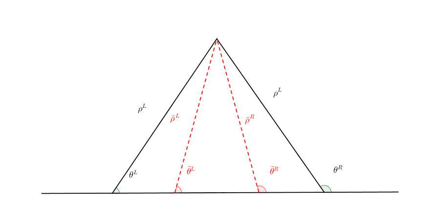

Linear Stability Analysis
========================================

Some General Discussion
-------------------------

Equation of Motion
---------------------

The equation of motion is the liouville's equation

.. math::
   i \partial_t \rho = [H,\rho].

The Hamiltonian is composed of three different terms,

.. math::
   H = H_v + H_m + H_{\nu\nu},

where

.. math::
   H_v =& -\frac{1}{2}\beta\eta \omega_0 \sigma_3\\
   H_m =& \frac{1}{2} \sqrt{2}G_F n_e \sigma_3 \\
   H_{\nu\nu} =& \sqrt{2}G_F \int d\omega d\Omega_{\hat v'} n(\omega,\hat v')\beta(\hat v')\rho(\omega,\hat v') (1-\hat v \cdot \hat v'),

where :math:`\eta=\pm 1` for Normal Hierarchy and Inverted Hierarchy respectively, :math:`\beta=1` for neutrinos and :math:`\beta=-1` for antineutrinos. In other words, the vacuum frequency is :math:`\omega_v = \eta \omega_0`. :math:`\beta(\hat v')` indicates wether the density matrix :math:`\rho(\omega,\hat v')` is for neutrinos or antineutrinos. If :math:`\rho(\omega,\hat v')` is for antineutrinos, :math:`\beta(\hat v')=-1`, otherwise :math:`\beta(\hat v')=1`. More explicitly, the neutrino-neutrino interaction Hamiltonian is

.. math::
   H_v =& \begin{cases}
   -\frac{1}{2}\eta \omega_0 \sigma_3 & \text{for neutrinos}\\
   \frac{1}{2}\eta \omega_0 \sigma_3 & \text{for antineutrinos}
   \end{cases}\\
   H_{\nu\nu} =& \begin{cases}
   \sqrt{2}G_F \int d\omega d\Omega_{\hat v'} n(\omega,\hat v')\rho(\omega,\hat v') (1-\hat v \cdot \hat v') & \text{interacting with neutrinos} \\
   - \sqrt{2}G_F \int d\omega d\Omega_{\hat v'} n(\omega,\hat v')\bar\rho(\omega,\hat v') (1-\hat v \cdot \hat v') &  \text{interacting with antineutrinos}
   \end{cases}

Please note that in this notion,

1. :math:`\omega_0` **is meant to be the absolute value of the frequency**, since :math:`\eta` takes care of the signs.
2. the integral in :math:`H_{\nu\nu}` must take care of both interactions with neutrinos and anti-neutrinos, thus the density matrix is not only for neutrinos.

For the simplicity of notions, we define some new quantities.

1. We define :math:`\lambda` to measure the matter interactions

   .. math::
      \lambda = \sqrt{2} G_F n_e.

2. Angle distribution of number density is defined as

   .. math::
      f(\hat v) = \frac{n(\omega,\hat v)}{n_{total}},

   where :math:`n_{total}` is the total number density of neutrinos for all energies. It can also be defined for anti-neutrinos

   .. math::
      \bar f(\hat v) = \frac{n(\omega,\hat v)}{\bar n_{total}},

   where :math:`\bar n_{total}` is the total number density of anti-neutrinos.

   In fact, the direction of momentum :math:`\hat v` depends only on an angle for line models, hence :math:`f(\theta)`. With this definition, we know that the number density of neutrinos within an angle :math:`[\theta, \theta + d\theta]` can be calculated

   .. math::
      n_{total} f(\theta) d\theta.

   Similarly, the the number density of antineutrinos within angle :math:`[\theta, \theta+d\theta]` is

   .. math::
      \bar n_{total} \bar f(\theta) d\theta.

3. Total number density of neutrinos and anti-neutrinos are related through a asymmetry parameter

   .. math::
      \alpha = \frac{\bar n_{total} }{n_{total}}.

With the two definitions we simplify the matter effect and neutrino self-interaction

.. math::
   H_m =& \frac{1}{2} \lambda \sigma_3 \\
   H_{\nu\nu} =& \sqrt{2}G_F n_{total} \int d\omega d\Omega_{\hat v'} f(\omega,\hat v)\rho(\omega,\hat v') (1-\hat v \cdot \hat v') \\
   & - \sqrt{2}G_F \bar n_{total} \int d\omega d\Omega_{\hat v'} \bar f(\omega,\hat v)\bar\rho(\omega,\hat v') (1-\hat v \cdot \hat v') \\
   =& \frac{1}{2}\mu \int d\omega d\Omega_{\hat v'} f(\omega, \hat v)\rho(\omega,\hat v') (1-\hat v \cdot \hat v') \\
   & - \frac{1}{2}\alpha \mu \int d\omega d\Omega_{\hat v'} \bar f(\omega, \hat v)\bar\rho(\omega,\hat v') (1-\hat v \cdot \hat v') ,

where

.. math::
   \mu = 2\sqrt{2} G_F n_{total}.

Linearize the EoM
----------------------

To linear the EoM we start from a state where almost all neutrinos are in one flavor,

.. math::
   \rho = \begin{pmatrix}
   1 & \delta \\
   \delta^* & 0
   \end{pmatrix}.

Suppose we have a Hamiltonian in flavor basis of the form

.. math::
   H = \begin{pmatrix}
   -h_0 & h \\
   h^* & h_0
   \end{pmatrix},

the commutator of Hamiltonian and density matrix is

.. math::
   [H,\rho] = \begin{pmatrix}
   \delta^* h - \delta h^* &  - h - 2 \delta h_0 \\
   2\delta h_0 + h^* & -\delta^* h + \delta h^*
   \end{pmatrix}.

We linearize the equation by keeping only the first order terms of :math:`\delta`. For this purpose, we need to calculate the neutrino self-interaction :math:`H_{\nu\nu}`.

However, from the general form of :math:`H_{\nu\nu}`, which is an integral or convolution of :math:`\rho`, we would expect that the off diagonal element of the Hamiltonian :math:`h`, is of first order, if we start from a density matrix that has first order, which is what we do. Thus we expect :math:`h \delta^*` is second order effect, which we will neglect.

Finally, we obtain one equation for each beam, which can either be the (1,2) element or the (2,1) element.

Four-Beam Line Model
-----------------------

.. admonition:: Some Definitions
   :class: note

   We define some parameters in this section.

   .. math::
      \lambda =& \sqrt{2} G_F n_e \\
      \eta = & \pm 1\\
      \beta =& \pm 1 \\
      \omega_v =& \lvert \Delta m^2/2E \rvert \\
      \mu =& \sqrt{2} G_F n_{\nu_e}\\
      n_{\bar\nu_e} = & \alpha n_{\nu_e}.

   :math:`\eta` is determines the hierarchy of the neutrinos. :math:`\eta=+1` means normal hierarchy, and :math:`\eta=-1` means inverted hierarchy. :math:`\beta` takes care of the sign for the vacuum term and self-interaction term. For the vacuum term, :math:`\beta=(-)1` for (anti)neutrinos. For the self-interaction term, :math:`\beta=(-)1` if the beam is interacting with (anti)neutrinos.

   We use :math:`{}^L` to denote the beam on the left, :math:`{}^R` to denote the beam on the right, and :math:`\bar{\delta}` to denote that the beam is composed of anti-neutrinos.

.. _four-beams-model-geometry:

   Four beams model

For any line model of finite beams, we can specify each beam by three parameters,

.. math::
   \{\rho, \theta, \alpha\},

where :math:`\rho` is the density matrix of the beam, :math:`\theta` is the angle of the beam defined by some rule, :math:`\alpha` is the ratio of the particle number density to the neutrino number density. If we are talking about a neutrino beam instead of an anti-neutrino beam, we have :math:`\alpha=1`.

In the four-beam case, we define the system using the following three lists of parameters,

.. math::
   \delta =& \{\delta^L, \bar\delta^L, \delta^R, \bar\delta^R\}\\
   \theta =& \{1, \alpha, \alpha, 1\}\\
   \alpha =& \{ \theta_1, \theta_2, \pi-\theta_2,\pi-\theta_1 \},

where the :math:`\delta`'s are used to construct the perturbed density matrix,

.. math::
   \rho^L = \begin{pmatrix}
   1 & \delta^L \\
   \delta^{L*} & 0
   \end{pmatrix}

.. admonition:: Perturbed Density Matrix
   :class: toggle

   We are interested in flavor conversion. So we start from a state with one flavor, which renders the density matrix

   .. math::
      \rho^{X} = \begin{pmatrix}
      1 & 0 \\
      0 & 0
      \end{pmatrix}.

   However, as dynamics is our concern, we need to add the perturbation to investigate the stability

   .. math::
      \rho^{X} = \begin{pmatrix}
      1 & \delta^{X} \\
      \delta^{X*} & 0
      \end{pmatrix}.

So we can now write down the equation of motion for the system with this perturbed density.

.. admonition:: :math:`\delta` as a vector
   :class: toggle

   In fact, as we'll derive the linearized equations, :math:`\delta` is used as a vector

   .. math::
      \delta = \begin{pmatrix}
      \delta^L \\ \bar\delta^L \\ \delta^R \\ \bar\delta^R
      \end{pmatrix}.

With all the definitions and conventions specified, we can write down the equation of motion without trouble, IN PRINCIPLE.

First of all, we find the Hamiltonian,

.. math::
   H_v = & -\frac{1}{2}\eta \omega_v \sigma_3, \\
   H_m = & \frac{1}{2}\lambda \sigma_3.

The neutrino self interaction term requires some elabration on it. We take the left neutrino beam as an example. It experiences interactions with three beams, :math:`\{\bar\rho^L, \bar\theta^L, \alpha\}`, :math:`\{\bar\rho^R, \bar\theta^R, \alpha\}`, as well as :math:`\{ \rho^R, \theta^R, 1\}`. So :math:`H_{\nu\nu}^L` should have three terms,

.. math::
   H_{\nu\nu}^L =  -\mu \alpha (1-\cos(\theta_1-\theta_2)) \bar\rho^L - \mu \alpha (1+\cos(\theta_1+\theta_2))\bar\rho^R + \mu (1+\cos 2\theta_1) \rho^R.

This procedure works for all other beams. Or we can use the power of the All Mighty Mathematica.

.. math::
   \bar H_{\nu\nu}^L = & \mu (1-\cos(\theta_1 - \theta_2)) \rho^L - \mu \alpha (1+\cos(2\theta_2)) \bar\rho^R + \mu (1+\cos(\theta_1+\theta_2)) \rho^R \\
   \bar H_{\nu\nu}^R = & \mu (1 + \cos(\theta_1 + \theta_2)) \rho^L -\mu \alpha (1 + \cos(2\theta_2)) \bar \rho^L + \mu (1 - \cos(\theta_1-\theta_2))\rho^R \\
   H_{\nu\nu} ^R = & \mu (1 + \cos(2\theta_1)) \rho^L - \mu \alpha(1 + \cos(\theta_1 + \theta_2)) \bar \rho^L - \mu (1 - \cos(\theta_1 - \theta_2)) \bar\rho^R.

The equation of motion is reduced to one equation about :math:`\delta`'s for each beam.

.. math::
   i \partial_r \delta = - h - 2 \delta h_0,

where

.. math::
   h_0 =& \frac{1}{2}\eta \omega_v - \frac{1}{2}\lambda,

and :math:`h` is determined by the expression of :math:`H_{\nu\nu}`. Then we rewrite the equation into the form

.. math::
   i \partial_r \delta = M \cdot \delta,

where :math:`M` is the coefficient matrix that generates the equations we previously derived. This procedure can be done by Mathematica.

.. math::
   i \partial_r \begin{pmatrix}
   \delta^L \\ \bar\delta^L \\ \delta^R \\ \bar\delta^R
   \end{pmatrix} =
   \begin{pmatrix}
   \lambda + \mu(1+\cos(2\theta_1)) + \alpha \mu (1 - \cos(\theta_1-\theta_2)) + \alpha \mu (1 + \cos(\theta_1+\theta_2)) - \eta \omega_v & -\alpha \mu(1-\cos(\theta_1 - \theta_2)) & -\alpha \mu(1+\cos(\theta_1 + \theta_2)) & -\mu(1+\cos(2\theta_1)) \\
   - \mu(1-\cos(\theta_1 - \theta_2)) & \lambda + \mu (1-\cos(\theta_1-\theta_2)) + \alpha \mu (1+\cos(2\theta_2)) + \mu (1+\cos(\theta_1+\theta_2)) + \eta \omega_v & -\alpha \mu(1+\cos(2 \theta_2)) & -\mu(1+\cos(\theta_1 + \theta_2)) \\
   -\mu(1+\cos(\theta_1 + \theta_2)) & -\alpha \mu(1+\cos(2\theta_2)) &
   \lambda + \mu(1-\cos(\theta_1-\theta_2)) + \alpha \mu (1 + \cos(2\theta_2)) + \mu (1 + \cos(\theta_1+\theta_2)) - \eta \omega_v  & -\mu (1 - \cos (\theta_1-\theta_2)) \\
   -\mu(1+\cos(2\theta_1)) & -\alpha\mu (1+ \cos(\theta_1+\theta_2)) & -\alpha \mu (1-\cos(\theta_1-\theta_2)) & \lambda + \mu(1+\cos(2\theta_1)) + \alpha \mu (1 - \cos(\theta_1-\theta_2)) + \alpha \mu (1 + \cos(\theta_1+\theta_2)) + \eta \omega_v
   \end{pmatrix}
   \begin{pmatrix}
   \delta^L \\ \bar\delta^L \\ \delta^R \\ \bar\delta^R
   \end{pmatrix}.
   :label: eqn-linearized-eom-perturbations-in-general-1

Notice that we have the equation with r as the variable, which is not very convenient. Even we solve the equation, it is very hard to interpretate the solutions since r is different at the same height z. So we have to rewrite the equation into one with vertical height z as the variable using :math:`i\partial_r = i \sin \theta \partial_z + i \cos \theta \partial_x`. Be very careful with the sign of :math:`+ i \cos \theta \partial_x`. In the four beam case, we have

.. math::
   i \partial_r^L = & i \sin \theta_1 \partial_z + i \cos \theta_1 \partial_x \\
   i\bar\partial_r^L=& i \sin \theta_2 \partial_z + i \cos \theta_2 \partial_x \\
   i \bar\partial_r^R =& i\sin \theta_2 \partial_z - i \cos \theta_2 \partial_x \\
   i \partial_r^R =& i\sin \theta_1 \partial_z - i\cos\theta_1 \partial_x.

The equation for the perturbations becomes

.. math::
.. math::
   i \partial_z \begin{pmatrix}
   \sin \theta_1 \delta^L \\ \sin \theta_2\bar\delta^L \\ \sin \theta_2\delta^R \\ \sin \theta_1\bar\delta^R
   \end{pmatrix} + i \partial_x \begin{pmatrix}
   \cos \theta_1\delta^L \\ \cos \theta_2\bar\delta^L \\ - \cos \theta_2\delta^R \\ -\cos\theta_1\bar\delta^R
   \end{pmatrix} =
   \begin{pmatrix}
   \lambda + \mu(1+\cos(2\theta_1)) + \alpha \mu (1 - \cos(\theta_1-\theta_2)) + \alpha \mu (1 + \cos(\theta_1+\theta_2)) - \eta \omega_v & -\alpha \mu(1-\cos(\theta_1 - \theta_2)) & -\alpha \mu(1+\cos(\theta_1 + \theta_2)) & -\mu(1+\cos(2\theta_1)) \\
   - \mu(1-\cos(\theta_1 - \theta_2)) & \lambda + \mu (1-\cos(\theta_1-\theta_2)) + \alpha \mu (1+\cos(2\theta_2)) + \mu (1+\cos(\theta_1+\theta_2)) + \eta \omega_v & -\alpha \mu(1+\cos(2 \theta_2)) & -\mu(1+\cos(\theta_1 + \theta_2)) \\
   -\mu(1+\cos(\theta_1 + \theta_2)) & -\alpha \mu(1+\cos(2\theta_2)) &
   \lambda + \mu(1-\cos(\theta_1-\theta_2)) + \alpha \mu (1 + \cos(2\theta_2)) + \mu (1 + \cos(\theta_1+\theta_2)) - \eta \omega_v  & -\mu (1 - \cos (\theta_1-\theta_2)) \\
   -\mu(1+\cos(2\theta_1)) & -\alpha\mu (1+ \cos(\theta_1+\theta_2)) & -\alpha \mu (1-\cos(\theta_1-\theta_2)) & \lambda + \mu(1+\cos(2\theta_1)) + \alpha \mu (1 - \cos(\theta_1-\theta_2)) + \alpha \mu (1 + \cos(\theta_1+\theta_2)) + \eta \omega_v
   \end{pmatrix}
   \begin{pmatrix}
   \delta^L \\ \bar\delta^L \\ \delta^R \\ \bar\delta^R
   \end{pmatrix}.
   :label: eqn-linearized-eom-perturbations-in-general-2

If we are using a model that is homogeneous in x direction, the derivative is gone. We assume the solution is of the form :math:`\delta = \delta_0 e^{i\Omega z}`. By put the assumption back into the equation we obtain

.. math::
   -\Omega \delta_0 = M\cdot \delta_0.

Linear stability analysis basically becomes finding the eigenvalues of matrix :math:`M`. A negative imaginary part in :math:`\Omega` means the solution can grow exponentially.

.. admonition:: Some Questions
   :class: warning

   1. Even if we assume homogenous in x direction, will it be stable under small perturbations? I guess it also is not that easy to say since the equation of motion in x direction is somewhat similar to the equation in z direction, we might have some instability in x direction.
   2. Is there any interpretation of the solution as a function of r?

For this four-beam model, the eigenvalues can be found analytically by Mathematica, eventhough the solution is a bit tedious. We work out the example using unit of :math:`\omega_v`, i.e., :math:`\hat \lambda=\lambda/\omega_v` and :math:`\hat\mu = \mu/\omega_v`.

Neutrino Line Model with Fourier Analysis
--------------------------------------------------

Neutrino line model is discussed in [duan2015]_. We'll follow the paper.

The equation of motion is

.. math::
   i\partial_t \rho + i \hat v \cdot \vec \nabla \rho = \left[ H, \rho \right],

where Hamiltonian

.. math::
   H = H_v + H_m + H_{\nu\nu}.

We discuss the equilibrium case so that the time dependent part vanishes.

For the line model, we have only two directions :math:`x` and :math:`z`, thus the density matrix depends on these two directions, i.e., :math:`\rho(x,z)`. Since all the neutrinos emitted from a line located at :math:`z=0`, we can Fourier decompose the density matrix :math:`\rho(x,z)` in the x direction

.. math::
   \rho(x,z) = \sum_m e^{i m k_0 x} \rho_m(z),

where :math:`k_0` is determined by the size of the line :math:`L`,

.. math::
   k_0 = \frac{2\pi}{L}.

Equivalently, we can linearize the equation first then Fourier transform the perturbations. Both methods works.

Fourier Transform of Density Matrix
~~~~~~~~~~~~~~~~~~~~~~~~~~~~~~~~~~~~~~~~~~~~~~~~

As we plug it back into the equation of motion, left hand side becomes

.. math::
   &i \hat v \cdot \nabla \rho(x,z) \\
   =& i v_x \partial_x \rho(x,z) + i v_z \partial_z \rho(x,z) \\
   =& i v_x \partial_x \sum_m e^{i m k_0 x} \rho_m(z) + i v_z \partial_z \sum_m e^{i m k_0 x} \rho_m(z) \\
   =& \sum_m e^{i m k_0 x} \left( i v_x (i m k_0) \rho_m(z) + i v_z \partial_z \rho_m(z) \right).

The vacuum Hamiltonian and matter Hamiltonian are

.. math::
   H_v =& -\frac{1}{2}\eta \omega_v \sigma_3 \\
   \bar H_v =& \frac{1}{2}\eta \omega_v \sigma_3 \\
   H_m =& \frac{1}{2} \lambda \sigma_3.

The neutrino-neutrino interaction becomes

.. math::
   H_{\nu\nu}^{i} =& \sum_j \sqrt{2} G_F n_\nu^{j} (1 - \hat v^{i}\cdot \hat v^{j}) \beta^{j}\rho^{j}(x,z)\\
   =& \sum_m e^{im k_0 x} \left( \sum_j \sqrt{2} G_F n_\nu^{j} (1 - \hat v^{i}\cdot \hat v^{j}) \beta^{j}\rho_m(z) \right),

where :math:`\beta^{j}` indicates if the beam is neutrino or antineutrino,

.. math::
   \beta^{j} =\begin{cases}
   1 & \qquad \text{neutrinos}\\
   -1 & \qquad \text{antineutrinos}.
   \end{cases}

To save keystroke we define

.. math::
   \mu = \sqrt{2}G_F n_{\nu},

where :math:`n_\nu` is the number density of the neutrinos.

So we can write down the equation of motion for each beam, using the decomposed density matrix. It's easily noticed that the equation is not coupled between Fourier modes of the density matrix.

For simplicity, we first solve the four beams case, c.f. :numref:`four-beams-model-geometry`, with :math:`\bar n_{\nu} = \alpha n_{\nu}`. The equation of motion for neutrino beam i reads

.. math::
   i v_z \partial_z \rho_m^i(z) - m k_0 v_x^i \rho_m^i(z) = \left[ -\beta^i \eta \omega_v \sigma_3/2, \rho_m^i(z) \right] + \left[ \lambda \sigma_3/2, \rho_m^i(z) \right] + \sum_{m'}\left[\sum_j \mu \alpha^j (1 - \hat v^{i}\cdot \hat v^{j}) \beta^{j}\rho^j_{m'}(z),\rho^i_{m-m'}(z) \right].
   :label: eqn-fourier-modes-density-matrix-eom

.. admonition:: Horizontal Speed :math:`v_x^i`
   :class: warning

   Please notice that the horizontal speed :math:`v_x^i` has a different sign for left beam and right beam.

We have all the modes decoupled from each other. However, the different beams are coupled to each other for the same mode. Thus the equations for mode :math:`m` can be combined into a single matrix differential equation, which is tedious to write down.

To analyze the instability, we apply the tricks in linear stability analysis, and define the perturbed density matrice

.. math::
   \rho^i_m =& \begin{pmatrix}
   1 & \epsilon^i_m \\
   {\epsilon^i_m}^* & 0
   \end{pmatrix}\\
   \bar\rho^i_m =&\begin{pmatrix}
   1 & \bar\epsilon^i_m \\
   {\bar\epsilon^i_m}^* & 0
   \end{pmatrix}.

The only unknow functions are :math:`\epsilon^i_m` and :math:`\bar\epsilon^i_m`.

.. admonition:: Useful Commutation Relations
   :class: hint

   With the perturbed form of density matrix, we have several simple commutation relations.

   .. math::
      [\sigma_3,\rho_m^i] =& \begin{pmatrix}
      0 & 2\epsilon_m^i \\
      2{\epsilon_m^i}^* & 0
      \end{pmatrix} \\
      [\rho_{m'}^j,\rho_{m-m'}^i] = & \begin{pmatrix}
      -\epsilon^i_{m-m'} {\epsilon_{m'}^j}^* + \epsilon^j_{m'} {\epsilon_{m-m'}^i}^* & \epsilon_{m-m'}^i - \epsilon_{m'}^j \\
      -{\epsilon_{m-m'}^i}^* + {\epsilon_{m'}^j}^* &  \epsilon^i_{m-m'} {\epsilon_{m'}^j}^* - \epsilon^j_{m'} {\epsilon_{m-m'}^i}^* \\
      \end{pmatrix}.

We analyze the four beams model which has only one left beam and one right beam for neutrinos and antineutrinos, with the same geometry shown in :numref:`four-beams-model-geometry`. The equation of motion calculated from the linearized density matrix is

.. math::
   i v_z \partial_z \begin{pmatrix}
   1 & \epsilon_m^i \\
   {\epsilon_m^i}^* & 0
   \end{pmatrix} = m k_0 v_x^i \begin{pmatrix}
   1 & \epsilon_m^i \\
   {\epsilon_m^i}^* & 0
   \end{pmatrix}  + \frac{1}{2}\left( \lambda - \beta^i \eta \omega_v \right) \begin{pmatrix}
   0 & 2\epsilon_m^i \\
   2{\epsilon_m^i}^* & 0
   \end{pmatrix} + \sum_j \sum_{m'} \mu \alpha^j (1-\hat v^i\cdot \hat v^j) \beta^j \begin{pmatrix}
   -\epsilon^i_{m-m'} {\epsilon_{m'}^j}^* + \epsilon^j_{m'} {\epsilon_{m-m'}^i}^* & \epsilon_{m-m'}^i - \epsilon_{m'}^j \\
   -{\epsilon_{m-m'}^i}^* + {\epsilon_{m'}^j}^* &  \epsilon^i_{m-m'} {\epsilon_{m'}^j}^* - \epsilon^j_{m'} {\epsilon_{m-m'}^i}^* \\
   \end{pmatrix}

For the purpose of linear stability analysis, one the off-diagonal elements are needed. The equations for the perturbations becomes

.. math::
   iv_z\partial_z \epsilon^i_m - m k_0 v_x^i \epsilon^i_m = \frac{1}{2}(\lambda - \beta^i \eta \omega_v) 2\epsilon^i_m + \sum_j\sum_{m'} \mu \alpha^j(1-\hat v^i\cdot \hat v^j) \beta^j (\epsilon^i_{m-m'} - \epsilon^j_{m'}),

where we have unified the notation of :math:`\epsilon` and :math:`\bar\epsilon`. For the four beams model, the equations can be written down explicitly in principle. However, we could imagine the space it's gonna take.

For simplicity we consider the case :math:`\theta^L = \theta^R \equiv\theta` and :math:`\alpha^L=\alpha^R`. We also have :math:`v_x^R=\bar v_x^R= -v_x^L= -\bar v_x^L \equiv -v_x`.

Then the equations becomes

.. math::
   iv_z \partial_z \epsilon^L_m =&  \left( m k_0 v_x  + (\lambda - \eta \omega_v) \right) \epsilon^L_m + \sum_{m'} \left( \mu (1-\cos(2\theta)) (\epsilon^L_{m-m'}- \epsilon^R_{m'}) - \mu \alpha (1-\cos(2\theta)) (\epsilon^L_{m-m'}-\bar\epsilon^R_{m'}) \right)\\
   iv_z \partial_z \bar\epsilon^L_m =& \left( m k_0 v_x + (\lambda + \eta \omega_v \right) \bar\epsilon^L_m + \sum_{m'}\left( \mu (1-\cos(2\theta))(\bar\epsilon^L_{m-m'} - \epsilon^R_{m'}) - \mu \alpha (1- \cos(2\theta) ) (\bar\epsilon^L_{m-m'} - \bar\epsilon^R_{m'}) \right)\\
   i v_z \partial_z \epsilon^R_m =& \left( - m k_0 v_x + (\lambda - \eta \omega_v ) \right) \epsilon^R_m + \sum_{m'}\left(\mu (1-\cos(2\theta)) (\epsilon^R_{m-m'} - \epsilon^L_{m'}) - \mu \alpha (1 - \cos(2\theta)) (\epsilon^R_{m-m'} -\bar \epsilon^L_{m'}) \right)\\
   iv_z \partial_z \bar\epsilon^R_m =& \left(  -m k_0 v_x + (\lambda + \eta \omega_v \right) \bar\epsilon^R_m + \sum_{m'} \left( \mu (1-\cos(2\theta) ) (\bar\epsilon^R_{m-m'} - \epsilon^L_{m'}) - \mu \alpha (1 - \cos(2\theta) ) (\bar\epsilon^R_{m-m'} - \bar\epsilon^L_{m'}) \right).

For convinience we define

.. math::
   \chi = \mu(1-\cos(2\theta)),

so that the equations are

.. math::
   iv_z \partial_z \epsilon^L_m = & \left( m k_0 v_x  + (\lambda - \eta \omega_v) \right) \epsilon^L_m + \sum_{m'} \left( \chi (\epsilon^L_{m-m'}- \epsilon^R_{m'}) -  \alpha \chi (\epsilon^L_{m-m'}-\bar\epsilon^R_{m'}) \right)\\
   iv_z \partial_z \bar\epsilon^L_m =& \left( m k_0 v_x + (\lambda + \eta \omega_v \right) \bar\epsilon^L_m + \sum_{m'}\left( \chi (\bar\epsilon^L_{m-m'} - \epsilon^R_{m'}) - \alpha \chi (\bar\epsilon^L_{m-m'} - \bar\epsilon^R_{m'}) \right)\\
   i v_z \partial_z \epsilon^R_m =& \left( -m k_0 v_x + (\lambda - \eta \omega_v ) \right) \epsilon^R_m + \sum_{m'}\left( \chi (\epsilon^R_{m-m'} - \epsilon^L_{m'}) - \alpha \chi (\epsilon^R_{m-m'} -\bar \epsilon^L_{m'}) \right)\\
   iv_z \partial_z \bar\epsilon^R_m =& \left(  -m k_0 v_x + (\lambda + \eta \omega_v \right) \bar\epsilon^R_m + \sum_{m'} \left( \chi (\bar\epsilon^R_{m-m'} - \epsilon^L_{m'}) -  \alpha \chi (\bar\epsilon^R_{m-m'} - \bar\epsilon^L_{m'}) \right).

**We actually have a problem. What are those couplings between different modes?** Are these couplings really first order?

Fourier Transform Perturbations
~~~~~~~~~~~~~~~~~~~~~~~~~~~~~~~~~~~~~~~~

The other idea is to linearize the equations first then Fourier transform only the perturbations. The result for the equations of perturbations can be obtained directly from Eq. (:eq:`eqn-fourier-modes-density-matrix-eom`),

.. math::
   i v_z \partial_z \rho^i(z)  = \left[ -\beta^i \eta \omega_v \sigma_3/2, \rho^i(z) \right] + \left[ \lambda \sigma_3/2, \rho^i(z) \right] + \left[\sum_j \mu \alpha^j (1 - \hat v^{i}\cdot \hat v^{j}) \beta^{j}\rho^j(z),\rho^i(z) \right].

We linearize the equation first before Fourier decomposition is applied. The linearized equation is basically :eq:`eqn-linearized-eom-perturbations-in-general-1`, with different notations. Then we Fourier transform the equations,

.. math::
   iv_z \partial_z \epsilon^L_m =&  \left( m k_0 v_x  + (\lambda - \eta \omega_v) + (1 - \alpha) \chi \right) \epsilon^L_m - \chi  \epsilon^R_m + \alpha \chi \bar\epsilon^R_m\\
   iv_z \partial_z \bar\epsilon^L_m =& \left( m k_0 v_x + (\lambda + \eta \omega_v) + (1-\alpha)\chi \right) \bar\epsilon^L_m - \chi \epsilon^R_m + \alpha \chi  \bar\epsilon^R\\
   i v_z \partial_z \epsilon^R_m =& \left( -m k_0 v_x + (\lambda - \eta \omega_v ) + (1-\alpha)\chi \right) \epsilon^R_m - \chi \epsilon^L_m + \alpha \chi \bar \epsilon^L_m \\
   iv_z \partial_z \bar\epsilon^R_m =& \left(  -m k_0 v_x + (\lambda + \eta \omega_v) +(1-\alpha)\chi \right) \bar\epsilon^R_m - \chi \epsilon^L + \alpha \chi \bar\epsilon^L_m.

The reason we have no coupling between different modes is that linearized equation of motion is linear to all the perturbations.

Construct a vector

.. math::
   \begin{pmatrix}
   \epsilon^L_m \\
   \bar\epsilon^L_m\\
   \epsilon^R_m \\
   \bar\epsilon^R_m
   \end{pmatrix},
   :label: eqn-vector-of-functions-to-be-solved-lsa

from which we develop the matrix equation

.. math::
   i\partial_z\begin{pmatrix}
   \epsilon^L_m \\
   \bar\epsilon^L_m\\
   \epsilon^R_m \\
   \bar\epsilon^R_m
   \end{pmatrix} = \frac{1}{v_z} \begin{pmatrix}
   m k_0 v_x  + (\lambda - \eta \omega_v) + (1 - \alpha) \chi  & 0 & -\chi & \alpha \chi \\
   0 & m k_0 v_x + (\lambda + \eta \omega_v) + (1-\alpha)\chi & -\chi & \alpha \chi \\
   -\chi & \alpha \chi &   -m k_0 v_x + (\lambda - \eta \omega_v ) + (1-\alpha)\chi & 0 \\
   -\chi & \alpha \chi & 0 & -m k_0 v_x + (\lambda + \eta \omega_v) +(1-\alpha)\chi
   \end{pmatrix}\begin{pmatrix}
   \epsilon^L_m \\
   \bar\epsilon^L_m\\
   \epsilon^R_m \\
   \bar\epsilon^R_m
   \end{pmatrix}.

We define

.. math::
   \Upsilon_m = \frac{1}{v_z} \begin{pmatrix}
   m k_0 v_x  + (\lambda - \eta \omega_v) + (1 - \alpha) \chi  & 0 & -\chi & \alpha \chi \\
   0 & m k_0 v_x + (\lambda + \eta \omega_v ) + (1-\alpha)\chi & -\chi & \alpha \chi \\
   -\chi & \alpha \chi &   -m k_0 v_x + (\lambda - \eta \omega_v ) + (1-\alpha)\chi & 0 \\
   -\chi & \alpha \chi & 0 &  -m k_0 v_x + (\lambda + \eta \omega_v) +(1-\alpha)\chi
   \end{pmatrix}.

This non-Hermitian 'evolution' matrix :math:`\Upsilon_m` introduces many new features in the evolutions of the perturbations since the eigenvalues of it are not garanteed to be real. Any imaginary part of the eigenvalues of it will give us exponential increase.

.. admonition:: Plus-Minus Modes
   :class: toggle

   In the paper [duan2015]_ the authors introduced the definition

   .. math::
      D^{\pm}_m =& \frac{1}{2} (\epsilon^L_m \pm \epsilon^R_m) - \frac{\alpha}{2} (\bar\epsilon^L_m\pm \bar\epsilon^R_m)\\
      S^{\pm}_m =&  \frac{1}{2} (\epsilon^L_m \pm \epsilon^R_m) + \frac{\alpha}{2} (\bar\epsilon^L_m\pm \bar\epsilon^R_m).

   The vector of functions to be solve is

   .. math::
      \begin{pmatrix}
      D^+_m\\
      S^+_m \\
      D^-_m\\
      S^-_m
      \end{pmatrix}.

   This is simply a transformation of the vector we have, i.e., Eq. :eq:`eqn-vector-of-functions-to-be-solved-lsa`. The transformation matrix is

   .. math::
      \mathcal R=\frac{1}{2}\begin{pmatrix}
      1 & -\alpha & 1 & -\alpha \\
      1 & \alpha & 1 & \alpha \\
      1 & -\alpha & -1 & \alpha \\
      1 & \alpha & -1 & -\alpha
      \end{pmatrix},

   so that

   .. math::
      \begin{pmatrix}
      D^+_m\\
      S^+_m \\
      D^-_m\\
      S^-_m
      \end{pmatrix} = \mathcal R \begin{pmatrix}
      \epsilon^L_m \\
      \bar\epsilon^L_m\\
      \epsilon^R_m \\
      \bar\epsilon^R_m
      \end{pmatrix}.

   We can find the corresponding 'Hamiltonian' matrix for the new vector by applying

   .. math::
      \Lambda_m = \mathcal R \Upsilon_m \mathcal R^{-1}.

   What I get is

   .. math::
      \Lambda_m = \mathcal R \Upsilon_m \mathcal R^{-1}=\frac{1}{v_z}\begin{pmatrix}
      \lambda  & - \eta \omega_v & m k_0 v_x & 0 \\
      - (1+\alpha)\chi -\eta \omega_v & (1-\alpha)\chi + \lambda & 0 & m k_0 v_x \\
      m k_0 v_x & 0 & 2(1-\alpha)\chi + \lambda & -\eta\omega_v\\
      0 & m k_0 v_x & (1+\alpha)\chi - \eta \omega_v & (1-\alpha)\chi + \lambda
      \end{pmatrix},

   which is the same as the form derived in the paper [duan2015]_.

We can easily find the eigenvalues for the matrix :math:`Uplison_m` or :math:`\Lambda_m`. Any **imaginary part** (not real part because we have an extra i in the equation) of the eigenvalue will lead to exponential growth of the perturbations.

.. figure:: assets/linear-stability-analysis/linear-stability-analysis-kappa-line-four-beams.png
   :align: center

   Maximum of imaginary part of the eigenvalues of matrix :math:`\Upsilon_m` for different :math:`\chi` and :math:`m`. This amazing result says that larger neutrino density leads to the instability on smaller scales. This result is for :math:`\alpha=0.8`, :math:`v_z=1/2`, :math:`k_0=2\pi/L=2\pi/(20\pi/\omega_v)`, and :math:`\lambda=0`.

.. admonition:: Eigenvalues of :math:`\Upsilon_m` and :math:`\Lambda_m` are the same
   :class: hint

   The reason is that the determinant of the following two matrice are the same,

   .. math::
      \lvert \Upsilon_m \rvert = \lvert \mathcal R \Upsilon_m \mathcal R^{-1} \rvert,

   since determinant has cyclic permutation symmetric.

We also notice that matter has no effect on this phenomenon because we can remove matter effect by minus a matrix :math:`\frac{1}{v_z}\lambda \mathbf I` from matrix :math:`\Upsilon_m`, while the eigenvalues is not changed. What's more important, the evolution of the perturbation doesn't change under such a manipulation.

.. [duan2015] Duan, H., & Shalgar, S. (2015). `Flavor instabilities in the neutrino line model. <http://doi.org/10.1016/j.physletb.2015.05.057>`_ Physics Letters, Section B: Nuclear, Elementary Particle and High-Energy Physics, 747, 139–143.
