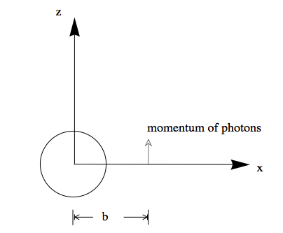
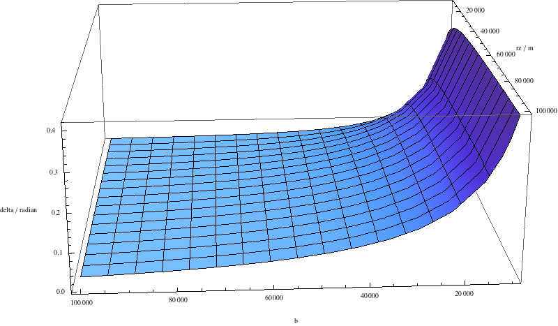
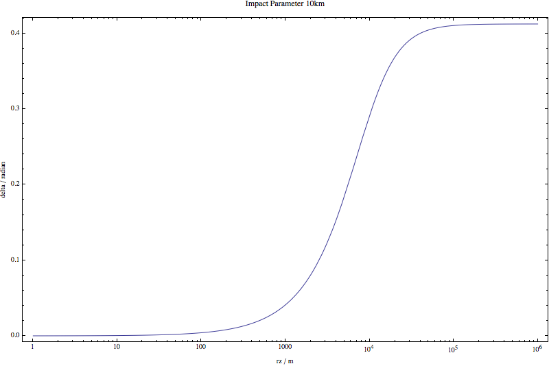

Effect of Gravitation
==========================================

The effect of gravitation on neutrino oscillation could be great around a neutron star.

The spacetime are distorted around the neutron star.

* Time gradient/delay; Shapiro delay;
* Space geometry/trajectory; self-interaction :math:`\vec v\cdot \vec v'`;
* Redshift;
* Tidal effect;
* Coupling of space and time due to cross terms (might need quantum field theory in curved spacetime);
* Lense-Thirring effect.

Evaluation
-------------------

The equation of motion in a linear approximation (with respect to  :math:`\kappa`) is

.. math::
   \frac{d}{d\tau}u_\mu + \left( \kappa h_{\mu\alpha,\beta} u^\alpha u^\beta - \frac{\kappa}{2}h_{\alpha\beta,\mu}u^\alpha u^\beta \right) = 0,

where :math:`\kappa=8\pi G`, :math:`h_{\alpha\beta}` is the metric tensor of the gravitational field, that is,

.. math::
   g_{\alpha\beta} = \eta_{\alpha\beta} + \kappa h_{\alpha}.

Another useful form is to multiply on both side :math:`m d\tau` and substitute mass terms with 4-momentum :math:`p_\mu = m u_\mu`.

.. math::
   d p_\mu + \left( \kappa h_{\mu\alpha,\beta} p^\alpha - \frac{\kappa}{2} h_{\alpha\beta,\mu} p^\alpha \right) dx^{\beta} = 0

Deflection in The Trajectory
~~~~~~~~~~~~~~~~~~~~~~~~~~~~~~~~~~~~~~~~~~~~~~

For the trajectory of photons, we only need to find out the geodesic. Neutrinos are massive particles which are different from photons. However, the neutrinos we are considering have energy as high as several MeVs or even more while their mass are less than 1eV. In this case, they are relativistic so their trajectory are close to photons'.

The deflection of photons near a star is,

.. math::
   \delta \approx - \frac{4G M_\odot}{bc^2}.

.. admonition:: Derivation
   :class: note

   Suppose we have a photon coming along z axis from infinite, the deflected angle at infinite is, by first order approximation :math:`\tan\delta \approx \delta`, the change of momentum in x direction over the momentum in z direction,

   .. math::
      \delta \approx \frac{\Delta p_x}{p_z}.

   Momentum in this coordinate system is

   .. math::
      p^\alpha = (c p^3, 0, 0, p^3).

   Displacement is

   .. math::
      dx^\beta = (dz/c,0,0,dz).

   Then the change in momentum can be calculated using the equation of motion,

   .. math::
      \Delta p_1 = - \kappa p^\alpha \int_{-\infty}^{\infty} \left( h_{1\alpha,\beta} - \frac{1}{2} h_{\alpha\beta,1} \right) dx^\beta.

This is the deflection angle of a photon coming from infinite. However, the angle deflected for a photon emitted at tangent is different.

   neutrino gravitatioin

A detailed calculation shows, [1]_

   The deflection angle of a photon starting from a tangent position at :math:`z=rz` with tangent momentum and impact parameter :math:`b`.

With an impact parameter of :math:`b=10\text{km}`, the angle will eventually become larger than :math:`0.4`, which is very significant.

   As we can see the angle becomes very big at about 10km.

Refs & Notes
-------------------

Here is a list of papers on the gravitational effects of neutrino oscillations,

1. `Gravitational Effects on the Neutrino Oscillation <http://arxiv.org/abs/hep-ph/9611231>`_
2. `Neutrino oscillations in curved spacetime: an heuristic treatment <http://arxiv.org/abs/hep-ph/9610494>`_
3. `Neutrino Oscillations in Gravitational Field <http://arxiv.org/abs/0906.5556>`_
4. `Neutrino oscillations in Kerr-Newman space-time <http://arxiv.org/abs/1002.0648>`_
5. `Neutrino oscillations in strong gravitational fields <http://journals.aps.org/prd/abstract/10.1103/PhysRevD.54.1587>`_ by Dardo Piriz, Mou Roy, and Jose Wudka
6. `Can Gravity Distinguish Between Dirac and Majorana Neutrinos? <http://arxiv.org/abs/gr-qc/0605153>`_ (on `PRL <http://journals.aps.org/prl/abstract/10.1103/PhysRevLett.97.041101>`_ )

And related topics

1. `A comparison between matter wave and light wave interferometers for the detection of gravitational waves <http://arxiv.org/abs/gr-qc/0609075>`_
2. `Matter waves in a gravitational field: An index of refraction for massive particles in general relativity <http://arxiv.org/abs/gr-qc/0107063>`_

.. [1] The MMA file is `here <https://github.com/emptymalei/neutrino/blob/master/MMA/gravitation.nb>`_ .
