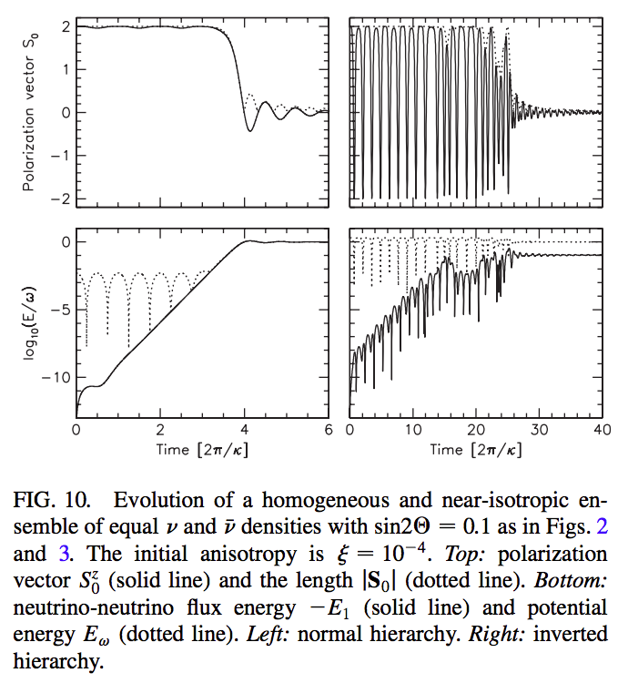
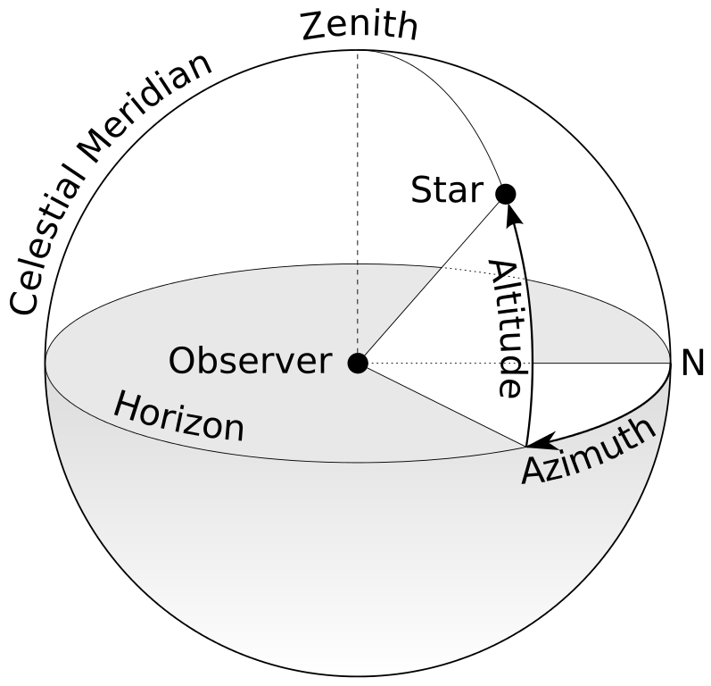

Instability
=====================

Instability of neutrino oscillation means the rapid growth of the oscillations.

.. admonition:: Question
   :class: warning

   Where do we get the perturbations?

.. admonition:: Answer
   :class: note

   TBD.

.. index:: Linear Stability Analysis

Linear Stability Analysis
------------------------------

.. index:: Bimodal Instability

Bimodal Instability
---------------------------

An example of such intability happens in a system composed of equal amounts of neutrinos and antineutrinos. Flavour transform occurs due to

.. math::
   \nu_e + \bar{\nu_e} \leftrightarrow \nu_x + \bar{\nu_x}.

Vacuum mixing angle triggers the flavour instability.

Neutrino oscillatioins are synchronized but with a small amplitude inside a SN core (suppressed by matter effects), [1]_ which basically pin down the flavour transformation. As the flux reaches

.. [1] Wolfenstein, L. `Neutrino oscillations in matter. <http://journals.aps.org/prd/abstract/10.1103/PhysRevD.17.2369>`_ *Phys. Rev. D* **17**, 23692374 (1978). Or check papers of MSW effect such as Wick Haxton's excellent review.

.. index:: Multi-angle Instability

Multi-angle Instability
------------------------------------------------

Non-isotropic neutrino gas would have velocity (or momentum) related interactions, :math:`1-\vec v_p\cdot\vec v_q`, which is in fact a :math:`1 -\frac{2\sqrt{\pi}}{\sqrt{3}} Y_1^0(\theta,\phi)` term.

A small anisotropy leads to a runaway flavor equipartition. [2]_

.. [2] Raffelt, G. & Smirnov, A. `Self-induced spectral splits in supernova neutrino fluxes. <http://journals.aps.org/prd/abstract/10.1103/PhysRevD.75.083002>`_ *Phys. Rev. D* **76**, (2007). In this paper the author adds a small perturbation to a perfectly isotropic neutrino antineutrino gas. The results show multi-angle instability.

   A figure from Raffelt & Simirnov (2007) shows the instability from anisotropic small perturbations. Potential energy grows expotentially, where :math:`-E_1 = \mu/4 \vec{D_1}^2` .

MAA
--------------------------

   A sphere on wikipedia `File:Azimuth-Altitude schematic.svg <https://commons.wikimedia.org/wiki/File:Azimuth-Altitude_schematic.svg>`_

Multi-azimuth angle (MAA) instability, first discovered by Georg Raffelt et al, in the work `Axial Symmetry Breaking in Self-Induced Flavor Conversion of Supernova Neutrino Fluxes <http://journals.aps.org/prl/abstract/10.1103/PhysRevLett.111.091101>`_ , [3]_ is an intrinsic symmetry breaking. The point is to allow angle modes to evolve independently.

This instability may come from the term that is related to the velocity of neutrinos in the Hamiltonian.

This could happen even for a perfectly symmetric emission.

.. [3] Raffelt, G., Sarikas, S. & Seixas, D. `Axial Symmetry Breaking in Self-Induced Flavor Conversionof Supernova Neutrino Fluxes. <http://journals.aps.org/prl/abstract/10.1103/PhysRevLett.111.091101>` *Phys. Rev. Lett.* **111**, (2013).

Neutrino Self Interaction and Instability
--------------------------------------------

Refs & Notes
--------------------

.
