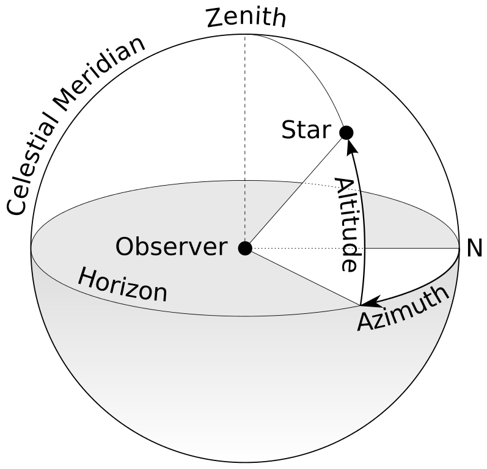

.. index:: MAA Instability

MAA
--------------------------

   A sphere on wikipedia `File:Azimuth-Altitude schematic.svg <https://commons.wikimedia.org/wiki/File:Azimuth-Altitude_schematic.svg>`_

Multi-azimuth angle (MAA) instability, first discovered by Georg Raffelt et al, in the work `Axial Symmetry Breaking in Self-Induced Flavor Conversion of Supernova Neutrino Fluxes <http://journals.aps.org/prl/abstract/10.1103/PhysRevLett.111.091101>`_ , [3]_ is an intrinsic symmetry breaking. The point is to allow angle modes to evolve independently. Even the flavors of neutrinos are axially symmetric on the surface of neutron star, the axial symmetry could be destroyed as it evolves.

This instability may come from the term that is related to the velocity of neutrinos in the Hamiltonian.

This could happen even for a perfectly symmetric emission.

.. [3] Raffelt, G., Sarikas, S. & Seixas, D. `Axial Symmetry Breaking in Self-Induced Flavor Conversionof Supernova Neutrino Fluxes. <http://journals.aps.org/prl/abstract/10.1103/PhysRevLett.111.091101>` *Phys. Rev. Lett.* **111**, (2013).
