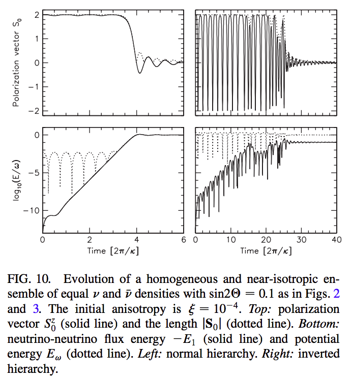

.. index:: MZA Instability

Multi-Zenith-Angle Instability
================================

Multi-zenith-angle instability was first described in a paper [Banerjee2011]_.

.. admonition:: In What Context
   :class: toggle

   System with neutrino self-interactions.

   Non-isotropic neutrino gas would have velocity (or momentum) related interactions, :math:`1-\vec v_p\cdot\vec v_q`, which is in fact a :math:`1 -\frac{2\sqrt{\pi}}{\sqrt{3}} Y_1^0(\theta,\phi)` term.

A small anisotropy leads to a runaway flavor equipartition. [2]_

.. [2] Raffelt, G. & Smirnov, A. `Self-induced spectral splits in supernova neutrino fluxes. <http://journals.aps.org/prd/abstract/10.1103/PhysRevD.75.083002>`_ *Phys. Rev. D* **76**, (2007). In this paper the author adds a small perturbation to a perfectly isotropic neutrino antineutrino gas. The results show multi-angle instability.

   A figure from Raffelt & Simirnov (2007) shows the instability from anisotropic small perturbations. Potential energy grows expotentially, where :math:`-E_1 = \mu/4 \vec{D_1}^2` .

References & Notes
-------------------

.. [Banerjee2011] Banerjee, A., Dighe, A., & Raffelt, G. (2011). Linearized flavor-stability analysis of dense neutrino streams. Physical Review D, 84(5), 53013. https://doi.org/10.1103/PhysRevD.84.053013
