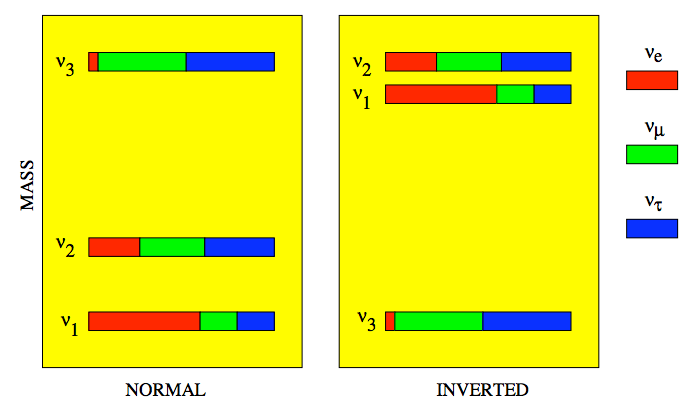

Masses of Neutrinos
=====================

Neutrino masses are still not determined completely. However we have some possible patterns.

   Source: http://projects.fnal.gov/nuss/lectures/RabiM_1.pdf

One of the questions we have about the masses of neutrinos is **the generation of it**.

.. note::
   This figure also gives the terms: normal hierarchy (NH) and invertd hierarchy (IH).

See-saw Mechanism
------------------

RH neutrinos term in Lagrangian breaks the symmetry.

.
