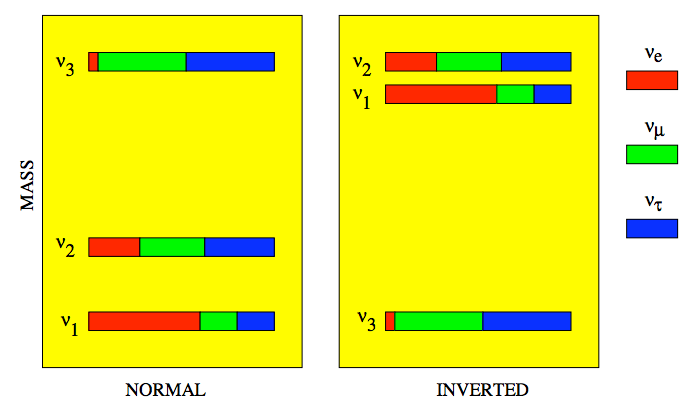

Masses of Neutrinos
=====================

Neutrino masses are still not determined completely. However we have some possible patterns.

   Source: http://projects.fnal.gov/nuss/lectures/RabiM_1.pdf

One of the questions we have about the masses of neutrinos is **the generation of it**.

.. note::
   This figure also gives the terms: normal hierarchy (NH) and invertd hierarchy (IH).

Lepton mixing matrix, can be written as the product of three matrices which stands for a rotation in 23, 13(with a CP phase), 12 respectively. This is called the PMNS mixing matrix.

.. math::
   \mathbf U &= \mathbf {U_{23}} \times \mathbf {U_{13,\delta}} \times \mathbf {U_{12}} \\
   & = \begin{pmatrix} 1 & 0 & 0 \\ 0 &\cos\theta_{23} & \sin\theta_{23} \\ 0 -\sin\theta_{23} & \cos\theta_{23} \end{pmatrix}  \begin{pmatrix} \cos\theta_{13} & 0 & e^{i\delta} \sin\theta_{13} \\ 0 & 1 & 0 \\ -e^{i\delta}\sin\theta_{13} & 0 & \cos\theta_{13}  \end{pmatrix} \begin{pmatrix} \cos\theta_{12} & \sin\theta_{12} & 0 \\ -\sin\theta_{12} & \cos \theta_{12} & 0 \\ 0 & 0 & 1 \end{pmatrix}

.. admonition:: Neutrino Mixing vs Quark Mixing
   :class: note

   In fact that quarks also has a mixing matrix that mixes the mass eigenstates to produce flavor states. But note that quarks has a mixing matrix of order

   .. math::
      V_{CKM}\sim \begin{pmatrix}
      1 & 0.2 & 0.005 \\
      0.2 & 1 & 0.04 \\
      0.005 & 0.04 & 1
      \end{pmatrix},

   while  neutrino has a mixing matrix of order

   .. math::
      U_{PMNS} \sim \begin{pmatrix}
      0.8 & 0.5 & ? \\
      0.4 & 0.6 & 0.7 \\
      0.4 & 0.6 & 0.7
      \end{pmatrix}.

   It is obvious that the mixing in neutrino is much larger than quark mixing.

.. toctree::
   :maxdepth: 2

   theory-mass.rst
   determine-mass.rst
