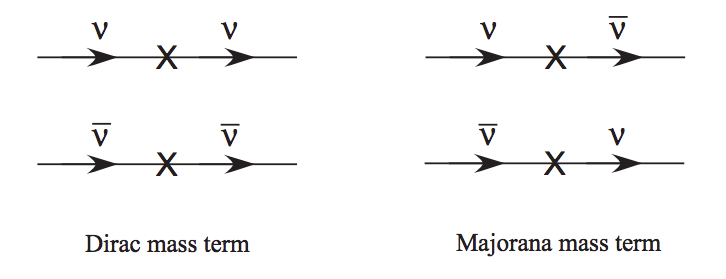

Theories of Neutrino Mass
========================================

.. index:: Majorana Particles

Majorana Particle
--------------------------

Dirac Equation
~~~~~~~~~~~~~~~~~~

Dirac equation can be derived by using the fact that :math:`E^2=p^2+m^2` and insisting that the equation should be linear. We start from the assumption

.. math::
   i\partial_t \Psi = (\vec\alpha\cdot \vec p + \beta m)\Psi,

where :math:`\alpha` and :math:`\beta` are NOT necessarily complex numbers. The right side is the energy which comes from the fact that energy operator is :math:`\hat{E} = i\hbar\frac{\partial}{\partial t} \,\!`.

As we require the energy term satisfy :math:`E^2=p^2+m^2`, what we have from the assumption is

.. math::
   (\vec\alpha\cdot \vec p + \beta m)(\vec\alpha\cdot \vec p + \beta m) \equiv p^2 + m^2.

Expand the expression we get the requirements for :math:`\vec\alpha` and :math:`\beta`,

.. math::
   \vec\alpha\cdot\vec \alpha &= 1, \\
   \{\alpha_i,\alpha_j\} &= 0, \\
   \{\alpha_i,\beta \} & = 0 ,\\
   \beta^2 & = 1.

where the second line is for :math:`i\neq j`.

.. admonition:: Hint
   :class: note

   Use the component form to derive the requirements.

.. admonition:: Quaternion
   :class: note

   A quaternion is a quantity that can be written as a matrix of the form

   .. math::
      q = \begin{pmatrix}\;z & w \\ -w^* & \;z^*\end{pmatrix}.

   As comparison, a complex number can be written as

   .. math::
      C = \begin{pmatrix}\;\; a &   b  \\- b &  a
      \end{pmatrix},

   where a and b are real. So quaternion is a generalization of complex number. An important fact is a quaternion times its hermitian conjugate gives us its modulus times an identity, i.e.,

   .. math::
      q^\dagger q= q q^\dagger = \| q \|^2 I.

   Is it useful for Dirac equation?

These are the most general requirements, any quantities that satisfy the four requirements would do the work.

In fact we have three different representations if we assume :math:`\vec\alpha` and :math:`\beta` are matrices. They are Dirac-Pauli representation, Weyl representation and Majorana representation.

.. admonition:: Three representations
   :class: note

   It could be useful to define two four vectors :math:`\sigma^\mu = (\sigma^0, - \sigma^i)` and :math:`\bar\sigma^\mu = (\sigma^0, \sigma^i)`. But all they do is to combine :math:`\gamma^0` and :math:`\gamma^i` into one expression.

   * Dirac-Pauli representation

   The :math:`\vec\alpha` and :math:`\beta` are

   .. math::
      \vec \alpha &= \begin{pmatrix} 0 & \vec \sigma \\ \vec\sigma & 0 \end{pmatrix}, \\
      \beta & = \begin{pmatrix} I & 0 \\ 0 & -I \end{pmatrix}.

   The gamma matrices are

   .. math::
      \gamma^0 & = \begin{pmatrix} I & 0 \\ 0 & -I  \end{pmatrix}, \\
      \gamma^i & = \begin{pmatrix} 0 & \sigma^i \\ -\sigma^i & 0 \end{pmatrix}, \\
      \gamma^5 & = \begin{pmatrix} 0 & I \\ I & 0 \end{pmatrix}.

   Correspondingly, the chirality operator :math:`P_{R(+)/L(-)} = \frac{1}{2}(1\pm \gamma^5)` is

   .. math::
      P_{L(-)} &=\frac{1}{2} \begin{pmatrix} I & 0 \\ 0 & I  \end{pmatrix},\\
      P_{R(+)} & = \frac{1}{2} \begin{pmatrix} I & I  \\ I & I \end{pmatrix}.

   * Weyl representation

   The :math:`\vec\alpha` and :math:`\beta` are

   .. math::
      \vec \alpha &= \begin{pmatrix} -\vec \sigma & 0 \\  0 & \vec\sigma  \end{pmatrix}, \\
      \beta & = \begin{pmatrix} 0 & I \\ I & 0 \end{pmatrix}.

   The gamma matrices are

   .. math::
      \gamma^0 & = \begin{pmatrix} 0 & I \\ I & 0  \end{pmatrix}, \\
      \gamma^i & = \begin{pmatrix} 0 & \sigma^i \\ -\sigma^i & 0 \end{pmatrix}, \\
      \gamma^5 & = \begin{pmatrix} -I & 0 \\ 0 & I \end{pmatrix}.

   Correspondingly, the chirality operator :math:`P_{R(+)/L(-)} = \frac{1}{2}(1\pm \gamma^5)` is

   .. math::
      P_{L(-)} &=\frac{1}{2} \begin{pmatrix} I & 0 \\ 0 & 0  \end{pmatrix},\\
      P_{R(+)} & = \frac{1}{2} \begin{pmatrix} 0 & 0  \\  0 & I \end{pmatrix}.

   In this representation the Dirac equation is

   .. math::
      (i\partial_t - \vec p \cdot \vec \sigma) \psi_R - m_D\psi_L &= 0, \\
      (i\partial_t + \vec p \cdot \vec \sigma) \psi_L - m_D\psi_R &= 0.

   where we assumed that

   .. math::
      \Psi = \begin{pmatrix}  \psi_R \\ \psi_L \end{pmatrix}.

   The reason we could have such a simple form of the state is that the chirality operators only take out the upper and lower component of the state. Or in a group theory view, the Poncaré group generators becomes block diagonal and they break up to the generators of :math:`(\frac{1}{2},0)\oplus (0,\frac{1}{2})`. This group theory view also shows that the Dirac representation is reducible and reduces to left and right handed states.

   * Majorana representation

   The gamma matrices are

   .. math::
      \gamma^0 & = \begin{pmatrix} 0 & \sigma^2 \\ \sigma^2 & 0  \end{pmatrix}, \\
      \gamma^1 & = \begin{pmatrix} i\sigma^3 & 0 \\ 0 & i \sigma^3  \end{pmatrix}, \\
      \gamma^2 & = \begin{pmatrix} 0 & - \sigma^2 \\ \sigma^2 & 0   \end{pmatrix}, \\
      \gamma^3 & = \begin{pmatrix} -i\sigma^1 & 0 \\ 0 & -i\sigma^1 \end{pmatrix}, \\
      \gamma^5 & = \begin{pmatrix} \sigma^2 & 0 \\ 0 & -\sigma^2 \end{pmatrix}.

   The chirality operator :math:`P_{R(+)/L(-)} = \frac{1}{2}(1\pm \gamma^5)` won't simplify.

   The generators of the Lorentz group becomes all imaginary so that the transformation matrices can be real.

Dirac equation in D-P rep. is

.. math::
   (i\partial_t - \vec p \cdot \vec \sigma) \psi_R - m_D\psi_L &= 0, \\
   (i\partial_t + \vec p \cdot \vec \sigma) \psi_L - m_D\psi_R &= 0.

where we use that fact the a state is

.. math::
   \Psi = \begin{pmatrix}  \psi_R \\ \psi_L \end{pmatrix}.

.. admonition:: Charge conjugation
   :class: note

   Charge conjugation can be identified by comparing the equations for a electron and a position. Just plugin the canonical momentum for the four momentum in free Dirac equation. (In Halzen & Martin section 5.4.) We require that a charge conjugation of a state is

   .. math::
      \Psi_C = C\gamma^0\Psi^* = C \bar\Psi^T,

   where :math:`C` is a matrix and :math:`{}^T` is transposition.

   In both D-P and Weyl rep., we have (Halzen & Martin, excerse 5.6)

   .. math::
      C = i\gamma^2.

   However, in Majorana basis, we have

   .. math::
      C = I.

.. admonition:: Parity
   :class: note

   Parity in Weyl basis is

   .. math::
      \mathscr{P} = \gamma^0.

A Majorana fermion which has the property that its charge conjugation is the same as itself, can be written as

.. math::
   \Psi_R &= \begin{pmatrix}  i \sigma^2 \psi_R^* \\ \psi_R  \end{pmatrix}, \\
   \Psi_L & = \begin{pmatrix} \psi_L \\  -i\sigma^2\psi_L^* \end{pmatrix}.

.. admonition:: Why in this form?
   :class: note

   Think about spinor transformation. This form is a spinor. In this case a mass term :math:`-i\frac{1}{2}( \psi_L^\dagger \sigma^2 \psi_L^* - \psi_L^T \sigma^2 \psi_L )` becomes :math:`\frac{m}{2}\bar\Psi_L\Psi_L`.

   This will be proved in later context.

   Also notice that a charge conjugation in Majorana rep. is identity.

The equations becomes

.. math::
   (i\partial_t -\vec p \cdot \vec \sigma) \psi_R - i m_R \sigma^2 \psi_R^* &= 0, \\
   (i\partial_t + \vec p \cdot \vec \sigma) \psi_L - i m_L \sigma^2\psi_L^* & = 0.

Lagrangian
~~~~~~~~~~~~~~~~~~~~~~~~

.. admonition:: Lagrangian and Equation of Motion
   :class: note

   The Lagrangian with Dirac mass is

   .. math::
      \mathscr{L}_D = \frac{i}{2} \bar\Psi \overlr{\partial}\Psi - m \bar\Psi \Psi.

   Using action principle,

   .. math::
      \frac{\partial \mathscr{L}}{\partial \bar\Psi} - \partial_\mu \frac{\partial \mathscr{L}}{\partial( \partial_\mu \bar\Psi)} = 0

   and the fact that

   .. math::
      \frac{\partial \mathscr{L}}{\partial\bar\Psi} &= \frac{i}{2} \slashed{\partial} \Psi - m \Psi \\
      \frac{\partial \mathscr{L}}{\partial ( \partial_\mu \bar\Psi)} & = -\frac{i}{2} \gamma^\mu \Psi

   I have the equation of motion,

   .. math::
      \frac{i}{2} \slashed{\partial}\Psi - m\Psi + \frac{i}{2}\partial_\mu \gamma^\mu\Psi = 0,

   which simplifies to

   .. math::
      (i\slashed{\partial} - m) \Psi = 0.

   Its conjugate is

   .. math::
      \bar\Psi (\overset\leftarrow{\slashed{\partial}} + m) = 0.

   **In fact we usually drop a surface term in the Lagrangian.** The reason we can do it is because the equation of motion comes from action pricinple. The action is :math:`S = \int d^4x \mathscr{L}`. Drop or add a surface term to the Lagrangian won't change the equation of motion. The term we would like remove from the Lagrangian is

   .. math::
      \slashed{\partial} (\bar\Psi \Psi).

   The Lagrangian becomes

   .. math::
      \mathscr{L}_D = \bar\Psi (i\slashed{\partial} ) \Psi -  m \bar\Psi \Psi.

Majorana fermions has more significance when we write down the Lagrangian.

But first, the Lagrangian with Dirac mass term is

.. math::
   \mathscr{L}_D = \bar\Psi (i\slashed{\partial} ) \Psi -  m \bar\Psi \Psi,

where :math:`\bar\Psi = \Psi^\dagger\gamma^0` and :math:`\slashed{\partial} = \gamma^\mu \partial_\mu`. Plugin the Weyl representtaion, we have

.. math::
   \mathscr{L}_D &= i\begin{pmatrix}\psi_R^\dagger & \psi_L^\dagger \end{pmatrix} \begin{pmatrix} 0 & \sigma^\mu \\  \bar\sigma^\mu & 0 \end{pmatrix} \partial _\mu \begin{pmatrix} \psi_L \\ \psi_R \end{pmatrix} - m\begin{pmatrix}\psi_R^\dagger & \psi_L^\dagger \end{pmatrix}  \begin{pmatrix} \psi_L \\ \psi_R \end{pmatrix} \\
   & = i\psi_L^\dagger \bar\sigma^\mu \partial _\mu \psi_L + i \psi_R^\dagger \sigma^\mu \partial_\mu \psi_R - m (\psi_R^\dagger \psi_L + \psi_L^\dagger \psi_R).

where :math:`\sigma^\mu = (I,-\sigma^i)` and :math:`\bar\sigma^\mu = (I,\sigma^i)`. **Pay attention to the metric when doing contraction.**

This Lagrangian shows the effect of mass which couples the left-handed state and right-handed state.

It is possible to write down another Lagrangian,

.. math::
   \mathscr{L}_{M,L} = i\psi_L^\dagger \sigma^\mu \partial_\mu \psi_L + i \frac{1}{2}m( \psi_L^\dagger \sigma^2 \psi_L^* - \psi_L^T \sigma^2 \psi_L),

which **decouples the left-handed and right-handed**.

.. admonition:: Global Phase Transformation
   :class: note

   A global phase transformation :math:`\psi\to e^{i\alpha} \psi` will change this Lagrangian since we have

   .. math::
      \psi_L^T\sigma^2 \psi_L \to e^{2i\alpha}\psi_L^T \sigma^2 \psi_L.

   Global symmetry is related to charge, in this case Majorana Lagrangian breaks charge conservation law. So Majorana fermions can only be neutral per charge conservation.

The thing is, this formalism ensures that the charge conjugatioin of a state is itself.

Majorana Fermions
~~~~~~~~~~~~~~~~~~~~~~~~~~~~~~~~~~~~~~~

A Majorana fermion is a fermion that obeys the Dirac equation but at the same time doesn't change under charge conjugation, i.e., :math:`C \Psi^* = \Psi`, where :math:`C` is the charge conjugation

.. admonition:: Charge Conjugation Conventions
   :class: note

   There are at least two different conventions. One is :math:`\Psi^{(c)} = C \Psi^*` while the other is :math:`\Psi^{(c)} = C'\gamma^0 \Psi^*`. In any case, we can prove that in D-P rep., we have

   .. math::
      C = C'\gamma^0 = i\gamma^2.

   In Majorana rep., we have :math:`C = C'\gamma^0 = I`. From here we can see the importance of Majorana rep..

   The way to find this conjugation operator is to use the fact that we requre an electron (with state :math:`\Psi(p)`) line in Feynmann diagram is equivalent to a positron (with state :math:`\Psi^{(c)}(-p)`) line with opposite momentum so that they have the same charge current. Write down the Dirac equation for both and enforce the to be the same.

We can work in Weyl basis to find how to write down a genral state. Suppose we have a state that is composed of two Weyl spinors,

.. math::
   \Psi = \begin{pmatrix} \psi_1 \\ \psi_2 \end{pmatrix}.

Then we know that in Weyl rep., the charge conjugation is

.. math::
   C_{W} = i\gamma^0 = \begin{pmatrix} 0 & i\sigma^2 \\  -i\sigma^2 & 0  \end{pmatrix}.

Apply the representation of :math:`\Psi` and :math:`C_{W}` in Weyl basis, and use charge conjugation, we have

.. math::
   C_W\Psi^* &=  \begin{pmatrix} 0 & i\sigma^2 \\  -i\sigma^2 & 0  \end{pmatrix} \begin{pmatrix} \psi_1^* \\ \psi_2^* \end{pmatrix} \\
   & = \begin{pmatrix} i\sigma^2\psi_2^* \\ -i\sigma^2 \psi_1^* \end{pmatrix}.

The condition for Majorana fermions is :math:`\Psi^{(c)} = \Psi`, which leads to the conclusion that

.. math::
   \psi_2 = -i\sigma^2\psi_1^*.

Thus it is possible to have a state that is only composed of one chiral spinor,

.. math::
   \Psi = \begin{pmatrix} \psi_L \\ -i\sigma^2 \psi_L^* \end{pmatrix}.

Thus we have decoupled equations for left-handed state and right-handed state.

Chirality, Helicity and Spin
~~~~~~~~~~~~~~~~~~~~~~~~~~~~~~~~~~~~~~~~~~

For a massless particle, chirality is conserved since the equation of motion or Lagrangian doesn't couple left-handed state with right-handed state.

However, if a particle has mass, chirality symmetry is broken.

See-saw Mechanism
~~~~~~~~~~~~~~~~~~~~~~~~~~~~

In general the mass term in Lagrangian can be written as [1]_

.. math::
   \mathscr{L}_m = \frac{1}{2} \begin{pmatrix} (\bar\nu_L)^c \bar\nu_R \end{pmatrix}\begin{pmatrix} m_L & m_D \\ m_D & m_R  \end{pmatrix} \begin{pmatrix}  \nu_L \\ (\nu_R)^c \end{pmatrix} + h.c. .

We used the creation and annihilation operators for neutrinos, :math:`\bar\nu_{L,R}` and :math:`\nu_{L,R}`.

.. admonition:: Annihilation and Creation
   :class: note

   A table in Boris Kayser's paper (arXiv:hep-ph/0211134) shows explicitly the meanings of the operator [2]_.

   +-------------------------------+-----------------------+----------------------------+
   |             Field             | Effect on :math:`\nu` | Effect on :math:`\bar\nu`  |
   +-------------------------------+-----------------------+----------------------------+
   |       :math:`\nu_{L,R}`       |      Annihilation     |          Creation          |
   +-------------------------------+-----------------------+----------------------------+
   |     :math:`\bar\nu_{L,R}`     |        Creation       |        Annihilation        |
   +-------------------------------+-----------------------+----------------------------+
   |    :math:`\nu_{L,R}^{(c)}`    |        Creation       |        Annihilation        |
   +-------------------------------+-----------------------+----------------------------+
   | :math:`\bar{\nu_{L,R}}^{(c)}` |      Annihilation     |          Creation          |
   +-------------------------------+-----------------------+----------------------------+

The idea of see-saw mechanism is to make :math:`\frac{m_R-m_L}{m_D}` very large since we do not observe right-handed neutrinos. If we diagonalize the matrix to get to the mass eigenbasis, we have the two eigenvalues of mass should be :math:`m_R` and :math:`\sim m_D^2/m_R`.

The we have the see-saw mechanism. Large mass of right-handed neutrinos compensate the mass of neutrinos we have observe.

The reason that :math:`\frac{m_R-m_L}{m_D}` can be large is that :math:`m_D` is of the same masses of other leptons because Dirac masses of leptons comes from the same Higgs field.

.. admonition:: Diagonalizing Mass Matrix
   :class: note

   A mass matrix can be decomposed,

   .. math::
      \mathscr{M}_\nu = \begin{pmatrix} m_L & m_D \\ m_D & m_R \end{pmatrix} = \begin{pmatrix} 0 & m_D \\ m_D & m_R-m_L \end{pmatrix} + m_L I

   I can find the eigenvalues of the masses, they are

   .. math::
      m_1 & = m_D^2/m_R \\
      m_2 & = m_R.

   Then we can find the transformation matrix. At this point we can identify that the see-saw mechanism works.

   To save time, we can just follow Boris [2]_ , diagonalizing the first matrix with :math:`(m_R-m_L)/m_D \gg 1` is done using a unitary matrix

   .. math::
      Z = \begin{pmatrix} 1 & -\rho \\ \rho & 1  \end{pmatrix} \begin{pmatrix} i & 0 \\ 0 & 1 \end{pmatrix},

   where :math:`\rho=m_D/(m_R-m_L)` is very small.

   The result of the diagonalized mass matrix becomes

   .. math::
      \mathscr{M}_{\mu,Diag} &= Z^T \mathscr{M}_\nu Z \\
      & \approx \begin{pmatrix}  -\frac{m_D^2}{m_R-m_L} & 0 \\  0 & 2\frac{m_D^2}{m_R-m_L}+ m_R-m_L  \end{pmatrix} + m_L I.

   **A problem here.**

Consequences
~~~~~~~~~~~~~~~~~~~~~~~~~~~~~~~~~~

The see-saw mass term in :eq:`seesaw-mass-lagrangian` combined with the meaning of the creation and annihilation operators, we know that Majorana mass can annihilate a neutrino or antineutrino then create a antineutrino or neutrino.

   Figure 1 in `arXiv:hep-ph/0211134 <http://arxiv.org/abs/hep-ph/0211134>`_ by Boris Kayser. These diagrams illustrate what Dirac mass and Majorana mass do to the neutrinos.

Refs & Notes
----------------------------

1. References for Majorana fermions: `Lecture notes by Matthew Schwartz @ Harvard: Lecture 10 Spinors and the Dirac Equation <http://isites.harvard.edu/fs/docs/icb.topic792163.files/10-spinors.pdf>`_ , `Lectures notes by Tong @ DAMPTP <http://www.damtp.cam.ac.uk/user/tong/qft/four.pdf>`_ .

.. [1] Elliott, S. R., & Franz, M. (2015). Colloquium: Majorana fermions in nuclear, particle, and solid-state physics. Reviews of Modern Physics, 87(March), 137–163. doi:10.1103/RevModPhys.87.137
.. [2] Kayser, B. (2002). Neutrino Mass, Mixing, and Flavor Change. `arXiv:hep-ph/0211134 <http://arxiv.org/abs/hep-ph/0211134>`_ .
