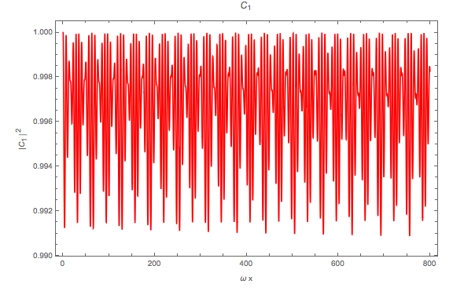
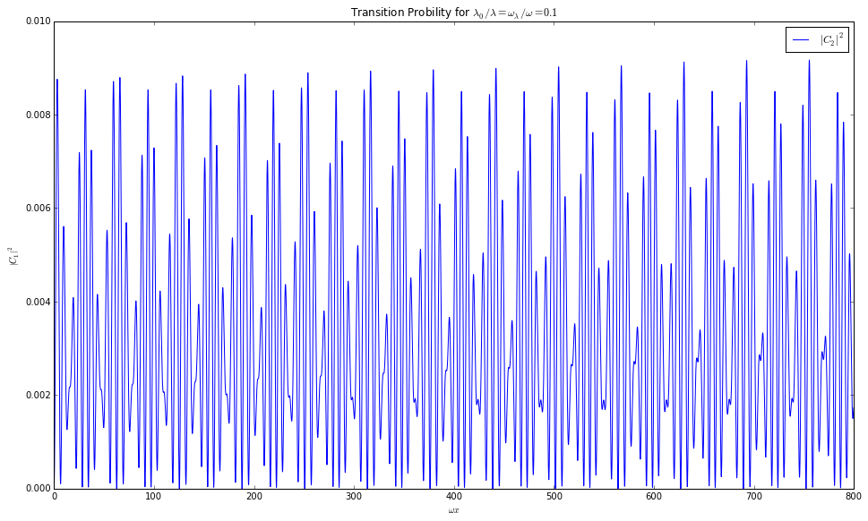
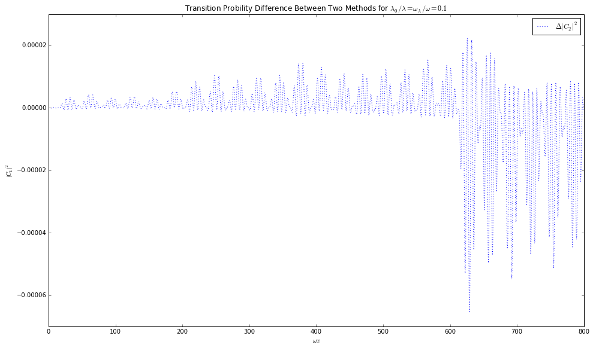
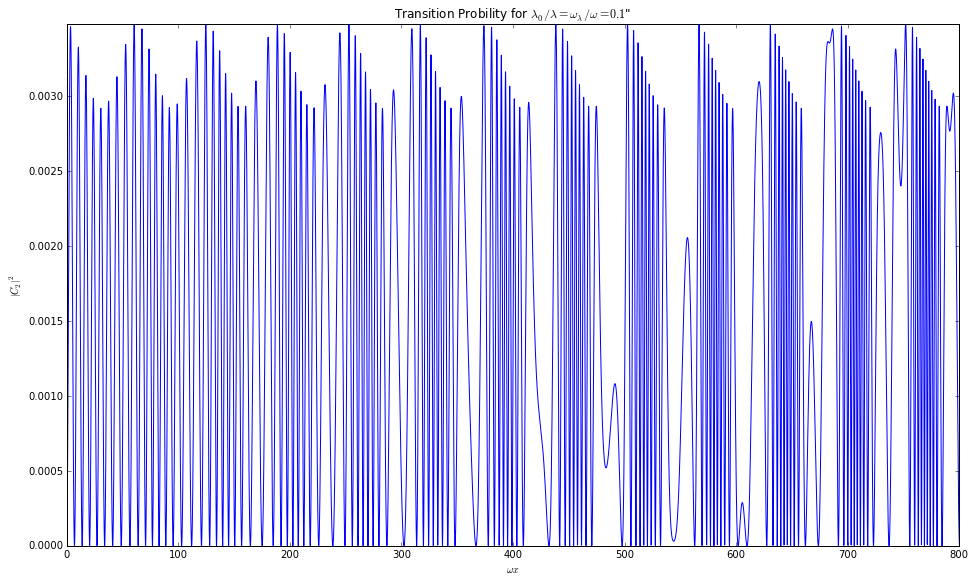
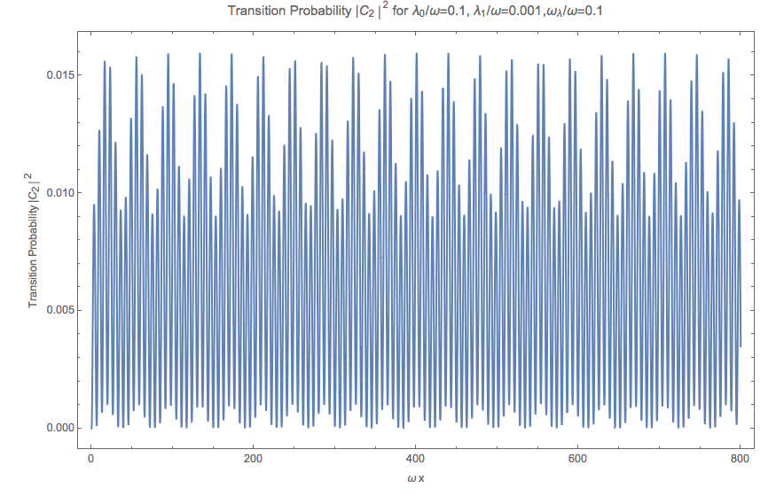
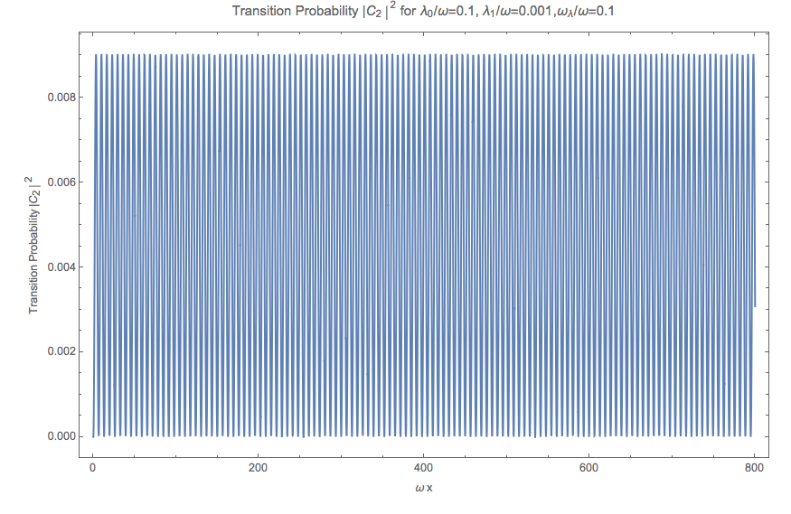
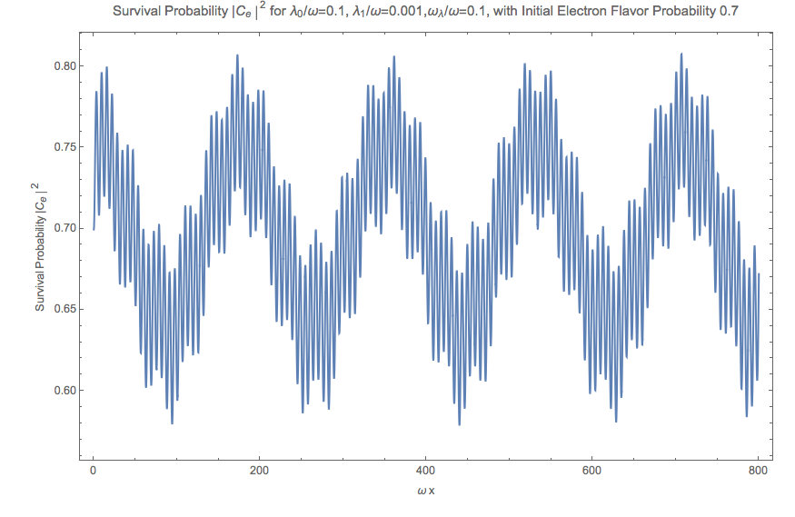
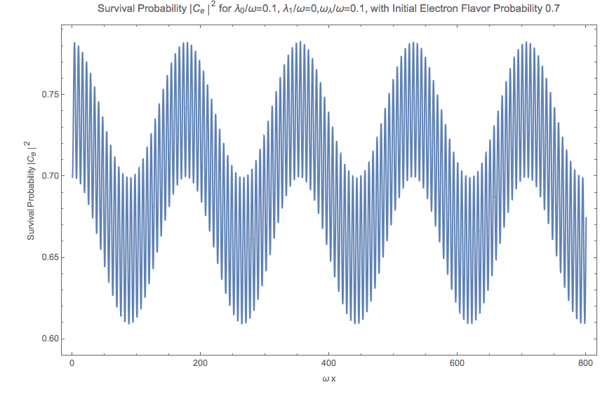
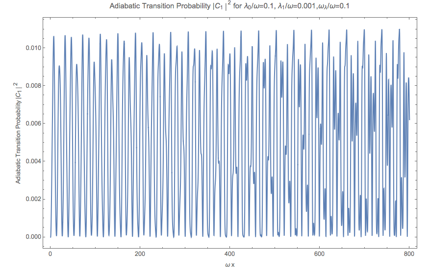
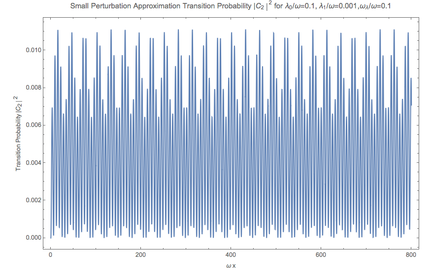

Matter as Driven Energy
====================================

Oscillation in Matter and Vacuum
--------------------------------------------------------------

Oscillation in Vacuum, as we have calculated is,

.. math::
   \begin{pmatrix} \psi_{e}^{(v)} (\bar x) \\ \psi_{x}^{(v)} (\bar x)  \end{pmatrix} = \begin{pmatrix}  \cos\theta_v \psi_{v1}(0) e^{-i\frac{\bar x}{2}} + \sin \theta_v \psi_{v2}(0) e^{i\frac{\bar x}{2}} \\    -\sin\theta_v \psi_{v1}(0) e^{-i\frac{\bar x}{2}} + \cos \theta_v \psi_{v2}(0) e^{i\frac{\bar x}{2}}   \end{pmatrix},

where :math:`\bar x = \omega x` and :math:`\omega = \frac{\delta m^2 }{2E}`.

The initial condition is

.. math::
   \begin{pmatrix} \psi_{v1}(0) \\ \psi_{v2}(0) \end{pmatrix} = \begin{pmatrix} \cos\theta_v & -\sin\theta_v \\ \sin \theta_v & \cos\theta_v \end{pmatrix} \begin{pmatrix} \psi_{e}(0) \\ \psi_{x}(0) \end{pmatrix} .

Thus we have the probability of the second state

.. math::
   P_{x}^{(v)}(\bar x) = 2\sin^2\theta_v \cos^2\theta_v \left( 1 + \cos (\bar x) \right).

Similarly the oscillation in a constant matter background is

.. math::
   P_{x}^{(m)}(\bar x) = 2\sin^2\theta_m \cos^2\theta_m \left( 1 + \cos \left( \frac{\omega_m}{\omega} \bar x \right) \right).

To have a larger amplitude in matter oscillation, we require

.. math::
   \sin ^2\theta_m \cos^2\theta_m \geq \sin ^2\theta_v \cos^2\theta_v,

which simplifies to

.. math::
   \sin 2\theta_m \geq \sin 2\theta_v.

Since

.. math::
   \sin 2\theta_m = \frac{\sin 2\theta_v}{\sqrt{ 1 + \left(\frac{\lambda}{\omega}\right)^2 - 2\frac{\lambda}{\omega} \cos 2\theta_v }},

we have

.. math::
   \sqrt{ 1 + \left(\frac{\lambda}{\omega}\right)^2 - 2\frac{\lambda}{\omega} \cos 2\theta_v } \leq 1.

Manipulating this inequality, we get

.. math::
   \frac{\lambda}{\omega} \leq 2\cos 2\theta_v.

.. admonition:: MSW Resonance
   :class: hint

   The MSW resonance is at

   .. math::
      \frac{\lambda}{\omega} = \cos 2\theta_v.

Notice that this requirement also leads to the result that the oscillation frequency in matter is smaller than the vacuum oscillation frequency,

.. math::
   \omega_m = \omega \sqrt{ 1 +  \left(\frac{\lambda}{\omega}\right)^2 -2 \frac{\lambda}{\omega} \cos 2\theta_v } \leq \omega.

Rabi-like Transition
------------------------------

.. index:: Rabi Oscillation

.. admonition:: Rabi Oscillation
   :class: note

   Rabi oscillations happens when a driven field is applied to a quantum system. A simple case would be a driven field :math:`-A\cos(\omega t)` is applied to a system with Hamiltonian

   .. math::
      H_0 = \begin{pmatrix} \epsilon_1 & 0 \\ 0 & \epsilon_2 \end{pmatrix}.

   The overall Hamiltonian becomes

   .. math::
      H = -\frac{\omega_0}{2} \begin{pmatrix} 1 & 0 \\ 0 & -1 \end{pmatrix} - A \cos(\omega t)\begin{pmatrix} 0 & 1 \\ 1 & 0  \end{pmatrix} .

   Using Pauli matrices, this can be simplified,

   .. math::
      H = -\frac{\omega_0}{2}\sigma_z - A\cos(\omega t)\sigma_x .

   An ansatz about the state is that we can always write down the solutions to this system as

   .. math::
      \ket{\psi} = c_g(t) e^{-iE_g t}\ket{g} + c_e(t) e^{-i E_e t} \ket{e}.

   We also know that in :math:`\{\ket{g},\ket{e}\}` basis, we have :math:`\sigma_z \ket{g}=\ket{g}` and :math:`\sigma_z\ket{e}=-\ket{e}`. Thus the Schroding equation is reduced to

   .. math::
      i\partial_t( c_g e^{-iE_gt}\ket{g}+c_e e^{-iE_et}\ket{e} )=(-\frac{\omega}{2}\sigma_z - A\cos(\omega t) \sigma_z)( c_g e^{-iE_gt}\ket{g}+c_e e^{-iE_et}\ket{e} ).

   Simplify the equation and write down the equations for both :math:`\ket{g}` and :math:`\ket{e}`, I have

   .. math::
      \dot c_g &= i A\cos(\omega t) c_e e^{i(E_g-E_e) t}, \\
      \dot c_e & = i A\cos(\omega t) c_g e^{-i(E_g-E_e)t}.

   Notice that we can write :math:`\cos(\omega t)` as :math:`\frac{1}{2}(e^{-i\omega t} + e^{i\omega t})`. The equations becomes

   .. math::
      \dot c_g &= \frac{iA}{2}c_e ( e^{i(omega-\omega_0)t} + e^{-i(\omega+\omega_0)t} ), \\
      \dot c_e & = \frac{iA}{2} c_g ( e^{i(\omega+\omega_0)t} + e^{i( \omega_0 - \omega )t} ).

   where I used :math:`\omega_0 = E_e - E_g`. I assume this is larger than 0.

   **The rotation wave approximation is that since the term with angular frequency** :math:`\omega+\omega_0` **is much larger than** :math:`\omega_0-\omega`. I would drop it and only capture the overall behavior.

   The equation we have is

   .. math::
      \dot c_g & = \frac{iA}{2} c_e e^{-i(\omega_0-\omega)}, \\
      \dot c_e & = \frac{iA}{2} c_g e^{i(\omega_0 - \omega)}.

   So the problem becomes solvable.

   .. math::
      \ddot c_e - i(\omega - \omega) \dot c_e + \frac{A^2}{4}c_e = 0.

   The solution to this is simply determined by solving out the characteristic equation, which is

   .. math::
      \lambda_{\pm} = \frac{(\omega_0 - \omega) \pm \sqrt{ (\omega_0 - \omega)^2 + A^2 } }{2} .

   The general solution to :math:`c_e` is

   .. math::
      c_e = c_+ e^{i\lambda_+ t} + c_- e^{i\lambda_- t}.

   Suppose we have initial condition that

   .. math::
      c_g(0) & = 1,\\
      c_e(0) & = 0,

   the solutions should be

   .. math::
      c_e(t) & = \frac{iA}{\Omega_R} e^{i\Delta t/2} \sin(\Omega_R t/2) ,\\
      c_g(t) &=  e^{-i\Delta t/2}(\cos(\Omega_R t/2) + \frac{i\Delta}{\Omega_R} \sin(\Omega_R t/2) ),

   where we defined :math:`\Delta = \omega_0-\omega` and the Rabi frequency :math:`\Omega_R^2` is defined as :math:`\Omega_R^2 = \Delta^2 + A^2`.

   The probability for the system to stay on a state :math:`\ket{e}` is

   .. math::
      P = \frac{A^2}{\Omega_R^2} \sin^2\left( \frac{\Omega_R }{2} t \right).

In vacuum energy eigenbasis, we can write down the Hamiltonian for neutrino oscillations in matter,

.. math::
   H =  -\frac{\omega}{2} \sigma_1 + U^{-1} V U,

where the transformation matrix was calculated in the previous chapter. The expression for this Hamiltonian, as we plug in the transformation, is

.. math::
   H = -\frac{\omega}{2} \sigma_3 + \frac{\lambda}{2}\cos(2\theta_v) \sigma_3 + \frac{\lambda}{2}\sin(2\theta) \sigma_1 .

.. admonition:: Comparing with The Simple Case of Rabi Oscillation
   :class: note

   The extra term compared with the Rabi oscillation we worked out is

   .. math::
      \frac{\lambda}{2}\cos(2\theta_v) \sigma_3,

   which is also the troble since here :math:`\lambda` is time dependent.

.. admonition:: Hamiltonian Vector
   :class: note

   This Hamiltonian forms a vector

   .. math::
      \vec H = \begin{pmatrix}  0 & \frac{\lambda}{2}\sin(2\theta_v) & 0 & -\frac{\omega}{2} + \frac{\lambda}{2} \cos(2\theta_v)  \end{pmatrix},

   in the complate basis

   .. math::
      \vec \sigma = \begin{pmatrix}  I & \sigma_1 & \sigma_2 & \sigma_3  \end{pmatrix}.

   So that

   .. math::
      H = \vec H \cdot \vec \sigma.

To solve the problem, we use the ansatz that

.. math::
   \ket{\psi} = C_1 e^{i\frac{\omega}{2}t} \ket{1} + C_2 e^{-i\frac{\omega}{2}t} \ket{2}.

In the proper basis, we also have

.. math::
   \sigma_3 \ket{1} &= \ket{1}, \\
   \sigma_3 \ket{2} & = -\ket{2},\\
   \sigma_1 \ket{1} & = \ket{2},\\
   \sigma_1\ket{2} & = \ket{1}.

Plug in these into Schrodinger equation,

.. math::
   &( i\dot C_1 e^{i\omega t/2} \ket{1} - \frac{\omega}{2} C_1 e^{i\omega t/2} \ket{1} + i\dot C_2 e^{-i\omega t/2} \ket{2} + \frac{\omega}{2} C_2 e^{-i\omega t/2} \ket{1} ) \\
   &= \left( \frac{\lambda}{2} \cos 2\theta_v - \frac{\omega}{2} \right) C_1 e^{i\omega t/2} \ket{1} - \left( \frac{\lambda}{2}\cos 2\theta_v -\frac{\omega}{2}  \right) C_2 e^{-\omega t/2} \ket{2} + \frac{\lambda}{2} \sin 2\theta_v C_1 e^{i\omega t/2}\ket{2} + \frac{\lambda}{2} \sin 2\theta_v C_2 e^{-i\omega t/2} \ket{1}.

Collect terms we get two equations,

.. math::
   i \dot C_1 & = \frac{\lambda \cos 2\theta_v}{2} C_1 + \frac{\lambda \sin 2\theta_v}{2} C_2 e^{-i\omega t}, \\
   i \dot C_2 & = -\frac{\lambda \cos 2\theta_v}{2} C_2 + \frac{\lambda \sin 2\theta_v}{2} C_1 e^{i\omega t}.

Write down the expression for :math:`C_1` from the second equation and the expression for :math:`C_2` from the first equation,

.. math::
   C_1 &= \frac{ i \dot C_2 + \frac{\lambda \cos 2\theta_v }{2}C_2 }{\frac{\lambda \cos 2\theta_v}{2} e^{i\omega t}}, \\
   C_2 & = \frac{ i \dot C_1 - \frac{\lambda \cos 2\theta_v }{2}C_1  }{ \frac{\lambda \sin 2\theta_v}{2} e^{-i\omega t} }.

.. admonition:: The Equations
   :class: note

   The equations should be analyzed term by term.

   .. math::
      i \dot C_1 & = {\color{red}\frac{\lambda \cos 2\theta_v}{2} C_1} {\color{blue}+ \frac{\lambda \sin 2\theta_v}{2} C_2 e^{-i\omega t}}, \\
      i \dot C_2 & = {\color{red}-\frac{\lambda \cos 2\theta_v}{2} C_2} {\color{blue}+ \frac{\lambda \sin 2\theta_v}{2} C_1 e^{i\omega t}}.

   The red terms are the new math, without which the equation given a periodic matter potential will be exactly the same as the Rabi flopping we worked out. The red terms works as acuumulated oscillation due to all the values of :math:`C_1` or :math:`C_2`.

   To see this effect more clearly, the solutions with the blue Rabi flopping terms are worked out for both equations.

   .. math::
      C_1(x) & = {\color{red}C_1(0) \exp\left( -\frac{i}{2} \cos 2\theta_v \int_0^x \lambda (x') dx' \right)} \\
      C_2(x) & = {\color{red}C_2(0) \exp \left( \frac{i}{2} \cos 2\theta_v \int_0^x \lambda(x') dx' \right)}.

   Given initial condition that :math:`C_1(0)=1` and :math:`C_2(0)=0`, we anticiptate the the new red term for :math:`C_2(x)` only works as :math:`C_1(x)` is populted to :math:`C_2(x)` through Rabi flopping.

   Notice that this term will give us more complicated oscillatary result since it will mix up with the Rabi flopping result. The phase in these results won't just simply go away when the moduli are calculated.

   The other view of these equations is to look at the expressions

   .. math::
      C_1 &= {\color{blue}\frac{ i \dot C_2}{\frac{\lambda \cos 2\theta_v}{2} e^{i\omega t}}} {\color{red} + \frac{\frac{\lambda \cos 2\theta_v }{2}C_2 }{\frac{\lambda \cos 2\theta_v}{2} e^{i\omega t}}  }, \\
      C_2 & = {\color{blue}\frac{ i \dot C_1}{ \frac{\lambda \sin 2\theta_v}{2} e^{-i\omega t} }  } -  {\color{red} \frac{\frac{\lambda \cos 2\theta_v }{2}C_1  }{ \frac{\lambda \sin 2\theta_v}{2} e^{-i\omega t} }  }.

   It means that the new terms added new mixing contributions to :math:`C_1` and :math:`C_2`. But the idea is that we don't really know whether it is enhencement or reduction.

Combine the two equations we get the equation for :math:`\dot C_1` which is used to get the equation for :math:`C_2`. Simplification can be done and it leads to

.. math::
   \ddot C_2 - \left( i \omega +  \frac{\dot \lambda}{\lambda}  \right) \dot C_2 - \left(   \frac{\lambda \cos 2\theta_v}{2} \omega  - \frac{\lambda^2}{4}   \right) C_2 = 0.

Since the equation doesn't corresponds to a clear and simple physics picture, we need to understand term by term.

.. admonition:: Review of The Hamiltonian
   :class: note

   The Hamiltonian we are dealing with is

   .. math::
      H = {\color{green}-\frac{\omega}{2} \sigma_3} + {\color{red}\frac{\lambda}{2} \cos 2\theta_v \sigma_3} + {\color{blue}\frac{\lambda}{2}\sin 2\theta_v \sigma_1},

   where the green term contributes to the two eigenenergies, the red term contributes to the two eigenenergies but with a time or space dependence, the last blue term is the flopping term.

One of the obstacles of further approximations to Rabi oscillation is that the term :math:`\frac{\lambda}{2} \cos 2\theta_v` is not much smaller than the flopping term which means it can not be dropped.

From now on we are going to use :math:`ct=x` since neutrinos has a velocity very close to speed of light which means we can just replace :math:`t` with :math:`x` in natural units.

Analytical Attack
--------------------------

Period Matter Potential (NON-PHYSICAL)
----------------------------------------------------

For simplicity we consider periodic matter potential, :math:`\lambda(x) = \lambda_0 \cos(\omega_\lambda x) \equiv \alpha\omega \cos(\omega_\lambda x)`. Also for easy calculation, we define :math:`\omega_\lambda = \beta \omega`. Thus :math:`\alpha` and :math:`\beta` fully describes the periodic matter potential.

We use periodic matter potential :math:`\lambda(x) = \lambda_0 \cos(\omega_\lambda x) \equiv \alpha\omega \cos(\omega_\lambda x)` and define :math:`\omega_\lambda = \beta \omega`.

Numerical Results
~~~~~~~~~~~~~~~~~~~~~~~~~

To verify this approximation, we also need to write down the equation for :math:`C_2`,

.. math::
   - \frac{d^2 C_2}{d\bar x ^2} + \left( i -\beta \tan (\beta \bar x) \right) \frac{d C_2}{d\bar x} + \left( \frac{\alpha}{2} \cos (\beta \bar x)\cos 2\theta_v - \frac{\alpha^2}{4} \cos^2 (\beta \bar x)  \right) C_2 = 0 .

We have the two real equations for it, which is written as a matrix equation.

.. math::
   \frac{d}{d\bar x}\begin{pmatrix} C_{2,R} \\ C_{2,I} \\ C_{2P,R} \\ C_{2P,I} \end{pmatrix} =\begin{pmatrix}
   0 & 0 & 1 & 0 \\
   0  & 0 & 0 & 1 \\
   \frac{\alpha}{2}\cos 2\theta_v \cos (\beta \bar x) - \frac{\alpha^2}{4}\cos^2 (\beta \bar x) & 0 & -\beta \tan (\beta\bar x) & -1 \\
   0 & \frac{\alpha}{2}\cos 2\theta_v \cos (\beta \bar x) - \frac{\alpha^2}{4}\cos^2 (\beta \bar x) & 1 & -\beta \tan (\beta \bar x)
   \end{pmatrix} \begin{pmatrix} C_{2,R} \\ C_{2,I} \\ C_{2P,R} \\ C_{2P,I} \end{pmatrix}

where we defined :math:`C_{2P}=\frac{dC_{2}}{d\bar x}`.

Meanwhile, the original equations becomes

.. math::
   i \frac{d C_1}{d \bar x} &= \frac{\alpha \cos 2\theta_v }{2} \cos (\beta \bar x) C_1 + \frac{\alpha \sin 2\theta_v}{2} \cos (\beta \bar x) C_2 e^{-i\bar x} \\
   i \frac{d C_2}{d\bar x} & =  -\frac{\alpha \cos 2\theta_v}{2} \cos (\beta\bar x) C_2 + \frac{\alpha \sin 2\theta_v}{2} \cos (\beta \bar x) C_1 e^{i\bar x}.

To solve them numerically, we could decompose it into four real equations.

.. math::
   - \frac{d C_{1,I}}{d \bar x} &= \frac{\alpha \cos 2\theta_v}{2} \cos (\beta \bar x) C_{1,R} + \frac{\alpha \sin 2\theta_v}{2} \cos (\beta \bar x) C_{2,R} \cos(\bar x) + \frac{\alpha \sin 2\theta_v}{2} \cos (\beta \bar x) C_{2,I} \sin(\bar x) \\
   \frac{d C_{1,R}}{d\bar x}& = \frac{\alpha \cos 2\theta_v}{2} \cos (\beta \bar x) C_{1,I} - \frac{\alpha \sin 2\theta_v}{2} \cos (\beta \bar x) C_{2,R} \sin(\bar x) + \frac{\alpha \sin 2\theta_v}{2} \cos (\beta \bar x) C_{2,I} \cos(\bar x) \\
   -\frac{d C_{2,I}}{d\bar x}&= -\frac{\alpha \cos 2\theta_v}{2} \cos (\beta \bar x) C_{2,R} + \frac{\alpha \sin 2\theta_v}{2} \cos (\beta \bar x) C_{1,R}\cos \bar x - \frac{\alpha \sin 2\theta_v}{2} \cos (\beta \bar x) C_{1,I}\sin \bar x \\
   \frac{d C_{2,R}}{d\bar x} & = -\frac{\alpha \cos 2\theta_v}{2} \cos (\beta \bar x)  C_{2,I} + \frac{\alpha \sin 2\theta_v}{2} \cos (\beta \bar x) C_{1,R} \sin \bar x + \frac{\alpha \sin 2\theta_v}{2}\cos (\beta \bar x) C_{1,I} \cos \bar x .

Consequently, we have the matrix equation as the original equations,

.. math::
   \frac{d}{d\bar x}\begin{pmatrix} C_{1,R}\\ C_{1,I} \\ C_{2,R} \\ C_{2,I} \end{pmatrix} = \frac{1}{2}\begin{pmatrix}
   0 & \alpha\cos 2\theta_v & - \alpha \sin 2\theta_v\sin \bar x & \alpha \sin 2\theta_v \cos \bar x \\
   -\alpha\cos 2\theta_v & 0 & -\alpha\sin 2\theta_v \cos \bar x & - \alpha \sin 2\theta_v\sin\bar x \\
   \alpha \sin 2\theta_v \sin \bar x & \alpha \sin 2\theta_v \cos \bar x & 0 & -\alpha\cos 2\theta_v \\
   -\alpha \sin 2\theta_v \cos \bar x & \alpha \sin 2\theta_v \sin \bar x & \alpha \cos 2\theta_v & 0
   \end{pmatrix} \begin{pmatrix} C_{1,R}\\ C_{1,I} \\ C_{2,R} \\ C_{2,I} \end{pmatrix}.

The numerical results have periodic stimulated phenomena.

   Numerical result using Mathematica. sin2thetav = 0.917; cos2thetav = 0.4

.. figure:: assets/matter-driven/matterandrabi-numerical-original-c2-mma.png
   :align: center

   Numerical result using Mathematica. sin2thetav = 0.917; cos2thetav = 0.4

.. figure:: assets/matter-driven/matterandrabi-numerical-original-c1-py.png
   :align: center

   Numerical result using python. sin2thetav = 0.917; cos2thetav = 0.4

.. figure:: assets/matter-driven/matterandrabi-numerical-original-c2-py.png
   :align: center

   Numerical result using python. sin2thetav = 0.917; cos2thetav = 0.4

The second order equation of :math:`C_2` can also be solved numerically.

   Solving the second order equation of :math:`C_2` numerically. sin2thetav = 0.917; cos2thetav = 0.4

   The difference between solving the two first order equations and the one second order equation. The two methods are not exactly the same even though they are the same equations. This is probability because `numpy.odeint` is used instead of `numpy.ode`. sin2thetav = 0.917; cos2thetav = 0.4

Approximation
~~~~~~~~~~~~~~~~~~~~~~~

We first consider the case that :math:`\frac{\lambda}{2} \cos 2\theta_v\ll \frac{\omega}{2}` and :math:`\omega_\lambda\ll \omega` which means that the modulation of eigenenergies are not very fast. Translate these conditions into math, we require that

.. math::
   \alpha &\ll 1\\
   \beta & \ll 1.

1. The red term :math:`\frac{\lambda}{2} \cos 2\theta_v\sigma_3` works as a modulation of the eigenenergies.
2. The blue term :math:`\frac{\lambda}{2}\sin 2\theta_v \sigma_1` flips the states with a Rabi flopping rate **approximately**. The rate in this case could be

   .. math::
      P = \frac{\frac{\lambda_0^2}{2^2} \sin^2 2\theta_v }{\Omega_R^2} \sin^2\left( \frac{\Omega_R}{2} t  \right),

   where :math:`\Omega_R` is a function of :math:`x`,

   .. math::
      \Omega_R^2 &= \omega^2 \left( \left(1 - \frac{\omega_\lambda}{\omega}  - \frac{\alpha}{2}\cos 2\theta_v \cos\left( \frac{\omega_\lambda}{\omega} \omega x \right) \right)^2 + \left( \frac{\alpha}{2}\sin 2\theta_v  \right)^2  \right) \\
      &= \omega^2 \left( \left( 1 - \beta - \frac{\alpha}{2}\cos 2\theta_v \cos\left( \beta \bar x \right) \right)^2 + \left( \frac{\alpha}{2}\sin 2\theta_v \right)^2 \right)

   So we define :math:`\hat\Omega_R = \Omega_R/\omega` and :math:`\bar x = \omega x`. The survival probability as an approximation becomes

   .. math::
      P = \frac{(\alpha \sin 2\theta_v)^2}{4 \omega (\hat\Omega_R(\bar x))^2} \sin^2\left( \frac{\hat\Omega_R(\bar x)}{2} \bar x \right).

This theoretical prediction is shown in the following figure.

   RWA plus slow periodic perturbation (and probabily more hidden approximations) analytical result.

Constant Matter with Periodic Perturbation
----------------------------------------------------------------

Using the scaled variable :math:`\bar x = \omega x`, the equations for :math:`C_1` and :math:`C_2` are

.. math::
   i \frac{d C_1}{d\bar x} & = {\color{red}\frac{\cos 2\theta_v}{2} \frac{\lambda }{\omega} C_1} {\color{blue}+ \frac{\sin 2\theta_v}{2} \frac{\lambda }{\omega} C_2 e^{-i\bar x}}, \\
   i \frac{d C_2}{d\bar x} & = {\color{red}-\frac{\cos 2\theta_v}{2} \frac{\lambda }{\omega} C_2} {\color{blue}+ \frac{\sin 2\theta_v}{2} \frac{\lambda }{\omega} C_1 e^{i\bar x}},

which gives us the general equation for :math:`C_2`

.. math::
   \frac{d^2C_2}{d\bar x ^2} - \left( \frac{1}{\lambda} \frac{d\lambda}{d\bar x}  + i \right) \frac{dC_2}{d\bar x} - \left( \frac{1}{2} \frac{\lambda}{\omega} \cos 2\theta_v - \frac{1}{4}\left( \frac{\lambda}{\omega} \right)^2 \right) C_2 = 0.

We will consider the case that matter potential is composed of a constant background potential :math:`\lambda_0` and a periodic perturbative potential :math:`\lambda_1\cos(\beta \bar x)`. Thus the matter potential is :math:`\lambda = \lambda_0 + \lambda_1 \cos(\beta x)`, where :math:`\beta = \frac{\omega_\lambda}{\omega}`.

Define the following variables,

.. math::
   \alpha_0 & = \frac{\lambda_0}{\omega}, \\
   \alpha_1 & = \frac{\lambda_1}{\omega}.

The equations for :math:`C_1` and :math:`C_2` becomes

.. math::
   i \frac{dC_1}{d\bar x} & = {\color{red}\frac{\cos 2\theta_v}{2} ( \alpha_0 + \alpha_1\cos(\beta \bar x) ) C_1} {\color{blue}+ \frac{\sin 2\theta_v}{2} ( \alpha_0 + \alpha_1\cos(\beta \bar x) ) C_2 e^{-i\bar x}}, \\
   i \frac{d C_2}{d\bar x} & = {\color{red}-\frac{\cos 2\theta_v}{2} ( \alpha_0 + \alpha_1\cos(\beta \bar x) ) C_2} {\color{blue}+ \frac{\sin 2\theta_v}{2} ( \alpha_0 + \alpha_1\cos(\beta \bar x) ) C_1 e^{i\bar x}}.

The equation for :math:`C_2` becomes

.. math::
   \frac{d^2C_2}{d\bar x^2} + \left( \frac{ \frac{\alpha_1}{\alpha_0} \beta \sin (\beta \bar x) }{ 1 + \frac{\alpha_1}{\alpha_0} \cos (\beta \bar x) } - i \right) \frac{dC_2}{d\bar x} + \frac{1}{4} \left( \alpha_0^2 \left( 1 + \frac{\alpha_1}{\alpha_0} \cos (\beta \bar x) \right)^2 - 2 \alpha_0 \left(1 + \frac{\alpha_1}{\alpha_0} \cos (\beta \bar x)  \right) \right) C_2 = 0

.. admonition:: Consistancy Check
   :class: note

   This result should go back to the non-physical periodic perturbation case when we plug in :math:`\lambda_0 = 0`.

   As we do that, the result is

   .. math::
      \frac{d^2 C_2}{d\bar x^2} + ( \beta \tan(\beta \bar x) - i ) \frac{dC_2}{d\bar x} + \frac{1}{4} \left( \alpha_1^2 \cos ^2 (\beta \bar x) - 2\alpha_2 \cos (\beta \bar x) \cos 2\theta_v \right) C_2 = 0,

   which indeed is the case we had.

Numerical Results
~~~~~~~~~~~~~~~~~~~~~~

   Numerical result for the transition probability :math:`\left\lvert C_2\right\rvert^2` with parameters :math:`sin2thetav = 0.917`, :math:`\alpha_0 = 0.1`, :math:`\alpha_1 = 0.01 \alpha_0`, :math:`\beta = 0.1`.

As a comparision, we also have the result when :math:`\alpha_1 = 0`.

   Numerical result for the transition probability with a constant matter perturbation, i.e., :math:`\alpha_1=0`. Other parameters are :math:`sin2thetav = 0.917`, :math:`\alpha_0 = 0.1`, :math:`\beta = 0.1`.

To go back to flavor basis, we use

.. math::
   \begin{pmatrix} C_e \\ C_x \end{pmatrix} = \begin{pmatrix} \cos\theta_v & \sin\theta_v \\ -\sin\theta_v & \cos \theta_v \end{pmatrix} \begin{pmatrix} C_1 \\ C_2 \end{pmatrix}.

Since we have been using initial condition that :math:`\lvert C_1 \rvert^2=1`, the initial electron flavor is :math:`\lvert C_e \rvert^2 = 0.70`.

   Electron neutrino survival probability.

   Electron flavor survival probability for background matter potential only.

Resoances
---------------------------------------

For a matter profile

.. math::
   \lambda (x) = \lambda_0 + \lambda_1 \sin ( \beta \hat x ),

where :math:`\hat x = \omega x`, the resonance happens at a :math:`\beta` value

.. math::
   \beta_r = \frac{1}{n} \sqrt{ \hat \lambda ^2 +1 - 2\hat\lambda \cos (2\theta_v) }.

This result comes from the matching of the frequency of matter oscillation profile :math:`\beta` and matter oscillation frequency :math:`\omega_m = \frac{\omega_m}{2} - \left( -\frac{\omega_m}{2} \right)` to some certain fraction :math:`n`, [1]_

.. math::
   n \beta - \left( \frac{\omega_m}{2} - \left( -\frac{\omega_m}{2} \right) \right) = 0.

What Really is the Reason of These Transition?
~~~~~~~~~~~~~~~~~~~~~~~~~~~~~~~~~~~~~~~~~~~~~~~~~~~~~~~~~~~~~~~~~~~~~

As a comparison, we would like to see how is the system deviating from adiabatic. In adiabatic limit, we have a light state and a heavy state, which means we have a wavefunction

.. math::
   \begin{pmatrix} \nu_L(x) \\ \nu_H(x) \end{pmatrix}.

The relation between the wave function in this basis and the wave function in flavor basis is

.. math::
   \begin{pmatrix} \nu_L(x) \\ \nu_H(x) \end{pmatrix} = \mathbf{U^{-1}}(x) \begin{pmatrix} \nu_e \\ \nu_x \end{pmatrix}.

Meanwhile,

.. math::
   \begin{pmatrix} \nu_e \\ \nu_x \end{pmatrix} = \mathbf{U} \begin{pmatrix} \nu_1 \\ \nu_2 \end{pmatrix},

where the rotation matrix :math:`\mathbf{U}` relates vacuum eigenbasis wave function to the flavor basis wave function.

Survival probability of the heavier state in vacuum basis is given by

.. math::
   P_{\nu_1\to\nu_2} = \left\lvert \cos(\theta_v- \theta(x)) \nu_L(0) - \sin(\theta_v - \theta(x)) \nu_H(0)  \right\rvert^2,

where

.. math::
   \nu_L(0) &= \cos(\theta_v - \theta(0)) \\
   \nu_H(0) & = -\sin(\theta_v - \theta(0)),

given initial condition that in vacuum basis that

.. math::
   \nu_1(0) &= 1\\
   \nu_2(0) & = 0.

   Adiabatic result given the same parameters and initial condition, i.e., :math:`\left\lvert C_2\right\rvert^2`, :math:`sin2thetav = 0.917`, :math:`\alpha_0 = 0.1`, :math:`\alpha_1 = 0.01 \alpha_0`, :math:`\beta = 0.1`.

Approximations
~~~~~~~~~~~~~~~~~~~~~~

Approximations can be done when :math:`\alpha_1\ll \alpha_0` which means the perturbation is small compared to the background.

Using :math:`\frac{\alpha_1}{\alpha_0}` as a small quantity, apply Taylor expansion and keep only first order, we have

.. math::
   &\frac{ \frac{\alpha_1}{\alpha_0}\beta \sin (\beta \bar x) }{ 1 + \frac{\alpha_1}{\alpha_0} \cos (\beta \bar x)  }
   \approx  \frac{\alpha_1}{\alpha_0}\beta \sin (\beta \bar x), \\
   & \frac{1}{4} \left( \alpha_1^2 \cos ^2 (\beta \bar x) - 2\alpha_2 \cos (\beta \bar x) \cos 2\theta_v \right)   \\
   \approx & -\frac{1}{4} \left( 2\cos 2\theta_v - 1 + 2 \left( \frac{\alpha_1}{\alpha_0} \cos (\beta \bar x) \right) ( \cos 2\theta_v -1 )  \right) \\
   = & \frac{1}{2} \alpha_0 ( 1 - \cos 2\theta_v ) \left( 1 + \frac{\alpha_1}{\alpha_0} \cos (\beta \bar x) \right)  - \frac{1}{4} \alpha_0 .

Under this approximation, the equation for :math:`C_2` becomes

.. math::
   \frac{d^2 C_2}{ d\bar x^2}  + \left( \frac{\alpha_1}{\alpha_0} \sin (\beta \bar x) - i \right) \frac{d C_2}{d\bar x} + \left( \frac{1}{2} \alpha_0 (1 - \cos 2\theta_v) \left(1 + \frac{\alpha_1}{\alpha_0} \cos (\beta \bar x) \right) - \frac{1}{4}\alpha_0  \right) C_2 = 0 .

   Small pertubation approximation numerical result. Parameters used are :math:`sin2thetav = 0.917`, :math:`\alpha_0 = 0.1`, :math:`\alpha_1 = 0.01 \alpha_0`, :math:`\beta = 0.1`.

Refs & Notes
-----------------

.. [1] Kneller, J. P., McLaughlin, G. C., & Patton, K. M. (2013). Stimulated neutrino transformation in supernovae. AIP Conference Proceedings, 1560, 176–178. doi:10.1063/1.4826746
