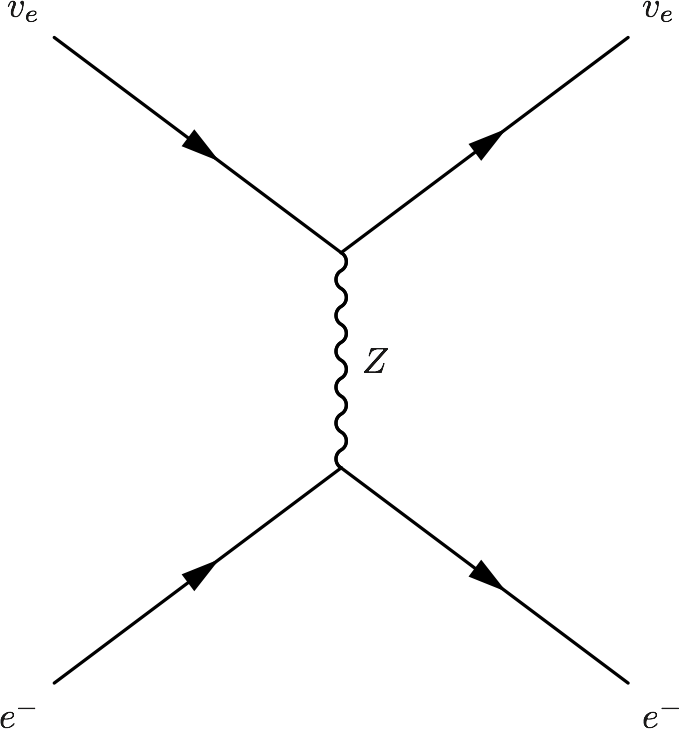

Interaction With Matter
=================================================

.. index:: MSW effect

MSW Effect
-------------------

.. admonition:: Physics of MSW
   :class: note

   As neutrinos passing by matter, the effective mass coming from energy change becomes important thus changing it's eigenstates and propagation.

Neutrinos do interact with matter, mostly electrons in most cases.

.. code:: tex

   \begin{fmfgraph*}(200,180)
     \fmfleft{i1,i2}
     \fmfright{o1,o2}
     \fmf{fermion}{i1,v1,o1}
     \fmf{fermion}{i2,v2,o2}
     \fmf{photon}{v1,v2}
     \fmflabel{$v_e$}{i2}
     \fmflabel{$e^-$}{i1}
     \fmflabel{$v_e$}{o2}
     \fmflabel{$e^-$}{o1}
     \fmf{photon,label=$Z$}{v1,v2}
   \end{fmfgraph*}

.. figure:: assets/nutaueNeutral.png

.. code:: tex

   \begin{fmfgraph*}(200,180)
    \fmfleft{i1,i2}
    \fmfright{o1,o2}
    \fmf{fermion}{i1,v1,o1}
    \fmf{fermion}{i2,v2,o2}
    \fmf{photon}{v1,v2}
    \fmflabel{$v_\tau$}{i2}
    \fmflabel{$e^-$}{i1}
    \fmflabel{$v_\tau$}{o2}
    \fmflabel{$e^-$}{o1}
    \fmf{photon,label=$Z$}{v1,v2}
   \end{fmfgraph*}

.. figure:: assets/nueCharged.png

.. code:: tex

   \begin{fmfgraph*}(200,180)
    \fmfleft{i1,i2}
    \fmfright{o1,o2}
    \fmf{fermion}{i1,v1,o1}
    \fmf{fermion}{i2,v2,o2}
    \fmf{photon}{v1,v2}
    \fmflabel{$v_e$}{i2}
    \fmflabel{$e^-$}{i1}
    \fmflabel{$v_e$}{o1}
    \fmflabel{$e^-$}{o2}
    \fmf{photon,label=$W^{-}$}{v1,v2}
   \end{fmfgraph*}

The one that is missing is the charged current for :math:`nu_\tau` and :math:`e^{-}` interaction because of lepton number conservation.

The first two diagrams will add two equal terms on the diagonal terms of Hamiltonian, which can be viewed as adding a number times identity matrix thus conserves the eigenstates while shifts the eigenvalues. However, the third diagram will only add a term to the first diagonal term of Hamiltonian, which is the weak coupling :math:`\Delta = \sqrt{2}G_F n(x)` with :math:`n(x)` being the number density of electrons.

.. admonition:: Identity Matrix and Survival Probability
   :class: note

   Identity matrix shifts the eigenvalues up and down homogeneously which changes the evolution of the state. However, since this is only a phase, the calculation of the survival probability will kill this phase.

.. admonition:: Weak Interaction
   :class: note

   We can guess this interaction term using physics picture. This interaction should be proportional to density of electrons with a coupling constant :math:`G_F`. Then check the dimensions.

   .. math::
      [G_F] &= [E]^{-2} \\
      [n(x)] & = [E]^3

   So the dimension is right. The missing constant is :math:`\sqrt{2}`.

This symmetry breaking will change the evolution and makes the states more electron neutrino.

This is the reason of MSW effect.

In other words, the first requirement of MSW effect is that the electrons interacts with neutrinos and makes it in a specific state that is heavy if the electron density is strong enough. Meanwhile, if the mixing angle is not that large, a level crossing could happen making the state a light state as the density becomes vacuum. The other requirement, which is obvious, is that the density change should be adiabatic, the meaning of which is the density profile of matter gently reduces to vacuum, leaving enough reaction time for the neutrinos.

The MSW effect itself can be made clear using the example of neutrino oscillations in our sun.

.. admonition:: Small Mixing Angle
   :class: note

   Take two flavour mixing as an example.

   .. math::
      \begin{pmatrix}\nu_e \\ \nu_x\end{pmatrix} = \begin{pmatrix}  \cos\theta & \sin\theta \\ -\sin\theta  & \cos\theta \end{pmatrix}   \begin{pmatrix}\nu_1 \\ \nu_2\end{pmatrix}

   In the small mixing angle limit,

   .. math::
      \begin{pmatrix}\nu_e \\ \nu_x\end{pmatrix} \to \begin{pmatrix}  1 & \theta \\ -\theta  & 1 \end{pmatrix}   \begin{pmatrix}\nu_1 \\ \nu_2\end{pmatrix}

   which is very close to an identity matrix. This implies that electron neutrino is more like mass eigenstate :math:`\nu_1`. By :math:`\nu_1` we mean the state with energy :math:`\frac{ \delta m^2 }{4E}` in vacuum.

   We need this intuitive picture to understand MSW effect. Electron neutrinos are almost identical to the low mass neutrino mass eigenstate. **However, as we will see, due to the matter interaction, the electron flavour neutrino is corresponding to the HEAVY mass eigenstate.** This is the key idea in physics of MSW effect.

The Hamiltonian for neutinos with neutrino-matter interaction (in flavour basis) is

.. math::
   \mathbf H = \frac{ \delta m^2 }{4E}\begin{pmatrix} -\cos 2\theta & \sin 2\theta \\ \sin 2\theta & \cos 2\theta \end{pmatrix}  {\color{red} + \frac{\Delta}{2} \mathbf {\sigma_3}}  {\color{green}+ \Delta \mathbf I},

where the last term (green part) can be neglected because this term will only shift all the eigenvalues with the same amount without changing the eigenvectors.

Define a quantities like :math:`\omega=\frac{ \delta m^2 }{2E}` for neutrinos ( :math:`\bar\omega = \frac{ \delta m^2 }{-2E}` for antineutrinos) and :math:`\Delta = \sqrt{2} G_F n(x)` (which might be denoted by :math:`\nu = \sqrt{2}G_F n_\nu` in other lituratures).

Using Pauli matrices, I can decompose this to

.. math::
   \mathbf H = \frac{\omega}{2}= ( -\cos2\theta \sigma_3 + \sin 2\theta \sigma_1 )   {\color{red} + \frac{\Delta}{2} \mathbf {\sigma_3}}  {\color{green}+ \Delta \mathbf I}

.. note::
   As a reminder, :math:`\Delta = \sqrt{2}G_F n(x)`.

.. note::
   The red part is from the charged current Feynman diagram. We have a :math:`\mathbf\sigma_3` matrix instead of an matrix like

   .. math::
      \begin{pmatrix}1 & 0 \\ 0 & 0 \end{pmatrix}

   because we rewrite this matrix with Pauli matrices and identy. Then the identities are neglected.

   This can be done properly because Pauli matrice and Identy matrix form a complete basis.

In a more compact form, this Hamiltonian is

.. math::
   \mathbf H &= \frac{ \delta m^2 }{4E} \left( -\cos 2\theta \mathbf {\sigma_3 } + \sin 2\theta \mathbf{\sigma_1} \right)  {\color{red} + \frac{\Delta}{2} \mathbf {\sigma_3}} \\
   & = \left(\frac{\Delta}{2} -\frac{ \delta m^2 }{4E} \cos 2\theta\right) \mathbf {\sigma_3 } + \frac{ \delta m^2 }{4E} \sin 2\theta \mathbf{\sigma_1}

.. note::
   Eigenvalues of :math:`\mathbf {\sigma_3}` are 1 and -1 with corresponding eigenvectors

   .. math::
      \begin{pmatrix}1\\ 0 \end{pmatrix}

   and

   .. math::
      \begin{pmatrix}0\\ 1 \end{pmatrix}.

As we have mentioned, this Hamiltonian is in flavour basis. When mixing angle :math:`\theta \to 0`, the eigenvectors are almost eigenvectors of :math:`\mathbf{\sigma_3}` which are electron neutrinos and x type neutrinos.

.. admonition:: Interesting Limits
   :class: note

   Before we really solve the equation of motion, some interesting limits can be shown here.

   **Interaction** :math:`\Delta` **is much larger than cacuum mixing terms.** In this case, the Hamiltonian becomes diagonalized and the neutrinos will stay on it's flavour eigenstates in the propagation.

   **Interaction** :math:`\Delta` **is much smaller than vacuum mixing terms.** The propagation reduces to vacuum case.

To see this effect quantitively, we need to diagonalize this Hamiltonian (**Can we actually diagonalize the equation of motion? NO!**). Equivalently, we can rewrite it in the basis of mass eigenstates :math:`\{\ket{\nu_L(x)}, \ket{\nu_H(x)}\}`,

.. math::
   \ket{\nu_L(x)} &= \cos\theta(x) \ket{\nu_e} - \sin\theta(x) \ket{\nu_\mu} \\
   \ket{\nu_H(x)} & =  \sin\theta(x) \ket{\nu_e} - \cos\theta(x) \ket{\nu_\mu}.

This new rotation in matrix form is

.. math::
   \begin{pmatrix} \ket{\nu_L(x)} \\ \ket{\nu_H(x)} \end{pmatrix} &= \begin{pmatrix} \cos \theta(x) & -\sin\theta(x) \\ \sin\theta(x) & \cos\theta(x) \end{pmatrix} \begin{pmatrix}\ket{\nu_e} \\ \ket{\nu_x} \end{pmatrix} \\
   & = \mathbf{U^{-1}_x } \begin{pmatrix}\ket{\nu_e} \\ \ket{\nu_x} \end{pmatrix}

.. admonition:: Diagonalize Hamiltonian
   :class: note

   To diagonilize it, we need to multiply on both sides the rotation matrix and its inverse,

   .. math::
      \mathbf {H_{xd}} = \mathbf{U_x^{-1}} \mathbf H \mathbf {U_x}.

   The second step is to set the off diagonal elements to zero. By solving the equaions we can find the :math:`\sin 2\theta(x)` and :math:`\cos 2\theta(x)`.

   .. math::
      \mathbf{H_{xd}} &= \mathbf{U^{-1}_x} \left( A_1 \mathbf{\sigma_1} + A_3 \mathbf{\sigma_3} \right) \mathbf{ U_x } \\
      & = \begin{pmatrix} A_3\cos 2\theta(x) - A_1 \sin 2\theta(x) & A_3 \sin 2\theta(x) + A_1 \cos 2\theta(x) \\ A_3 \sin 2\theta(x) + A_1\cos 2\theta(x) &  - A_3 \cos 2\theta(x) + A_1 \sin 2\theta(x) \end{pmatrix},

   where

   .. math::
      A_3 &  = \frac{\Delta}{2} - \frac{\delta^2 m}{4E}\cos 2\theta \\
      A_1 & =  \frac{\delta^2 m}{4E} \sin 2\theta.

   Set the off-diagonal elements to zero,

   .. math::
      A_3 \sin 2\theta(x) + A_1 \cos 2\theta(x)  = 0

   So the solutions are

   .. math::
      \sin 2\theta(x) & = \frac{A_1}{\sqrt{A_1^2 + A_3^2}} \\
      \cos 2\theta(x) & = \frac{-A_3}{\sqrt{A_1^2+A_3^2}}.

   Plug in :math:`A_1` and :math:`A_3`

   .. math::
      \sin 2\theta(x)  &= \frac{\sin 2\theta_v}{\sqrt{ \left(\frac{\Delta}{\omega} \right)^2+1 - 2 \frac{\Delta}{\omega}\cos 2\theta_v }} \\
      \cos 2\theta(x)&= \frac{ \cos 2\theta_v - \frac{\Delta}{\omega} }{ \sqrt{ \left( \frac{\Delta}{\omega} \right)^2  +1 - 2 \frac{\Delta}{\omega}\cos 2\theta_v  }}.

   Define :math:`\hat\Delta = \frac{\Delta}{\omega}` with :math:`\omega=\frac{\Delta m^2}{2E}`, which represents the matter interaction strength compared to the vacuum oscillation.

   .. math::
      \sin 2\theta(x)  &= \frac{\sin 2\theta_v}{\sqrt{ \hat\Delta ^2+1 - 2 \hat\Delta \cos 2\theta_v }} \\
      \cos 2\theta(x)&= \frac{ \cos 2\theta_v - \hat\Delta  }{ \sqrt{\hat\Delta ^2  +1 - 2 \hat\Delta \cos 2\theta_v } }.

   **This diagonalize the Hamiltonian LOCALLY. It's not possible to diagonalize the Hamiltonian globally if the electron number density is not a constant.**

   **The point is, for equation of motion, we have a differentiation with respect to position** :math:`x`! **So even we diagonalize the Hamiltonian, the equation of motion won't be diagonalized. An extra matrix will occur on the LHS and de-diagonalize the Hamiltonian on RHS.**

.. note::
   As :math:`\Delta \to \infty`, :math:`A_3\to \infty` and :math:`\sin 2\theta(x)` vanishes. Thus the neutrino will stay on flavour eigenstates.

With the newly defined heavy-light mass eigenstates, we can calculate the propagatioin of neutrinos, []_

.. math::
   i \hbar \partial_t \ket{\psi_x(t)} = \mathbf{Extra Matrix From LHS}\cdot \mathbf H_{xd} \ket{\psi_x(t)},

where the :math:`\mathbf{Extra Matrix From LHS}` comes from the fact that changing from flavor basis :math:`\Psi(x)` to heavy-light basis :math:`\Psi_m(x)` using :math:`\mathbf {U_m}`,

.. math::
   i\partial_x (\mathbf{U_m} \Psi_m(x)) = H ( \mathbf{U_m} \Psi_m(x) )

only returns

.. math::
   i\partial_x \Psi_m(x) = \mathbf{H_{md} } \Psi_m(x) - i \mathbf{U_m^{-1}} ( \partial_x \mathbf{U_m} ) \Psi_m(x).

We imediately know the propagation is on the heavy-light mass eigenstates under adiabatic condition WITHOUT solving the equation. The eigenvalue of these states are :math:`-\sqrt{A_3^2+A_1^2}` and :math:`\sqrt{A_3^2+A_1^2}`. The absolute value of these solutions grow as :math:`\Delta` becomes large.

Combining the two terms on RHS,

.. math::
   i\partial_x \Psi_m(x) = \mathbf{H_m} \Psi_m(x),

where

.. math::
   \mathbf{H_m} = \mathbf{H_{md}} - i \mathbf{U_m^{-1}} ( \partial_x \mathbf{ U_m } ).

The only part inside :math:`\mathbf{U_m(x)}` that is space dependent is the number density of the electrons :math:`n(x)`. **Thus we know immediately that the Hamiltonian is diagonalized if the number density is constant.**

.. admonition:: Is Adabatic Condition Valid Here?
   :class: note

   Haxton's paper.

   Before going into the system, here is a discussion of adiabatic in thermodynamics.

From the two solutions we know there is a gap between the two trajectories. We draw a figure with electron number density as the horizontal axis and energy as the vertical axis.

.. figure:: assets/msw.png
   :align: center

   `Neutrino physics <http://scitation.aip.org/content/aapt/journal/ajp/68/1/10.1119/1.19368>`_ by Wick C. Haxton and Barry R. Holstein.

.. index:: MSW effect

MSW Refraction, Resonance and More
---------------------------------------------------------

.. admonition:: Hysteresis Loops of Neutrino Oscillations Due to MSW Effect
   :class: note

   Due to MSW effect, a system that is close to adiabaticity but not exactly adiabaticity could exhibit hysteresis effect, i.e., neutrinos going from high density region to low density region then coming back could form a hysteresis loop.

TODO

1. Write down the effective potential :math:`V(x)` which depends on the position. Refractive index is defined as :math:`n_{ref} - 1 = \frac{V}{p}`.
2. Two characteristic length: :math:`l_v = \frac{4\pi E}{ \delta m^2 }` as the vacuum oscillation length and :math:`l_0=\frac{2\pi}{V}` as the refraction length. As the becomes comparable resonance occurs. For small mixing angle cases, resonance happens when vacuum length is about the length of refraction.

There are three different matrix representatioins that is useful to the calculations.

1. Flavor basis;
2. Vacuum mass eigenstate basis;
3. Instataneous mass eigenstate basis.

.. admonition:: Basis of Hamiltonian
   :class: note

   In vacuum mass eigenstate basis, the Hamiltonian without matter and self-interaction is easy and straightforward,

   .. math::
      \mathbf{H_{vmv}} = \mathbf{H_{vp}} = \frac{1}{2E}\begin{pmatrix} m_1^2 & 0 & 0 \\ 0 & m_2^2 & 0  \\ 0 & 0 & m_3^2
      \end{pmatrix}.

   To remove the trace, we can subtract a identity matrix

   .. math::
      &\mathbf{H}- \frac{m_1^2}{2E}\mathbf{I} \\
      =& \frac{1}{2E}\begin{pmatrix}
      m_1^2 & 0 & 0 \\
      0 & m_2^2 &  0\\
      0 & 0 & m_3^2
      \end{pmatrix} - \frac{m_1^2}{2E} \mathbf{I} \\
      =& \frac{1}{2E} \begin{pmatrix}
      0 & 0 & 0 \\
      0 & \Delta m_{12}^2 & 0 \\
      0 & 0 & \Delta m_{13}^2
      \end{pmatrix}

   The interaction in flavor basis is

   .. math::
      \mathbf{V_f} = \begin{pmatrix} \sqrt{2}G_F n & 0 & 0 \\ 0 & 0 & 0\\ 0 & 0 & 0 \end{pmatrix}.

   **To write down the Hamiltonian in vacuum mass eigenstates**, we transform the interaction term to vacuum mass eigenstates by

   .. math::
      \mathbf{V_{vm}} = \mathbf{U^{-1}} \mathbf{V} \mathbf{U},

   where :math:`U` is the PMNS matrix.

   **To write down the Hamiltonian in flavor basis**, we transform the vacuum Hamiltonian to flavor basis **after remove the trace**, which is

   .. math::
      \mathbf{H_{fv}} = \mathbf{U} \mathbf{H_{vmv}} \mathbf{U^{-1}}.

   **We could also write down the Hamiltonian matrix in instantaneous mass eigenstates**, which requires a instantaneous diagonalization.

.. index:: solar neutrinos

2 Flavor Neutrino Oscillations and Matter Effect
~~~~~~~~~~~~~~~~~~~~~~~~~~~~~~~~~~~~~~~~~~~~~~~~~~~~~~~~

.. admonition:: Solar Neutrinos
   :class: note

   Electron neutrinos are produced in the core of the sun then the neutrinos would propagate out to the surface of the sun without much difficulty. What is the predicted neutrino survival probability?

Interaction with matter plays a big role in neutrino oscillation. As shown previously, the interaction only affects (anti) electron neutrinos. In other words, the interaction term in flavor basis is

.. math::
   V_f = \begin{pmatrix} \Delta & 0 \\ 0 & 0  \end{pmatrix}.

where :math:`\Delta = \sqrt{2} G_F n` and :math:`n` is the number density of the electrons. However, to do calculations, since identity matrix doesn't change the survival probability, we can always make the hamiltonian traceless, which becomes

.. math::
   H_i=\frac{\Delta}{2} \boldsymbol{\sigma_3}.

Constant Electron Number Density
~~~~~~~~~~~~~~~~~~~~~~~~~~~~~~~~~~~~~~~~~~~~~~~

Suppose we have an environment with constant electron number density, the term :math:`- i \mathbf{U_m^{-1}} ( \partial_x \mathbf{U_m} )` goes away. All we have is the diagonalized new Hamiltonian :math:`\mathbf{H_{md}}` and the eigenvalues are easily obtained which are

.. math::
   E_1 &= A_3\cos 2\theta(x) - A_1 \sin 2\theta(x) \\
   E_2 & = - A_3 \cos 2\theta(x) + A_1 \sin 2\theta(x) .

The final result for these two eigenvalues are

.. math::
   E_1 &= -\sqrt{ \frac{\Delta^2 + \omega^2 }{4} - \frac{\Delta \omega }{2} \cos 2\theta_v. } \\
   E_2 &= \sqrt{ \frac{\Delta^2 + \omega^2 }{4} - \frac{\Delta \omega }{2} \cos 2\theta_v. }.

Meanwhile the eigenstates are denoted as :math:`\ket{\nu_{c1}}`and :math:`\ket{\nu_{c2}}`.

.. admonition:: Two Special Cases
   :class: note

   Two special cases,

   1. :math:`\cos 2\theta_v \to 0`;
   2. :math:`\cos 2\theta_v \to 1`.

As for the survival probability for the initial condition that :math:`\Psi(x=0)=\ket{\nu_{c1}}`, the result has the same form as the vacuum case, which is

.. math::
   P_x(\nu_e,L) = 1 - \sin^2(2\theta_m)\sin^2\left( \frac{\omega_m L}{2} \right) ,

where

.. math::
   \sin 2\theta(x)  = \frac{\omega\sin 2\theta_v}{\sqrt{ \omega^2+\Delta^2 - 2 \omega \Delta\cos 2\theta_v }}.

:math:`\theta_m = \theta(x)` is the effective mixing angle which in fact doesn't depend on :math:`x` if the matter profile is constant.

.. admonition:: Vacuum Survival Probability
   :class: note

   As an comparison, the vacuum result is

   .. math::
      P_x(\nu_e,L) = 1 - \sin^2(2\theta)\sin^2\left( \frac{\omega L}{2} \right) ,

   for all electron flavor initial condition.

Adiabatic Limit
~~~~~~~~~~~~~~~~~~~~~~~~~~~~~~~~~~~~~~~

In some astrophysical environments the electron number density changes very slowly which means the term :math:`\mathbf{U_m^{-1}} \partial_x \mathbf{U_m}` is much smaller than :math:`\mathbf{H_{md}}`. By intuition we would expect that this term could be dropped to the lowest order.

The eigen energies are slowing changing with the position of neutrinos,

.. math::
   E_1 & = -\frac{\omega}{2}\sqrt{\hat\Delta^2 + 1 - 2 \hat\Delta  \cos 2\theta_v} \\
   E_2 & = \frac{\omega}{2}\sqrt{\hat\Delta^2 + 1 - 2 \hat\Delta  \cos 2\theta_v}.

When the term :math:`\hat\Delta` is very small :math:`1-2\hat\Delta\cos 2\theta_v` will dominate and the whole term decreases. On the other hand as :math:`\hat\Delta` becomes large, :math:`\hat\Delta^2` will dominate and the whole term grows. Mathematically we could find the region when the part :math:`\sqrt{\hat\Delta^2 + 1 - 2 \hat\Delta  \cos 2\theta_v}` decreases and increases.

.. figure:: assets/mswEnergyLevels.jpg
   :align: center

   Energy Levels for MSW effect. We have the up-down symmetry since we shifted the energy by a constant to remove the identity matrix in the Hamiltonian.

The survival probability for the light neutrinos would be

.. math::
   P_x(\nu_L,L) = 1 - \sin^2(2\theta (x))\sin^2\left( \frac{\omega L}{2} \right) .

The survival probability for electron flavor neutrino is

.. math::
   P_x(\nu_e,L) = \frac{1}{2} + \frac{1}{2}\cos 2\theta(x_0) \cos 2\theta_v,

if the neutrinos are produced in dense region and the detection happens in vacuum.

.. admonitioin:: Adiabatic Limit of Nuetrino Oscillations in Matter
   :class: note

   Before we move on to higher order corrections, it would be nice to understand this phenomenon.

   1. The vacuum oscillation length can be extracted from vacuum oscillation survival probability. It is :math:`L_v = \frac{2\pi}{\omega}`.
   2. In this problem we have another energy scale which is the interaction, :math:`\Delta`. Here we can define another characteristic length :math:`l_m = \frac{2\pi}{\Delta}`.
   3. MSW resonance happens when the two character lengths are matching with each other. Another way to put it is that the term :math:`\sin 2\theta(x)` is minimized so that we have the smallest energy gap which leads to :math:`\hat\Delta = \cos 2\theta_v`. Equivalently this is the relation

   .. math::
      l_0 = l_m\cos 2\theta_v.

   4. At resonance, we have

      .. math::
         \cos 2\theta(x) &= 1 \\
         \sin 2\theta(x) &= 0.

      This is max mixing of the states which means that at the resonance point

      .. math::
         \begin{pmatrix} \nu_L(x_{r}) \\ \nu_H(x_{r}) \end{pmatrix} = \frac{\sqrt{2}}{2}\begin{pmatrix} 1 & -1 \\ 1 & 1 \end{pmatrix} \begin{pmatrix}\nu_e \\ \nu_x \end{pmatrix}

   5. Resonance conditions corresponds to a resonance density which is given by

      .. math::
         n_e(x) = \frac{\omega}{\sqrt{2}G_F } \cos 2\theta_v \equiv n_0(E,\Delta m^2) \cos 2\theta_v,

      where :math:`n_0(E,\Delta m^2)=\frac{\omega}{\sqrt{2}G_F }` is a characteristic number density which depends on the energy mixing angles and :math:`\Delta m^2` of the neutrinos.

   6. One should notice that if the condition :math:`\sin^2 2\theta(x) = \sin^2 2\theta_v` is satisfied, the survival probability for :math:`\ket{\nu_1}` has the same **the form of** vacuum oscillation survival probability for electron neutrinos. The condition is solved,

      .. math::
         \hat\Delta^2 + 1 - 2\hat\Delta \cos 2\theta_v = 1,

      which leads to

      .. math::
         \hat\Delta = 0 \quad\text{or}\quad 2\cos 2\theta_v .

      The first condition is trivial which corresponds to vacuum however the second condition $\Delta = 2\cos 2\theta_v \omega$ means the interaction oscillation length is doubled compared to resonance point.

      **Nevertheless, we should always remember to check what survival probability the expression is describing. Here we have survival probability for :math:`\nu_L(x)`.** At :math:`n(x)\to 0` the oscillation becomes vacuum oscillation.

First Order Approximation
~~~~~~~~~~~~~~~~~~~~~~~~~~~~~~~~~~~~~~~~~~

Refs and Notes
~~~~~~~~~~~~~~~~~~~~~~~~~~~~~~~~~~~~

1. Wolfenstein, L. (1978). Neutrino oscillations in matter. Physical Review D, 17(9), 2369–2374. doi:10.1103/PhysRevD.17.2369
2. Wolfenstein, L. (1979). Neutrino oscillations and stellar collapse. Physical Review D, 20(10), 2634–2635. doi:10.1103/PhysRevD.20.2634
3. Parke, S. J. (1986). Nonadiabatic Level Crossing in Resonant Neutrino Oscillations. Physical Review Letters, 57(10), 1275–1278. doi:10.1103/PhysRevLett.57.1275
4. Bethe, H. A. (1986). Possible Explanation of the Solar-Neutrino Puzzle. Physical Review Letters, 56(12), 1305–1308. doi:10.1103/PhysRevLett.56.1305
