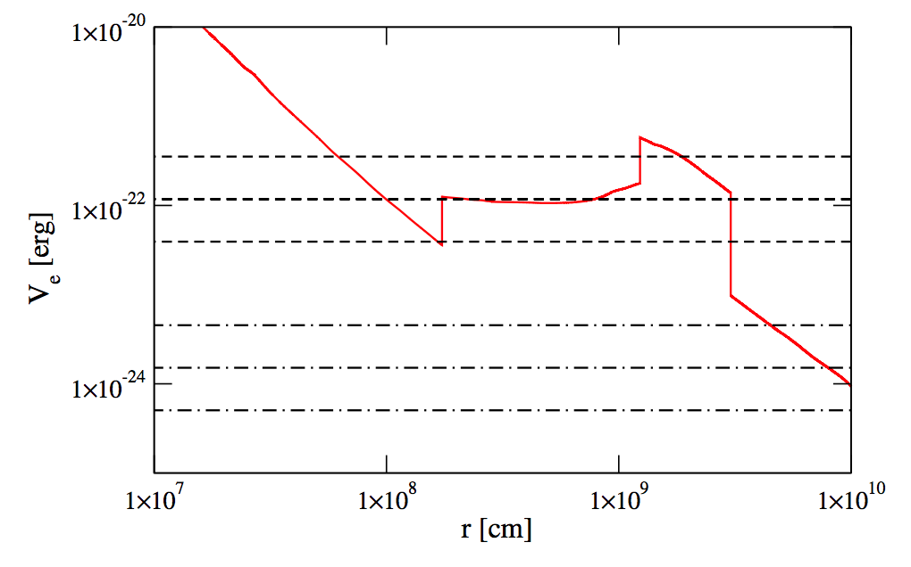
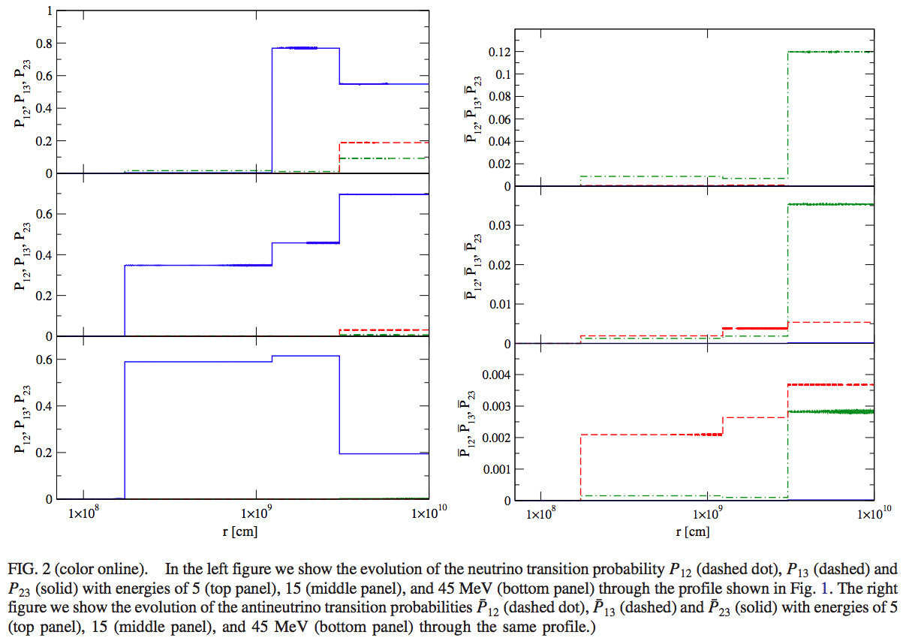

Distorted Phase Effect
====================================

.. index:: Distorted Phase Effect

The Phenomenon
-----------------

Notes for distorted phase effect, ref to [Kneller2015]_

   MSW potential for different radius. Multiple breaks appear. [Kneller2015]_. The dashed line are the resonance potential requirement for 5MeV, 15MeV, 45MeV neutrino of different mixing parameters :math:`\delta m^2=2.32\times 10^{-3}\mathrm{eV}^2`, :math:`\theta=9^{\circ}` (dashed grid lines) and :math:`\delta m^2=2.32\times 10^{-3}\mathrm{eV}^2`, :math:`\theta=33.9^\circ` (dot-dashed grid lines).

Kneller et al calculated the corresponding neutrino transitions.

   Neutrino transition probabilities through the profile above [Kneller2015]_. The first jump for 5MeV neutrinos is due to the density profile break at around :math:`10^{9}\mathrm{cm}`, while the second jump is due to the profile decrease at around :math:`5\times 10^{9}\mathrm{cm}` .

I don't quite understand the drop in probability for 5MeV neutrinos. Is that not simply a constant matter effect?

Refs & Notes
-------------------

.. [Kneller2015] Kneller, J. P., & Kabadi, N. V. (2015). `Sensitivity of neutrinos to the supernova turbulence power spectrum: Point source statistics. <https://doi.org/10.1103/PhysRevD.92.013009>`_ Physical Review D - Particles, Fields, Gravitation and Cosmology, 92(1), 1–19.
.. [Kneller2017] Kneller, J. P., & Reyes, M. de los. (2017). The effect upon neutrinos of core-collapse supernova accretion phase turbulence. `arXiv:1702.06951 <http://arxiv.org/abs/1702.06951>`_
