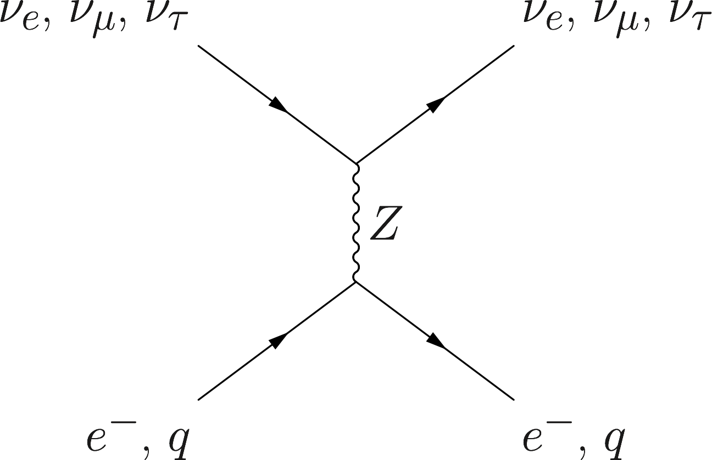
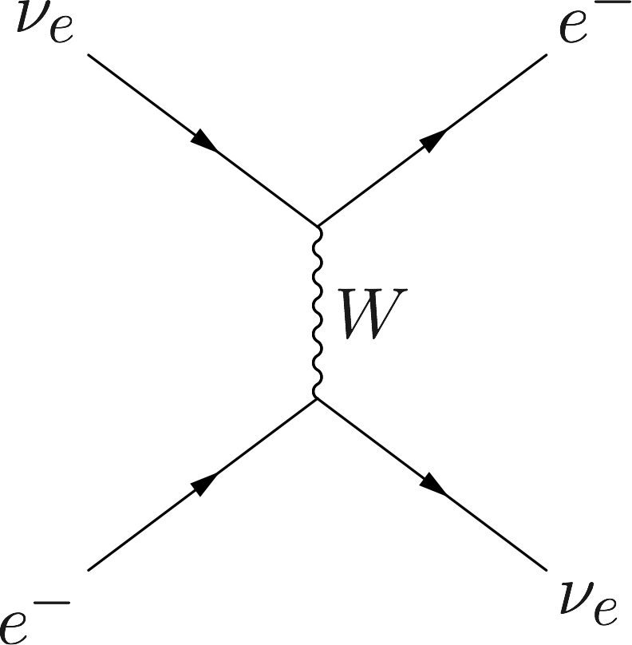

Interaction With Matter
=================================================

.. admonition:: Physics of MSW
   :class: note

   As neutrinos passing by matter, the effective mass coming from energy change becomes important thus changing it's eigenstates and propagation.

Neutrinos do interact with matter, through charged current and neutral current weak interaction.

.. admonition:: **TeX Code** for Neutral Current Interaction
   :class: toggle

   .. code:: tex

      \begin{fmffile}{feyngraph}
      \Huge
      \begin{fmfgraph*}(200,180)
          \fmfleft{i1,i2}
          \fmfright{o1,o2}
          \fmf{fermion}{i1,v1,o1}
          \fmf{fermion}{i2,v2,o2}
          \fmf{photon}{v1,v2}
          \fmflabel{$\nu_e$, $\nu_\mu$, $\nu_\tau$}{i2}
          \fmflabel{$e^-$, $q$}{i1}
          \fmflabel{$\nu_e$, $\nu_\mu$, $\nu_\tau$}{o2}
          \fmflabel{$e^-$, $q$}{o1}
          \fmf{photon,label=$Z$}{v1,v2}
      \end{fmfgraph*}
      \end{fmffile}

.. admonition:: **TeX Code** for Charged Current
   :class: toggle

   .. code:: tex

      \begin{fmffile}{feyngraph}
      \Huge
      \begin{fmfgraph*}(200,180)
          \fmfleft{i1,i2}
          \fmfright{o1,o2}
          \fmf{fermion}{i1,v1,o1}
          \fmf{fermion}{i2,v2,o2}
          \fmf{photon}{v1,v2}
          \fmflabel{$\nu_e$}{i2}
          \fmflabel{$e^-$}{i1}
          \fmflabel{$\nu_e$}{o1}
          \fmflabel{$e^-$}{o2}
          \fmf{photon,label=$W$}{v1,v2}
      \end{fmfgraph*}
      \end{fmffile}

For neutral current, all the three flavors interact with electrons and nucleus in the same way, which will produce a term proportional to identity as potential. Terms proportional to identity in Hamiltonian will only cause a global phase thus we don't really care. But for charged current, we have only electron flavor interact with electrons. This charged current interaction will only add a term to the first diagonal term of Hamiltonian as potential, which is the weak coupling :math:`\Delta = \sqrt{2}G_F n(x)` with :math:`n(x)` being the number density of electrons and :math:`G_F` is the Fermi constant.

.. admonition:: Identity Matrix and Survival Probability
   :class: note

   Identity matrix shifts the eigenvalues up and down homogeneously which changes the evolution of the state. However, since this is only a phase, the calculation of the survival probability will kill this phase.

.. admonition:: Weak Interaction
   :class: note

   We can guess this interaction term using physics picture. This interaction should be proportional to density of electrons with a coupling constant :math:`G_F`. Then check the dimensions.

   .. math::
      [G_F] &= [E]^{-2} \\
      [n(x)] & = [E]^3

   So the dimension is right. The missing constant is :math:`\sqrt{2}`.

.. toctree::
   :maxdepth: 2

   msw.rst
   msw-derivation.rst
   parametric.rst
   matter-driven.rst
