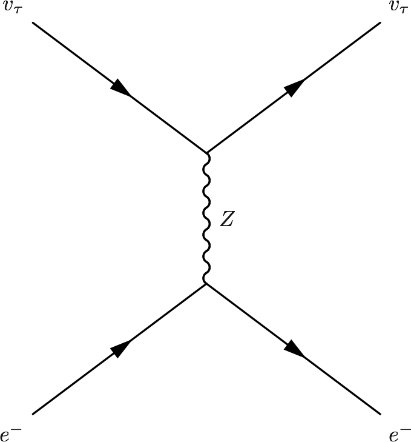

Interaction With Matter
=================================================

.. admonition:: Physics of MSW
   :class: note

   As neutrinos passing by matter, the effective mass coming from energy change becomes important thus changing it's eigenstates and propagation.

Neutrinos do interact with matter, mostly electrons in most cases.

.. image:: assets/matter/nueNeutral.png
   :width: 30%

.. image:: assets/matter/nueCharged.png
   :width: 30%

.. admonition:: **TeX Code** for Neutral Current of Electron Flavor
   :class: toggle

   .. code:: tex

      \begin{fmfgraph*}(200,180)
        \fmfleft{i1,i2}
        \fmfright{o1,o2}
        \fmf{fermion}{i1,v1,o1}
        \fmf{fermion}{i2,v2,o2}
        \fmf{photon}{v1,v2}
        \fmflabel{$v_e$}{i2}
        \fmflabel{$e^-$}{i1}
        \fmflabel{$v_e$}{o2}
        \fmflabel{$e^-$}{o1}
        \fmf{photon,label=$Z$}{v1,v2}
      \end{fmfgraph*}

.. admonition:: **TeX Code** for Neutral Current of Tau Flavor
   :class: toggle

   .. code:: tex

      \begin{fmfgraph*}(200,180)
       \fmfleft{i1,i2}
       \fmfright{o1,o2}
       \fmf{fermion}{i1,v1,o1}
       \fmf{fermion}{i2,v2,o2}
       \fmf{photon}{v1,v2}
       \fmflabel{$v_\tau$}{i2}
       \fmflabel{$e^-$}{i1}
       \fmflabel{$v_\tau$}{o2}
       \fmflabel{$e^-$}{o1}
       \fmf{photon,label=$Z$}{v1,v2}
      \end{fmfgraph*}

.. admonition:: **TeX Code** for Charged Current
   :class: toggle

   .. code:: tex

      \begin{fmfgraph*}(200,180)
       \fmfleft{i1,i2}
       \fmfright{o1,o2}
       \fmf{fermion}{i1,v1,o1}
       \fmf{fermion}{i2,v2,o2}
       \fmf{photon}{v1,v2}
       \fmflabel{$v_e$}{i2}
       \fmflabel{$e^-$}{i1}
       \fmflabel{$v_e$}{o1}
       \fmflabel{$e^-$}{o2}
       \fmf{photon,label=$W^{-}$}{v1,v2}
      \end{fmfgraph*}

The one that is missing is the charged current for :math:`nu_\tau` and :math:`e^{-}` interaction because of lepton number conservation.

The first two diagrams will add two equal terms on the diagonal terms of Hamiltonian, which can be viewed as adding a number times identity matrix thus conserves the eigenstates while shifts the eigenvalues. However, the third diagram will only add a term to the first diagonal term of Hamiltonian, which is the weak coupling :math:`\Delta = \sqrt{2}G_F n(x)` with :math:`n(x)` being the number density of electrons.

.. admonition:: Identity Matrix and Survival Probability
   :class: note

   Identity matrix shifts the eigenvalues up and down homogeneously which changes the evolution of the state. However, since this is only a phase, the calculation of the survival probability will kill this phase.

.. admonition:: Weak Interaction
   :class: note

   We can guess this interaction term using physics picture. This interaction should be proportional to density of electrons with a coupling constant :math:`G_F`. Then check the dimensions.

   .. math::
      [G_F] &= [E]^{-2} \\
      [n(x)] & = [E]^3

   So the dimension is right. The missing constant is :math:`\sqrt{2}`.

.. toctree::
   :maxdepth: 2

   msw.rst
   parametric.rst
   matter-driven.rst
