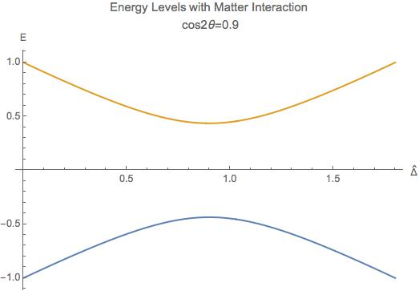

.. index:: MSW Derivation
.. index:: MSW Resonance
.. index:: Landau-Zener Transition

MSW Refraction, Resonance and Non-adiabacity
---------------------------------------------------------

.. admonition:: Hysteresis Loops of Neutrino Oscillations Due to MSW Effect
   :class: note

   Due to MSW effect, a system that is close to adiabaticity but not exactly adiabaticity could exhibit hysteresis effect, i.e., neutrinos going from high density region to low density region then coming back could form a hysteresis loop.

TODO

1. Write down the effective potential :math:`V(x)` which depends on the position. Refractive index is defined as :math:`n_{ref} - 1 = \frac{V}{p}`.
2. Two characteristic length: :math:`l_v = \frac{4\pi E}{ \Delta m^2 }` as the vacuum oscillation length and :math:`l_0=\frac{2\pi}{V}` as the refraction length. As the becomes comparable resonance occurs. For small mixing angle cases, resonance happens when vacuum length is about the length of refraction.

There are three different matrix representatioins that is useful to the calculations.

1. Flavor basis;
2. Vacuum mass eigenstate basis;
3. Instataneous mass eigenstate basis.

.. admonition:: Basis of Hamiltonian
   :class: note

   In vacuum mass eigenstate basis, the Hamiltonian without matter and self-interaction is easy and straightforward,

   .. math::
      \mathbf{H_{vmv}} = \mathbf{H_{vp}} = \frac{1}{2E}\begin{pmatrix} m_1^2 & 0 & 0 \\ 0 & m_2^2 & 0  \\ 0 & 0 & m_3^2
      \end{pmatrix}.

   To remove the trace, we can subtract a identity matrix

   .. math::
      &\mathbf{H}- \frac{m_1^2}{2E}\mathbf{I} \\
      =& \frac{1}{2E}\begin{pmatrix}
      m_1^2 & 0 & 0 \\
      0 & m_2^2 &  0\\
      0 & 0 & m_3^2
      \end{pmatrix} - \frac{m_1^2}{2E} \mathbf{I} \\
      =& \frac{1}{2E} \begin{pmatrix}
      0 & 0 & 0 \\
      0 & \Delta m_{12}^2 & 0 \\
      0 & 0 & \Delta m_{13}^2
      \end{pmatrix}

   The interaction in flavor basis is

   .. math::
      \mathbf{V_f} = \begin{pmatrix} \sqrt{2}G_F n & 0 & 0 \\ 0 & 0 & 0\\ 0 & 0 & 0 \end{pmatrix}.

   **To write down the Hamiltonian in vacuum mass eigenstates**, we transform the interaction term to vacuum mass eigenstates by

   .. math::
      \mathbf{V_{vm}} = \mathbf{U^{-1}} \mathbf{V} \mathbf{U},

   where :math:`U` is the PMNS matrix.

   **To write down the Hamiltonian in flavor basis**, we transform the vacuum Hamiltonian to flavor basis **after remove the trace**, which is

   .. math::
      \mathbf{H_{fv}} = \mathbf{U} \mathbf{H_{vmv}} \mathbf{U^{-1}}.

   **We could also write down the Hamiltonian matrix in instantaneous mass eigenstates**, which requires a instantaneous diagonalization.

.. index:: solar neutrinos

2 Flavor Neutrino Oscillations and Matter Effect
~~~~~~~~~~~~~~~~~~~~~~~~~~~~~~~~~~~~~~~~~~~~~~~~~~~~~~~~

.. admonition:: Solar Neutrinos
   :class: note

   Electron neutrinos are produced in the core of the sun then the neutrinos would propagate out to the surface of the sun without much difficulty. What is the predicted neutrino survival probability?

Interaction with matter plays a big role in neutrino oscillation. As shown previously, the interaction only affects (anti) electron neutrinos. In other words, the interaction term in flavor basis is

.. math::
   V_f = \begin{pmatrix} \Delta & 0 \\ 0 & 0  \end{pmatrix}.

where :math:`\Delta = \sqrt{2} G_F n` and :math:`n` is the number density of the electrons. However, to do calculations, since identity matrix doesn't change the survival probability, we can always make the hamiltonian traceless, which becomes

.. math::
   H_i=\frac{\Delta}{2} \boldsymbol{\sigma_3}.

Constant Electron Number Density
~~~~~~~~~~~~~~~~~~~~~~~~~~~~~~~~~~~~~~~~~~~~~~~

Suppose we have an environment with constant electron number density, the term :math:`- i \mathbf{U_m^{-1}} ( \partial_x \mathbf{U_m} )` goes away. All we have is the diagonalized new Hamiltonian :math:`\mathbf{H_{md}}` and the eigenvalues are easily obtained which are

.. math::
   E_1 &= A_3\cos 2\theta(x) - A_1 \sin 2\theta(x) \\
   E_2 & = - A_3 \cos 2\theta(x) + A_1 \sin 2\theta(x) .

The final result for these two eigenvalues are

.. math::
   E_1 &= -\sqrt{ \frac{\Delta^2 + \omega^2 }{4} - \frac{\Delta \omega }{2} \cos 2\theta_v. } \\
   E_2 &= \sqrt{ \frac{\Delta^2 + \omega^2 }{4} - \frac{\Delta \omega }{2} \cos 2\theta_v. }.

Meanwhile the eigenstates are denoted as :math:`\ket{\nu_{c1}}` and :math:`\ket{\nu_{c2}}`.

.. admonition:: Two Special Cases
   :class: note

   Two special cases,

   1. :math:`\cos 2\theta_v \to 0`;
   2. :math:`\cos 2\theta_v \to 1`.

As for the survival probability for the initial condition that :math:`\Psi(x=0)=\ket{\nu_{c1}}`, the result has the same form as the vacuum case, which is

.. math::
   P_x(\nu_e,L) = 1 - \sin^2(2\theta_m)\sin^2\left( \frac{\omega_m L}{2} \right) ,

where

.. math::
   \sin 2\theta(x)  = \frac{\omega\sin 2\theta_v}{\sqrt{ \omega^2+\Delta^2 - 2 \omega \Delta\cos 2\theta_v }}.

:math:`\theta_m = \theta(x)` is the effective mixing angle which in fact doesn't depend on :math:`x` if the matter profile is constant.

.. admonition:: Vacuum Survival Probability
   :class: note

   As an comparison, the vacuum result is

   .. math::
      P_x(\nu_e,L) = 1 - \sin^2(2\theta)\sin^2\left( \frac{\omega L}{2} \right) ,

   for all electron flavor initial condition.

Adiabatic Limit
~~~~~~~~~~~~~~~~~~~~~~~~~~~~~~~~~~~~~~~

In some astrophysical environments the electron number density changes very slowly which means the term :math:`\mathbf{U_m^{-1}} \partial_x \mathbf{U_m}` is much smaller than :math:`\mathbf{H_{md}}`. By intuition we would expect that this term could be dropped to the lowest order.

The eigen energies are slowing changing with the position of neutrinos,

.. math::
   E_1 & = -\frac{\omega}{2}\sqrt{\hat\Delta^2 + 1 - 2 \hat\Delta  \cos 2\theta_v} \\
   E_2 & = \frac{\omega}{2}\sqrt{\hat\Delta^2 + 1 - 2 \hat\Delta  \cos 2\theta_v}.

When the term :math:`\hat\Delta` is very small :math:`1-2\hat\Delta\cos 2\theta_v` will dominate and the whole term decreases. On the other hand as :math:`\hat\Delta` becomes large, :math:`\hat\Delta^2` will dominate and the whole term grows. Mathematically we could find the region when the part :math:`\sqrt{\hat\Delta^2 + 1 - 2 \hat\Delta  \cos 2\theta_v}` decreases and increases.

   Energy Levels for MSW effect. We have the up-down symmetry since we shifted the energy by a constant to remove the identity matrix in the Hamiltonian.

The survival probability for the light neutrinos would be

.. math::
   P_x(\nu_L,L) = 1 - \sin^2(2\theta (x))\sin^2\left( \frac{\omega L}{2} \right) .

The survival probability for electron flavor neutrino is

.. math::
   P_x(\nu_e,L) = \frac{1}{2} + \frac{1}{2}\cos 2\theta(x_0) \cos 2\theta_v,

if the neutrinos are produced in dense region and the detection happens in vacuum.

.. admonition:: Adiabatic Limit of Nuetrino Oscillations in Matter
   :class: note

   Before we move on to higher order corrections, it would be nice to understand this phenomenon.

   1. The vacuum oscillation length can be extracted from vacuum oscillation survival probability. It is :math:`L_v = \frac{2\pi}{\omega}`.
   2. In this problem we have another energy scale which is the interaction, :math:`\Delta`. Here we can define another characteristic length :math:`l_m = \frac{2\pi}{\Delta}`.
   3. MSW resonance happens when the two character lengths are matching with each other. Another way to put it is that the term :math:`\sin 2\theta(x)` is minimized so that we have the smallest energy gap which leads to :math:`\hat\Delta = \cos 2\theta_v`. Equivalently this is the relation

   .. math::
      l_0 = l_m\cos 2\theta_v.

   4. At resonance, we have

      .. math::
         \cos 2\theta(x) &= 1 \\
         \sin 2\theta(x) &= 0.

      This is max mixing of the states which means that at the resonance point

      .. math::
         \begin{pmatrix} \nu_L(x_{r}) \\ \nu_H(x_{r}) \end{pmatrix} = \frac{\sqrt{2}}{2}\begin{pmatrix} 1 & -1 \\ 1 & 1 \end{pmatrix} \begin{pmatrix}\nu_e \\ \nu_x \end{pmatrix}

   5. Resonance conditions corresponds to a resonance density which is given by

      .. math::
         n_e(x) = \frac{\omega}{\sqrt{2}G_F } \cos 2\theta_v \equiv n_0(E,\Delta m^2) \cos 2\theta_v,

      where :math:`n_0(E,\Delta m^2)=\frac{\omega}{\sqrt{2}G_F }` is a characteristic number density which depends on the energy mixing angles and :math:`\Delta m^2` of the neutrinos.

   6. One should notice that if the condition :math:`\sin^2 2\theta(x) = \sin^2 2\theta_v` is satisfied, the survival probability for :math:`\ket{\nu_1}` has the same **the form of** vacuum oscillation survival probability for electron neutrinos. The condition is solved,

      .. math::
         \hat\Delta^2 + 1 - 2\hat\Delta \cos 2\theta_v = 1,

      which leads to

      .. math::
         \hat\Delta = 0 \quad\text{or}\quad 2\cos 2\theta_v .

      The first condition is trivial which corresponds to vacuum however the second condition :math:`\Delta = 2\cos 2\theta_v \omega` means the interaction oscillation length is doubled compared to resonance point.

      **Nevertheless, we should always remember to check what survival probability the expression is describing. Here we have survival probability for** :math:`\nu_L(x)`. At :math:`n(x)\to 0` the oscillation becomes vacuum oscillation.

.. admonition:: In The Basis of Vacuum Energy Eigenstates
   :class: note

   We could also using the basis of vacuum energy eigenstates, in which the vacuum part of the Hamiltonian is

   .. math::
      \mathbf{H_{vmv}} = \frac{1}{2} \begin{pmatrix}
      E_2 - E_1 & 0 \\
      0 & E_2 - E_1
      \end{pmatrix} \equiv  \frac{1}{2} \begin{pmatrix}
      \Delta E & 0 \\
      0 & \Delta E
      \end{pmatrix} .

   The matter interaction in flavor basis is

   .. math::
      \begin{pmatrix}
      \Delta & 0 \\
      0 & 0
      \end{pmatrix}.

   It is more convinient to use the traceless potential

   .. math::
      \mathbf{V_{f}} = \frac{\Delta}{2}\begin{pmatrix}
      1 & 0 \\
      0 & -1
      \end{pmatrix}.

   Transform it to vacuum energy eigenstate basis, we have

   .. math::
      \mathbf{V_{vm}} &= \mathbf{U^{-1}}\mathbf{V_{f}} \mathbf{U} \\
      & = \Delta \begin{pmatrix}
      \cos 2\theta_v & \sin 2\theta_v \\
      \sin 2\theta_v  & - \cos 2\theta_v
      \end{pmatrix}.

   The Hamiltonian in this problem becomes

   .. math::
      \mathbf{H_{vm}} = \begin{pmatrix}
      - \frac{\Delta m^2}{4E}+\cos 2\theta_v & \frac{\Delta}{2} \sin 2\theta_v \\
      \frac{\Delta}{2} \sin 2\theta_v & \frac{\Delta m^2}{4E} -  \frac{\Delta}{2} \cos 2\theta_v
      \end{pmatrix}.

General Discussion of Matter Effect
~~~~~~~~~~~~~~~~~~~~~~~~~~~~~~~~~~~~~~~~~~

This part is a very general discussion of the matter effect [Parke1986]_.

To work in flavor basis, we use the subscript :math:`{}_{mf}` to denote the flavor basis representation with mass effect. The equation of motion in flavor basis can be written down as

.. math::
   i\partial_x \Psi_{mf}(x) = \mathbf{H_{mf}} \Psi_{mf}(x)

where

.. math::
   \mathbf{H_{mf}} =  \left(  \frac{\Delta}{2} -  \frac{\omega}{2} \cos 2\theta_v  \right) \boldsymbol{\sigma_3} + \frac{\omega}{2} \sin 2\theta_v \boldsymbol{\sigma_1}.

There are three stages for neutrinos to travel from the core of the sun to vacuum.

1. At the core, electron neutrinos are produced. The electron flavor state should be projected onto heavy and light instantaneous mass eigenstates. What fallows is the that the propagation is adiabatic until the transition happens.
   As we have seen in adiabatic situation, the states will stay in heavy and light states all along the evolution if the system starts from heavy or light state,

   .. math::
      \ket{\nu_{a1}(x)} &= \exp(-i \int_0^x \frac{\omega_m(x)}{2} dx )  \ket{\nu_L(x)} \\
      \ket{\nu_{a2}(x)} &= \exp(i\int_0^x \frac{\omega_m(x)}{2} dx) \ket{\nu_H(x)},

   where the heavy and light states are defined in the adiabatic situation previously. **This is what happens before the passing through of the resonance.**
2. At the resonance point, light instantaneous mass eigenstate has a probability to jump to the heavy state and vice versa.
   When it comes to the resonance point which is non-adiabatic propagation, the transition between the states :math:`\ket{\nu_L}\to a_L \ket{\nu_L(x)} + a_H \ket{\nu_H(x)} \ket{\nu_1(x)}` and :math:`\ket{\nu_H}\to b_L \ket{\nu_L(x)} + b_H \ket{\nu_H(x)}` will mix the heavy and light state up.

   .. math::
      \ket{\nu_1(x)} &= a_L \exp(-i \int_{x_r}^x \omega_m(x')/2 dx' )  \ket{\nu_L(x)} + a_H \exp(i\int_{x_r}^x \omega_m(x')/2 dx') \ket{\nu_H(x)}  \\
      \ket{\nu_2(x)} &= b_L \exp(-i \int_{x_r}^x \omega_m(x')/2 dx' )  \ket{\nu_L(x)} + b_H \exp(i\int_{x_r}^x \omega_m(x')/2 dx') \ket{\nu_H(x)},

   where the relations between the constants are determined using the condition that :math:`\ket{\nu_1(x)}` and :math:`\ket{\nu_2(x)}` are orthonormal, which leads to the conclusion that

   .. math::
      b_L &= -a_H^* \\
      b_H &= a_L^* \\
      \lvert a_L \rvert^2 &=  - \lvert a_H \rvert^2 .
3. After the resonance point, the heavy and light states will continue on their adiabatic propagation.

.. admonition:: Helpful Notes
   :class: note

   The relation between :math:`\theta_m` and :math:`\theta_v` is given by

   .. math::
      \omega_m\sin 2\theta_m =  \omega \sin 2\theta_v.

Electron neutrinos are produced in a dense region as :math:`\ket{\nu_e}`, which are partially transformed to other the other neutrinos due to matter and the resonance then it propagates as if it satisfies the adiabatic condition again. The initial state in terms of light and heavy state is

.. math::
   \ket{\Psi_{m}(x_0)} = \ket{\nu_e}= \cos \theta_m(x_0) \ket{\nu_L(x_0)} + \sin \theta_m(x_0) \ket{\nu_H(x_0)}.

The final state right before the resonance is

.. math::
   \ket{\Psi_{m}(x_{r-})} = \cos\theta_m(x_{0}) \exp\left( -i \int_{x_0}^{x_{r-}} \frac{\omega_m(x)}{2} dx   \right) \ket{\nu_L(x_{r-})} + \sin\theta_m(x_{0}) \exp\left( i \int_{x_0}^{x_{r-}} \frac{\omega_m(x)}{2} dx \right) \ket{\nu_H(x_{r-})}

After the resonance the state is described by the general jumping

.. math::
   \ket{\Psi_{m}(x)}= &  \cos\theta_m(x_0) \exp\left( -i \int_{x_0}^{x_{r-}} \frac{\omega_m(x)}{2} dx   \right)  \left(  a_L \exp( -i \int_{x_r}^x \frac{\omega_m(x')}{2}dx' ) \ket{\nu_L(x)}  + a_H \exp( i\int_{x_r}^x \frac{\omega_m(x')}{2}dx' ) \ket{\nu_H(x)}  \right)  \\
   & + \sin\theta_m(x_{0}) \exp\left( i \int_{x_0}^{x_{r-}} \frac{\omega_m(x)}{2} dx \right)  \left(  -a_H^* \exp( -i \int_{x_r}^x \frac{\omega_m(x')}{2}dx' ) \ket{\nu_L(x)}  + a_L^* \exp( i\int_{x_r}^x \frac{\omega_m(x')}{2}dx' ) \ket{\nu_H(x)}  \right)

in which the :math:`x_{r-}` is actually :math:`x_r` thus

.. math::
   \ket{\Psi_{m}(x)}= &  \cos\theta_m(x_0) \exp\left( -i \int_{x_0}^{x_{r}} \frac{\omega_m(x)}{2} dx   \right)  \left(  a_L \exp( -i \int_{x_r}^x \frac{\omega_m(x')}{2}dx' ) \ket{\nu_L(x)}  + a_H \exp( i\int_{x_r}^x \frac{\omega_m(x')}{2}dx' ) \ket{\nu_H(x)}  \right)  \\
   & + \sin\theta_m(x_{0}) \exp\left( i \int_{x_0}^{x_{r-}} \frac{\omega_m(x)}{2} dx \right)  \left(  -a_H^* \exp( -i \int_{x_r}^x \frac{\omega_m(x')}{2}dx' ) \ket{\nu_L(x)}  + a_L^* \exp( i\int_{x_r}^x \frac{\omega_m(x')}{2}dx' ) \ket{\nu_H(x)}  \right)

To calculate the survival probability it is easier to use flavor basis, hence we have another form of :math:`\ket{\Psi_m(x)}` which is

.. math::
   \ket{\Psi_{m}(x)}= &  \left[ \cos\theta_m(x_0) \exp\left( -i \int_{x_0}^{x_{r}} \frac{\omega_m(x')}{2} dx'   \right)   a_L \exp( -i \int_{x_r}^x \frac{\omega_m(x')}{2}dx' ) \right. \\
   &  \left. - \sin\theta_m(x_{0}) \exp\left( i \int_{x_0}^{x_{r-}} \frac{\omega_m(x')}{2} dx' \right)    a_H^* \exp( -i \int_{x_r}^x \frac{\omega_m(x')}{2}dx' )  \right] \ket{\nu_L(x)}\\
   & + \left[  \cos\theta_m(x_0) \exp\left( -i \int_{x_0}^{x_{r}} \frac{\omega_m(x)}{2} dx   \right) a_H \exp( i\int_{x_r}^x \frac{\omega_m(x')}{2}dx' ) \right. \\
   & \left. + \sin\theta_m(x_{0}) \exp\left( i \int_{x_0}^{x_{r-}} \frac{\omega_m(x)}{2} dx \right)   a_L^* \exp( i\int_{x_r}^x \frac{\omega_m(x')}{2}dx' ) \right]  \ket{\nu_H(x)} \\
   =&  \left[ \cos\theta_m(x_0) \exp\left( -i \int_{x_0}^{x_{r}} \frac{\omega_m(x)}{2} dx   \right)   a_L \exp( -i \int_{x_r}^x \frac{\omega_m(x')}{2}dx' ) \right. \\
   &  \left. - \sin\theta_m(x_{0}) \exp\left( i \int_{x_0}^{x_{r-}} \frac{\omega_m(x)}{2} dx \right)    a_H^* \exp( -i \int_{x_r}^x \frac{\omega_m(x')}{2}dx' )  \right] ( \cos\theta_m(x)\ket{\nu_e} - \sin\theta_m(x)\ket{\nu_x} )\\
   & + \left[  \cos\theta_m(x_0) \exp\left( -i \int_{x_0}^{x_{r}} \frac{\omega_m(x)}{2} dx   \right) a_H \exp( i\int_{x_r}^x \frac{\omega_m(x')}{2}dx' ) \right. \\
   & \left. + \sin\theta_m(x_{0}) \exp\left( i \int_{x_0}^{x_{r-}} \frac{\omega_m(x)}{2} dx \right)   a_L^* \exp( i\int_{x_r}^x \frac{\omega_m(x')}{2}dx' ) \right] ( \sin\theta_m(x)\ket{\nu_e} + \cos\theta_m(x)\ket{\nu_x})

Since :math:`\cos\theta_m`, :math:`\sin\theta_m` and :math:`\omega_m` are real while :math:`a_L` and :math:`a_H` are complex, survival amplitude of electron neutrinos is given by

.. math::
   &\braket{\Psi_m(0)}{\Psi_m(x)} \\
   = & \braket{\nu_e}{\Psi_m(x)} \\
   = &  \left[ \cos\theta_m(x_0) \exp\left( -i \int_{x_0}^{x_{r}} \frac{\omega_m(x')}{2} dx'   \right)   a_L \exp( -i \int_{x_r}^x \frac{\omega_m(x')}{2}dx' ) \right. \\
   &  \left. - \sin\theta_m(x_{0}) \exp\left( i \int_{x_0}^{x_{r}} \frac{\omega_m(x')}{2} dx' \right)    a_H^* \exp( -i \int_{x_r}^x \frac{\omega_m(x')}{2}dx' )  \right]  \cos\theta_m(x) \\
   & + \left[  \cos\theta_m(x_0) \exp\left( -i \int_{x_0}^{x_{r}} \frac{\omega_m(x')}{2} dx'   \right) a_H \exp( i\int_{x_r}^x \frac{\omega_m(x')}{2}dx' ) \right. \\
   & \left. + \sin\theta_m(x_{0}) \exp\left( i \int_{x_0}^{x_{r}} \frac{\omega_m(x')}{2} dx' \right)   a_L^* \exp( i\int_{x_r}^x \frac{\omega_m(x')}{2}dx' ) \right]  \sin\theta_m(x) \\
   =& A_L \exp\left( -i \int_{x_r}^{x} \frac{\omega_m(x')}{2} dx'   \right) + A_H \exp\left( i\int_{x_r}^x \frac{\omega_m(x')}{2}dx' \right),

where the coefficients are

.. math::
   A_L(x) & = \cos\theta_m(x) \left[ a_L\cos\theta_m(x_0) \exp\left(  -i\int_{x_0}^{x_r} \frac{\omega_m(x')}{2} dx' \right) - a_H^*\sin\theta_m(x_0) \exp\left( i \int_{x_0}^{x_r} \frac{\omega_m(x')}{2}dx' \right)  \right] \\
   A_H(x) & = \sin\theta_m(x)  \left[ a_H \cos\theta_m(x_0) \exp\left( -i \int_{x_0}^{x_{r}} \frac{\omega_m(x')}{2} dx'   \right)   + a_L^*\sin\theta_m(x_{0}) \exp\left( i \int_{x_0}^{x_{r}} \frac{\omega_m(x')}{2} dx' \right)    \right]  .

The detection is in a region where matter density is very small, thus we use :math:`x\to\infty` which means the effective mixing angle becomes vacuum mixing angle. The probability is the square of the amplitude,

.. math::
   P(\nu_e,x) &= \lvert \braket{\Psi_m(0)}{\Psi_m(x)}  \rvert^2 \\
   & = \lvert A_L(x) \exp\left( -i \int_{x_r}^{x} \frac{\omega_m(x')}{2} dx'   \right) + A_H(x) \exp\left( i\int_{x_r}^x \frac{\omega_m(x')}{2}dx' \right)  \rvert^2 \\
   & = \lvert A_L(x) \rvert^2 + \lvert A_H(x) \rvert^2 + A_L^*(x) A_H(x) \exp(2i\phi) + A_H^*(x) A_L(x) \exp(-2i\phi) \\
   & = \lvert A_L(x) \rvert^2 + \lvert A_H(x) \rvert^2 + 2 \mathbf{Re}( A_L^*(x) A_H(x) \exp(2i\phi) ),

where :math:`\phi` is defined as

.. math::
   \phi = \int_{x_r}^{x} \frac{\omega_m(x')}{2}dx'.

Note that for any complex number :math:`(a+ib)e^{i\phi} \equiv \rho e^{i\psi}`,

.. math::
   (a+ib)e^{i\phi} + c.c.=2 \rho \cos(\psi+\phi),

which means that the previous result can be simplified to

.. math::
   P(\nu_e,x) &=  \lvert A_L(x) \rvert^2 + \lvert A_H(x) \rvert^2 + 2 \mathbf{Re}( A_L^*(x) A_H(x) \exp(2i\phi) ) \\
   & =  \lvert A_L(x) \rvert^2 + \lvert A_H(x) \rvert^2 + 2 \lvert A_L^*(x) A_H(x) \rvert \cos\left( 2\phi + \psi_{LH} \right),

with the definition that :math:`\psi_{LH}(x)` is the argument of :math:`A_L^*(x)A_H(x)`.

However the coefficients :math:`a_L` and :math:`a_H` are still not known yet. The trick is to average over the detection and production position. The average over :math:`x` removes the :math:`\cos` term due to the dependent of :math:`x` for :math:`\phi` and averages :math:`\cos^2\theta_m(x)` to :math:`\frac{1}{2}`, which results in

.. math::
   \langle P(\nu_e,x)\rangle_{x} =& \cos^2\theta_m(x) (\lvert a_H\rvert^2 \cos^2\theta_m(x_0) + \lvert a_L\rvert^2 \sin^2\theta_m(x_0) ) \\
   & + \sin^2\theta_m(x) ( \lvert a_H\rvert^2 \cos^2\theta_m(x_0) + \lvert a_L \rvert^2 \sin^2\theta_m(x_0) ) \\
   & + ( - \cos^2\theta_m(x) + \sin^2\theta_m(x) ) \cos\theta_m(x_0)\sin\theta_m(x_0) ( a_H a_L e^{-2i\phi'} + \mathrm{c.c}) .

Applying the condition that :math:`\lvert a_L \rvert^2 + \lvert a_H \rvert^2 = 1`, the probability becomes

.. math::
   \langle P(\nu_e,x)\rangle_{x} =& \frac{1}{2} + \frac{1}{2} (1 - 2 \lvert a_H \rvert^2) \cos 2\theta_m(x_0) \cos 2\theta_v - \lvert a_H a_L \rvert \sin 2\theta_m(x_0)\cos 2\theta_v \cos ( 2 \phi' + \psi_{LH} ),

where :math:`\psi_{LH}` is the argument of :math:`a_H a_L` and :math:`\phi` is :math:`\int_{x_0}^{x_r} \frac{\omega_m(x')}{2}dx'` .

**The average over production removes the last part.**

Notice that in fact the detection happens in vacuum, which means :math:`\theta_m(x)=\theta_v`.

.. math::
   \langle \langle P(\nu_e,x)\rangle_{x} \rangle_{x_0}= \frac{1}{2} + \frac{1}{2}(1- 2\lvert a_H \rvert^2) \cos 2\theta_m(x_0) \cos 2\theta_v .

**This means that the adiabatic result is of the form**

.. math::
   P(\nu_e,x)_{\mathrm{adiabatic}} = \frac{1}{2} ( 1+ \cos 2\theta_m \cos 2\theta_v ).

Define a transition probability at resonance

.. math::
   P_r(\nu_L \to \nu_H) = \lvert a_2 \rvert^2,

which can be determined by the Landau-Zener transition analytically (first order) to the first order.

.. Writing down the dimensionless equation, I have
   .. math::
   i \partial_{\hat x} \Psi_{mf} = \frac{R_S \omega}{2} ( (\hat\Delta - \cos 2\theta_v ) \boldsymbol{\sigma_3} + \sin 2\theta_v \boldsymbol{\sigma_1} )  \Psi_{mf} .

.. [Parke1986] Parke, S. J. (1986). Nonadiabatic Level Crossing in Resonant Neutrino Oscillations. Physical Review Letters, 57(10), 1275–1278. doi:10.1103/PhysRevLett.57.1275

.. index:: Landau-Zener Transition

Landau-Zener Transition of Neutrinos
~~~~~~~~~~~~~~~~~~~~~~~~~~~~~~~~~~~~~~~~~~~~~~~~~~~~~~~~~~~~~~~~

As discussed in the previous subsection, a transition probability between the two states :math:`\ket{\nu_L(x)}` and :math:`\ket{\nu_H(x)}` would change the final survival probabilty. Thus calculating this transition probability will be done in this subsection.

Recall that the effective potential is

.. math::
   \mathbf{V_m} & = -i\mathbf{U_m^{-1}} ( \partial_x \mathbf{U_m} ) ,

where

.. math::
   \mathbf{U_m} = \begin{pmatrix} \cos \theta(x) & \sin\theta(x) \\ -\sin\theta(x) & \cos\theta(x) \end{pmatrix} .

:math:`\sin\theta(x)` and :math:`\cos\theta(x)` can be found by solving the equations. Plug in the results and applying the trick that

.. math::
   \partial_x \mathbf{U_m} & = \frac{d \hat\Delta(x)}{dx} \partial_{ \hat\Delta(x)} \mathbf{U_m} ,

we have

.. math::
   \mathbf{V_m} & = -i\mathbf{U_m^{-1}} ( \partial_x \mathbf{U_m} ) \\
   & = - i \frac{\hat\Delta'(x_r) \sin 2\theta_v}{ 1 + 2 (\hat\Delta(x)-\cos 2\theta_v)^2 - \cos 4\theta_v }   \begin{pmatrix}
   0 & 1 \\
   -1 & 0
   \end{pmatrix} .

Since we are dealing with resonance which is located at :math:`\hat\Delta =\cos 2\theta_v`, the quantities can be expanded around :math:`\hat\Delta - \cos 2\theta = 0`.

To keep only first order of in the effective potential, we have to expand around :math:`\hat\Delta = \cos 2\theta_v`

.. math::
   \mathbf{V_m(x)} & = - i \hat\Delta'(x_r) \frac{\sin 2\theta_v}{4(\cos 2\theta_v -1)} \left( -1 + (\hat\Delta(x) - 1)  \right)  \begin{pmatrix}
   0 & 1 \\
   -1 & 0
   \end{pmatrix}.

.. admonition:: Pauli Matrices
   :class: note

   The effective potential can be written in terms of :math:`\sigma_2`,

   .. math::
      \sigma_2 = - i  \begin{pmatrix}
      0 & 1 \\
      -1 & 0
      \end{pmatrix}.

The equation of motion up to first order of :math:`\hat\Delta` becomes

.. math::
   i\partial_x\ket{\Psi_m} = (\mathbf{H_{md}} + \mathbf{V_m})\ket{\Psi_m}.

We have already solved

.. math::
   i\partial_x\ket{\Psi_m} = \mathbf{H_{md}} \ket{\Psi_m},

where the eigenstates are :math:`\ket{\nu_L}` and :math:`\ket{\nu_H}` with eigenvalues :math:`\omega_{m1}` and :math:`\omega_{m2}` respectively.

To save typing we define

.. math::
   v &= -  \hat\Delta'(x_r) \frac{1}{2\sin 2\theta}

so that the effective potential reduces to a simple form

.. math::
   \mathbf{V_m} = \begin{pmatrix}
   0 & i v \\
   -i v & 0
   \end{pmatrix}.

The general solution to the equation we need to solve can be written as

.. math::
   \ket{\Psi_m} = C_L(x) e^{-i\int \omega_{m1} dx} \ket{\nu_L} + C_H(x) e^{-i\int \omega_{m2} dx} \ket{\nu_H},

where

.. math::
   \omega_{m1} &=-\sqrt{ \frac{\Delta^2 + \omega^2}{4}-\frac{\Delta \omega}{2} \cos 2\theta_v } \\
   & = -\omega \sqrt{\left( \frac{\hat\Delta^2 + 1}{4} - \frac{\hat\Delta}{2}\cos 2\theta_v \right)} , \\
   \omega_{m2} & = - \omega_{m1} \equiv \frac{\omega_m}{2}.

Hamiltonian applied to this state results in

.. math::
   \mathbf{H_m} \ket{\Psi_m} =& \omega_{m1} C_L(x) e^{-i\int \omega_{m1}dx} \ket{\nu_L} -ivC_L(x) e^{-i\int \omega_{m1}dx}\ket{\nu_H} \\ &+\omega_{m2}C_H(x) e^{-i\int \omega_{m2}dx}\ket{\nu_H} + iv C_H(x) e^{-i\int \omega_{m2}dx}\ket{\nu_L}.

Plug the state :math:`\ket{\Psi_m}` into the Schrodinger equation, we have

.. math::
   \dot C_L(x) &= v C_H(x) e^{  i\int  \omega_m dx} \\
   \dot C_H(x) & = -v C_L(x) e^{ - i\int \omega_m dx} ,

in which :math:`omega_m` is

.. math::
   \omega_m =  \omega_{m2} - \omega_{m1} = 2\omega_{m2} = \omega\sqrt{ \hat\Delta^2 + 1 - 2 \hat\Delta \cos 2\theta_v } .

The boundary condition for such a problem **in general** is

.. math::
   \ket{\Psi_m(0)} = C_L(0)\ket{\nu_L} + C_H(0) \ket{\nu_H}.

**It should be made clear that the problem we will be discussing is the transition from one state** :math:`\ket{\nu_L(x)}` **to another** :math:`\ket{\nu_H(x)}` **in first order approximation. That means we will confine this system so that the initial condition is** :math:`\ket{\Psi_m(-\infty)} = \ket{\nu_L}`. In terms of :math:`C_L` and :math:`C_H`,

.. math::
   C_L(-\infty) &= 0, \\
   \lvert C_H(-\infty) \rvert^2 & = 1.

The first order differential equations of :math:`C_L(x)` and :math:`C_H(x)` can be combined and produce a second order differential equation.

.. math::
   \ddot C_L - \left(   \frac{\dot v}{v} + i\omega_m \right) \dot C_L + v^2 C_L = 0.

**If we use the approximation that** :math:`\frac{d \hat\Delta }{dx}` **is a constant, where in fact we are assuming that** :math:`n(x)` **is linearly depending on** :math:`x` **which means** :math:`\hat\Delta` **is a linear function of** :math:`x`. **Thus** :math:`v\propto\frac{d\hat\Delta}{dx}` **is a constant.** The equation simplifies to

.. math::
   \ddot C_L - i\omega_m \dot C_L + v^2 C_L = 0,

where :math:`v=-\frac{\cot\theta_v}{4} \frac{d\hat\Delta}{dx}` is constant.

**In the paper by Zener,** [Zener1932]_ we need to do substitution of the function :math:`C_L` so that the equation reduces to Weber equation.

The eigenvalues are not varying very fast and satisfies the condition that

.. math::
   \omega_m(x) =  \omega_m(x_r) +  \alpha (x-x_r),

where :math:`\alpha = \delta \omega_m'(x_r)` is a constant and comes from the first order of the expression.

Define a new variable :math:`W` which is determined by

.. admonition:: The Trick
   :class: note

   This is done by assuming :math:`C_L=f(x)W` and plugging it back to the equation then set the coefficient of :math:`\dot C_L` to :math:`0`.}

.. math::
   C_L = e^{ \frac{i}{2}\int \delta \omega_m dx' } W.

Then we get a simple equation about :math:`W`,

.. math::
   \ddot W + \left( v^2 + \frac{i \alpha}{2} + \frac{\alpha^2 }{4} (x - x_r + \frac{2\sin\theta_v}{\alpha})^2  \right) W = 0,

which can be reduced to the standard form of Weber equation with the new parameters which are are found by using a single assumption that :math:`z=g(x- x_r + \frac{2\sin\theta_v}{\alpha})`,

.. math::
   z &= g \left(x - x_r + \frac{2\sin\theta_v}{ \alpha'} \right) \\
   \nu &= i \frac{v^2}{\alpha'},

where :math:`g^2\equiv -i\alpha'` ( :math:`g=(1-i)\sqrt{\left\vert \alpha' \right\vert } /\sqrt{2}=\sqrt{\left\vert \alpha' \right\vert }e^{-i\pi/4}` ) and :math:`\alpha' = -\alpha`. The equation we need to solve becomes

.. math::
   \frac{d^2 W(z)}{dz^2} + \left( \nu +\frac{1}{2} - \frac{1}{4}z^2 \right) W(z) = 0 .

.. admonition:: Parabolic Cylinder Function
   :class: note

   .. figure:: assets/matter/weber1.png
      :align: center

      The parabolic cylinder function :math:`D_\nu(z)` for :math:`\nu=1` (blue) and :math:`\nu=2` (red). But for imaginary :math:`z` the function blows up.

   The Weber equation has two independent solutions :math:`D_\nu(z)` and :math:`D_{-\nu-1}(iz)`. They are also called Parabolic Cylinder Function on `wolfram mathworld <http://mathworld.wolfram.com/ParabolicCylinderFunction.html>`_.

   Since :math:`D_{\nu}(z)` blows up for the line on complex plane :math:`z\propto e^{-\pi i/4}`, the solution that works is :math:`D_{-\nu-1}(iz)`. Then the solution to :math:`U_L` is

   .. math::
      U_L(x) = u_{+} D_{-iv^2/\alpha -1} (\frac{1-i}{\sqrt{2}} x) ,

   or

   .. math::
      U_L(x) = u_- D_{-iv^2/\alpha -1} ( - \frac{1-i}{\sqrt{2}} x) .

   The asymptotic expression for :math:`D_{-\nu-1}` on the line of :math:`e^{-i\pi/4}` and :math:`e^{-3i\pi/4}` at infinite contour radius on complex plane are

   .. math::
      D_{-\nu-1}(i x e^{-3i\pi/4}) &\to e^{i(\nu+1)\pi/4} e^{i x^2/4} x^{-\nu-1} \\
      D_{-\nu-1}(i x e^{-i\pi/4}) &\to e^{-i(\nu+1)\pi/4} e^{-i x^2/4} x^{-\nu-1}.

   So the real part of these asymptotic expressions are

   .. math::
      e^{i\nu\pi/4} x^{-\nu-1} &= e^{-v^2\pi/4\alpha'} x^{-\nu-1} \\
      e^{-i\nu\pi/4} x^{-\nu-1} &=e^{v^2\pi/4\alpha'} x^{-\nu-1}

   Apply the boundary condition we have the results of the coefficients.

   .. math::
      \lvert u_+ \rvert = \lvert u_- \rvert = e^{-\gamma \pi/4}\sqrt{\gamma} ,

   where :math:`\gamma = \frac{v^2}{\lvert \alpha \rvert}`.

   What we need to find out is the state at :math:`x\to \infty`, which depends on the asymptotic values of :math:`D_{-\nu-1}`,

   .. math::
      C_L(x) &\to \sqrt{\gamma} e^{-\gamma \pi/4} \left(  e^{3\pi (\nu+1)i/4} e^{-ix'^2/4} x'^{-\nu-1} + \frac{\sqrt{2\pi}}{ \Gamma (\nu+1) } e^{i \pi\nu/4} e^{i x'^2 /4} x'^\nu  \right) ,

   or

   .. math::
      C_L & \to \sqrt{\gamma} e^{-\gamma \pi/4} \left(   e^{-3\pi (\nu+1)i/4} e^{ix'^2/4} x'^{-\nu-1} + \frac{\sqrt{2\pi}}{ \Gamma (\nu+1) } e^{i \pi\nu/4} e^{ - i x'^2 /4} x'^\nu   \right).

   The transition rate is determined by :math:`\lvert C_L \rvert^2`

   .. math::
      \lvert C_L(\infty) \rvert^2 = \gamma e^{-\pi\gamma} \frac{2\pi}{\Gamma(i\gamma +1) \Gamma(-i\gamma +1)} = 2e^{-\pi\gamma}\sinh \pi\gamma = 1-e^{-2\pi\gamma}.

   Now we understand the transition probability is given by

   .. math::
      P_{tran} = e^{-2\pi\gamma}.

Suppose we have the initial condition as :math:`\ket{\Psi_m(x=-\infty)} = \ket{\nu_L}`, the system can jump to :math:`\ket{\nu_H}` since the state at arbitrary position :math:`x` is a mixing of the two states. The probability of jumping is given by [SJParke1986]_ [Petcov1987]_

.. math::
   P(x\to \infty, \ket{\nu_L}\to\ket{\nu_H}) = \exp \left( -\frac{\pi}{2}\frac{\sin^2 2\theta_v}{\cos 2\theta_v} \frac{\omega}{\left\vert  \frac{d\hat\Delta}{dx} \right\vert_{x_r} } \right)

The survival probability can be calculated by applying this transition probability to the result we had previously.

**To be clear, if electron neutrinos are produced inside core of our sun, it will be almost the heavy state.** Since the interaction with matter is very strong, it transfers to :math:`\ket{\nu_L}` with probability :math:`P(x\to \infty, \ket{\nu_L}\to\ket{\nu_H})` due to the gradient of the matter profile which works as the perturbation. Thus the final state will be a mixing of :math:`\ket{\nu_L}` and :math:`\ket{\nu_H}`.

.. [Zener1932] Zener, C. (1932). Non-Adiabatic Crossing of Energy Levels. Proceedings of the Royal Society A: Mathematical, Physical and Engineering Sciences, 137(833), 696–702. doi:10.1098/rspa.1932.0165
.. [SJParke1986] Parke, S. J. (1986). Nonadiabatic Level Crossing in Resonant Neutrino Oscillations. Physical Review Letters, 57(10), 1275–1278. doi:10.1103/PhysRevLett.57.1275
.. [Petcov1987] Petcov, S. T. (1987). On the non-adiabatic neutrino oscillations in matter. Physics Letters B, 191(3), 299–303. doi:10.1016/0370-2693(87)90259-0
