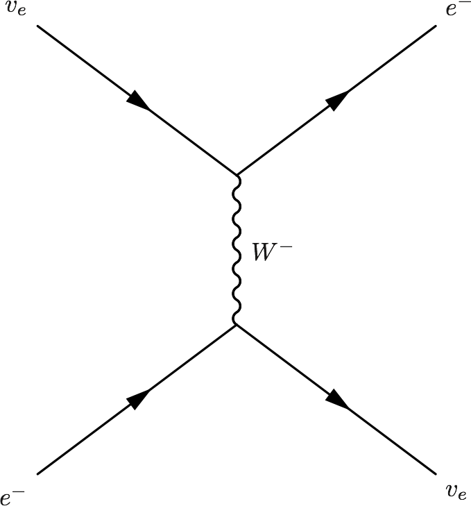

Oscillations
==============


Evidence of Oscillations
---------------------------


A lot of experiments have been done to research on neutrino oscillations. In summary there are three types,

1. Solar neutrinos,
2. Reactor and accelerator neutrinos,
3. Atmospheric neutrinos.


Results of Experiments
~~~~~~~~~~~~~~~~~~~~~~~~~


1. Difference between masses from data

   .. math::
      \frac{\lvert \Delta m_{21}^2 \rvert}{\lvert \Delta m_{31(32)}^2 \rvert} \approx 0.03 .

   We also have

   .. math::
      \lvert\Delta m_{21}^2 \rvert \ll \lvert \Delta m_{31(32)}^2 \rvert.

   By some convention, people would use numbers so that :math:`\Delta m_{21}^2 > 0` or :math:`m_1 < m_2`.


Theory
-------------


Neutrinos evolve in mass eigenstates. So we need to describe flavour states :math:`\ket{\nu_\alpha}` using mass eigenstates :math:`\ket{\nu_j}`.

.. math::
   \ket{\nu_\alpha} = \sum_j U^*_{\alpha j} \ket{\nu_j;\tilde p_j},

where :math:`U^*_{\alpha j}` is the element of neutrino mixing matrix.

In ultra relativistic case, we can simply find out the time evolution, which is equivalent to distance evolution,

.. math::
   \ket{\psi(t)} = \sum_j U^*_{\alpha j} G_j(t,t_0) \ket{\nu_j;\tilde p_j}.


The survival probability means how much neutrinos of a flavour left after some time or distance, which is calculated by

.. math::
   P(\nu_l\to\nu_{l'}) = \lvert \braket{\nu_{l'} }{\psi (t)}  \rvert^2 .

We can see clearly that the survival probability depends on some parameters.


Two Flavour Oscillation
~~~~~~~~~~~~~~~~~~~~~


To write down this clearly, we need to write down the mixing matrix and propagator. For simplicity, we calculate the example of two flavour (a, b) oscillation.

It's easier to write down the propagation in mass eiginstates so the first thing to work out is the mixing matrix.

Suppose we have only a flavour neutrino initially,

.. math::
   \ket{\psi(0)} = \ket{\nu_a}


Mixing Matrix
`````````````````````````````

The mixing matrix is an rotation of eigenbasis.

.. figure:: assets/nuetrinoMixingAngle.png
   :align: center
   :alt: Two Flavour Neutrino Mixing

   Two flavour neutrino mixing diagram with :math:`\theta` being the mixing angle

The flavour states can be expressed in terms of mass eigenstates,

.. math::
   \begin{pmatrix}\nu_a \\ \nu_b\end{pmatrix} = \begin{pmatrix}  \cos\theta  & \sin\theta \\ -\sin\theta  & \cos\theta \end{pmatrix}   \begin{pmatrix}\nu_1 \\ \nu_2\end{pmatrix}

where the matrix

.. math::
   \mathbf U = \begin{pmatrix}  \cos\theta  &  \sin\theta \\ -\sin\theta  & \cos\theta \end{pmatrix}

is the mixing matrix which is a rotation of basis geometrically. In other words, this matrix is the representation of the rotation :math:`e^{i\hat\theta}`.


Survival Probability
`````````````````````````````


With the mixing matrix, the propagation of an initial state of only flavour a is

.. math::
   \ket{\psi(t)} = \cos\theta \ket{\nu_1} e^{-i E_1 t} + \sin\theta \ket{\nu_2} e^{-i E_2 t} .


To find out the amplitude of flavour a, we need to project the state :math:`\ket{\psi(t)}` onto a flavour eigenstate, say, :math:`\ket{\nu_a}`,

.. math::
   \braket{\nu_a}{\psi(t)} & = \bra{\nu_a}\left( \cos\theta \ket{\nu_1} e^{-i E_1 t} + \sin\theta \ket{\nu_2} e^{-i E_2 t}\right) \\
   &= \left( \cos\theta \ket{\nu_1}  + \sin\theta \ket{\nu_2} \right) \left( \cos\theta \ket{\nu_1} e^{-i E_1 t} + \sin\theta \ket{\nu_2} e^{-i E_2 t}\right) \\
   & = \cos^2\theta e^{-iE_1t} + \sin^2\theta e^{-i E_2 t}

The survival probability is the amplitude squared,

.. math::
   P_{aa} & = \lvert \braket{\nu_a}{\psi(t)} \rvert ^2 \\
   & = \lvert \cos^2\theta e^{-iE_1t} + \sin^2\theta e^{-i E_2 t}  \rvert^2 \\
   & = \left( \cos^2\theta e^{-iE_1t} + \sin^2\theta e^{-i E_2 t}  \right)^* \left( \cos^2\theta e^{-iE_1t} + \sin^2\theta e^{-i E_2 t}  \right) \\
   & = \cos^4\theta + \sin^4\theta + \cos^2\theta\sin^2\theta e^{i(E_1-E_2)t}+ \sin^2\theta\cos^2\theta e^{-i(E_1-E_2)t} \\
   & = \cos^4\theta + \sin^4\theta + \cos^2\theta\sin^2\theta e^{i\Delta E t}+ \sin^2\theta\cos^2\theta e^{-i\Delta E t} \\
   & = \cos^4\theta + \sin^4\theta + 2 \cos^2\theta\sin^2\theta \cos(\Delta E t) \\
   & = (\cos^2\theta +\sin^2\theta)^2 - 2\cos^2\theta \sin^2\theta  + 2 \cos^2\theta\sin^2\theta \cos(\Delta E t) \\
   & = 1 - 2 \cos^2\theta \sin^2\theta (1 - \cos(\Delta E t)) \\
   & = 1 - \sin^2(2\theta) \sin^2\left( \frac{\Delta E t}{2} \right)

with the definition :math:`\Delta E =  E_1-E_2 \approx p_1 + \frac{1}{2}\frac{m_1^2}{p_1} - p_2 - \frac{1}{2}\frac{m_2^2}{p_2}`. We usually calculate the case :math:`p_1=p_2=p` , which takes us to

.. math::
   \Delta E & \approx \frac{m_1^2 - m_2^2}{2p} \\
   & = \frac{\delta^2 m}{2p} .

with :math:`\delta^2 m=m_1^2 - m_2^2`. Most of the time we would like to know the oscillation with respect to distance. Using the approximation :math:`t = L` and :math:`\Delta E \approx \frac{m_1^2 - m_2^2}{2p}`, we have

.. math::
   P_{aa} &= 1 - \sin^2(2\theta) \sin^2\left( \frac{\Delta E L}{2} \right) \\
   & = 1 -  \sin^2(2\theta) \sin^2\left( \frac{\delta^2m L}{4p} \right) .

This is the survival probability of flavour a neutrino with an initial state of flavour a.


There are several things to be noticed,

1. :math:`\theta=0` leads to oscillation free neutrinos.
2. :math:`\Delta E=0` or :math:`\delta ^2m =0` (in the case of same momentum) also gives us no oscillation.
3. At :math:`L=0` the survival probability is 1, which means no oscillation is done.


Hamiltonian
````````````````````

It's easy to write down the Hamiltonian for the mass state stationary Schrödinger equation. As we have proven, to first order approximation,

.. math::
   E = p + \frac{1}{2}\frac{m^2}{p}

.. math::
   \mathbf H_j &= \begin{pmatrix} p + \frac{1}{2}\frac{m_1^2}{p} & 0 \\ 0 & p + \frac{1}{2}\frac{m_2^2}{p} \end{pmatrix} \\
   & = p \mathbf I + \frac{1}{2p}\begin{pmatrix} m_1^2 & 0 \\ 0 & m_2^2 \end{pmatrix}

However, the Hamiltonian we prefer is the one for flavour eigenstates. To achieve this, we only need to rotate this previous Hamiltonian using the mixing matrix :math:`\mathbf U`.

.. math::
   \mathbf H_{\alpha} & = \mathbf U \hat H_j  \mathbf U^T \\
   & =  \begin{pmatrix}  \cos\theta & \sin\theta \\ -\sin\theta  & \cos\theta \end{pmatrix} \left( p \mathbf I + \frac{1}{2p}\begin{pmatrix} m_1^2 & 0 \\ 0 & m_2^2 \end{pmatrix} \right)   \begin{pmatrix}  \cos\theta & -\sin\theta \\ \sin\theta & \cos\theta \end{pmatrix} \\
   & = p \mathbf I + \frac{1}{2p} \begin{pmatrix} \cos^2\theta m_1^2 + \sin^2\theta m_2^2 & -\sin\theta\cos\theta m_1^2 + \sin\theta\cos\theta m_2^2 \\ -\sin\theta\cos\theta m_1^2 + \sin\theta\cos\theta m_2^2 & \sin^2\theta m_1^2 + \cos^2\theta m_2^2 \end{pmatrix} \\
   & = p \mathbf I + \frac{1}{2p} \begin{pmatrix} m_1^2 - \delta^2 m \sin^2\theta & -\frac{1}{2}\sin 2\theta \delta^2m \\ -\frac{1}{2}\sin 2\theta \delta^2m & m_2^2+\delta^2m\sin^2\theta \end{pmatrix} \\
   & = p \mathbf I + \frac{1}{2p} \left( \frac{1}{2}(m_1^2+m_2^2) \mathbf I -   \frac{1}{2}\begin{pmatrix} -\delta^2m\cos 2\theta & \delta^2 m \sin 2\theta \\ \delta^2m\sin 2\theta & \delta^2 m\cos 2\theta \end{pmatrix} \right) \\
   & = \left(p + \frac{m_1^2+m_2^2}{4p} \right)\mathbf I - \frac{1}{4p}\begin{pmatrix} -\delta^2m\cos 2\theta & \delta^2 m \sin 2\theta \\ \delta^2m\sin 2\theta & \delta^2 m\cos 2\theta \end{pmatrix}

Again we see clearly, no oscillation will apear as long as mixing angle :math:`\theta=0` or :math:`\delta^2m=0`.


.. note::
   The reason we can do this is that this mixing matrix is time and space independent. To see this, we first write down the Schrödinger equation for mass eigenstates,

   .. math::
      i d_t \ket{\Phi_j} = \hat H_j \ket{\Phi_j}.

   Applying the mixing matrix,

   .. math::
      i d_t \mathbf U^{-1} \ket{\Phi_\alpha} = \hat H_j  \mathbf U^{-1} \ket{\Phi_\alpha}.

   Notice that the mixing matrix, which is a rotation, is orthonormal, :math:`\mathbf U \mathbf U^T=\mathbf I`. Then we have inverse of this matrix is the same as the transpose.

   .. math::
      i d_t \mathbf U^T \ket{\Phi_\alpha} = \hat H_j  \mathbf U^T \ket{\Phi_\alpha}.

   Multiply on both sides :math:`\mathbf U` and remember the fact that the mixing matrix is orthonormal, we have

   .. math::
      i d_t \ket{\Phi_\alpha} = \mathbf U \hat H_j  \mathbf U^T \ket{\Phi_\alpha}.

   Now we can define the Hamiltonian for flavour states,

   .. math::
      \mathbf H_{\alpha} = \mathbf U \mathbf H_j  \mathbf U^T .


Since Pauli matrices plus identity forms a complete basis for all 2 by 2 matrices, it our Hamiltonian can be written as

.. math::
   \mathbf H  &= \frac{\delta^2 m}{4E}\begin{pmatrix} -\cos 2\theta & \sin 2\theta \\ \sin 2\theta & \cos 2\theta \end{pmatrix} \\
   & = \frac{\delta^2 m}{4 E} \left( -\cos 2\theta \mathbf{\sigma_z} + \sin 2\theta \mathbf{\sigma_x} \right).


.. note::
   Pauli matrices are

   .. math::
      \sigma_x = \begin{pmatrix}0 & 1 \\ 1 & 0\end{pmatrix}
      \sigma_y = \begin{pmatrix}0 & -i \\ i & 0\end{pmatrix}
      \sigma_x = \begin{pmatrix}1 & 0 \\ 0 & -1\end{pmatrix}


   Or in a more compact way,

   .. math::
      \sigma_j = \begin{pmatrix} \delta_{j3}&\delta_{j1}-i\delta_{j2}\\ \delta_{j1}+i\delta_{j2}&-\delta_{j3}\end{pmatrix}  .


MSW Effect
```````````````````````````````

Neutrinos do interact with matter, mostly electrons in most cases.

.. figure:: assets/nueNeutral.png

.. code:: tex

   \begin{fmfgraph*}(200,180)
     \fmfleft{i1,i2}
     \fmfright{o1,o2}
     \fmf{fermion}{i1,v1,o1}
     \fmf{fermion}{i2,v2,o2}
     \fmf{photon}{v1,v2}
     \fmflabel{$v_e$}{i2}
     \fmflabel{$e^-$}{i1}
     \fmflabel{$v_e$}{o2}
     \fmflabel{$e^-$}{o1}
     \fmf{photon,label=$Z$}{v1,v2}
   \end{fmfgraph*}


.. figure:: assets/nutaueNeutral.png


.. code:: tex

   \begin{fmfgraph*}(200,180)
    \fmfleft{i1,i2}
    \fmfright{o1,o2}
    \fmf{fermion}{i1,v1,o1}
    \fmf{fermion}{i2,v2,o2}
    \fmf{photon}{v1,v2}
    \fmflabel{$v_\tau$}{i2}
    \fmflabel{$e^-$}{i1}
    \fmflabel{$v_\tau$}{o2}
    \fmflabel{$e^-$}{o1}
    \fmf{photon,label=$Z$}{v1,v2}
   \end{fmfgraph*}





.. code:: tex

   \begin{fmfgraph*}(200,180)
    \fmfleft{i1,i2}
    \fmfright{o1,o2}
    \fmf{fermion}{i1,v1,o1}
    \fmf{fermion}{i2,v2,o2}
    \fmf{photon}{v1,v2}
    \fmflabel{$v_e$}{i2}
    \fmflabel{$e^-$}{i1}
    \fmflabel{$v_e$}{o1}
    \fmflabel{$e^-$}{o2}
    \fmf{photon,label=$W^{-}$}{v1,v2}
   \end{fmfgraph*}


The one that is missing is the charged current for :math:`nu_\tau` and :math:`e^{-}` interaction because of lepton number conservation.

The first two diagrams will add two equal terms on the diagonal terms of Hamiltonian, which can be viewed as adding a number times identity matrix thus conserves the eigenstates while shifts the eigenvalues. However, the third diagram will only add a term to the first diagonal term of Hamiltonian.

This symmetry breaking will change the evolution and makes the states more electron neutrino.

This is the MSW effect in short.


Q&A
-----


.. admonition:: Question
   :class: warning

   What are some of the conventions used in liturature?

.. admonition:: Answer
   :class: note

   1. :math:`\Delta m^2_{ij}=m_i^2-m_j^2`.
   2. Flavours of left hand neutrinos are mixing of mass eigen states, :math:`\nu_{lL}=\sum_{j=1}^3 U_{lj}\nu_{jL}(x)`.


.. admonition:: Question
   :class: warning

   Why can we use just quantum mechanics on relativistic neutrinos? In principle one should use quantum field theory or at least relativistic quantum mechanics?


.. admonition:: Answer
   :class: note

   To be answered.


.. admonition:: Question
   :class: warning

   What does the mixing angle mean exactly both in vacuum and matter environment?


.. admonition:: Answer
   :class: note

   There are several ways to illustrate this.

   1. **Rotation angle** in flavour space. For simplicity I use a two component neutrino model.

   .. math::
      \ket{\nu_1} &= \cos\theta \ket{\nu_e} + \sin \theta \ket{\nu_\mu} \\
      \ket{\nu_2} & = -\sin\theta \ket{\nu_e} + \cos\theta \ket{\nu_\mu}

   This is a rotation in a plane with a generator :math:`e^{-i\hat \theta}`. **(Make a figure for this.) + (Write down the 3 components model.)**

   2. **Oscillation probability** involves this angle too. It is a suppression of the oscillation probability.

   3. From the view of **quantum states**, this angle determines how the flavour states are composed with mass eigenstates, i.e., the fraction or probability of each mass eiginstates in a flavour state.


.. admonition:: Question
   :class: warning

   What does wave packet in neutrino oscillation mean?


.. admonition:: Answer
   :class: note

   To Be Answered.


.. admonition:: Question
   :class: warning

   How would a wave packet spread?


.. admonition:: Answer
   :class: note

   A Gaussian wave packet would spread or shrink. The key of this spreading or shrinking is the dispersion relation.

   For **non-relativistic** Gaussian wave packet :math:`\psi(x,t) = e^{-\alpha(k-k_0)^2}` in momentum basis with dispersion relation :math:`\hbar\omega = \frac{\hbar^2 k^2}{2m}`, the expansion of packet is

   .. math::
      \Delta x= \sqrt{\alpha^2+\left(\frac{\hbar t}{2m}\right)^2} .

   Obviously, the RMS width spreads according to group velocity :math:`v_g = \hbar _0/m`.

   **However, the situation could be different for a relativistic neutrino.**


.. admonition:: Question
   :class: warning

   What will scattering do to a wave packet.


.. admonition:: Answer
   :class: note

   **Momentum transfer** for a plan wave case in Born approximation is


Determine :math:`\vert\Delta m^2\vert` and :math:`\theta`
----------------------------------------------------------------------

Atmospheric Results
~~~~~~~~~~~~~~~~~~~~

Accelerator Results
~~~~~~~~~~~~~~~~~~~~~

Reactor Results
~~~~~~~~~~~~~~~~~~~~~


.
