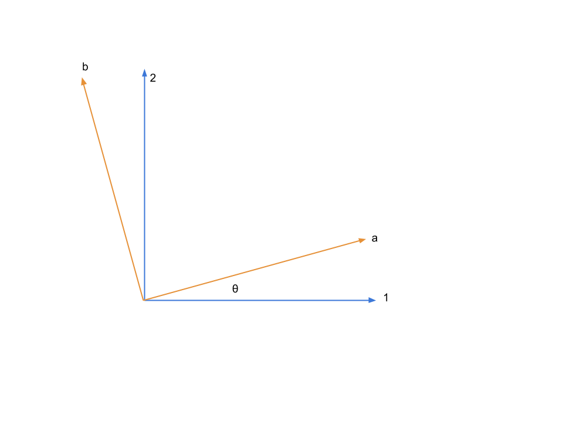

Evidence of Oscillations
---------------------------


A lot of experiments have been done to research on neutrino oscillations. In summary there are three types,

1. Solar neutrinos,
2. Reactor and accelerator neutrinos,
3. Atmospheric neutrinos.


Results of Experiments
~~~~~~~~~~~~~~~~~~~~~~~~~


1. Difference between masses from data

   .. math::
      \frac{\lvert \Delta m_{21}^2 \rvert}{\lvert \Delta m_{31(32)}^2 \rvert} \approx 0.03 .

   We also have

   .. math::
      \lvert\Delta m_{21}^2 \rvert \ll \lvert \Delta m_{31(32)}^2 \rvert.

   By some convention, people would use numbers so that :math:`\Delta m_{21}^2 > 0` or :math:`m_1 < m_2`.


Determine :math:`\vert\Delta m^2\vert` and :math:`\theta`
~~~~~~~~~~~~~~~~~~~~~~~~~~~~~~~~~~~~~~~~~~~~~~~~~~~~~~~~~~~~~~~~~~~~~~~~

The neutrino experimantal data shows the mixing angles are [1]_

1. :math:`\theta_{23}=39^{\circ}\pm 2 ^{\circ}`;
2. :math:`\theta_{13}=8.9^{\circ}\pm 0.5^{\circ}`;
3. :math:`\theta_{12}=34^{\circ}\pm 1^{\circ}`.

Experimental result of the :math:`\delta m^2 _{ij}` s are [1]_

1. :math:`\delta^2 m_{21}=7.5^{+0.3}_{-0.2}\times 10^{-5}eV^2`;
2. :math:`\lvert\delta^2 m_{32}\rvert =2.4^{+0.1}_{-0.1}\times 10^{-3}eV^2`.


.. admonition:: Definition of Mass-squared Difference
   :class: note

   :math:`\delta m^2 _{ij}=m_i^2-m_j^2`. Obviously, :math:`\delta^2 m_{31}=\delta^2 m{32}-\delta^2 m_{21}`.


As :math:`\lvert \delta^2 m_{21}\rvert\ll \lvert\delta^2 m_{32}\rvert`, we should have :math:`\delta^2 m_{31} \approx \delta^2 m_{32}`.


Atmospheric Results
``````````````````````````````

Accelerator Results
```````````````````````````

Reactor Results
`````````````````````````


Vacuum Theory
---------------------


Neutrinos evolve in mass eigenstates. So we need to describe flavour states :math:`\ket{\nu_\alpha}` using mass eigenstates :math:`\ket{\nu_j}`.

.. math::
   \ket{\nu_\alpha} = \sum_j U^*_{\alpha j} \ket{\nu_j;\tilde p_j},

where :math:`U^*_{\alpha j}` is the element of neutrino mixing matrix.


.. admonition:: PMNS Mixing Matrix
   :class: note

   Pontecorvo-Maki-Nakagawa-Sakata (PMNS) mixing matrix is the product of three rotation matrices, in addition to an extra phase,

   .. math::
      \mathbf U &= \mathbf {U_{23}} \times \mathbf {U_{13,\delta}} \times \mathbf {U_{12}} \\
      & = \begin{pmatrix} 1 & 0 & 0 \\ 0 &\cos\theta_{23} & \sin\theta_{23} \\ 0 -\sin\theta_{23} & \cos\theta_{23} \end{pmatrix}  \begin{pmatrix} \cos\theta_{13} & 0 & e^{i\delta} \sin\theta_{13} \\ 0 & 1 & 0 \\ -e^{i\delta}\sin\theta_{13} & 0 & \cos\theta_{13}  \end{pmatrix} \begin{pmatrix} \cos\theta_{12} & \sin\theta_{12} & 0 \\ -\sin\theta_{12} & \cos \theta_{12} & 0 \\ 0 & 0 & 1 \end{pmatrix}

   The :math:`\delta` is the CP violation phase.

   The origin of the phase is from the fact that we need 4 degrees of freedom for this mixing matrix while a convinient way is to write down the SO(3) rotation matrix then put this extra phase here.


.. admonition:: More About Phase of Nutrinos
   :class: note

   The mixing of mass eigenstates is

   .. math::
      \begin{pmatrix} \nu_e \\ \nu_\mu \\ \nu_\tau  \end{pmatrix} = \begin{pmatrix} e^{i\alpha_1} & 0 & 0 \\ 0 & e^{i\alpha_2} & 0 \\ 0 & 0 & e^{i\alpha_3} \end{pmatrix} \text{Some Unitary Matrix} \begin{pmatrix} 1 & 0 & 0 \\ 0 & e^{i\beta_2} & 0 \\ 0 & 0 & e^{i\beta_3} \end{pmatrix}

   Since the phase of neutrinos can be redefined, we have 3 phases for each flavour and a global phase being arbitary. The first matrix on the RHS can be eliminated. **The third matrix on the RHS is not important for neutrino oscillations so it can be neglected.** (Proof required)


In ultra relativistic case, we can simply find out the time evolution, which is equivalent to distance evolution,

.. math::
   \ket{\psi(t)} = \sum_j U^*_{\alpha j} G_j(t,t_0) \ket{\nu_j;\tilde p_j}.


The survival probability means how much neutrinos of a flavour left after some time or distance, which is calculated by

.. math::
   P(\nu_l\to\nu_{l'}) = \lvert \braket{\nu_{l'} }{\psi (t)}  \rvert^2 .

We can see clearly that the survival probability depends on some parameters.


Two Flavour Oscillation
~~~~~~~~~~~~~~~~~~~~~~~~~~~~~~~~~~~~~~~~~~


To write down this clearly, we need to write down the mixing matrix and propagator. For simplicity, we calculate the example of two flavour (a, b) oscillation.

It's easier to write down the propagation in mass eiginstates so the first thing to work out is the mixing matrix.

Suppose we have only a flavour neutrino initially,

.. math::
   \ket{\psi(0)} = \ket{\nu_a}


Mixing Matrix
`````````````````````````````

The mixing matrix is an rotation of eigenbasis.



   Two flavour neutrino mixing diagram with :math:`\theta` being the mixing angle

The flavour states can be expressed in terms of mass eigenstates,

.. math::
   \begin{pmatrix}\nu_a \\ \nu_b\end{pmatrix} = \begin{pmatrix}  \cos\theta  & \sin\theta \\ -\sin\theta  & \cos\theta \end{pmatrix}   \begin{pmatrix}\nu_1 \\ \nu_2\end{pmatrix}

where the matrix

.. math::
   \mathbf U = \begin{pmatrix}  \cos\theta  &  \sin\theta \\ -\sin\theta  & \cos\theta \end{pmatrix}

is the mixing matrix which is a rotation of basis geometrically. In other words, this matrix is the representation of the rotation :math:`e^{i\hat\theta}`.


Survival Probability
`````````````````````````````

Neutrinos are usually produced in electron flavor, which we choose as the initial condition for this example,

.. math::
   \ket{\psi(t=0)} = \cos\theta \ket{\nu_1} + \sin \theta \ket{\nu_2}.


With the mixing matrix, the propagation of an initial state of only flavour a is

.. math::
   \ket{\psi(t)} = \cos\theta \ket{\nu_1} e^{-i E_1 t} + \sin\theta \ket{\nu_2} e^{-i E_2 t} .


To find out the amplitude of flavour a, we need to project the state :math:`\ket{\psi(t)}` onto a flavour eigenstate, say, :math:`\ket{\nu_a}`,

.. math::
   \braket{\nu_a}{\psi(t)} & = \bra{\nu_a}\left( \cos\theta \ket{\nu_1} e^{-i E_1 t} + \sin\theta \ket{\nu_2} e^{-i E_2 t}\right) \\
   &= \left( \cos\theta \ket{\nu_1}  + \sin\theta \ket{\nu_2} \right) \left( \cos\theta \ket{\nu_1} e^{-i E_1 t} + \sin\theta \ket{\nu_2} e^{-i E_2 t}\right) \\
   & = \cos^2\theta e^{-iE_1t} + \sin^2\theta e^{-i E_2 t}

The survival probability is the amplitude squared,

.. math::
   P_{aa} & = \lvert \braket{\nu_a}{\psi(t)} \rvert ^2 \\
   & = \lvert \cos^2\theta e^{-iE_1t} + \sin^2\theta e^{-i E_2 t}  \rvert^2 \\
   & = \left( \cos^2\theta e^{-iE_1t} + \sin^2\theta e^{-i E_2 t}  \right)^* \left( \cos^2\theta e^{-iE_1t} + \sin^2\theta e^{-i E_2 t}  \right) \\
   & = \cos^4\theta + \sin^4\theta + \cos^2\theta\sin^2\theta e^{i(E_1-E_2)t}+ \sin^2\theta\cos^2\theta e^{-i(E_1-E_2)t} \\
   & = \cos^4\theta + \sin^4\theta + \cos^2\theta\sin^2\theta e^{i\Delta E t}+ \sin^2\theta\cos^2\theta e^{-i\Delta E t} \\
   & = \cos^4\theta + \sin^4\theta + 2 \cos^2\theta\sin^2\theta \cos(\Delta E t) \\
   & = (\cos^2\theta +\sin^2\theta)^2 - 2\cos^2\theta \sin^2\theta  + 2 \cos^2\theta\sin^2\theta \cos(\Delta E t) \\
   & = 1 - 2 \cos^2\theta \sin^2\theta (1 - \cos(\Delta E t)) \\
   & = 1 - \sin^2(2\theta) \sin^2\left( \frac{\Delta E t}{2} \right)

with the definition :math:`\Delta E =  E_1-E_2 \approx p_1 + \frac{1}{2}\frac{m_1^2}{p_1} - p_2 - \frac{1}{2}\frac{m_2^2}{p_2}`. We usually calculate the case :math:`p_1=p_2=p` , which takes us to

.. math::
   \Delta E & \approx \frac{m_1^2 - m_2^2}{2p} \\
   & = \frac{\delta^2 m}{2p} .

with :math:`\delta^2 m=m_1^2 - m_2^2`. Most of the time we would like to know the oscillation with respect to distance. Using the approximation :math:`t = L` and :math:`\Delta E \approx \frac{m_1^2 - m_2^2}{2p}`, we have

.. math::
   P_{aa} &= 1 - \sin^2(2\theta) \sin^2\left( \frac{\Delta E L}{2} \right) \\
   & = 1 -  \sin^2(2\theta) \sin^2\left( \frac{ \delta m^2  L}{4p} \right) .

This is the survival probability of flavour a neutrino with an initial state of flavour a.


There are several things to be noticed,

1. :math:`\theta=0` leads to oscillation free neutrinos.
2. :math:`\Delta E=0` or :math:`\delta ^2m =0` (in the case of same momentum) also gives us no oscillation.
3. At :math:`L=0` the survival probability is 1, which means no oscillation is done.


Hamiltonian
````````````````````

It's easy to write down the Hamiltonian for the mass state stationary Schrodinger equation. As we have proven, to first order approximation,

.. math::
   E = p + \frac{1}{2}\frac{m^2}{p}

.. math::
   \mathbf H_j &= \begin{pmatrix} p + \frac{1}{2}\frac{m_1^2}{p} & 0 \\ 0 & p + \frac{1}{2}\frac{m_2^2}{p} \end{pmatrix} \\
   & = p \mathbf I + \frac{1}{2p}\begin{pmatrix} m_1^2 & 0 \\ 0 & m_2^2 \end{pmatrix}

However, the Hamiltonian we prefer is the one for flavour eigenstates. To achieve this, we only need to rotate this previous Hamiltonian using the mixing matrix :math:`\mathbf U`.

.. math::
   \mathbf H_{\alpha} & = \mathbf U \hat H_j  \mathbf U^T \\
   & =  \begin{pmatrix}  \cos\theta & \sin\theta \\ -\sin\theta  & \cos\theta \end{pmatrix} \left( p \mathbf I + \frac{1}{2p}\begin{pmatrix} m_1^2 & 0 \\ 0 & m_2^2 \end{pmatrix} \right)   \begin{pmatrix}  \cos\theta & -\sin\theta \\ \sin\theta & \cos\theta \end{pmatrix} \\
   & = p \mathbf I + \frac{1}{2p} \begin{pmatrix} \cos^2\theta m_1^2 + \sin^2\theta m_2^2 & -\sin\theta\cos\theta m_1^2 + \sin\theta\cos\theta m_2^2 \\ -\sin\theta\cos\theta m_1^2 + \sin\theta\cos\theta m_2^2 & \sin^2\theta m_1^2 + \cos^2\theta m_2^2 \end{pmatrix} \\
   & = p \mathbf I + \frac{1}{2p} \begin{pmatrix} m_1^2 - \delta^2 m \sin^2\theta & -\frac{1}{2}\sin 2\theta  \delta m^2  \\ -\frac{1}{2}\sin 2\theta  \delta m^2  & m_2^2+ \delta m^2 \sin^2\theta \end{pmatrix} \\
   & = p \mathbf I + \frac{1}{2p} \left( \frac{1}{2}(m_1^2+m_2^2) \mathbf I -   \frac{1}{2}\begin{pmatrix} - \delta m^2 \cos 2\theta & \delta^2 m \sin 2\theta \\  \delta m^2 \sin 2\theta & \delta^2 m\cos 2\theta \end{pmatrix} \right) \\
   & = \left(p + \frac{m_1^2+m_2^2}{4p} \right)\mathbf I - \frac{1}{4p}\begin{pmatrix} - \delta m^2 \cos 2\theta & \delta^2 m \sin 2\theta \\  \delta m^2 \sin 2\theta & \delta^2 m\cos 2\theta \end{pmatrix}

Again we see clearly, no oscillation will apear as long as mixing angle :math:`\theta=0` or :math:`\delta m^2 =0`.


.. note::
   The reason we can do this is that this mixing matrix is time and space independent. To see this, we first write down the Schrodinger equation for mass eigenstates,

   .. math::
      i d_t \ket{\Phi_j} = \hat H_j \ket{\Phi_j}.

   Applying the mixing matrix,

   .. math::
      i d_t \mathbf U^{-1} \ket{\Phi_\alpha} = \hat H_j  \mathbf U^{-1} \ket{\Phi_\alpha}.

   Notice that the mixing matrix, which is a rotation, is orthonormal, :math:`\mathbf U \mathbf U^T=\mathbf I`. Then we have inverse of this matrix is the same as the transpose.

   .. math::
      i d_t \mathbf U^T \ket{\Phi_\alpha} = \hat H_j  \mathbf U^T \ket{\Phi_\alpha}.

   Multiply on both sides :math:`\mathbf U` and remember the fact that the mixing matrix is orthonormal, we have

   .. math::
      i d_t \ket{\Phi_\alpha} = \mathbf U \hat H_j  \mathbf U^T \ket{\Phi_\alpha}.

   Now we can define the Hamiltonian for flavour states,

   .. math::
      \mathbf H_{\alpha} = \mathbf U \mathbf H_j  \mathbf U^T .


Since Pauli matrices plus identity forms a complete basis for all 2 by 2 matrices, it our Hamiltonian can be written as

.. math::
   \mathbf H  &= \frac{\delta^2 m}{4E}\begin{pmatrix} -\cos 2\theta & \sin 2\theta \\ \sin 2\theta & \cos 2\theta \end{pmatrix} \\
   & = \frac{\delta^2 m}{4 E} \left( -\cos 2\theta \mathbf{\sigma_z} + \sin 2\theta \mathbf{\sigma_x} \right).


.. note::
   Pauli matrices are

   .. math::
      \sigma_x = \begin{pmatrix}0 & 1 \\ 1 & 0\end{pmatrix} \\
      \sigma_y = \begin{pmatrix}0 & -i \\ i & 0\end{pmatrix} \\
      \sigma_x = \begin{pmatrix}1 & 0 \\ 0 & -1\end{pmatrix}.


   In a more compact way,

   .. math::
      \sigma_j = \begin{pmatrix} \delta_{j3}&\delta_{j1}-i\delta_{j2}\\ \delta_{j1}+i\delta_{j2}&-\delta_{j3}\end{pmatrix}  .


Equation of Motion in Matter
--------------------------------------


Hamiltonian
~~~~~~~~~~~~~~~~~~~~~~~~~~~~~~~


We have already derived the Hamiltonian for vacuum oscillatioin,

.. math::
   H_v=\frac{ \delta m^2 }{2E}\frac{1}{2}\begin{pmatrix} -\cos 2\theta_v & \sin 2 \theta_v \\ \sin 2\theta_v & \cos 2\theta_v  \end{pmatrix},

where we would like to define a new matrix,

.. math::
   \mathbf B = \frac{1}{2}\begin{pmatrix}  -\cos 2\theta_v & \sin 2 \theta_v \\ \sin 2\theta_v & \cos 2\theta_v  \end{pmatrix},

so that the vacuum Hamiltonian can be written as

.. math::
   H_v = \frac{ \delta m^2 }{2E}\mathbf B


The **effect of matter**, as we have already discussed before, adds an extra term

.. math::
   H_m = \sqrt{2}G_F n_e L.

Here we have

.. math::
   L = \begin{pmatrix} 1 & 0 \\ 0 & 0 \end{pmatrix}.


.. note::

   Previously in the MSW effect section, we have :math:`L=\frac{1}{2}\sigma_3`. The reason, as explained there, is that we can always write down a 2 by 2 matrix using Pauli matrices and indentity matrix and identity matrix only shifts the overall eigenvalue not the eigenvector so we can just drop the identity term.


One other term is the self-interaction of neutrinos, i.e., neutral-current neutrino-neutrino forward exchange scattering,

.. math::
   H_\nu =\sqrt{2}G_F \int d^3\mathbf p' (1-\hat {\mathbf p}\cdot \hat{\mathbf p}')(\rho_{p'}-\bar \rho_{p'}).


The overall Hamiltonian is

.. math::
   H = H_0 + H_m + H_\nu ,

where the vacuum Hamiltonian is

.. math::
   H_0 &= \frac{\delta^2 m}{2E} \mathbf B \\
   & = \frac{\delta^2 m}{2E} U \left(\frac{1}{2}\sigma_3 \right) U^\dagger .


Equation of Motion
~~~~~~~~~~~~~~~~~~~~~~~~~~~~~~~~


From the Hamiltonian, Von Neumann equation is

.. math::
   i \frac{\partial}{\partial t}\rho = \left[ H , \rho\right]


In `Picture <.picture.html>`_ chapter we have seen the definition of a polarization matrix. The components of a polarization vector (**for neutrinos**) is given by

.. math::
   P_{\omega,i} &\propto \mathrm{Tr} (\rho_E \sigma_i) \\
   & = \frac{1}{n_\nu} \frac{\lvert \delta^2 m \rvert}{2\omega^2} \times  \mathrm{Tr} (\rho_E \sigma_i) .

For anitneutrinos, we have a negative :math:`\omega` which is defined as :math:`\omega = \frac{ \delta m^2 }{2E}` (neutrinos) and :math:`\omega_{\bar\nu}= - \frac{ \delta m^2 }{2E}` (anitneutrinos). The polarization is defined as

.. math::
   P_{\omega,i} = - \frac{1}{n_\nu} \frac{\lvert \delta^2 m \rvert}{2\omega^2} \times  \mathrm{Tr} (\bar \rho_E \sigma_i) .


With all these definitions, Von Neumann equation multiply by :math:`\vec{\sigma} = \sigma_1 \hat e_1 + \sigma_2 \hat e_2 + \sigma_3 \hat e_3`, we have

.. math::
   i \dot \rho \sum_i \sigma_i \hat e_i = \left[H, \rho\right] \sum_i\sigma_i \hat e_i.

Notice that Pauli matrices are Hermitian and Unitary, we can alway insert the identity :math:`\mathbf I = \sigma_j \sigma_j^\dagger`.


.. admonition:: Commutator and Cross Product
   :class: note

   Commutator of two vectors,

   .. math::
      \vec A \times \vec B & = (A_2 B_3 - A_3 B_2) \hat e_1 + (A_3 B_1 - A_1 B_2)\hat e_2 + (A_1 B_2 - A_2 B_3)\hat e_3


.. admonition:: Trace of Pauli Matrices
   :class: note

   All Pauli matrices have vanishing trace. And what makes our calculation more convinient is that the trace of matrices is invariant under cyclic permutation, that is

   .. math::
      \mathrm{Tr}(\sigma_i \mathbf H \sigma_j) = \mathrm{Tr}(\mathbf H \sigma_j\sigma_i)

   Notice that to have a non-vanishing trace we need :math:`i=j`. This property really saves our life.


As the definition, we have

.. math::
   \mathbf H &= \vec H\cdot \vec\sigma \\
   \rho & = \vec \rho \cdot \vec \sigma


Using these we can rewrite the commutator

.. math::
   [H,\rho] & = [\vec H \cdot \vec\sigma, \vec \rho \cdot \vec \sigma] \\
   & = \sum_{ik}(H_i \sigma_i \rho_k \sigma_k - \rho_k \sigma_k H_i \sigma_i )\\
   & = \sum_{ik}(H_i\rho_k \sigma_i\sigma_k - \rho_k H_i \sigma_k \sigma_i) \\
   & = \sum_{ik} H_i\rho_k (\sigma_i\sigma_k-\sigma_k\sigma_i) \\
   & = \sum_{ik} H_i \rho_k [\sigma_i,\sigma_k] \\
   & =  \sum_{ik} H_i \rho_k 2i \epsilon_{ikn}\sigma_n \\
   & =  2i \sum_{ik}\epsilon_{ikn}\sigma_n H_i \rho_k

Multiply by :math:`\sigma_j` and take the trace, we get,

.. math::
   \mathrm{Tr}(\sigma_j [H,\rho]) & =  2i \mathrm{Tr}(\sum_{ik}\epsilon_{ikn}\sigma_j\sigma_n H_i \rho_k )\\
   &= 2i \sum_{ik} \mathrm{Tr}(\epsilon_{ikj} \mathrm I  H_i \rho_k  ) \\
   & = 2i \sum_{ik} \epsilon_{jik} H_i\rho_k  \mathrm{Tr}(\mathbf I) \\
   & = 4i \epsilon_{jik}H_i\rho_k.


The corresponding LHS after these work becomes

.. math::
   i\mathrm{Tr}(\sigma_j \dot \rho_i \sigma_i) & = i \partial_t \rho_j \mathrm{Tr}( I) \\
   & = 2i\dot{P_j}


The Von Neuman equation becomes

.. math::
   \dot{\vec P} = 2 \vec H \times \vec P.

We know explicitly what polarization vector is

.. math::
   P_j = \mathrm{Constant} \mathrm {Tr} (\rho \sigma_j)

for neutrinos while

.. math::
   \bar P_j = -\mathrm{Constant} \mathrm {Tr} (\bar \rho \sigma_j).

The vectorized Hamiltonian is

.. math::
   H = H_i\sigma_i.

Multiply by :math:`\sigma_j` and take the trace,

.. math::
   \mathrm{Tr}(H\sigma_j) = H_j \mathrm{Tr}(\mathbf I),

that is,

.. math::
   \mathrm{Tr}(H\sigma_j) = 2 H_j.


.. admonition:: Hamiltonian

   The Hamiltonian for homogeneous isotropic environment is

   .. math::
      H &= H_0 + H_m + H_\nu \\
      & = \omega \mathbf B + \lambda \mathbf L + \sqrt{ G_F} \int_0^\infty dE' (\rho_E' - \bar \rho_E' ).

Then the equation we need becomes

.. math::
   \dot{\vec P_\omega} = (\omega \vec B + \lambda \vec L + \mu \vec D) \times \vec P_{\omega}.

where :math:`\vec B = \mathrm {Tr}(\mathbf B \vec \sigma)`, :math:`\vec L = \mathrm{Tr}(\mathbf L \vec \sigma)`, :math:`\vec D = \int_{-\infty}^{\infty}d\omega \vec P_\omega`.


Q&A
-----


.. admonition:: Question
   :class: warning

   What are some of the conventions used in liturature?

.. admonition:: Answer
   :class: note

   1. :math:`\Delta m^2_{ij}=m_i^2-m_j^2`.
   2. Flavours of left hand neutrinos are mixing of mass eigen states, :math:`\nu_{lL}=\sum_{j=1}^3 U_{lj}\nu_{jL}(x)`.


.. admonition:: Question
   :class: warning

   Why can we use just quantum mechanics on relativistic neutrinos? In principle one should use quantum field theory or at least relativistic quantum mechanics?


.. admonition:: Answer
   :class: note

   To be answered.


.. admonition:: Question
   :class: warning

   What does the mixing angle mean exactly both in vacuum and matter environment?


.. admonition:: Answer
   :class: note

   There are several ways to illustrate this.

   1. **Rotation angle** in flavour space. For simplicity I use a two component neutrino model.

   .. math::
      \ket{\nu_1} &= \cos\theta \ket{\nu_e} + \sin \theta \ket{\nu_\mu} \\
      \ket{\nu_2} & = -\sin\theta \ket{\nu_e} + \cos\theta \ket{\nu_\mu}

   This is a rotation in a plane with a generator :math:`e^{-i\hat \theta}`. **(Make a figure for this.) + (Write down the 3 components model.)**

   2. **Oscillation probability** involves this angle too. It is a suppression of the oscillation probability.

   3. From the view of **quantum states**, this angle determines how the flavour states are composed with mass eigenstates, i.e., the fraction or probability of each mass eiginstates in a flavour state.


.. admonition:: Question
   :class: warning

   What does wave packet in neutrino oscillation mean?


.. admonition:: Answer
   :class: note

   To Be Answered.


.. admonition:: Question
   :class: warning

   How would a wave packet spread?


.. admonition:: Answer
   :class: note

   A Gaussian wave packet would spread or shrink. The key of this spreading or shrinking is the dispersion relation.

   For **non-relativistic** Gaussian wave packet :math:`\psi(x,t) = e^{-\alpha(k-k_0)^2}` in momentum basis with dispersion relation :math:`\hbar\omega = \frac{\hbar^2 k^2}{2m}`, the expansion of packet is

   .. math::
      \Delta x= \sqrt{\alpha^2+\left(\frac{\hbar t}{2m}\right)^2} .

   Obviously, the RMS width spreads according to group velocity :math:`v_g = \hbar _0/m`.

   **However, the situation could be different for a relativistic neutrino.**


.. admonition:: Question
   :class: warning

   What will scattering do to a wave packet.


.. admonition:: Answer
   :class: note

   **Momentum transfer** for a plan wave case in Born approximation is


Refs & Notes
------------------


.. [1] `Neutrino tomography <http://scitation.aip.org/docserver/fulltext/aapt/journal/ajp/81/9/1.4817314.pdf?expires=1404757170&id=id&accname=389573&checksum=665C4B4FC4EA96902216439ECF5AC17D>`_ by Margaret A. Millhouse & David C. Latimer, American Journal of Physics 81, 646 (2013); `doi: 10.1119/1.4817314 <http://dx.doi.org/10.1119/1.4817314>`_ .
