Vacuum Oscillation
======================

Schrodinger equation is

.. math::
   i\partial_t \ket{\Psi} = \mathbf H \ket{\Psi},

where for relativistic neutrinos, the energy is

.. math::
   \mathbf H^{vm} &= \begin{pmatrix}\sqrt{p^2 + m_1^2} & 0 & 0 \\ 0& \sqrt{p^2 + m_2^2} & 0 \\ 0 & 0 & \sqrt{p^2 + m_3^2}  \end{pmatrix},

in which the energy terms are simplified using the relativistic condition

.. math::
   \sqrt{p^2+m_i^2} & = p\sqrt{1 + \frac{m_i^2}{p^2}} \\
   &\approx  p(1 + \frac{1}{2} \frac{m_i^2}{p^2}).

.. admonition:: So Called Decoherence
   :class: note

   Here we assume that they all have the same energy but different mass. The thing is we assume they have the same velocity since the mass is very small. To have an idea of the velocity difference, we can calculate the distance travelled by another neutrino in the frame of one neutrino.

   Assuming the mass of a neutrino is 1eV with energy 10MeV, we will get a speed of :math:`1-10^{-14}` c. This :math:`10^{-14}` c will make a difference about :math:`3\mu\mathrm{ m}` in 1s.

   Will decoherence happen due to this? For high energy neutrinos this won't be a problem however for low energy neutrinos this will definitely cause a problem for the wave function approach.Because the different mass eigenstates will become decoherent gradually along the path.

   A estimation of the decoherence length is

   .. math::
      l_{\mathrm{coh}}=\frac{v_g}{\Delta v_g}\sigma.

   To obtain the relation,

   .. math::
      \Delta x &= \lvert v_1 - v_2 \rvert t_{\mathrm{coh}}\\
      \frac{\hbar c}{\Delta E} & = \lvert \frac{m_1^2}{2E_1^2} - \frac{m_2^2}{2E_2^2} \rvert t_{\mathrm{coh}} \\
      \frac{\hbar c}{\Delta E} & = \frac{1}{2E}\lvert \Delta m_{12}^2 \rvert t_{\mathrm{coh}}

   **It should be made clear that this is not really decoherence but in the view of wave packet formalism different propagation eigenstates will be far away from each other. As long as we put them together again we can overlap and oscillate again. No quantum decoherence is happening at all.**

In general the flavor eigenstates are the mixing of the mass eigenstates with a unitary matrix :math:`\mathbf U`, that is

.. math::
   \ket{\nu_{\alpha}} =  U_{\alpha i} \ket{\nu_i},

where the :math:`\alpha` s are indices for flavor states while the *i* s are indices for mass eigenstates.

To find out the equation of motion for flavor states, plugin in the initary tranformation,

.. math::
   i  U_{\alpha i} \partial_t \ket{\nu_i} =  U_{\alpha i}  H^m_{ij} \ket{\nu_j}.

We use index :math:`{}^{vm}` for representation of Hamiltonian in mass eigenstates in vacuum oscillations. Applying the unitary condition of the transformation,

.. math::
   \mathbf I = \mathbf {U^\dagger} \mathbf U,

I get

.. math::
   i U_{\alpha i} \partial_t \ket{\nu_i} =  U_{\alpha i} H^m_{i j}  {U^\dagger_{j\beta}}  U_{\beta k} \ket{\nu_k},

which is simplified to

.. math::
   i \partial_t \ket{\nu_\alpha} = H^f_{\alpha \beta} \ket{\nu_{\beta}},

since the transformation is time independent.

The new Hamiltonian in the representations of flavor eigenstates reads

.. math::
   H^f_{\alpha\beta}  = U^\dagger_{\alpha i} H^m_{ij} U_{j\beta}.

Survival Problem
--------------------------------

The neutrino states at any time can be written as

.. math::
   \ket{\Psi(t)}  = X_1 \ket{\nu_1 } e^{-i E_1 t}+ X_2 \ket{ \nu_2 } e^{-i E_2 t},

where :math:`X_1` and :math:`X_2` are the initial conditions which are determined using the neutrino initial states.

Survival probalility is the squrare of the projection on an flavor eigenstate,

.. math::
   P_{\alpha}(t) = \lvert \braket{\nu_{\alpha}}{\Psi(t)} \rvert^2.

The calculation of this expression requires our knowledge of the relation between mass eigenstates and flavor eigenstates which we have already found out.

Recall that the transformation between flavor and mass states is

.. math::
   \ket{\nu_i} = U^{-1}_{i\alpha} \ket{\nu_\alpha},

which leads to the inner product of mass eigenstates and flavor eigenstates,

.. math::
   \braket{\nu_\alpha}{\nu_i} &= \bra{\nu_\alpha} U^{-1}_{i\beta} \ket{\nu_\beta} \\
   & = U^{-1}_{i\beta}\delta_{\alpha\beta} \\
   & = U^{-1}_{i\alpha}.

The survival probability becomes

.. math::
   P_\alpha (t) &= \lvert \braket{\nu_\alpha}{ X_1 \ket{\nu_1 } e^{-i E_1 t} X_2 \ket{ \nu_2 } e^{-i E_2 t} }  \rvert^2 \\
   & = \lvert  X_1 e^{-i E_1 t} \braket{\nu_\alpha}{\ket{\nu_1} } + X_2 e^{-i E_2 t} \braket{ \nu_\alpha }{ \nu_2 } \rvert^2 \\
   & = \lvert \sum_i X_i e^{-i E_i t} U^{-1}_{i \alpha}  \rvert ^2 \\
   & = \sum_i X_1^* e^{iE_i t} U^{\dagger *}_{i\alpha} \sum_i X_i e^{-i E_i t} U^\dagger_{i \alpha} \\
   & = \lvert X_1 \rvert^2 U^{\dagger * } _ {1\alpha} U^\dagger_{1\alpha} + \lvert X_2 \rvert^2 U^{\dagger * } _ {2\alpha} U^\dagger_{2\alpha}  + X_1^* X_2 U^{\dagger * }_{1\alpha} U^\dagger_{2\alpha} e^{i E_1 t - i E_2 t} + X_2^* X_1 U^{\dagger * }_{2\alpha} U^\dagger_{1\alpha} e^{i E_2 t - i E_1 t}

:math:`U^{\dagger *}_{i\alpha}` stands for the *i* th row and the :math:`\alpha` th column of the matrix :math:`U^{\dagger *}`.

Two Flavor States
-------------------

Suppose the neutrinos are prepared in electron flavor initially, the survival probability of electron flavor neutrinos is calculated using the result I get previously.

Electron neutrinos are the lighter ones, then I have :math:`{}_a = {}_e` and denote :math:`{}_b={}_x`.

.. admonition:: Meaning of Mixing
   :class: note

   In the small mixing angle limit,

   .. math::
      \begin{pmatrix}\nu_e \\ \nu_x\end{pmatrix} \to \begin{pmatrix}  1 & \theta \\ -\theta  & 1 \end{pmatrix}   \begin{pmatrix}\nu_1 \\ \nu_2\end{pmatrix}

   which is very close to an identity matrix. This implies that electron neutrino is more like mass eigenstate  :math:`\nu_1` . By :math:`\nu_1` we mean the state with energy  :math:`\frac{ \delta m^2 }{4E}` in vacuum.

In fact the dynamics of the system is very easily solved without dive into the math. Suppose we have :math:`\ket{\nu_e}` initially, which is

.. math::
   \Psi(x=0)=\ket{\nu_e} = \cos \theta_v \ket{\nu_1} - \sin \theta_v \ket{\nu_2},

the state of the system at distance :math:`x` is directly written down

.. math::
   \Psi(x) &=  \cos \theta_v \ket{\nu_1} e^{-i E_1 x} - \sin \theta_v \ket{\nu_2} e^{-i E_2 x} \\
   &= e^{-i E_1 x}( \cos \theta_v \ket{\nu_1}  - \sin \theta_v \ket{\nu_2} e^{i(E_1 - E_2) x}).

Since a global phase doesn't change the detection, we write the state as

.. math::
   \Psi(x) =  \cos \theta_v \ket{\nu_1}  - \sin \theta_v \ket{\nu_2} e^{i(E_1 - E_2) x} .

Notice that the period of the expression is

.. math::
   l_v = \frac{2\pi}{E_1 - E_2} = - \frac{4\pi E}{\Delta m_{12}}.

Recall the definition of angular frequency in vacuum :math:`\omega = \frac{\Delta m^2}{2E}`. The relation between period and angular frequency is indeed :math:`\omega = \frac{2\pi}{l_v}` as we should have been defined them.

Then the state becomes

.. math::
   \Psi(x) =  \cos \theta_v \ket{\nu_1}  - \sin \theta_v \ket{\nu_2} e^{i2\pi x/l_v} .

The survival probability for electron neutrinos is

.. math::
   P(\nu_e,L) &= 1-\sin^2(2\theta_v)\sin^2\left( \frac{\Delta m^2 L}{4E} \right) \\
   &= 1- \frac{1}{2}\sin^2 2\theta_v \left(1- \cos\left( \frac{2\pi x}{l_v} \right) \right)

The Standard Math for 2 Flavor Neutrino
--------------------------------------------

**This section is to demonstrate the standard math for differential equations we have learned in first year undergrad. In fact almost all the procedures are not necessary because we get this Hamiltonian in Flavor basis by transform the diagonalized Hamiltonian in mass eigenstates basis using the mixing matrix. Hence this section only works as a review of mathematics.**

To solve a set of first order differential equations, I need the determinant of coefficient matrix. For 2 flavor neutrino oscillations, the equation of motion is

.. math::
   \partial_x \begin{pmatrix}
   \nu_e(x) \\ \nu_x(x)
   \end{pmatrix} = i \frac{\omega}{2} \begin{pmatrix}
   -\cos 2\theta_v &    \sin 2\theta_v \\   \sin 2\theta_v & \cos 2\theta_v
   \end{pmatrix} \begin{pmatrix}
   \nu_e(x) \\ \nu_x(t)
   \end{pmatrix}.

To find the solutions I need the eigenvalues :math:`\lambda` . The determinant of the Hamiltonian is

.. math::
   &\det \left(  i\frac{\omega}{2} \begin{pmatrix}
   -\cos 2\theta_v &    \sin 2\theta_v \\   \sin 2\theta_v &  \cos 2\theta_v
   \end{pmatrix} - \lambda \mathbf{I} \right) \\
   =& \begin{vmatrix}
   -i \frac{\omega}{2} \cos 2\theta_v - \lambda & i \frac{\omega}{2} \sin 2\theta_v \\
   i \frac{\omega}{2} \sin 2\theta_v & i \frac{\omega}{2} \cos 2\theta_v - \lambda
   \end{vmatrix} .

By defining :math:`\lambda' = \lambda/(-i \omega / 2)`, the determinant is

.. math::
   - \left( \frac{\omega}{2} \right)^2   ( (\cos 2\theta_v - \lambda')(-\cos 2\theta_v - \lambda') - \sin 2\theta_v \sin 2\theta_v ) .

The eigenvalues are the solutions to

.. math::
   - \left( \frac{\omega}{2} \right)^2   ( (\cos 2\theta_v - \lambda')(-\cos 2\theta_v - \lambda') - \sin^2 2\theta_v  ) =0 ,

whose solution is

.. math::
   \lambda' = \pm 1.

With the solutions

.. math::
   \lambda = \pm i \frac{\omega}{2},

the eigenvectors can also be solved.

.. math::
   \begin{pmatrix}
   \cos 2\theta_v - 1 &  -  \sin 2\theta_v \\  - \sin 2\theta_v & - \cos 2\theta_v -1
   \end{pmatrix} \begin{pmatrix}
   \eta_1 \\ \eta_2
   \end{pmatrix} = \begin{pmatrix}
   0 \\ 0
   \end{pmatrix}

gives us :math:`\eta_2 = -\tan \theta_v \eta_1`, which means the eigenvectors are

.. math::
   \begin{pmatrix}
   1  \\ -\tan\theta_v
   \end{pmatrix} , \begin{pmatrix}
   1 \\ \cot \theta_v
   \end{pmatrix}.

The general solution of the first order differential equations is

.. math::
   \begin{pmatrix}
   1 \\ -\tan\theta_v
   \end{pmatrix} e^{-i \omega x/ 2 } \\
   \begin{pmatrix}
   1 \\ \cot \theta_v
   \end{pmatrix} e^{i  \omega x/ 2 }.

Initial condition is

.. math::
   \begin{pmatrix}
   1 \\ 0
   \end{pmatrix},

and it determines the final solution

.. math::
   & \cos^2\theta \begin{pmatrix}
   1 \\ -\tan\theta_v
   \end{pmatrix} e^{-i \omega x/ 2 } + \sin^2\theta_v
   \begin{pmatrix}
   1 \\ \cot \theta
   \end{pmatrix} e^{i  \omega x/ 2 } \\
   = & \begin{pmatrix}
   \cos^2\theta_v \\ -\sin\theta_v \cos\theta_v
   \end{pmatrix} e^{-i \omega x/ 2 } +
   \begin{pmatrix}
   \sin^2\theta_v \\ \sin\theta_v \cos \theta_v
   \end{pmatrix} e^{i  \omega x/ 2 }

The survival probability of electron neutrino is

.. math::
   P &= \lvert \cos^2\theta_v e^{-i \omega x/2} + \sin^2\theta_v e^{i\omega x/2} \rvert^2 \\
   & = \lvert \cos^2 \theta_v e^{-i \omega x} + \sin^2 \theta_v \rvert ^2 ,

which gets back to the result we had using the previous method.

This problem can also be solved using numerical methods. Here is a comparison between this analytical result and a numerical result.

Numerical Results for 2 Flavor Neutrino Oscillations
------------------------------------------------------------

For numerical calculation, the equations should be made dimensionless or seperate out the quantities that is not dimensionless before any calculations.

In 2 flavor neutrino case, the equation of motion to be solved is

.. math::
   \partial_x  \begin{pmatrix}
   \nu_e(x) \\ \nu_x(x)
   \end{pmatrix} = i \frac{\omega}{2} \begin{pmatrix}
   -\cos 2\theta_v &    \sin 2\theta_v \\   \sin 2\theta_v & \cos 2\theta_v
   \end{pmatrix} \begin{pmatrix}
   \nu_e(x) \\ \nu_x(t)
   \end{pmatrix}.

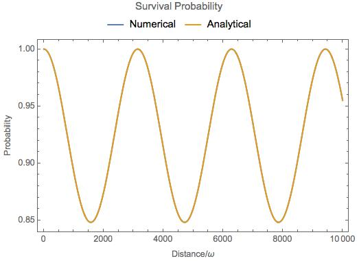

   Theoretical and numerical results overlap on all the range completely.

3 Flavor Oscillations
------------------------

The vacuum Hamiltonian in mass eigenstate basis is

.. math::
   \frac{1}{2E}\begin{pmatrix}
   m_1^2 & 0 & 0 \\
   0 & m_2^2 &  0\\
   0 & 0 & m_3^2
   \end{pmatrix}.

The trick to reduce the parameters is to subtract the :math:`\frac{m_1^2}{2E} \mathbf{I}` from Hamiltonian in mass eigenbasis.

.. math::
   &\mathbf{H}- \frac{m_1^2}{2E}\mathbf{I} \\
   =& \frac{1}{2E}\begin{pmatrix}
   m_1^2 & 0 & 0 \\
   0 & m_2^2 &  0\\
   0 & 0 & m_3^2
   \end{pmatrix} - \frac{m_1^2}{2E} \mathbf{I} \\
   =& \frac{1}{2E} \begin{pmatrix}
   0 & 0 & 0 \\
   0 & \Delta m_{12}^2 & 0 \\
   0 & 0 & \Delta m_{13}^2
   \end{pmatrix},

where

.. math::
   \Delta m_{12}^2 &= m_2^2 - m_1^2, \\
   \Delta m_{13}^2 &= m_3^2 - m_1^2, \\
   \Delta m_{23}^2 & = m_3^2 - m_2^2.

Then we define the vacuum Hamiltonian in mass eigenstate basis as

.. math::
   \mathbf{H_{vm}} = \frac{1}{2E} \begin{pmatrix}
   0 & 0 & 0 \\
   0 & \Delta m_{12}^2 & 0 \\
   0 & 0 & \Delta m_{13}^2
   \end{pmatrix}

To find out the representation of Hamiltonian in flavor basis, we need the PMNS matrix which transforms the mass eigenstates to flavor eigenstates,

.. math::
   \ket{\nu_\alpha}= \mathbf{U}\ket{\nu_i}.

In general the matrix is

.. math::
   \mathbf U = \begin{pmatrix}
   U_{11} & U_{12} & U_{13} \\
   U_{21} & U_{22} & U_{23} \\
   U_{31} & U_{32} & U_{33}
   \end{pmatrix},

with a constraint that it is unitary. To see the function of this matrix, we could use another set of indices,

.. math::
   \mathbf{U} = \begin{pmatrix}
   U_{e1} & U_{e2} & U_{e3} \\
   U_{\mu 1} & U_{\mu 2} & U_{\mu 3}\\
   U_{\tau 1} & U_{\tau 2} & U_{\tau 3}
   \end{pmatrix}.

This PMNS matrix is written as

.. math::
   \mathbf{U} = \left(
   \begin{array}{ccc}
    \cos \left(\theta _{12}\right) \cos \left(\theta _{13}\right) & \cos \left(\theta _{13}\right) \sin \left(\theta _{12}\right) & e^{-i \delta _{\text{CP}}} \sin \left(\theta _{13}\right) \\
    -\cos \left(\theta _{23}\right) \sin \left(\theta _{12}\right)-e^{i \delta _{\text{CP}}} \cos \left(\theta _{12}\right) \sin \left(\theta _{13}\right) \sin \left(\theta _{23}\right) & \cos \left(\theta _{12}\right) \cos \left(\theta _{23}\right)-e^{i \delta _{\text{CP}}} \sin \left(\theta _{12}\right) \sin \left(\theta _{13}\right) \sin \left(\theta _{23}\right) & \cos \left(\theta _{13}\right) \sin \left(\theta _{23}\right) \\
    \sin \left(\theta _{12}\right) \sin \left(\theta _{23}\right)-e^{i \delta _{\text{CP}}} \cos \left(\theta _{12}\right) \cos \left(\theta _{23}\right) \sin \left(\theta _{13}\right) & -e^{i \delta _{\text{CP}}} \cos \left(\theta _{23}\right) \sin \left(\theta _{12}\right) \sin \left(\theta _{13}\right)-\cos \left(\theta _{12}\right) \sin \left(\theta _{23}\right) & \cos \left(\theta _{13}\right) \cos \left(\theta _{23}\right) \\
   \end{array}
   \right).

which is a rotation for 3D with a CP violation phase :math:`\delta`. For simplicity, we first assume tis phase is 0. Then the matrix becomes,

.. math::
   \mathbf{U} = \left(
   \begin{array}{ccc}
    \cos \left(\theta _{12}\right) \cos \left(\theta _{13}\right) & \cos \left(\theta _{13}\right) \sin \left(\theta _{12}\right) & \sin \left(\theta _{13}\right) \\
    -\cos \left(\theta _{23}\right) \sin \left(\theta _{12}\right)-\cos \left(\theta _{12}\right) \sin \left(\theta _{13}\right) \sin \left(\theta _{23}\right) & \cos \left(\theta _{12}\right) \cos \left(\theta _{23}\right)-\sin \left(\theta _{12}\right) \sin \left(\theta _{13}\right) \sin \left(\theta _{23}\right) & \cos \left(\theta _{13}\right) \sin \left(\theta _{23}\right) \\
    \sin \left(\theta _{12}\right) \sin \left(\theta _{23}\right)-\cos \left(\theta _{12}\right) \cos \left(\theta _{23}\right) \sin \left(\theta _{13}\right) & -\cos \left(\theta _{23}\right) \sin \left(\theta _{12}\right) \sin \left(\theta _{13}\right)-\cos \left(\theta _{12}\right) \sin \left(\theta _{23}\right) & \cos \left(\theta _{13}\right) \cos \left(\theta _{23}\right) \\
   \end{array}
   \right).

The Hamiltonian in flavor basis is found by applying the transformation that

.. math::
   \mathbf{H} &= \mathbf{U} \mathbf{H_{vm}} \mathbf{U^{-1}}.

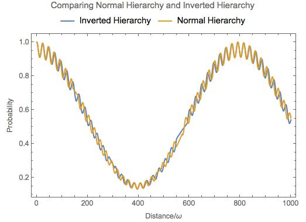

   Numerical results for vacuum oscillation 3 flavor case. The overall shapes are the same for NH and IH however they differ on small scales.

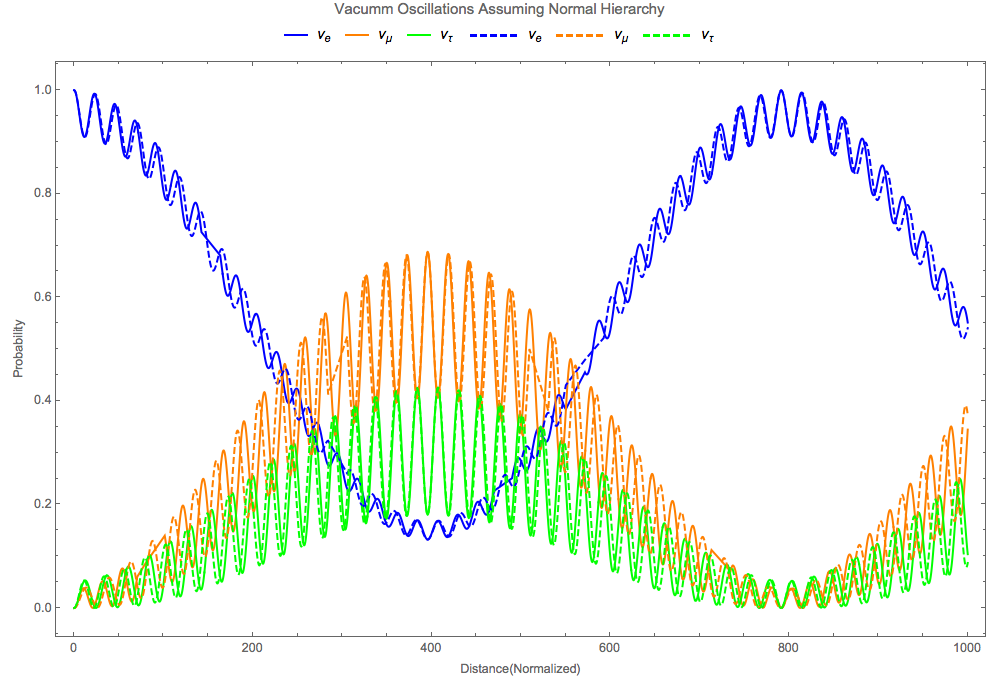

   Comparison of normal hierarchy and inverted hierarchy.The reason that they are almost the same is that the oscillation length for :math:`\Delta m_{13}^2` is small thus it only changes the oscillation patterns for the small oscillations. Vacuum energy scales in normal hierarchy are

   .. math::
      \omega_{12} &= \frac{\Delta m_{12}^2}{2E} = 3.8\times 10^{-20}\mathrm{GeV} \\
      \omega_{13} &= \frac{\Delta m_{13}^2}{2E} = 1.7\times 10^{-18}\mathrm{GeV} \\
      \omega_{23} &= \frac{\Delta m_{23}^2}{2E} \approx \omega_{13}

   which shows that basically only two scales and the larger one determines the small oscillation.

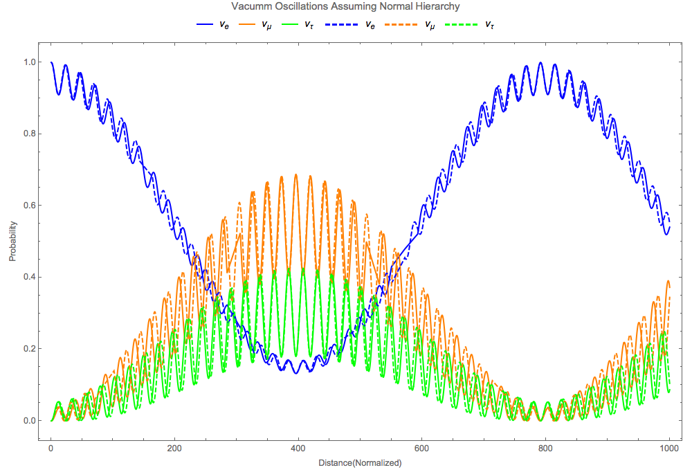

   Comparison of normal hierarchy and inverted hierarchy but with inverted :math:`\Delta m_{12}^2`.

Ternary Diagram
--------------------

Since the probability for differential flavors of neutrinos are summed to 1 and can be represented in barycentric coordinates, a ternary plot would be nice to understand what happens in the oscillations.

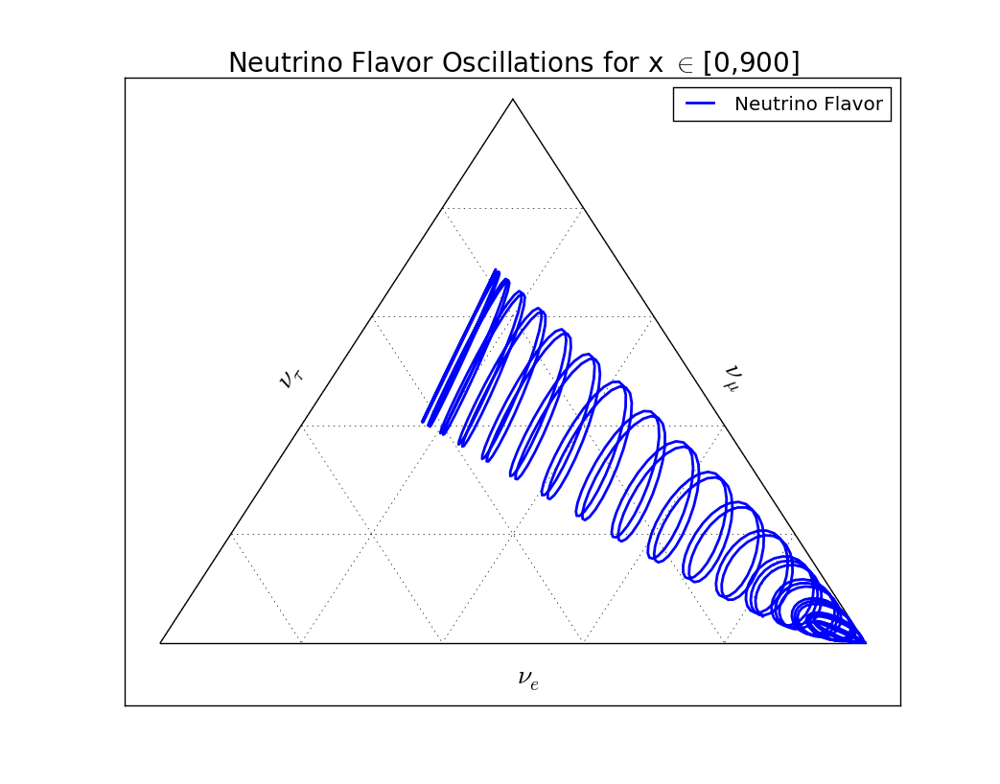

   Ternary diagram for vacuum oscillations. The state starts from bottom left, which means that the system has only electron neutrinos. As the neutrino travels, it oscillates in curves. After one period of the beat, it reaches the far end and then oscillates backwards.

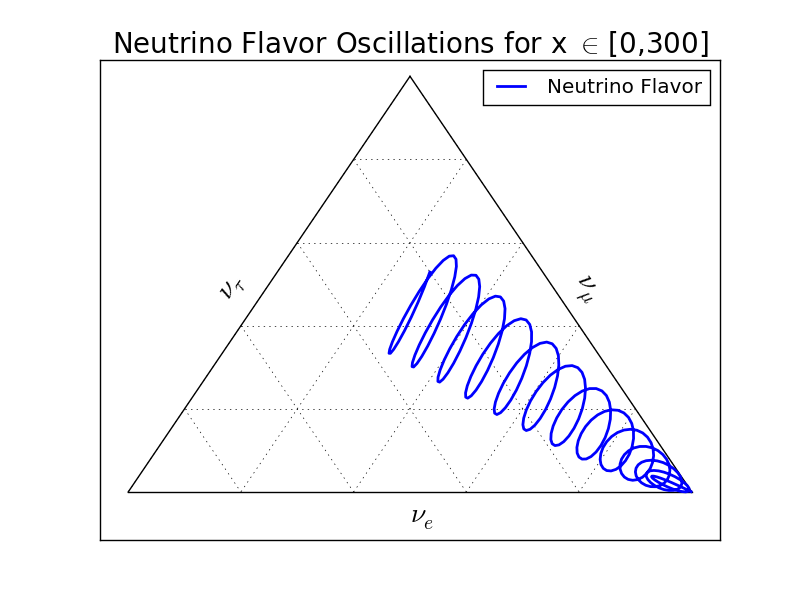

   Ternary diagram for less oscillation periods. The system starts from the right-bottom corner which is measured to be all electron neutrinos. The period of the spirals is from the energy scale that is related to a small length scale. The system spirals up then spirals back. This is a "period" that is governed by the energy scale that corresponds to a long length scale. Read qualitative method chapter for more about length scales.

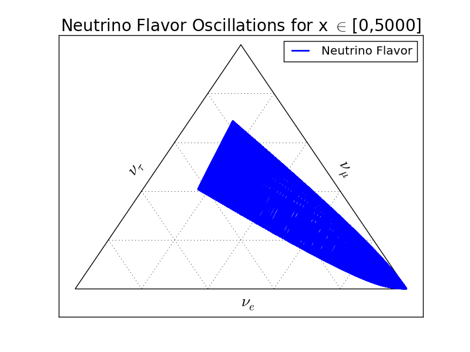

   Ternary diagram for more oscillation periods. It shows that the system doesn't really go back to the initial state after a "period". This is a three body problem anyway.

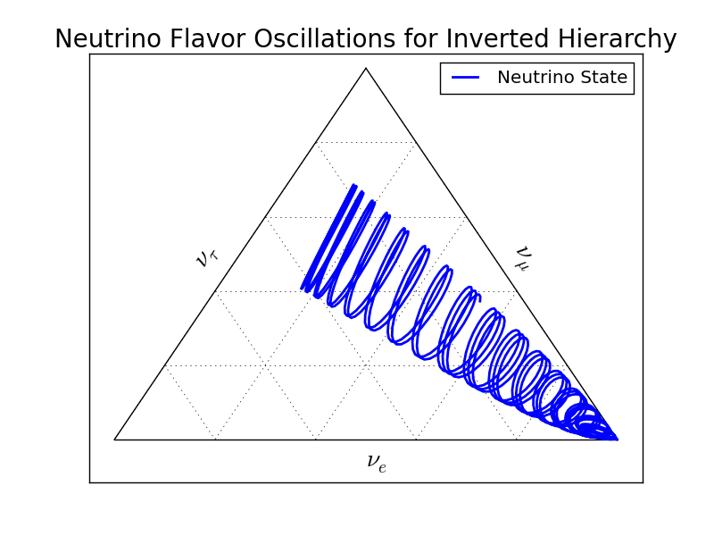

   Ternary diagram for inverted hierarchy. Inverted hierarchy means a period is inverted thus the spirals are in different directions.

Understanding the Mixing Angles
------------------------------------------------------

The mixing angles play important roles in the amplitude of the oscillations while the energy scales play a role in the periods.

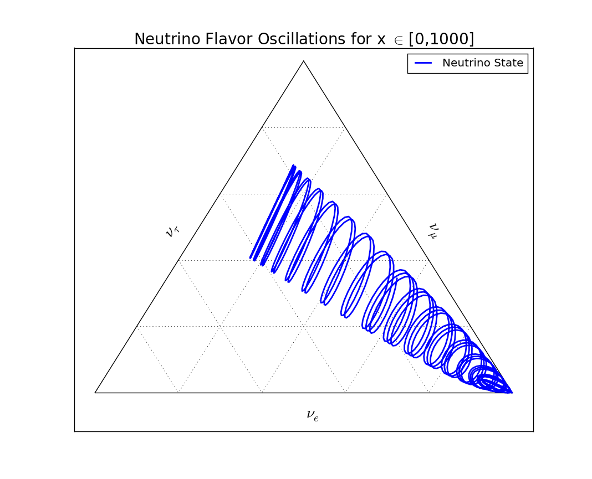

   Neutrino oscillations with the following parameters. This plot works as the base plot which will be compared with. The energy is scaled by a factor so that :math:`\frac{1}{4E}=100\mathrm{eV}`. (This scaling has no physical significance but rescales the period.)

   .. math::
      \theta_{12} &= 33.36/180*Pi; \\
      \theta_{13} &= 8.66/180*Pi; \\
      \theta_{23} &= 40/180*Pi;\\
      \delta_{CP} &= 0;\\
      m_1^2 &= 0.01;\\
      m_2^2 &= m1sq + 0.000079.

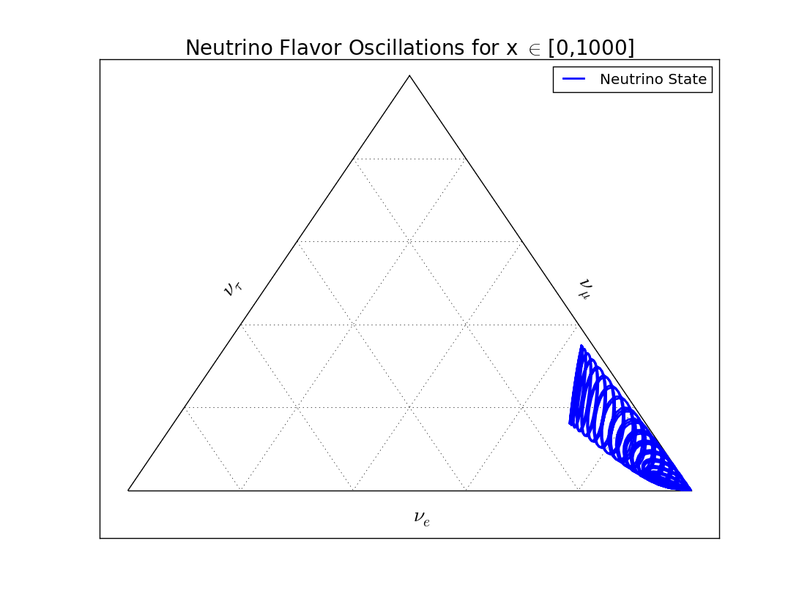

   Neutrino oscillations with :math:`\theta_{12}` reduced to half of the value in the base plot. It is clear that :math:`\theta_{12}` plays an imprtatn role in the long period of the oscillatioin. It also obvious that reducing :math:`\theta_{12}` tilts the system to less :math:`\nu_\tau` state.

   .. math::
      \theta_{12} &= 33.36/2* 180 * Pi; \\
      \theta_{13} &= 8.66/180*Pi; \\
      \theta_{23} &= 40/180*Pi;\\
      \delta_{CP} &= 0;\\
      m_1^2 &= 0.01;\\
      m_2^2 &= m1sq + 0.000079.

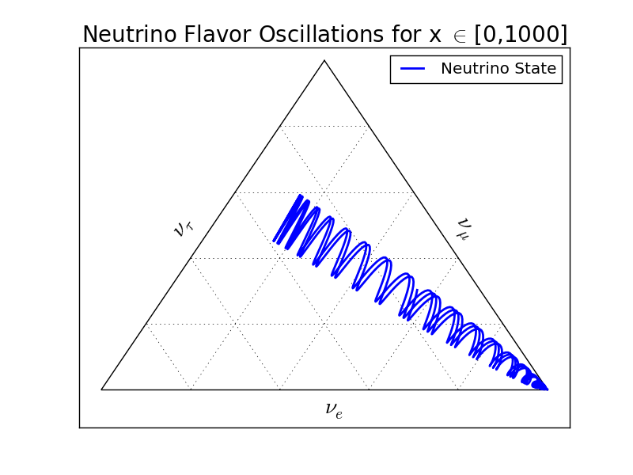

   Neutrino oscillations with :math:`\theta_{13}` reduced to half of the value in the base plot. Reducing :math:`\theta_{13}` shrinks the oscillation amplitude of the rapid oscillation.

   .. math::
      \theta_{12} &= 33.36/180*Pi; \\
      \theta_{13} &= 8.66/ 2* 180 *Pi; \\
      \theta_{23} &= 40/180*Pi;\\
      \delta_{CP} &= 0;\\
      m_1^2 &= 0.01;\\
      m_2^2 &= m1sq + 0.000079.

.. figure:: assets/vacuum/ternary/1000-4.png
   :align: center

   Neutrino oscillations with :math:`\theta_{23}` reduced to half of the value in the base plot. Reducing :math:`\theta_{23}` has a complicated effect on the oscillations. But it definitely tilts the system to less :math:`\nu_\tau` state. The suppression on the probability of :math:`\nu_\tau` is dramatic.

   .. math::
      \theta_{12} &= 33.36/180*Pi; \\
      \theta_{13} &= 8.66/ 180 *Pi; \\
      \theta_{23} &= 40/ 2* 180*Pi;\\
      \delta_{CP} &= 0;\\
      m_1^2 &= 0.01;\\
      m_2^2 &= m1sq + 0.000079.

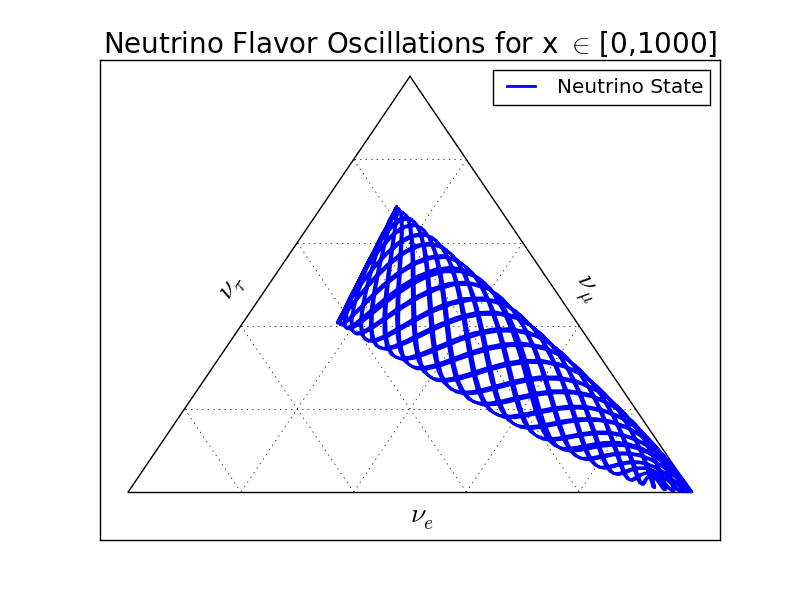

   Neutrino oscillations with :math:`\Delta m_{12}^2 = m_2^2- m_1^2` increased compared to the value in base plot. This changes the period of the rapid oscillation.

   .. math::
      \theta_{12} &= 33.36/180*Pi; \\
      \theta_{13} &= 8.66/180 *Pi; \\
      \theta_{23} &= 40/180*Pi;\\
      \delta_{CP} &= 0;\\
      m_1^2 &= 0.01;\\
      m_2^2 &= m1sq + 0.000079\times 10.

   Neutrino oscillation starts with initial state :math:`\Psi(x=0) = \nu_\mu`. The system starts from the top corner.

   .. math::
      \theta_{12} &= 33.36/180*Pi; \\
      \theta_{13} &= 8.66/180 *Pi; \\
      \theta_{23} &= 40/180*Pi;\\
      \delta_{CP} &= 0;\\
      m_1^2 &= 0.01;\\
      m_2^2 &= m1sq + 0.000079.

Refs and Notes
---------------------
