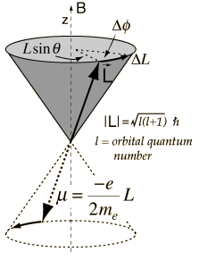
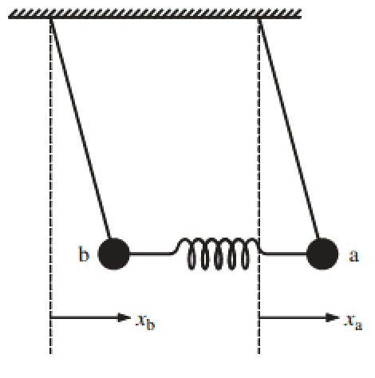
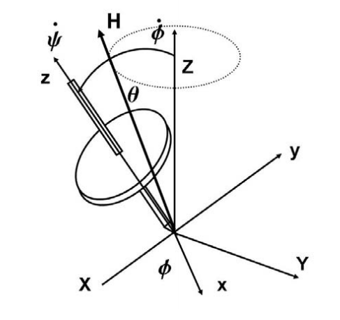
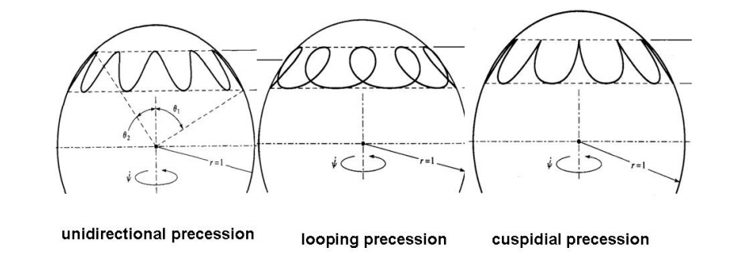

Some Useful Physics Pictures
=============================================


There are several pictures to visualize the oscillations of neutrinos.

.. index:: Magnetic Spin


Magnetic Spin
-----------------------------



   Image source: `Larmor Precession <http://hyperphysics.phy-astr.gsu.edu/hbase/magnetic/larmor.html>`_ .


Recall that torque of a magnetic spin in a magnetic field is calculated as

.. math::
   \vec \tau = \vec \mu \times \vec B,

while torque is by definition :math:`\vec \tau = \frac{d}{dt}\vec L`. So we have, for such a system, the equation of motion is

.. math::
   \frac{d}{dt}\vec L = \vec \mu \times \vec B.

In the case of electron quantum magnetic spin, :math:`\vec \mu` is proportional to the angular momentum :math:`\vec L`, i.e., :math:`\vec \mu = \frac{-e}{2m_e}\vec L\propto \vec L`.

So the equation of motion becomes

.. _magnetic-spin-angular-momentum-eom:

.. math::
   \frac{d}{dt}\vec L \propto \vec L \times \vec B.


.. admonition:: Equation of Motion for Neutrino Flavor Polarization Vector
   :class: note
   :name: EoM4NFPV

   That EoM is

   .. math::
      \frac{d}{dt} \vec P_\omega = (\omega \vec B + \lambda \vec L + \mu \vec D)\times \vec P_\omega ,

   where the quantities can be found in Duan, H., Fuller, G. & Qian, Y.-Z. Collective Neutrino Oscillations. *Annu. Rev. Nucl. Part. Sci.* **60**, 569–594 (2010).

   Now it is clear that the two system has very similar EoM.


Coupled Pendulum
------------------------




   Coupled pendulum


The equation of motion is

.. math::
   \begin{pmatrix}-\frac{d^2}{dt^2} - \left(\frac{g}{l}+\frac{k}{m}\right) & \frac{k}{m} \\ \frac{k}{m} & -\frac{d^2}{dt^2} - \left(\frac{g}{l}+\frac{k}{m}\right)\end{pmatrix} \begin{pmatrix} x \\ y \end{pmatrix} = \begin{pmatrix} 0 \\ 0 \end{pmatrix}

Using Fourier transform, we will get the solutions,

.. math::
   \begin{pmatrix} x \\ y \end{pmatrix} = \begin{pmatrix}1 \\ 1 \end{pmatrix}A_1 \cos(\omega_1 t + \phi_1) + \begin{pmatrix}1 \\ -1\end{pmatrix} A_2 \cos (\omega_2 t + \phi_2)


Recall that the state of neutrino after time :math:`t` is

.. math::
   \ket{\psi(t)} = A_1 \ket{\nu_1} e^{-i E_1 t} + A_2 \ket{\nu_2} e^{- i E_2 t},

where :math:`A_1` and :math:`A_2` are determined by initial condition. The real part of this, is exactly the same as the solution to coupled pendulum, where the physics is the transfer from one eigenstate to another.


Gyroscope or Spinning Top Picture
---------------------------------------------


A Classical Top
~~~~~~~~~~~~~~~~~~


The key concept of a classical gyroscope is the balance between gravity and angular momentum conservation, i.e., angular conservation in specific directions.


Angular momentum for a 3D rigid body with a axial symmetry in a :math:`\dot {\vec I}=0` frame is

.. math::
   \vec S \to \begin{pmatrix} I_0 \omega_x \\ I_0 \omega_y \\ I\omega_z \end{pmatrix}

The gyroscope should obey Euler's equations with extra Coriolis terms since we have decided to work in a rotation frame (:math:`\dot{\vec I}=0`), [1]_

.. math::
   M_x &= I_0 (\ddot \theta - \dot \phi^2\sin\theta \cos\theta) + I \dot \phi \sin\theta (\dot\phi\cos\theta + \dot \psi) \\
   M_y & =  I_0 (\ddot \phi \sin\theta + 2 \dot \phi \dot\theta \cos\theta) - I \dot \theta (\dot \phi \cos\theta + \dot \psi) \\
   M_z & = I (\ddot \psi + \ddot \phi \cos\theta - \dot\phi \dot \theta \sin\theta)

with the torque for a top being

.. math::
   M_x & = m g z_G \sin\theta \\
   M_y & = 0 \\
   M_z & = 0 .

.. note::
   :math:`\dot \psi` is the spin of the top itself. More generally, the Euler equation is

   .. math::
     \mathbf{I} \cdot \dot{\boldsymbol\omega} + \boldsymbol\omega \times \left( \mathbf{I} \cdot \boldsymbol\omega \right) = \mathbf{M}.


Steady Precession
```````````````````````````

A steady precession maintains the angle :math:`\theta`.



   Gyroscope steady precession


Now we have :math:`\dot \theta =0` so the Euler's equations reduces to,

.. math::
   \dot \phi  (I (\dot \phi \cos\theta +\dot \psi) - I_0\dot\phi \cos\theta) = M_x \equiv mg z_G


For a steady state usually we can use this approximation :math:`\dot \psi \gg \dot\phi`.

.. math::
   \dot\phi = \frac{m g z_G }{I\dot\psi} .

Now define :math:`\Omega  = \dot \phi` and :math:`\omega = \dot \psi`. Our approximation becomes :math:`\omega \gg \Omega`.


Unsteady Precession
`````````````````````````````````````



   Spin tops


Polarization Vector
-------------------------------

Polarization (for a two state system) is the difference of the probabilities of finding the system in the two difference normal states (spin up and spin down for example).


Density Matrix
~~~~~~~~~~~~~~~~~~~~

For a two-state system, an example of density matrix is

.. math::
   \hat \rho = W_1 \ket{\psi_a}\bra{\psi_a} + W_2 \ket{\psi_b}\bra{\psi_b}.

When :math:`\{ \ket{\psi_a}, \ket{\psi_b} \}` basis is chosen, density matrix can be written as a matrix,

.. math::
   \mathbf \rho = \begin{pmatrix} W_1 & 0 \\ 0 & W_2 \end{pmatrix},

in which the two constants are the probability to find the system in each states respectively and they are called the population.

Rewrite the density matrix with Pauli matrices and identity,

.. math::
   \mathbf \rho = \frac{1}{2} ( \mathbf I + \vec{\mathbf \sigma} \vec P ).


.. note::
   The reason we have a :math:`\frac{1}{2}` is that by definition polarization vector is

   .. math::
      \mathbf \rho &= a_0 \mathbf I + \mathbf {\sigma_x} a_x +  \mathbf {\sigma_y} a_y +  \mathbf {\sigma_z} a_z \\
      & = a_0 \mathbf I + \vec a \vec{\mathbf \sigma}.

   However, trace of density matrix should be 1, which means :math:`\mathrm{Tr} \mathbf \rho = a_0 2 =1` and we can find :math:`a_0=\frac{1}{2}` noting that :math:`\mathrm {Tr}\mathbf \sigma_i = 0`.


The important fact is that the values of polarization depends on the choice of basis.

More physical meanings can be obtained by chosing a good basis so that the density matrix is diagonalised by expressing it with components of polarization. [3]_


Polarization, as the name indicates, should equal to

.. math::
   P = W_1 - W_2

when it is aligned with z direction of Pauli matrices. Polarization vector is not a vector in real space but a vector of an imagined space.


.. admonition:: Take Out The Components
   :class: note

   How to project out the components of polarization vector? By multiplying on both sides the Pauli matrices.

   Note that for Pauli matrices

   .. math::
      \sigma_i \sigma_j = \epsilon_{ijk}\sigma_k + \delta_{ij}\mathbf I.

   Multiplying by :math:`\sigma_j` on both sides of :math:`\rho =  \frac 1 2(\mathbf I+\vec P \cdot\vec \sigma)`, we get

   .. math::
      \rho \sigma_j  = \frac 1 2(\mathbf I+\vec P \cdot\vec \sigma)\sigma_k.

   Apply the sigma algebra we discussed there, the result of this is

   .. math::
      \rho \sigma_j = \frac{1}{2}(\sigma_k + P_i \sigma_i \sigma_j) \\
      2 \rho \sigma_j - \sigma_k &= P_i (\epsilon_{ijk}\sigma_k + \delta_{ij}\mathbf I)

   We know that the trace of any Pauli matrix is zero. Take the trace of the equation,

   .. math::
      \mathrm{Tr}\sigma_j =  P_j.

   All done.


Neutrino-neutrino Interaction and BCS Theory
-------------------------------------------------------------

.. admonition:: BCS
   :class: note

   BCS Hamiltonian is

   .. math::
      \hat H_{BCS} = \sum_k 2 \epsilon_k \hat t_k^0- \lvert G\rvert \hat T^\dagger \hat T

Neutrino self interaction Hamiltonian is

.. math::
   \hat H = \sum_p \frac{\delta^2m}{2p}\hat B\cdot \vec J_\rho | \frac{\sqrt{2}G_F}{V}\vec J\cdot \vec J.


.. [1] Read Carl's lecture notes of *Classical Mechanics* for this derivation.
.. [2] Refer to `Top <http://ocw.mit.edu/courses/aeronautics-and-astronautics/16-07-dynamics-fall-2009/lecture-notes/MIT16_07F09_Lec30.pdf>`_ .
.. [3] Read quantum statistics book if more is needed.
