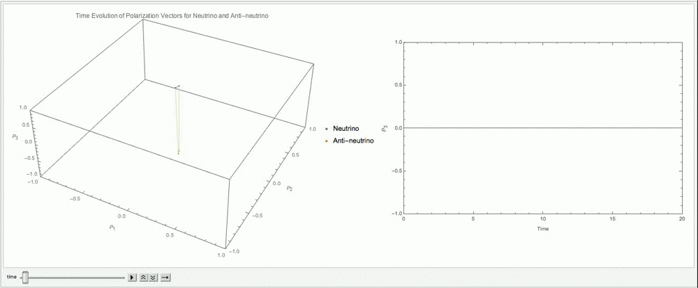
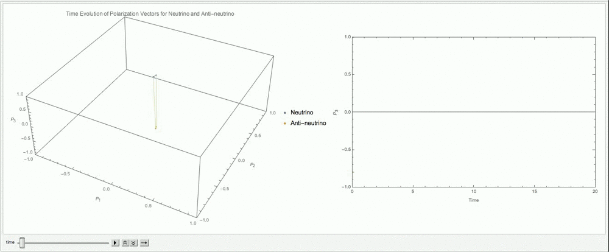
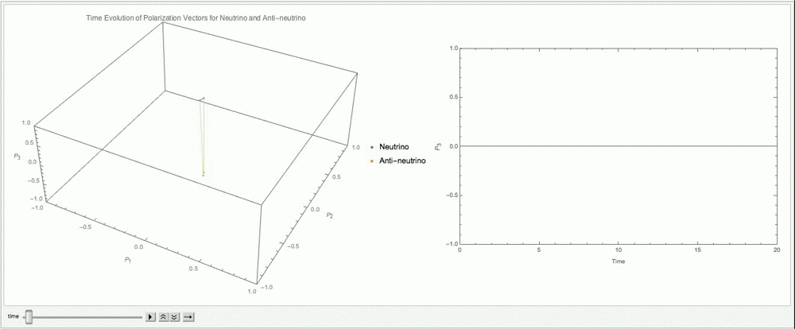
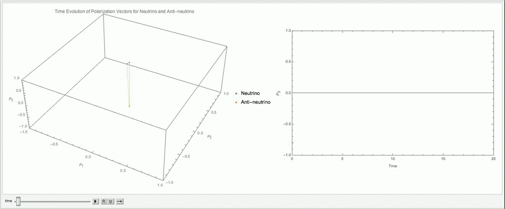

Flavor Isospin
======================================

.. admonition:: Notations
   :class: warning

   In this part we use bold symbols for vectors because the subscript with a over arrow is too ugly to read.

.. admonition:: Quaternion
   :class: note

   This is basically a quaternion form of neutrino oscillations.

The Hamiltonian in flavor basis with matter interaction for neutrino is

.. math::
   H = \frac{1}{2} ( {\color{red}\lambda} - \omega_v \cos 2\theta_v ) \sigma_3 + \frac{1}{2} \omega_v \sin 2\theta_v \sigma_1  + H_{\nu\nu},

where :math:`\omega_v = \frac{\Delta m^2}{2E}`, :math:`\lambda=\sqrt{2}G_F n_e` is the matter profile, and :math:`H_{\nu\nu}` is the neutrino-neutrino interaction. This Hamiltonian can be written in a way that the physics is clearer,

.. math::
   H = H_v + H_m + H_{\nu\nu},

where

.. math::
   H_v &= \frac{1}{2} ( -\omega_v \cos 2\theta_v \sigma_3 + \omega_v \sin 2\theta_v \sigma_1 ) \\
   H_m &= \frac{1}{2} \lambda \sigma_3 \\
   H_{\nu\nu} &=\sqrt{2}G_F \int\mathrm{d}^3 \mathbf{p}' ( 1 - \hat{\mathbf{p}}\cdot \hat{\mathbf{p}}' ) (\rho_{\mathbf{p}'} - \bar\rho_{ \mathbf{p}' }),

where :math:`\rho`'s are the density matrices for neutrinos and :math:`\bar\rho`'s are the density matrix for antineutrinos, and :math:`\hat{\mathbf{p}} = \frac{\vec p}{E}`. As descretization is used in numerical calculation, another form of the self-interaction is useful,

.. math::
   H_{\nu\nu}(t,\mathbf p, E) = \sqrt{2}G_F \sum_{\mathbf p} ( 1- \hat{\mathbf{p}}\cdot \hat{\mathbf{p}}' ) ( \rho_{\mathbf p'}(t) - \bar \rho^*_{\mathbf p'}(t) ).

For antineutrino, the Hamiltonian it obeys is

.. math::
   \bar H = H_v - H_m - H^*_{\nu\nu}.

With the Hamiltonian, the equation of motion for neutrinos is simply

.. math::
   i \frac{d}{dt} \rho = \left[ H, \rho \right].

.. _neutrino-flavor-isospin:

Neutrino Flavour Isospin
---------------------------------

.. admonition:: Mathematical Reason
   :class: hint

   The reason behind this isospin for neutrino flavors is that Pauli matrices plus identity form a complete basis for all 2 by 2 matrices.

Neutrino flavour isospin [duan2006]_

.. math::
   \mathbf s = \Psi^{\dagger} \frac{\boldsymbol\sigma}{2} \Psi,

where in flavor basis

.. math::
   \Psi = \begin{pmatrix} \psi_e \\ \psi_x \end{pmatrix}.

.. admonition:: Why the 1/2
   :class: hint

   The reason to choose have 1/2 in the definition of flavor isospin :math:`\mathbf s = \Psi^{\dagger} \frac{\boldsymbol\sigma}{2} \Psi` is to make sure the length of the vector is 1/2, just like spin 1/2.

Another way of looking at this relation is that the density matrix for single particle can be writen in terms of polarization :math:`\mathbf P`,

.. math::
   \rho = \frac{1}{2} ( 1 +  \boldsymbol{\sigma} \cdot \mathbf P ).

.. admonition:: Relation to Wave Function
   :class: note

   The density matrix is defined as

   .. math::
      \rho = \Psi \Psi^\dagger,

   which can be combined with the definition of polarization, so that

   .. math::
      \Psi \Psi^\dagger = \frac{1}{2} ( 1 +  \boldsymbol{\sigma} \cdot \mathbf P ).

   Plug in the Pauli matrices, we have

   .. math::
      \begin{pmatrix}
      \psi_e^*\psi_2 & \psi_e\psi_x^* \\
      \psi_x\psi_e^* & \psi_x^*\psi_x
      \end{pmatrix} = \frac{1}{2}\left(
      \begin{pmatrix}
      1 & 0 \\
      0 & 1
      \end{pmatrix} + P_1\sigma_1 + P_2\sigma_2 + P_3 \sigma_3
      \right),

   which is equivalent to four equations

   .. math::
      1 + P_3 &= 2\psi_e^*\psi_e \\
      1 - P_3 &= 2\psi_x^*\psi_x \\
      P_1 - i P_2 & = 2 \psi_e \psi_x^* \\
      P_1 + i P_2 & = 2 \psi_e^* \psi_x ,

   together with the normalization

   .. math::
      \psi_e^*\psi_e + \psi_x^*\psi_x = 1,

   we can solve the polarization vector,

   .. math::
      \vec P = \begin{pmatrix}
      \psi_e^* \psi_x + \psi_e \psi_x^* \\
      -i(\psi_e^* \psi_x - \psi_e \psi_x^*) \\
      \psi_e^* \psi_e - \psi_x^* \psi_x
      \end{pmatrix} = \begin{pmatrix}
      \psi_e^* \psi_x + (\psi_e^* \psi_x)^* \\
      -i(\psi_e^* \psi_x - (\psi_e^* \psi_x)^*) \\
      \lvert\psi_e\rvert^2 - \lvert \psi_x \rvert^2
      \end{pmatrix} = \begin{pmatrix}
      2\mathrm{Re}\left(\psi_e^* \psi_x \right) \\
      -2 i(\psi_e^* \psi_x - (\psi_e^* \psi_x)^*) \\
      \lvert\psi_e\rvert^2 - \lvert \psi_x \rvert^2
      \end{pmatrix} = \begin{pmatrix}
      2\mathrm{Re}\left(\psi_e^* \psi_x \right) \\
      2 \mathrm{Im}(\psi_e^* \psi_x ) \\
      \lvert\psi_e\rvert^2 - \lvert \psi_x \rvert^2
      \end{pmatrix}

As for a system of multiple particles, we can always extract the information of particle number density :math:`n` out of density matrix,

.. math::
   \rho &= n_\nu \frac{1}{2} \left( 1 +  \boldsymbol{\sigma} \cdot \mathbf P  \right) \\
   &= \frac{n_\nu}{2} + n_\nu \boldsymbol{\sigma} \cdot \frac{ \mathbf P}{2} \\
   & \equiv  \frac{n_\nu}{2} + n_\nu' \boldsymbol{\sigma} \cdot \mathbf{s},
   :label: density-matrix-flavor-isospin

where :math:`\mathbf{s}` is the so called flavor isospin and will be defined later, and :math:`n_\nu'` is effective neutrino density distribution. In the case of vacuum oscillation of homogeneous systems, :math:`n_\nu'=n_\nu` and :math:`\mathbf s = \mathbf P /2`.

.. admonition:: What is Effective Neutrino Density Distribution
   :class: warning

   JUST A GUESS AT THIS MOMENT:

   However, in more complicated systems such as systems with inhomogeneous angular distribution of neutrinos, the angular distribution should be taken into account.

We also find the component of Hamiltonian in :math:`\{ I, \sigma_1,\sigma_2,\sigma_3 \}` basis. However, in this specific problem, we only need :math:`\{\sigma_1,\sigma_2,\sigma_3 \}` since we already removed the identity from Hamiltonian. With this convention, we define the Hamiltonian vector :math:`\vec H` using

.. math::
   H = -\frac{\boldsymbol{\sigma} }{2}\cdot \mathbf H.

.. admonition:: Why 1/2 and Minus
   :class: hint

   The 1/2 in the definition is to make sure the final equation of motion is clean as :eq:`neutrino-flavor-isospin-equation-of-motion-general`. **Without this 1/2, we would have**

   .. math::
      \frac{d}{dx} \mathbf s = \frac{1}{2}\mathbf s \times \mathbf H,

   which is **NOT** good enough compared to the one we would have with the 1/2.

   The minus sign is to revert the whole system so that it is easier to deal with, such as :numref:`flavor-isospin-graphics-vacuum-only`. **Without this minus sign**, for normal hierarchy of :math:`\delta m_{12}` and neutrinos, we would have the vacuum Hamiltonian vector almost pointing downward and the matter effect pointing upward, which are not so convinient.

In order to have a look at the effect of different components, we also define :math:`\mathbf H_{v}` and :math:`\mathbf H_m`,

.. math::
   H_v &= - \frac{\boldsymbol{\sigma}}{2} \cdot \mathbf H_v \\
   H_m &= - \frac{\boldsymbol{\sigma} }{2} \cdot \mathbf H_m.

Note the equation of motion becomes

.. math::
   \frac{d}{dx} \mathbf s = \mathbf s \times \mathbf H.
   :label: neutrino-flavor-isospin-equation-of-motion-general

.. admonition:: Deriving Equation of Flavor Isospin
   :class: note

   Here in this formalism we just plugin to compare with the original equation of motion.

   However, a more systematic and rigorous method is given in [duan2006]_ . What's different here is that the author used the definition :math:`H_v = - \omega_v \frac{\boldsymbol{\sigma}}{2} \cdot \mathbf H` which means :math:`\mathbf H` in that paper is normalized but here we do not do that.

   Nonethless, EoM for flavor isospin can be derived using brute force. As a first step, we write down the equation of motion for density matrix,

   .. math::
      i \frac{d}{dt}\rho = [H,\rho].

   Using :eq:`density-matrix-flavor-isospin`, we rewrite the equation using flavor isospin

   .. math::
      i\frac{d}{dt} \left( \frac{n_\nu}{2} + n_\nu' \boldsymbol \sigma \cdot \mathbf s \right) = [H, \frac{n_\nu}{2} + n_\nu' \boldsymbol \sigma \cdot \mathbf s].

   We assume that number densities :math:`n_\nu` and :math:`n_\nu'` are conserved,

   .. math::
      i n_\nu' \mathbf \sigma \cdot \frac{d}{dt} \mathbf s = -\left(\frac{\boldsymbol \sigma}{2} \cdot \mathbf H \right) \left(  n_\nu' \boldsymbol \sigma \cdot \mathbf s \right) + \left(  n_\nu' \boldsymbol \sigma \cdot \mathbf s \right)\left(\frac{\boldsymbol \sigma}{2} \cdot \mathbf H \right) ,

   where :math:`n_\nu'` can be eliminated on both sides. To simplify the equation, we write down the component form of the dot products,

   .. math::
      i \boldsymbol \sigma_k \frac{d}{dt} \mathbf s_k &= \frac{1}{2} \left(  \boldsymbol \sigma_i \mathbf s_i \boldsymbol \sigma_j \mathbf H_j - \boldsymbol \sigma_i  \mathbf H_i \boldsymbol \sigma_j \mathbf s_j  \right) \\
      i \boldsymbol \sigma_k \frac{d}{dt} \mathbf s_k &= \frac{1}{2} \left(  \boldsymbol \sigma_i  \boldsymbol \sigma_j \mathbf s_i \mathbf H_j - \boldsymbol \sigma_i  \boldsymbol \sigma_j \mathbf H_i \mathbf s_j  \right).

   The products of Pauli matrices is calculated in the following way

   .. math::
      \boldsymbol \sigma_i  \boldsymbol \sigma_j = i \epsilon_{ijk} \boldsymbol \sigma_k + \delta_{ij} I,

   which lead to a simplified equation of motion

   .. math::
      i \boldsymbol \sigma_k \frac{d}{dt} \mathbf s_k &= \frac{1}{2} \left(  i\epsilon_{ijk}  \boldsymbol \sigma_k \mathbf s_i \mathbf H_j - i\epsilon_{ijk} \boldsymbol \sigma_k \mathbf H_i \mathbf s_j  \right) + \frac{1}{2}\left( \delta_{ij}I \mathbf s_i \mathbf H_j - \delta_{ij}I \mathbf s_j \mathbf H_i \right) \\
      i \boldsymbol \sigma_k \frac{d}{dt} \mathbf s_k &= i\boldsymbol \sigma_k \frac{1}{2} \left(  \epsilon_{ijk}   \mathbf s_i \mathbf H_j - \epsilon_{ijk}  \mathbf H_i \mathbf s_j  \right) \\
      \frac{d}{dt} \mathbf s_k &= \epsilon_{ijk}   \mathbf s_i \mathbf H_j,

   where the permutation property :math:`\epsilon_{jik} = - \epsilon_{ijk}` has been used. In the language of cross product, we have

   .. math::
      \frac{d}{dt}\mathbf s = \mathbf s\times \mathbf H.

.. admonition:: Analogies and Pictures
   :class: hint

   Previously we have already seen the equations for a spinning in magnetic field (:any:`magnetic-spin-angular-momentum-eom`),

   .. math::
      \frac{d}{dt}\mathbf L = \gamma \mathbf L \times \mathbf B,

   where :math:`\gamma = \frac{-e}{2m_e}`.

   Another interesting analogy comes from the equation of motion for a spinning top

   .. math::
      \frac{d}{dt}\mathbf S  =  \frac{\partial}{\partial t} \mathbf S  - \mathbf S \times \mathbf \Omega,

   where :math:`\vec\Omega = \vec n \dot\phi`. Consider conservation of momentum, we have

   .. math::
      \frac{\partial}{\partial t} \mathbf S  = \mathbf S \times \mathbf \Omega,

   which is similar to the neutrino isospin equation of motion. :math:`\mathbf \Omega` corresponds to :math:`\mathbf H`.

Graphical Representation of Flavor Isospin
------------------------------------------------------

To have more understanding in the flavor isospin picture, we prefer to visualize it by putting up a 3-dimensional coordinate system. As a first step, we need to know what does a vector mean in such a system.

.. admonition:: Why 3D Coordinate System
   :class: note

   In principle we need a 4D coordinate system. However, the component of identity of the Hamiltonian doesn't play a role here. Thus only the three component of Pauli matrices are needed.

.. figure:: assets/flavor-isospin/isospin-space.png
   :align: center

   Isospin space. :download:`Geogebra file  <assets/flavor-isospin/isospin-space.ggb>`.

First of all, we need to understand the component of flavor isospin projected on the black vertical axis. Apply the definition of flavor iosospin we can calculate the z component of it

.. math::
   \mathbf s_z = \frac{1}{2}\Psi^\dagger \sigma_3 \Psi = \frac{1}{2} \lvert \psi_e \rvert ^2 - \lvert \psi_x \rvert^2,

which means the difference between electron flaor and the other flavor. Thus on this axis, +1/2 means all electron flavor, while -1/2 means all the other flavor.

Vacuum Oscillation
~~~~~~~~~~~~~~~~~~~~~~~~~~~~~~~~~~~~~

.. admonition:: Basis
   :class: warning

   Since we are talking about vectors and matrices, basis is always the concern.

   In the following discussion, we use flavor basis since flavor isospin is the name of the vector we are interested in, even though this formalism can be done in any basis.

Vacuum oscillation equation of motion is

.. math::
   \frac{d}{dt}\mathbf s = \mathbf{s}\times \mathbf H_v,

where in flavor basis the components of :math:`\mathbf H_v` is

.. math::
   \mathbf H_v = \begin{pmatrix} -\omega_v\sin 2\theta_v \\ 0 \\ \omega_v\cos 2\theta_v   \end{pmatrix}

Let's start from electron flavor. If mixing angle is zero, the Hamiltonian vector will be on z axis and is aligned with initial state of flavor isospin. Recall the equation of motion is procession-like, thus :math:`\frac{d}{dt}\mathbf s= \mathbf{s}\times \mathbf H_v = \boldsymbol 0` and no flavor oscilltion or flavor mixing happens.

.. figure:: assets/flavor-isospin/zero-mixing-angle-isospin-graph.png
   :align: center

   Flavor isospin vector when mixing angle is zero. :download:`Geogebra file  <assets/flavor-isospin/zero-mixing-angle-isospin-graph.ggb>`.

.. admonition:: Different Initial Condition
   :class: hint

   Even with initial condition that is not on z axis, since procession will be along this Hamiltonian which is on z axis (where we assumed that the mixing angle is zero), and flavor content (which is determined by the projection on z axis) won't change.

Alternative, we can look at another limit, which is :math:`\theta_v = \frac{\pi}{4}`. The precession will be around x axis, thus the projection of flavor isospin vector will be oscillating from 1/2 (all electron flavor) to 0 (equal flavor content) then to -1/2 (all the other flavor) and back. In this case, the mixing should be maximium, i.e., the flavor conversion should be complete at some point.

.. _pi-over-four-mixing-angle-isospin-graph:

.. figure:: assets/flavor-isospin/pi-over-four-mixing-angle-isospin-graph.png
   :align: center

   Maximium conversion of initial electron flavor. The oscillation is between a up right state (electron flavor) and a down state (the other flavor). :download:`Geogebra file  <assets/flavor-isospin/pi-over-four-mixing-angle-isospin-graph.ggb>`.

In general we can graphically represent any oscillations of flavor isospin using such graph, as shown in :numref:`flavor-isospin-graphics-vacuum-only`.

.. _flavor-isospin-graphics-vacuum-only:

.. figure:: assets/flavor-isospin/flavor-isospin-graphics-vacuum-only.png
   :align: center

   Graphical representation of vacuum Hamiltonian.

Oscillations in Matter
~~~~~~~~~~~~~~~~~~~~~~~~~~~~~~~~~~~~~~~~~~~~

Vacuum is easy to understand, so is neutrino oscillations in constant matter potential. We could always define new mixing angles :math:`\theta_m` in matter and effective angular frequency :math:`\omega_m` so that the Hamiltonian with constant matter potential becomes

.. math::
   H = \frac{\omega_m}{2} \cos 2\theta_m \sigma_3 + \frac{\omega_m}{2} \sin 2\theta_m \sigma_1,

which has exactly the same form as vacuum Hamiltonian. So we expect the constant matter potential oscillation graph to be exactly the same as vacuum oscillation, but with different effective mixing angles.

As for changing matter potential, we can only analyze a few cases. More can be analyzed if we also plot out the components of Hamiltonian, as in :numref:`oscillation-isospin-graph-msw`.

.. admonition:: Equation of Motion
   :class: hint

   The equation of motion is

   .. math::
      \frac{d}{dt} \mathbf s = \mathbf s\times ( \mathbf H_v + \mathbf H_m ),

   where in flavor basis

   .. math::
      \mathbf H_v &= \begin{pmatrix} \omega_v\sin 2\theta_v \\ 0 \\ -\omega_v\cos 2\theta_v   \end{pmatrix} \\
      \mathbf H_m & = \begin{pmatrix} 0 \\ 0 \\ -\lambda \end{pmatrix}.

   When translated to the graph, :math:`\mathbf H_m` is a vector pointing downward.

.. _oscillation-isospin-graph-msw:

.. figure:: assets/flavor-isospin/oscillation-isospin-graph-msw.png
   :align: center

   Neutrino oscillations in matter, with Hamiltonian vector :math:`\vec H`.  :download:`Geogebra file  <assets/flavor-isospin/oscillation-isospin-graph-msw.ggb>`.

For very small matter density and very large matter density, we have vacuum oscillation dominition and matter dominition, :numref:`oscillation-isospin-graph-msw-change`.

.. _oscillation-isospin-graph-msw-change:

.. figure:: assets/flavor-isospin/oscillation-isospin-graph-msw-change.png
   :align: center

   Neutrino oscillations for (a) very small matter density and (b) very large matter density. :download:`Geogebra file  <assets/flavor-isospin/oscillation-isospin-graph-msw-change.ggb>`.

Now imagine a slow adiabatic process from :numref:`oscillation-isospin-graph-msw-change` (a) to (b). At first, the oscillation is almost around vacuum Hamiltonian vector. As matter becomes dense, the matter Hamiltonian vector becomes dominating, which flips the oscillation axis. Somewhere in between, we would have a Hamiltonian vector which points horizontally, almost like :numref:`pi-over-four-mixing-angle-isospin-graph`. This is where the MSW resonance (maximium flavor conversion) happens.

Oscillations with Self-interactions
--------------------------------------

Bipolar
~~~~~~~~~~~~~~~~~~~~~~~~~~~~~~~~~~~~~

The equation of motion in terms of flavor isospins is

.. math::
   \dot{\mathbf P} &= \omega \mathbf B \times \mathbf P - \mu  \bar{ \mathbf{ P} } \times \mathbf P \\
   \dot { \bar{ \mathbf{ P} } } &= -\omega \mathbf B \times \bar{ \mathbf{ P} } + \mu \mathbf{P} \times \bar{ \mathbf{ P} },
   :label: eqn-nfis-eom-no-matter-self-interaction

where :math:`\mathbf B = (\sin 2\theta_v,0,\cos 2\theta_v)` for normal hierarchy.

Suppose we start from the two vectors in the same direction :math:`\mathbf P\to (0,0,1)` and  :math:`\bar{\mathbf P}\to (0,0,1)`. To have a better visualization, we plot out :math:`\mathbf P` and :math:`-\bar{\mathbf P}`.

.. _fig-matter-gyro-pendulum-20-alpha-1-lambda-0-slow:

   With :math:`\alpha=1`, :math:`\lambda=0`, :math:`\mu=3\omega`.

However, :math:`\alpha` is not necessarily 1. The ensemble could start from other initial states such as :math:`\alpha=0.8` as shown in :numref:`fig-matter-gyro-pendulum-20-alpha-0.8-lambda-0-slow`.

.. _fig-matter-gyro-pendulum-20-alpha-0.8-lambda-0-slow:

   With :math:`\alpha=0.8`, :math:`\lambda=0`, :math:`\mu=3\omega`.

.. admonition:: The Name Bipolar
   :class: warning

   The name "Bipolar" doesn't seem to be actually describe the behavior the the two NFIS's. In the two examples we have shown, The two vectors are **not** opposite to each other all the time, even they started as such bipolar initial condition. That being said, the angle between the two NFIS's change with time. It can be proven by looking at :math:`\frac{d(\mathbf P \cdot \bar{\mathbf P})}{dt}` using equation of motion.

Bipolar With Matter
~~~~~~~~~~~~~~~~~~~~~~~~~~~~~~~~~~~~

We can introduce matter interaction to the problem :eq:`eqn-nfis-eom-no-matter-self-interaction`. The new equation of motion becomes

.. math::
   \dot{\mathbf P} &= (\omega \mathbf B + \lambda \mathbf \Lambda) \times \mathbf P - \mu  \bar{ \mathbf{ P} } \times \mathbf P \\
   \dot { \bar{ \mathbf{ P} } } &= (-\omega \mathbf B + \lambda \mathbf \Lambda )\times \bar{ \mathbf{ P} } + \mu \mathbf{P} \times \bar{ \mathbf{ P} },
   :label: eqn-nfis-eom-with-matter-self-interaction

where :math:`\mathbf \Lambda = (0,0,-1)`.

We choose a particular matter potential :math:`\lambda =\cos 2\theta_v` so that it cancels the corresponding vacuum Hamiltonian diagonal elements.

   With :math:`\alpha=1`, :math:`\lambda=\cos 2\theta_v`, :math:`\mu=3\omega`.

   With :math:`\alpha=0.8`, :math:`\lambda=\cos 2\theta_v`, :math:`\mu=3\omega`.

.. admonition:: Simplified Case with Matter
   :class: note

   We consider a special case where matter cancels the vacuum Hamiltonian, which requres :math:`\sin 2\theta_v \to 0` and :math:`\lambda \sim \omega`. The equaion of motion becomes

   .. math::
      \dot{\mathbf P } &= \mu \mathbf P \times \bar{\mathbf P} \\
      \dot{\bar{\mathbf P} } &= \mu \left( 2 \mathbf H_m/\mu + \mathbf P  \right) \times \bar{\mathbf P}.

   This special case can not be reduced to the actual gyroscopic pendulum equation. (? I tried but not successful.)

   .. figure:: assets/flavor-isospin/flavor-isospin-selfinteractions.png
      :align: center

      The combined oscillations of neutrinos :math:`\matbbf P` and antineutrinos :math:`\bar {\mathbf P}`.

Refs & Notes
----------------------

.. [duan2006] Duan, H., Fuller, G. M., & Qian, Y.-Z. (2006). `Collective neutrino flavor transformation in supernovae <http://journals.aps.org/prd/abstract/10.1103/PhysRevD.74.123004>`_ Physical Review D, 74(12), 1–16. http://doi.org/10.1103/PhysRevD.74.123004
