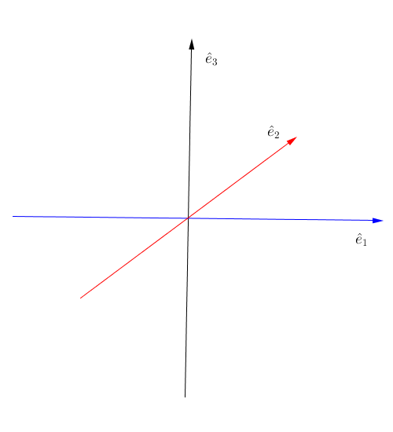
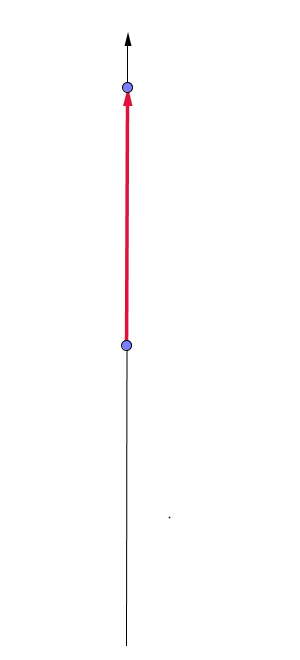
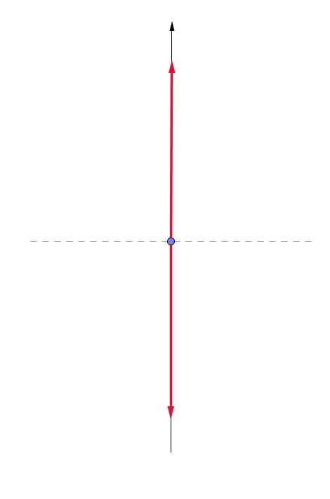
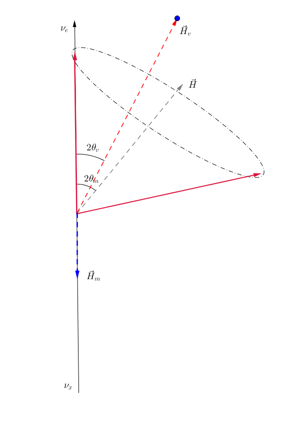

Flavor Isospin
======================================

The Hamiltonian in flavor basis with matter interaction for neutrino is

.. math::
   H = \frac{1}{2} ( {\color{red}\lambda} - \omega_v \cos 2\theta_v ) \sigma_3 + \frac{1}{2} \omega_v \sin 2\theta_v,
where :math:`\omega_v = \frac{\Delta m^2}{2E}`. For antineutrino, the Hamiltonian it obeys is

.. math::
   \bar H = \frac{1}{2} ( {\color{red}-\lambda } - \omega_v \cos 2\theta_v ) \sigma_3 + \frac{1}{2} \omega_v \sin 2\theta_v.

For reference purpose, the neutrino-neutrino interaction for neutrino is

.. math::
   H_{\nu\nu} = \sqrt{2}G_F \int\mathrm{d}^3 \mathbf{p}' ( 1 - \hat{\mathbf{p}}\cdot \hat{\mathbf{p}}' ) (\rho_{\mathbf{p}'} - \bar\rho_{ \mathbf{p}' }),

where :math:`\rho`'s are the density matrices.

Neutrino Flavour Isospin
---------------------------------

.. admonition:: Mathematical Reason
   :class: hint

   The reason behind this isospin for neutrino flavors is that Pauli matrices plus identity form a complete basis for all 2 by 2 matrices.

Neutrino flavour isospin [duan2006]_

.. math::
   \vec s = \Psi^{\dagger} \frac{\boldsymbol\sigma}{2} \Psi,

where in flavor basis

.. math::
   \Psi = \begin{pmatrix} \psi_e \\ \psi_x \end{pmatrix}.

We also find the component of Hamiltonian in :math:`\{ I, \sigma_1,\sigma_2,\sigma_3 \}` basis. However, in this specific problem, we only need :math:`\{\sigma_1,\sigma_2,\sigma_3 \}` since we already removed the identity from Hamiltonian. With this convention, we define the Hamiltonian vector :math:`\vec H` using

.. math::
   H = -\frac{\boldsymbol{\sigma} }{2}\cdot \vec H.

In order to have a look at the effect of different components, we also define :math:`\vec H_{v}` and :math:`\vec H_m`,

.. math::
   H_v &= - \frac{\boldsymbol{\sigma}}{2} \cdot \vec H_v \\
   H_m &= - \frac{\boldsymbol{\sigma} }{2} \cdot \vec H_m.

Not the equation of motion becomes

.. math::
   \frac{d}{dx} \vec s = \vec s \times \vec H.

.. admonition:: Deriving Equation of Flavor Isospin
   :class: note

   Here in this formalism we just plugin to compare with the original equation of motion.

   However, a more systematic and rigorous method is given in [duan2006]_ .

Previously we have already seen the equations for a spinning in magnetic field :ref:`magnetic-spin-angular-momentum-eom`,

.. math::
   \frac{d}{dt}\vec L = \gamma \vec L \times \vec B,

where :math:`\gamma = \frac{-e}{2m_e}`.

Another interesting analogy comes from the equation of motion for a spinning top

.. math::
   \frac{d}{dt}\vec S  =  \frac{\partial}{\partial t} \vec S  - \vec S \times \vec \Omega,

where :math:`\vec\Omega = \vec n \dot\phi`. Consider conservation of momentum, we have

.. math::
   \frac{\partial}{\partial t} \vec S  = \vec S \times \vec \Omega,

which is similar to the neutrino isospin equation of motion. :math:`\vec \Omega` corresponds to :math:`\vec H`.

Graphical Representation of Flavor Isospin
------------------------------------------------------

To have more understanding in the flavor isospin picture, we prefer to visualize it by putting up a 3-dimensional coordinate system. As a first step, we need to know what does a vector mean in such a system.

   Isospin space. :download:`Geogebra file  <assets/flavor-isospin/isospin-space.ggb>`.

First of all, we need to understand the component on the black vertical axis. The definition of flavor iosospin

.. math::
   \vec s_z = \Psi^\dagger \sigma_3 \Psi = \lvert \psi_e \rvert ^2 - \lvert \psi_x \rvert^2,

which means the difference between electron flaor and the other flavor. Thus on this axis, +1 means all electron flavor, while -1 means all the other flavor.

Let's start from electron flavor. If mixing angle is zero, no oscilltion or mixing hahhepns.

   Flavor isospin vector when mixing angle is zero. :download:`Geogebra file  <assets/flavor-isospin/zero-mixing-angle-isospin-graph.ggb>`.

Alternative, we can look at another limit, which is :math:`\theta_v = \frac{\pi}{4}`. In this case, the mixing should be maximium, i.e., the flavor conversion should be complete at some point.

.. _pi-over-four-mixing-angle-isospin-graph:

   Maximium conversion of initial electron flavor. The oscillation is between a up right state (electron flavor) and a down state (the other flavor). :download:`Geogebra file  <assets/flavor-isospin/pi-over-four-mixing-angle-isospin-graph.ggb>`.

In general we can graphically represent any oscillations of flavor isospin using such graph, as shown in :numref:`flavor-isospin-graphics-vacuum-only`.

.. _flavor-isospin-graphics-vacuum-only:

.. figure:: assets/flavor-isospin/flavor-isospin-graphics-vacuum-only.png
   :align: center

   Graphical representation of vacuum Hamiltonian. :download:`Geogebra file  <assets/flavor-isospin/flavor-isospin-graphics-vacuum-only.ggb>`.

Vacuum is easy to understand, so is neutrino oscillations in constant matter potential. We could always define new mixing angles :math:`\theta_m` in matter and effective angular frequency :math:`\omega_m` so that the Hamiltonian with constant matter potential becomes

.. math::
   H = \frac{\omega_m}{2} \cos 2\theta_m \sigma_3 + \frac{\omega_m}{2} \sin 2\theta_m \sigma_1,

which has exactly the same form as vacuum Hamiltonian. So we expect the constant matter potential oscillation graph to be exactly the same as vacuum oscillation.

As for changing matter potential, we can only analyze a few cases. More can be analyzed if we also plot out the components of Hamiltonian, as in :numref:`oscillation-isospin-graph-msw`.

.. _oscillation-isospin-graph-msw:

   Neutrino oscillations in matter, with Hamiltonian vector :math:`\vec H`.  :download:`Geogebra file  <assets/flavor-isospin/oscillation-isospin-graph-msw.ggb>`.

For very small matter density and very large matter density, we have vacuum oscillation dominition and matter dominition, :numref:`oscillation-isospin-graph-msw-change`.

.. _oscillation-isospin-graph-msw-change:

.. figure:: assets/flavor-isospin/oscillation-isospin-graph-msw-change.png
   :align: center

   Neutrino oscillations for very small matter density (a) and very large matter density (b). :download:`Geogebra file  <assets/flavor-isospin/oscillation-isospin-graph-msw-change.ggb>`.

Now imagine a slow adiabatic process from :numref:`oscillation-isospin-graph-msw-change` (a) to (b). At first, the oscillation is almost around vacuum Hamiltonian vector. As matter becomes dense, the matter Hamiltonian vector becomes dominating, which flips the oscillation axis. Somewhere in between, we would have a Hamiltonian vector which points horizontally, almost like :numref:`pi-over-four-mixing-angle-isospin-graph`. This is where the MSW resonance (maximium flavor conversion) happens.

Refs & Notes
----------------------

.. [duan2006] Duan, H., Fuller, G. M., & Qian, Y.-Z. (2006). `Collective neutrino flavor transformation in supernovae <http://journals.aps.org/prd/abstract/10.1103/PhysRevD.74.123004>`_ Physical Review D, 74(12), 1–16. http://doi.org/10.1103/PhysRevD.74.123004
