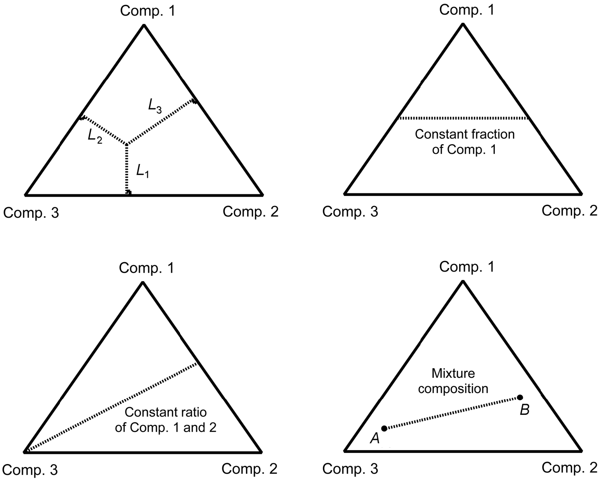

Common Sense
-----------------

Units
~~~~~~~~~

Natural units makes the calculation of neutrinos convenient. The consequences are

1. The energy-mass-momentum relations becomes :math:`E^2 = p^2 + m^2`. Thus mass :math:`m`, momentum :math:`\mathbf p` and energy :math:`E` have the same units.
2. Angular momentum in quantum mechanics is :math:`L_z = m\hbar` where :math:`m` is a number. :math:`\hbar` is of unit angular momentum.
3. A plane wave in quantum mechanics is :math:`\Psi = A e^{ \frac{E t - p x}{\hbar} }`. :math:`\frac{E t - p x}{\hbar}` should be unitless, which means :math:`px` has unit angular momentum, which is obvious, while :math:`E t` also has the unit of angular momentum. Previously we noticed momentum has the same unit with energy, we should have time  :math:`t` has the same unit as length :math:`x`. Also we can conclude that length and time has the unit of :math:`1/E`.

One should notice that charge is unit 1 in natural units since

.. math::
   F = \frac{Qq}{4\pi r^2}.

The conversion between natural units and SI can be down by using the following relations.

.. math::
   1 \mathrm{GeV} &= 5.08 \times 10^{15} \mathrm {m^{-1}} \\
   1 \mathrm{GeV} &= 1.8\times 10^{-27} \mathrm{kg}

Useful Conversions in Neutrino Physics
~~~~~~~~~~~~~~~~~~~~~~~~~~~~~~~~~~~~~~~~~~~~~~~~~~~~~~~~~~~~~~~~~~~~~~~~

Diagrams
~~~~~~~~~~~~~~~

   The meanings of points and lines in a ternary diagram. From `File:Vol1 Page 380 Image 0001.png@PetroWiki <http://petrowiki.org/File%3AVol1_Page_380_Image_0001.png>`_

In this documentation on neutrinos, we have all the readings of a point by looking into the line that goes to the left, which means that for the bottom axis, the left is 0 while the right is 1.

Refs and Notes
~~~~~~~~~~~~~~~~~

1. `A article about ternary diagram <http://petrowiki.org/Ternary_phase_diagrams>`_ .
