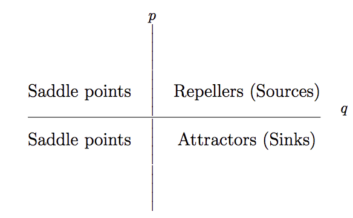

Mathematics Related
=================================================

The Equations
--------------------------------

For 2 flavor oscillations, the equation for flavor neutrinos is

.. math::
   i \frac{d}{dt} \begin{pmatrix} \nu_e \\ \nu_x \end{pmatrix} = \frac{\Delta m^2}{4E} \begin{pmatrix} - \cos 2\theta & \sin 2\theta \\  \sin 2\theta  & \cos 2\theta   \end{pmatrix} \begin{pmatrix} \nu_e \\ \nu_x \end{pmatrix}

and with matter

.. math::
   i \frac{d}{dt} \begin{pmatrix} \nu_e \\ \nu_x \end{pmatrix} = \frac{\Delta m^2}{4E} \begin{pmatrix} \frac{4E}{\Delta m^2} \sqrt{2} G_F n_e - \cos 2\theta   & \sin 2\theta \\  \sin 2\theta  &  \cos 2\theta   \end{pmatrix} \begin{pmatrix} \nu_e \\ \nu_x \end{pmatrix}

.. index:: Qualitative Analysis

Qualitative Analysis
-----------------------------------

The vacuum oscillation is determined by autonomous equations. A fixed point of an autonomous system is defined by

.. math::
   \frac{d}{dt} \begin{pmatrix} \nu_e \\ \nu_x \end{pmatrix}=0,

which means the so called "velocity" is 0. For vacuum oscillation, we set

.. math::
    \begin{pmatrix} - \cos 2\theta & \sin 2\theta \\  \sin 2\theta  & \cos 2\theta   \end{pmatrix} \begin{pmatrix} \nu_e \\ \nu_x \end{pmatrix} =0.

Thus we find the fixed points,

.. math::
   \nu_e & = 0 \\
   \nu_x & = 0.

If we have only the ith function with derivative 0, the line is called the ith-nullcline. Thus the fixed points are the interaction points of all the nullclines.

These fixed points are very useful. In general, for a set of autonomous equations,

.. math::
   f'(x) & = F(f,g)\\
   g'(x) & = G(f,g),

by definition the fixed point in phase space :math:`\{f_i,g_i\}` leads to the result

.. math::
   F(f,g) & = 0\\
   G(f,g) & = 0.

Thus the equations can be approximated using Taylor expansion near the point :math:`\{f_i,g_i\}`, since at the fixed points the derivatives are small.

.. math::
   \frac{d}{dx} &= F(f,g) \\
   & = F(f_i,g_i) + \frac{\partial F(f,g)}{\partial f}\vert_{f=f_i,g=g_i} (f-f_i)+ \frac{\partial F(f,g)}{\partial g}\vert_{f=f_i,g=g_i} (g-g_i)+ \mathcal O(2).

The equations are simplified to linear equations whose coefficient matrix is simply the Jacobian matrix of the original system at the fixed point :math:`\{f_i,g_i \}`. In this example, the coefficient matrix for the linearized system is

.. math::
   \mathbf{C} = \begin{pmatrix} \frac{\partial F(f,g)}{\partial f}\vert_{f=f_i,g=g_i} &   \frac{\partial F(f,g)}{\partial g}\vert_{f=f_i,g=g_i}  \\
   \frac{\partial G(f,g)}{\partial f}\vert_{f=f_i,g=g_i}  &  \frac{\partial G(f,g)}{\partial g}\vert_{f=f_i,g=g_i}  \end{pmatrix}.

As a comparison, the Jacobian matrix for the orginal equations at the fixed point is also the same which quite makes sense because Jacobian itself is telling the first order approximation of the velocity.

This linearization is only valid for hyperbolic fixed points which means that the eigenvalues of Jacobian matrix at fixed point has non-zero real part. Suppose the Jacobian is :math:`\mathbf{J}` with eigenvalues are :math:`\lambda_j`, a hyperbolic fixed point requires that :math:`\mathcal{Re}\lambda_j\neq 0`.

For more analysis, checkout `Poincare-Lyapunov Theorem`.[1]_

Define :math:`p=\mathrm{Tr}(\mathbf{J}(f_i,g_i))` and :math:`q=\mathrm{det}(\mathbf{J}(f_i,g_i))` then the systems can be categorized into 3 different categories given the case that the fixed point isa hyperbolic one.

   A diagram that shows the different categorizations given p and q values. Repellers and saddle points are unstable points but attractors are stable. Or in simple ways, given the eigenvalues of the Jacobian :math:`\lambda_1, \lambda_2`, :math:`Re(\lambda_1)>0, Re(\lambda_2)>0` gives us a repeller, :math:`Re(\lambda_1)<0, Re(\lambda_2)<0` gives us an attractor while :math:`Re(\lambda_1)<0, Re(\lambda_2)>0` gives us the saddle point.

.. [1] `Nonlinear Systems of Ordinary Differential Equations <http://www.mcs.csueastbay.edu/~malek/Class/nonlinear.pdf>`_ by Massoud Malek, California State University, East Bay.
