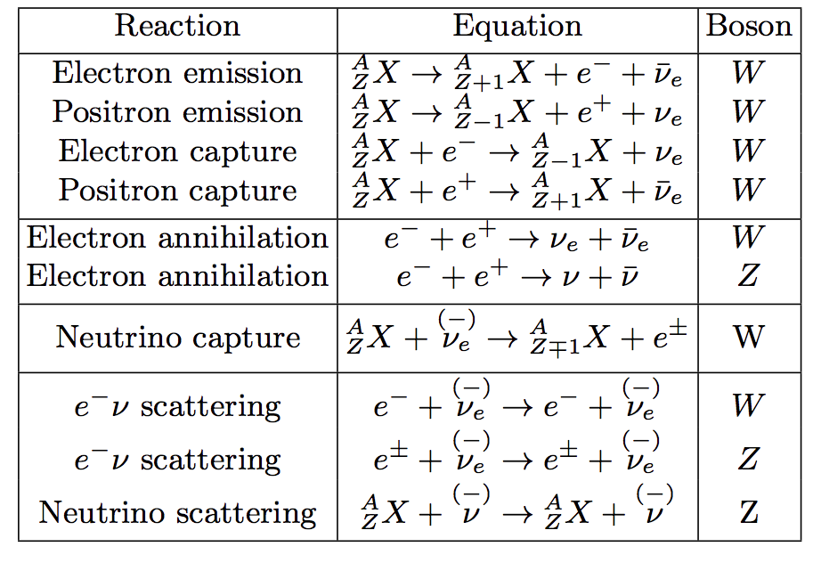
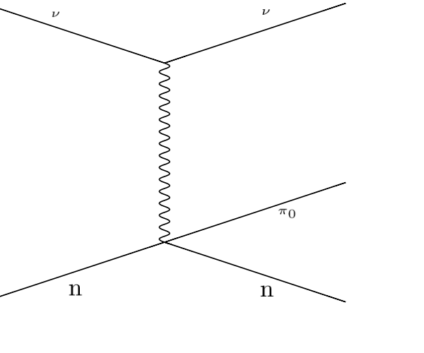
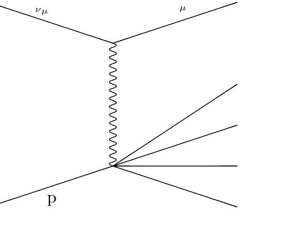
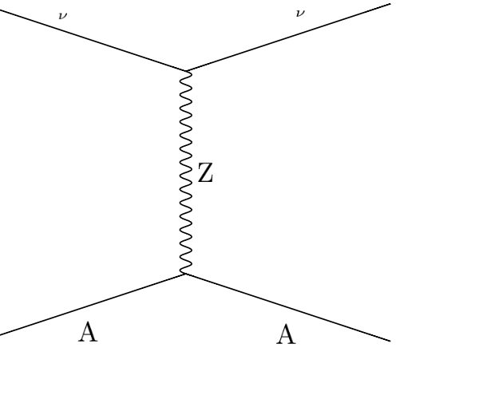
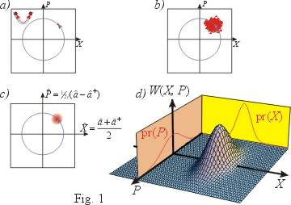

Physics
==================

Reactions Related to Neutrinos
-----------------------------------------

Before we actually reach a list of reactions, here are some most common examples which neutrinos participate in.

1. Beta decays, :math:`n\to p + e^- +\bar \nu` and :math:`p\to n + e^+ +\nu`
2. Electron capture and positron capture, :math:`e^- + p\to n+\nu` and :math:`e^+ + n \to p + \bar \nu`.
3. Inverse beta decays, :math:`\nu+ n \to p+e^-` and :math:`\bar\nu + p \to n + e^+`.
4. Inverses of beta decays, :math:`\bar\nu + e^- + p \to n` and :math:`n+e^++\nu \to n`.

As for a list of possible reactions, here we have this table.

   Neutrino related nuclear or leptonic reactions.

Another view of this is through drawing Feynman diagrams. There are six different kinds of Feynman diagrams that is related to neutrinos,

* Elastic scattering
* Quasi-elastic scattering
* Resonance
* Deep inelastic scattering
* Coherent neutral current neutrino-neucleus elastic scattering
* Neutrino-neutrino self-interaction.

Examples of elastic scattering:

.. image:: assets/physics/elastic-scattering-cc.png
   :width: 45%
.. image:: assets/physics/elastic-scattering-nc.png
   :width: 45%

.. image:: assets/physics/tau-neutrino-and-electron-nc.png
   :width: 45%
.. image:: assets/physics/elastic-scattering-neutrino-different-family.png
   :width: 45%

Example of quasi-elastic scattering

.. image:: assets/physics/quasi-elastic-scattering-neutrinos.png
   :width: 45%

Example of resonance

Example of deep inelastic scattering

Example of coherent neutral current scattering

What is a Neutrino Particle?
-------------------------------------

As Wigner said, a physical particle is an irreducible representation of the Poincaré group. A characteristic of Poincaré group is that mass comes in.

A neutrino particle is better recognized as its mass eigenstate.

In QFT, there are 3 different forms of neutrino mass term, left-handed Majorana, right-handed Majorana and Dirac mass terms.

Chirality and Helicity
-----------------------------

.. index:: Helicity

Helicity
~~~~~~~~~~~~~~

**Helicity** is the projection of spin onto direction of momentum,

.. math::
   h = \vec J\cdot\hat p = \vec L\cdot\hat p + \vec S\cdot \hat p = \vec S\cdot \hat p,

where

.. math::
   \hat p = \frac{\vec p}{\left|\vec p\right|}

A state is called **right-handed** if helicity is positive, i.e., spin has the same direction as momentum.

.. index:: Chirality

Chirality
~~~~~~~~~~~~

**Chirality** is the eigenstate of the Dirac :math:`\gamma_5` matrix, which is explicitly, [1]_

.. math::
   \gamma^5 &= \begin{pmatrix} \mathbf 0 & \mathbf I \\ \mathbf I & \mathbf 0 \end{pmatrix} \\
   & = \begin{pmatrix} 0 & 0 & 1 & 0 \\ 0 & 0 & 0 1 \\ 1 & 0 & 0 & 0 \\ 0 & 1 & 0 & 0  \end{pmatrix}.

Majorana or Dirac
--------------------------------

Double Beta Decay
~~~~~~~~~~~~~~~~~

States
--------------------------------------

.. index:: Wigner Function

Wigner Function
~~~~~~~~~~~~~~~~~~~~~~~~

   A ensemble of classical harmonic oscillators can be described using such phase-space probability distribution.

Wigner function is an analogue of the classical phase-space probability distribution function though it is not really probability. [3]_ The mean of Wigner function lies in the two quadratures, i.e., space distribution and momentum distribution.

There is a collection of Wigner functions on this site. [3]_

.. [3] `http://www.iqst.ca/quantech/wigner.php <http://www.iqst.ca/quantech/wigner.php>`_

.. admonition:: Question
   :class: note

   How do one describe a system of neutrinos using Wigner function? What is the effect of statistics.

Statistics
-------------------------------

Fermi-Dirac distribution

.. math::
   f(p,\xi) = \frac{1}{1+\exp (p/T-\xi)},

where :math:`\xi=\mu/T` is the degeneracy parameter.

The neutrino-neutrino forward scattering is [2]_

.. math::
   \nu_\alpha (p) + \nu_\beta (k) \to \nu_\alpha (k)+\nu_\beta (p).

.. admonition:: Question
   :class: warning

   Meaning of each term in Liouville equation.

.. [2] Pantaleone (1992), Friedland & Lunardini (2003).

Refs & Notes
-------------------

.. [1] `*Chirality and Helicity In Depth* by Robert D. Klauber <http://www.quantumfieldtheory.info/ChiralityandHelicityindepth.htm>`_
