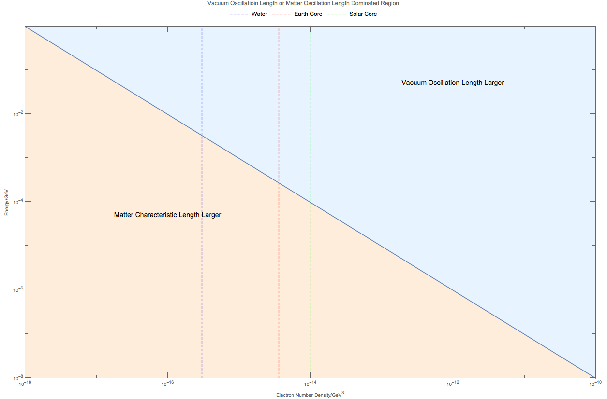

Qualitative Analysis
===========================

Oscillation Period, Frequency and Energy
------------------------------------------------------

**The mixing angles plays an important role in the amplitude of the oscillations while the energy scales play a role in the periods.**

In vacuum, 2 flavor oscillations, only one energy scale that is important enough which gives us the oscillation period (oscillation length) and frequency,

.. math::
   \omega &= \frac{\Delta m^2}{2E},\\
   l_v &= \frac{2\pi}{\omega} = \frac{4\pi E}{\Delta m^2}.

.. admonition:: 3 Flavor Energy Scales
   :class: note

   As long as we approach the 3 flavor oscillations, two mass square differences show up in the system thus giving us two energy scales, two periods and two frequencies. They are

   .. math::
      \omega_{12} &= \frac{\Delta m_{12}^2}{2E} \\       l_{v12} & = \frac{2\pi}{\omega_{12}},

   and

   .. math::
      \omega_{23} &= \frac{\Delta m_{23}^2}{2E} \\
      l_{v23} & = \frac{2\pi}{\omega_{23}}.

In matter, the interaction with matter :math:`\Delta \equiv \sqrt{2} G_F n` in related to another oscillation length, which is

.. math::
   l_m = \frac{2\pi}{\Delta} = \frac{2\pi}{\sqrt{2}G_F n} .

.. admonition:: Importance of Oscillation Period
   :class: note

   The oscillation length and frequency in fact is related to the energy scales. As the energy scales match each other, interesting things could happen. In the case of neutrinos, MSW resonance can happen.

.. admonition:: Fermi Constant
   :class: note

   Fermi constant is :math:`G_F=1.17\times 10^{-5}\mathrm{GeV^{-2}}`. The conversion between distance and energy is given by :math:`1\mathrm{fm}\cdot 197\mathrm{MeV}=1`.

With the definition of these oscillation lengths, a comparison between them can be made. Choose :math:`\Delta m_{21}^2=10^{-4}\times 10^{-18}\mathrm{GeV^{2}}`, we have

.. math::
   l_v &= 4\times 10^{19}\pi \left( \frac{E}{1 \mathrm{MeV} } \right) \mathrm{GeV^{-1}} = 7.9\times 10^3 \pi   \left( \frac{E}{1 \mathrm{MeV} } \right)\mathrm{m}  \\
   l_m &=  1.2\times 10^{19}\pi \left( \frac{10^{-14}}{n} \right) \mathrm{GeV^{-1}} = 1.2\times 10^4\pi \left( \frac{10^{-24}\mathrm{cm^{-3}}}{n} \right) .

There are relations between energy of neutrinos and the number density of electrons when the two lengths are equal.

   Comparison of the lengths. The two length are equal if

   .. math::
      \left(\frac{10^{-14}}{n} \right) = 3.3 \left( \frac{E}{10^{-3}}\right),

   in which :math:`n` is in :math:`\mathrm{GeV^3}` while :math:`E` is in unit of :math:`\mathrm{GeV}`.

On the other hand, the overall oscillation length in matter is

.. math::
   l &= \frac{2\pi}{\omega_m} \\
   & = \frac{2\pi}{\omega \sqrt{ \hat\Delta^2 + 1 - 2 \hat\Delta \cos 2\theta_v }} \\
   & = \frac{l_v}{ \sqrt{\left(\frac{l_v}{l_m} \right)^2 +1 - 2\frac{l_v}{l_m}\cos 2\theta_v  }} .

This expression shows exactly why the different length scales are important.

1. :math:`\lvert \frac{l_v}{l_m} \rvert \ll 1 \Rightarrow l\to l_v`, matter effect is minimal.
2. :math:`\lvert \frac{l_v}{l_m} \rvert \gg 1 \Rightarrow l\to 0`, matter effect kills the oscillations.
3. :math:`\lvert \frac{l_v}{l_m}\rvert \sim 1 \Rightarrow l\to \frac{l_v}{2\sin\theta_v}`, more interesting region, assuming :math:`\sin\theta_v>0`. To linear approximation,

   .. math::
      l \approx \frac{l_v}{2\sin\theta_v} \left( 1 -  \frac{l_v/l_m - 1}{2} \right) = \frac{l_v}{4\sin\theta_v} \left( 1 -  \frac{l_v}{l_m } \right) .

   notice that at resonance

   .. math::
      l = \frac{l_v}{2\sin \theta_v}.

Another important thing about these lengths is that :math:`l_v` is a function of energy which is that higher energy means longer oscillation length as shown in figure on comparison of vacuum oscillation length with matter length. This is important because we can always find the a energy that is at resonance with the matter density, as long as the energy still makes sure the neutrinos are relativistic. So a spectral swap is possible.

Refs and Notes
-----------------------

1. Wolfenstein, L. (1979). Neutrino oscillations and stellar collapse. Physical Review D, 20(10), 2634–2635. doi:10.1103/PhysRevD.20.2634
