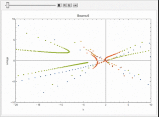
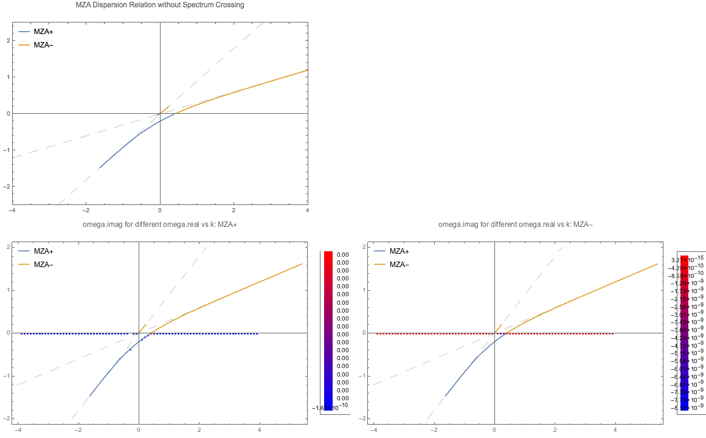

Dispersion Relation
================================

.. admonition:: Reference to Notes
   :class: note

   Izaguirre, I., Raffelt, G., & Tamborra, I. (2016). Fast Pairwise Conversion of Supernova Neutrinos: Dispersion-Relation Approach, 21101(January), 1–6. https://doi.org/10.1103/PhysRevLett.118.021101

Polarization Tensor
--------------------------

In Raffelt's paper, they defined the polarization tensor as

.. math::
   \Pi^{\mu\nu} = \eta^{\mu\nu} + \int \frac{d\Omega}{4\pi} G(\theta,\phi) \frac{v^\mu v^\nu}{k^\mu v_\mu}.

For numerical calculations, we lower the second index and multiply on both side :math:`\omega`,

.. math::
   \omega\Pi^\mu_\nu = \omega\delta^\mu_\nu + \int \frac{d\Omega}{4\pi} G(\theta,\phi) \frac{v^\mu v_\nu}{ 1- \frac{k}{\omega} \hat k\cdot \mathbf v },

where

.. math::
   v^\mu &= \begin{pmatrix} 1 & \sin\theta \cos\phi & \sin\theta \sin\phi & \cos\theta \end{pmatrix}\\
   k^\mu &= \begin{pmatrix} \omega & k \sin\theta_k \cos\phi_k & k\sin\theta_k \sin\phi_k & k\cos\theta_k \end{pmatrix}.

Parametrization of Polarization Tensor
~~~~~~~~~~~~~~~~~~~~~~~~~~~~~~~~~~~~~~~~~~~~~~~~~~~

Raffelt et al parametrize :math:`k^\mu(n)` where :math:`n=k/\omega`. Then the polarization tensor is decomposed into two parts,

.. math::
   \eta^{\mu\nu}

and

.. math::
   \frac{1}{\omega}N^{\mu\nu},

where

.. math::
   N^{\mu\nu} = \int d\Gamma G_{\mathbf v} \frac{v^\mu v^\nu}{ 1-n \hat{\mathbf k} \cdot \mathbf v },

with :math:`k^\mu=(\omega,\mathbf k)`.

.. admonition:: Note to self
   :class: warning

   The actual wave vector that determines the instability is :math:`K^\mu` which is related to :math:`k^\mu`,

   .. math::
      k^\mu= K^\mu - (\Lambda^\mu + \Phi^\mu).

   Since :math:`\Lambda^\mu` and :math:`\Phi^\mu` are real, imaginary part of :math:`\omega` (:math:`\mathbf k`) equal imaginary part of :math:`\Omega` (:math:`\mathbf K`). Thus we only discuss the dispersion relation of :math:`k^\mu`.

   Density matrix is written as

   .. math::
      \rho = \begin{pmatrix}
      1 & \epsilon \\
      \epsilon^* & -1
      \end{pmatrix}.

   The perturbation :math:`\epsilon` is assumed to have the form

   .. math::
      \epsilon = Q(\Omega, \mathbf K) e^{ -i( \Omega t - \mathbf K \cdot \mathbf x ) }.

   This assumption indicates that even though we find instabilities, a proper initial condition/boundary condition is required to stimulate this instability.

The polarization tensor is in fact

.. math::
   \Pi^{\mu\nu} = \eta + \frac{1}{\omega}N^{\mu\nu}.

The equation of motion becomes

.. math::
   v_\mu \Pi^{\mu\nu} a_\nu =0 ,

where

.. math::
   a_\nu = - \int d\Gamma v_\nu G_{\mathbf v} Q_{\mathbf v}.

Since :math:`v_\mu` is (component) of a null dual vector, we require :math:`\Pi^{\mu\nu} a_\nu` to be (component) proportional to :math:`v^\mu`. Since we have a lot of directions, different :math:`v^\mu` are independent of each other. So we require :math:`\Pi^{\mu\nu} a_\nu=0`.

Then we need to find the solution to

.. math::
   \mathrm{Det}(\Pi^{\mu\nu})=0,

which is simplified to

.. math::
   \mathrm{Det}(\omega \eta^{\mu\nu} + N^{\mu\nu}) = 0.

We can also use the polarization tensor :math:`\Pi^\mu_\nu`

.. math::
   \mathrm{Det}(\omega \delta^\mu_\nu + N^{\mu}_\nu) =0

is the determinant of a matrix

.. math::
   \omega I + \mathbf N^\mu_\nu.

Equivalently, we only need to find the eigenvalues of :math:`\mathbf N^\mu_\nu` then multiply on each of them by negative sign.

Examples of Parametrization
~~~~~~~~~~~~~~~~~~~~~~~~~~~~~~~

Raffelt et al proposed that can now solve the dispersion relation by finding the value of :math:`k^\mu(n)` for each n. We make the plot :math:`\omega` vs :math:`\mathbf k`.

Here is an example that I calculated.

The axial symmetric system can be calculated easily using this method. The paper gave an example of two polar angle beams with axial symmetry.

.. figure:: assets/dispersion-relation/listpltOmegan1.png
   :align: center

   :math:`\omega(n)` for :math:`G=0.5 \delta(\cos\theta- 0.8) + 0.5 \delta(\cos\theta+0.2)`.

.. figure:: assets/dispersion-relation/listpltDispersionRelationDecompose1.png
   :align: center

   Dispersion relation.

We can check what happens for multibeams. I can plot the dispersion relation for similar configuration but with different number of beams.

   Animition of dispersion relation.

   .. code:: text

      dataPltNBeamsPlt[Join[Table[1/beams, {n, 1, beams/2}],
      Table[-1/beams, {n, 1, beams/2}]],
      Table[Pi/3 + n Pi/2/(beams - 1), {n, 0, beams - 1}], {-10, 10}, 0.049, {{-10, 10}, {-10, 10}}]

I plot the :math:`\omega(n)` relation for different number of beams

.. image:: assets/dispersion-relation/listpltOmegan12List-2.png
   :width: 49%

.. image:: assets/dispersion-relation/listpltOmegan12List-4.png
   :width: 49%

.. image:: assets/dispersion-relation/listpltOmegan12List-8.png
   :width: 49%

.. image:: assets/dispersion-relation/listpltOmegan12List-10.png
   :width: 49%

Similar to the previous example, confining the range of :math:`n` leads to only a partial patch of the dispersion relation.

   The code for it

   .. code:: text

      pltDiffBeamsConfined[beams_] := dataPltNBeamsPlt[
      Join[Table[1/beams, {n, 1, beams/2}],
      Table[-1/beams, {n, 1, beams/2}]],
      Table[Pi/3 + n Pi/2/(beams - 1), {n, 0, beams - 1}], {-1, 1},
      0.049, {{-10, 10}, {-10, 10}}]

.. admonition:: This should be the continuous limit?
   :class: warning

   As a comparison, we can plot the dispersion relation in a larger range of n for 10 beams.

   .. figure:: assets/dispersion-relation/listpltOmegan12List-10.png
      :align: center

      10 beams.

   On the other hand, we can calculate the continuous limit for the same angle range.

   .. figure:: assets/dispersion-relation/compare-continuous-and-10-beams-within-n-range--1-to-1.png
      :align: center

      Dispersion relation for 10 beams (:math:`n\in [-1,1]`), and continuous limit.

   MEH

Analyze the Symmetries in Polarization Tensor
------------------------------------------------------------------

.. admonition:: Vectors Using Spherical Harmonics
   :class: toggle

   Four velocity can be expressed in terms of spherical harmonics.

   .. math::
      v^\mu = \sqrt{\pi}\begin{pmatrix} 2 & \sqrt{2/3} (Y_1^{-1} - Y_1^1) & i \sqrt{2/3} (Y_1^{-1} + Y_1^1) & 2\sqrt{1/3} Y_1^0 \end{pmatrix}.

In principle, solving the dispersion relation is not easy. Neverthless, symmetries would significantly simplify the problem.

Axial symmetry indicates that the integrals of first orders of :math:`\sin\phi\cos\phi`, :math:`\sin\phi`, and :math:`\cos\phi` are 0 on the range :math:`\phi\in [0,2\Pi]`.

We denote the integral

.. math::
   \int \frac{d\Omega}{4\pi} G(\theta,\phi) \frac{v^\mu v_\nu}{\omega- k \hat{\mathbf k}\cdot \mathbf v}

as :math:`P^\mu_\nu`. The polarization tensor becomes

.. math::
   \Pi^\mu_{\phantom{\mu}\nu} = I + P^\mu_{\phantom{\mu}\nu}.

For axial symmetric emission, only terms :math:`P^0_{\phantom{0}0}, P^0_{\phantom{0}3}, P^3_{\phantom{3}0}, P^3_{\phantom{3}3}, P^1_{\phantom{1}1}, P^2_{\phantom{2}2}` are nonzero, given :math:`\mathbf k` in z direction, i.e., :math:`\phi_k=\theta_k=0`.

To simplify the calcualtion, we denote :math:`n=\frac{\lvert \mathbf k\rvert}{\omega}`. We will NOT solve :math:`\omega(n)`. Instead we write down the form of the eigenvalues of

.. math::
   N^\mu_{\phantom{\mu}\nu} = \omega P^\mu_{\phantom{\mu}\nu},

which shows is an analytical expression of :math:`\omega`. We do not solve this relation. Instead, we plugin the definition :math:`n=\frac{\lvert \mathbf  k\rvert}{\omega}` and find out the relation between :math:`\omega` and :math:`k=\lvert \mathbf k \rvert`

The four velocity is

.. math::
   v^\mu \to ( 1, \sin\theta\cos\phi, \sin\theta\sin\phi, \cos\theta )^{\mathrm T}.

We define

.. math::
   I_n(\theta)=\int_{\cos\theta_2}^{\cos\theta_1} d\cos\theta G(\theta) \frac{\cos^n\theta}{1 - n \cos\theta },

where :math:`\theta_1` and :math:`\theta_2` are

Since

.. math::
   \int_0^{2\pi} d\phi&=2\pi \\
   \int_0^{2\pi} d\phi \cos^2\phi &=\int_0^{2\phi} d\phi \sin^2\phi = \pi,

the matrix :math:`N^\mu_{\phantom{\mu}\nu}` is simplified,

.. math::
   N^\mu_{\phantom{\mu}\nu} = \omega P^\mu_{\phantom{\mu}\nu}\to  \begin{pmatrix}
   \frac{1}{2}  I_0 & 0 & 0 & -\frac{1}{2}I_1\\
   0 & -\frac{1}{4}(I_0-I_2) & 0 & 0\\
   0 & 0 & -\frac{1}{4}(I_0-I_2) & 0 \\
   \frac{1}{2}I_1 & 0 & 0 & -\frac{1}{2}I_2
   \end{pmatrix}.

The equation we are solving is

.. math::
   \operatorname{Det}(\omega + N^{\nu}_{\phantom{\mu}\nu}) = 0.

We find the solutions to omega,

.. math::
   \omega = \frac{1}{4}(I_0-I_2), \quad -\frac{1}{4}\left(I_0-I_2\pm \sqrt{ (I_0-2I_1+I_2)(I_0+2I_1+I_2) }\right).
   :label: eqn-omega-n-relation-axial-sym-general

.. admonition:: Mathematica Code
   :class: toggle

   The Mathematica code for solving :math:`\omega` as a function of :math:`n` is

   .. code-block:: Mathematica

      Det[{
            {omega + i0/2, 0, 0, -i1/2},
            {0, omega - (i0 - i2)/4, 0, 0},
            {0, 0, omega - (i0 - i2)/4, 0},
            {i1/2, 0, 0, omega - i2/2}
         }]

We plug in the definition :math:`n=k/\omega` then solve dispersion relation from each of the solutions in Eq. :eq:`eqn-omega-n-relation-axial-sym-general`.

The questions are

1. What does each of the solutions mean?

Eigenvalues and Axial Symmetry
~~~~~~~~~~~~~~~~~~~~~~~~~~~~~~~~~

By definition, the meaning of polarization tensor, :math:`\Pi^\mu_\nu a^\nu=0` implies that :math:`a^1` and :math:`a^2` are the :math:`\phi` angle dependent components. To prove this, we rewrite :math:`Q`,

.. math::
   Q = \frac{a^\mu v_\mu}{k^\nu v_\nu},

which clearly shows that the 1, and 2 component of :math:`a^\mu` is related to the phi dependence of :math:`Q`. :math:`a^1=a^2=0` indicates that :math:`Q` has no :math:`\phi` dependence.

.. admonition:: Is this related to eigenvectors?
   :class: warning

   The eigenvalue :math:`\frac{1}{4}(I_0-I_2)` of matrix :math:`N^\mu_{\phantom{\mu}\nu}` corresponds to eigenvectors :math:`(0,0,1,0)` and :math:`(0,1,0,0)`.

   I don't think it is related to eigenvalues. However, eigenvalues set limit on the actual solution. When we write down the solution to :math:`a^\mu`, the coefficients are related to each other because we have determinant of coefficient matrix being 0. There are degeneracies.

That is to say, the part

.. math::
   \begin{pmatrix}
   -\frac{1}{4}(I_0-I_2) & 0 \\
   0 & -\frac{1}{4}(I_0-I_2)
   \end{pmatrix}

are the only elements that determines the whether we have a :math:`\phi` dependence in :math:`Q`, since this is the only part that needs to be acted on in Gaussian elimination method. It is obvious that we have

.. math::
   a^1=a^2=0.

In turn, it determines the angle dependence of :math:`Q`,

.. math::
   Q =  \frac{a^0 - a^1\sin\theta\cos\phi - a^2\sin\theta\sin\phi - a^3 \cos\theta}{k^\mu v_\mu} = Q_0 + Q_3(\theta).

We have no :math:`\phi` dependence in :math:`Q` if we foce the emission to be axially symmetric.

Continuous Emission within Angle Range
~~~~~~~~~~~~~~~~~~~~~~~~~~~~~~~~~~~~~~~~~~~~

In this case we have to calculate :math:`I_n` specifically for the angle range, then plug in the expression :math:`n=k/\omega` to find the dispersion relation.

Discrete Emission Beams
~~~~~~~~~~~~~~~~~~~~~~~~~~~~~~~~~~~~~~~~~

For discrete emission :math:`G(\theta)=\sum_i G_i \delta(\cos\theta-\cos\theta_i)`, we can define new quantities

.. math::
   \tilde I_n(\theta)= \sum_i G_i \frac{\cos^n\theta_i}{1 - n \cos\theta_i }.

Thus

.. math::
   &\omega = \frac{1}{4}(I_0-I_2) \\
   \Rightarrow &\omega = \frac{1}{4} \sum_i G_i \frac{1-\cos^2\theta_i}{1 - n \cos\theta_i }.

For two sets of beams, we have

.. math::
   4 =  G_1 \frac{1-\cos^2\theta_1}{\omega - k\cos\theta_1 } + G_2 \frac{1-\cos^2\theta_2}{\omega - k \cos\theta_2 },

which is a conic section. We have already used :math:`n=k/\omega`.

.. admonition:: Hyperbola
   :class: note

   For an quadratic equation [HyperbolaWikipedia]_

   .. math::
      A_{xx} x^2 + 2 A_{xy} xy + A_{yy} y^2 + 2 B_x x + 2 B_y y + C = 0,

   it is hyperbola if

   .. math::
      D := \begin{vmatrix} A_{xx} & A_{xy}\\A_{xy} & A_{yy} \end{vmatrix} < 0.

   Center of the hyperbola :math:`(x_c,y_c)` is

   .. math::
      x_c &= -\frac{1}{D} \begin{vmatrix} B_x & A_{xy} \\ B_y & A_{yy} \end{vmatrix}\\
      y_c &= -\frac 1 D \begin{vmatrix} A_{xx} & B_x \\A_{xy} & B_y \end{vmatrix}.

   Principal axis is tilted away from x axis by angle :math:`\beta`

   .. math::
      \tan 2\beta = \frac{2A_{xy}}{A_{xx}-A_{yy}}.

   .. [HyperbolaWikipedia] `Hyperbola @ Wikipedia <https://en.wikipedia.org/wiki/Hyperbola#Quadratic_equation>`_

We can prove that this is a hyperbola. Simplify the equation to standard form of conic sections

.. math::
   4\cos\theta_1\cos\theta_2 k^2 - 2 \times 2(\cos \theta_1+\cos\theta_2) \omega k +4\omega^2  + 2 \times \frac{ G_1(1-\cos^2\theta_1)\cos\theta_2 + G_2(1-\cos^2\theta_2)\cos\theta_1 }{2} k - 2 \times\frac{ G_1(1-\cos^2\theta_1) + G_2(1-\cos^2\theta_2) }{2}  \omega = 0.

.. admonition:: The :math:`\omega~k` plane
   :class: toggle

   We use :math:`\omega~k` plane, so that we map :math:`k` to :math:`x` and :math:`\omega` to :math:`y`.

   So the coefficients are defined as

   .. math::
      A_{kk} &= 4\cos\theta_1\cos\theta_2\\
      A_{k\omega} &= -2(\cos\theta_1+\cos\theta_2)\\
      A_{\omega\omega} & = 4 \\
      B_k & =  \frac{ G_1(1-\cos^2\theta_1)\cos\theta_2 + G_2(1-\cos^2\theta_2)\cos\theta_1 }{2} = \frac{\tilde G_1 \cos\theta_2 + \tilde G_2 \cos\theta_1}{2}\\
      B_\omega & =  - \frac{ G_1(1-\cos^2\theta_1) + G_2(1-\cos^2\theta_2) }{2} = -\frac{\tilde G_1 + \tilde G_2}{2}.

The condition for it to be hyperbola is :math:`D<0`, where

.. math::
   D = \begin{vmatrix}
   4\cos\theta_1\cos\theta_2 & -2(\cos\theta_1+\cos\theta_2) \\
   -2(\cos\theta_1+\cos\theta_2)  & 4
   \end{vmatrix} = - 4 (\cos\theta_1-\cos\theta_2)^2.

As long as we have different angles, :math:`D` is always less than 0. We always have a hyperbola. The center of the hyperbola is

.. math::
   k_c &= -\frac{1}{D} \begin{vmatrix}
   B_k & A_{k\omega} \\
   B_\omega & A_{\omega\omega}
   \end{vmatrix} = \frac{1}{4 (\cos\theta_1-\cos\theta_2)^2} \begin{vmatrix}
   \frac{ \tilde G_1\cos\theta_2 + \tilde G_2\cos\theta_1 }{2} & -2(\cos\theta_1+\cos\theta_2)\\
   - \frac{ \tilde G_1 + \tilde G_2 }{2} & 4
   \end{vmatrix}   \\
   \omega_c &= -\frac{1}{D} \begin{vmatrix}
   A_{kk} & B_k \\
   A_{k\omega} & B_\omega
   \end{vmatrix} = \frac{1}{4 (\cos\theta_1-\cos\theta_2)^2} \begin{vmatrix}
   4\cos\theta_1\cos\theta_2 & \frac{ \tilde G_1\cos\theta_2 + \tilde G_2\cos\theta_1 }{2}\\
   -2(\cos\theta_1+\cos\theta_2) & - \frac{ \tilde G_1 + \tilde G_2 }{2}
   \end{vmatrix}  .

A special case for it is :math:`G_1=\pm G_2`, however, the expression for the center doesn't really simplify that much.

We are interested in gaps, so the asymptotic lines are the lines that we are interested in.

First of all, we need to find out the principal axis. The angle between the principal axis and x axis is defined to be :math:`\beta`,

.. math::
   \tan2 \beta = \frac{2A_{k\omega}}{A_{kk}-A_{\omega\omega}} = \frac{\cos\theta_1+\cos\theta_2}{1-\cos\theta_1\cos\theta_2}.

Suppose we have angles :math:`\theta'_i=\arctan ( \cos\theta_i )`,

.. math::
   \beta = \frac{\theta'_1+\theta'_2}{2}.

This indicates that the angle :math:`\beta` is always within range :math:`\beta \in [\pi/4,\pi/4]`.

.. admonition:: The other solutions
   :class: note

   For the solutions

   .. math::
      \omega = -\frac{1}{4}\left(I_0-I_2\pm \sqrt{ (I_0-2I_1+I_2)(I_0+2I_1+I_2) }\right),

   it becomes much more complicated.

Why is it called Polarization Tensor
-------------------------------------------

Why is :math:`a^\mu` called polarization vector?

We kind of see why :math:`a^\mu` is some kind of polarization given the definition

.. math::
   a^\mu = -\int d\Gamma v^\mu G(\theta,\phi) Q(\theta,\phi).

In some sense it is a weighted average of :math:`Q`. And :math:`S = Q e^{-i k^\mu x_\mu}` is the "field" we are insterested in.

Comparing to electrodynamics, where we have the field :math:`A^\mu` which tells us about the polarization,

.. admonition:: Polarization in Electrodynamics
   :class: toggle

   We can assume that the four vector field is

   .. math::
      A^\mu = \epsilon^\mu a e^{-ikx} + {\epsilon^\mu}^*  a^* e^{ikx} \qquad \text{with}\quad k_\mu k^\mu =0.

   We make sense of it by interpretating :math:`\epsilon^\mu` as the polarization vector and :math:`a` as the amplitude of the field strength. This solution is only for one particular case. We use it as an example because it is simple.

   To calculate the electric field, :math:`E^i` where :math:`i=1,2,3`, we apply the definition of it

   .. math::
      E^i = - F^{0i}.

   By working it out, we find :math:`\epsilon^i`, which is the spatial part of :math:`\epsilon^\mu`, indeed plays a role in the direction of field.

Solving N Beams
------------------------------------

For consistancy check, we parametrize :math:`\omega(n)`. For MAA solution, we have

.. math::
   \omega(n) = \frac{1}{4} \sum_i G_i \frac{1-\cos^n\theta_i}{1 - n \cos\theta_i }.

.. _fig-DR-omega-n-2-beams-lr-png:

.. figure:: assets/dispersion-relation/DR-omega-n-2-beams-lr.png
   :align: center

   :math:`\omega(n)` with two angles :math:`\cos\theta = 0.9,0.3` and :math:`G_1 = -G_2 = -2\pi/2`. The grid lines are the values of n for singularity, :math:`n=1/0.3,1/0.9`.

.. _fig-DR-omega-k-2-beams-lr-png:

.. figure:: assets/dispersion-relation/DR-omega-k-2-beams-lr.png
   :align: center

   Same parameters as above. The orange dashed lines are the singularity lines.

:numref:`fig-DR-omega-n-2-beams-lr-png` shows that the limit of :math:`n\to 1/0.9,1/0.3` leads to :math:`\omega` infinities. These infinities also indicates that :math:`\omega (k)` at large :math:`\lvert\omega\rvert` are straight lines with slope :math:`n=1/0.9,1/0.3`, as shown in :numref:`fig-DR-omega-k-2-beams-lr-png`.

Similar plots are made for 4,6,8 beams.

.. figure:: assets/dispersion-relation/DR-omega-n-2-4-6-8-beams-lr.png
   :align: center

   2, 4, 6, 8 beams with equal division of cosine of emission angle. For example 4 beams are emission at :math:`\cos\theta= 0.9, 0.7, 0.5, 0.3`.

.. figure:: assets/dispersion-relation/DR-omega-k-2-4-6-8-beams-lr.png
   :align: center

   Same parameters as above.

We also calculated the homogeneous emssion.

   2, 4, 6, 8 beams for homogeneous :math:`G`.

   Same parameters as above.

.. admonition:: Gap
   :class: note

   Whenever a gap in :math:`omega` appears, we might find in the :math:`\omega(n)` plot that we have less solutions to :math:`n` for some given :math:`\omega` values. **It seems that this can only happen for ELN spectrum with crossing.**

   To illustrate this idea, I shaded the region that :math:`n(\omega)` has no solution for the case of two emission angle and crossing in :numref:`dr-omega-k-2-beams-lr-shaded-region-png`.

   .. _dr-omega-k-2-beams-lr-shaded-region-png:

   .. figure:: assets/dispersion-relation/DR-omega-k-2-beams-lr-shaded-region.png
      :align: center

      The shaded regions are the region that :math:`n(\omega)` has no solution. It's hard to analytically solve :math:`n(\omega)`. But we can get an idea of this using :math:`\omega(n)` plot.

   This provides an method to determine whether we have a gap in :math:`\omega` or :math:`k`. For gap in :math:`k`, we plot out :math:`k(n)`.

   .. figure:: assets/dispersion-relation/DR-k-n-2-beams-lr-shaded-region.png
      :align: center

      The shaded region are the region where :math:`n(k)` has no solution.

   The behavor of :math:`\omega(n)` and :math:`k(n)` are qualititatively the same.

   .. figure:: assets/dispersion-relation/DR-k-n-2-beams-lr-and-homogeneous.png
      :align: center

      :math:`k(n)` for non-crossing and crossing. The are qualitatively the same as :math:`\omega(n)`. That being said, we always have the same upside down U-shape for spectrum with crossing for both :math:`k(n)` and :math:`\omega(n)`, if the region of emission angles :math:`\theta` satisfies :math:`\cos\theta>0`.

Solving Continuous Emission
-----------------------------------------

Suppose neutrinos are emitted within a angle range :math:`[\theta_1,\theta_2]`. Using Mathematica, we find the three important integrals

.. math::
   I_0 &= \int_{c_2 }^{c_1 } d x \frac{1}{1-k\cos\theta/\omega} \\
      &= \frac{\omega}{k} \ln \left( \frac{\omega-c_2 k}{\omega-c_1 k}  \right) \\
   I_1 &= \int_{c_2 }^{c_1 } d x \frac{x}{1-k\cos\theta/\omega} \\
   & =  \frac{\omega}{k} \left( c_2 -c_1  +  \frac{ \omega }{k} \ln \left( \frac{\omega-c_2 k}{\omega-c_1 k}  \right) \right) \\
   I_2 &= \int_{c_2 }^{c_1 } d x \frac{x^2}{1-k\cos\theta/\omega} \\
   &= \frac{\omega}{2 k}  (c_2 -c_1 ) \left(2 \frac{\omega}{k} + c_1 +c_2  \right)  + \left(\frac{\omega}{k}\right)^3 \ln \left(  \frac{\omega-c_2 k}{\omega-c_1 k}  \right) .

where :math:`c_1=\cos\theta_1` and :math:`c_2=\cos\theta_2`.

Homogeneous Emission
~~~~~~~~~~~~~~~~~~~~~~~~~~~~

Assuming :math:`G=1`, the MAA solution is

.. math::
   \omega = \frac{g}{4}(I_0 - I_2),

which becomes

.. math::
   \omega=\frac{(c_2-c_1)(1+(c_1+c_2)n/2)}{4n^3} + \frac{ 1-n^2 }{4n^3}\ln\left(  \frac{1-c_2 n}{1-c_1 n}  \right)
   :label: eqn-dr-continuous-angle-range

Meanwhile we could write down the MZA/bimodal solution in the form of :math:`\omega(n)`.

For MAA and MZA we can plot :math:`\omega` as a function of n.

.. figure:: assets/dispersion-relation/DR-omega-k-direct-continuous-maa-no-crossing.png
   :align: center

   :math:`\omega(n)` for MAA solution. The spectrum is feeded in as :math:`\{\{\cos\theta_1,\cos\theta_2\}, G \}=\{\{0.9, 0.3\}, 1\}`.

.. figure:: assets/dispersion-relation/DR-omega-k-direct-continuous-mza-no-crossing.png
   :align: center

   :math:`\omega(n)` for MZA solution.  The spectrum is feeded in as :math:`\{\{\cos\theta_1,\cos\theta_2\}, G \}=\{\{0.9, 0.3\}, 1\}`.

On the other hand, we know :math:`k=n\omega`, so we have parametrized the dispersion relation using a parameter :math:`n`.

   Dispersion relation out of Eq. :eq:`eqn-dr-continuous-angle-range`. For large k, the relation becomes proportional. The discontinuties are at location of :math:`\lim_{n\to \infty}\{n\omega(n),\omega(n)\}`. In this example, :math:`\{ -0.184653, 0 \}` (MAA solution) and :math:`\{  0.729306, 0 \}` (MZA solution).

.. admonition:: The Limits
   :class: note

   There are several limits in the dispersion relation.

   From the figure of :math:`\omega`, we notice the singularities at the two ends of the distribution, :math:`1/c_1` and :math:`1/c_2`. At these points, a tiny change of n will cause a significant change in :math:`\omega` and :math:`k`. In fact the relation between them becomes a proportional relation since :math:`n` remains almost constant.

   Another limit is :math:`n\to \infty`. Since :math:`\ln(n)` increases slower than :math:`n`, we have

   .. math::
      \lim_{n\to\infty}\omega(n) =\lim_{n\to\infty} \frac{ I_0-I_2 }{4} = 0.

   We can calculate :math:`\lim_{n\to \infty}\{n\omega(n),\omega(n)\}`, for :math:`c_1=0.9` and :math:`c_1=0.3`,

   .. math::
      \lim_{n\to\infty}\{n\omega(n),\omega(n)\}  &= \{-0.184653, 0.  \}, &\qquad \text{for MAA solution}\\
      \lim_{n\to\infty}\{n\omega(n),\omega(n)\}  &= \{0.729306, 0.  \}, &\qquad \text{for MZA solution}.

   In general, we have the limits

   .. math::
      \lim_{n\to\infty}\{n\omega(n),\omega(n)\}  &= \{(c_1^2-c_2^2 + 2\ln \left\vert\frac{c_2}{c_1}\right\vert )/8, 0  \}, &\qquad \text{for MAA solution} \\
      \lim_{n\to\infty}\{n\omega(n),\omega(n)\}  &= \{ ( c_1^2-c_2^2 - 2\ln \left\vert \frac{c_2}{c_1} \right\vert )/4, 0  \}, &\qquad \text{for MZA solution}.

Emission with Crossing
~~~~~~~~~~~~~~~~~~~~~~~~

I have to break each of the integral into two parts. I calculate :math:`I_0-I_2` for the first region then add to it the second region. Within a region :math:`[\theta_1,\theta_2]` and

.. math::
   G=\begin{cases}
   g_1, \qquad & \theta_1<\theta<\theta_0 \\
   g_2, \qquad & \theta_0<\theta<\theta_2
   \end{cases}.

In other words, we have a box-like spetrum.

For MAA solution we define a function,

.. math::
   RHS(c_1,c_2,g)=\frac{I_0-I_2}{4} = \frac{g}{4} \left[ \left( \frac{1}{n} - \frac{1}{n^3} \right)\ln\left( \frac{1-n c_2}{1-n c_1} \right) - \frac{c_2-c_1}{n} \left( \frac{c_1+c_2}{2} + \frac{1}{n} \right) \right].

The dispersion relation is given by

.. math::
   \omega = RHS(c_1,c_0,g_1) + RHS(c_0,c_2,g_2).

Then we parametrically plot :math:`\{ n \omega(n), \omega(n)\}` to get the dispersion relation, for MAA solution. Similarly I can find that of MZA solution.

.. admonition:: Limits
   :class: note

   Before we do any numerical calculations, we can calculate the limits first.

   .. math::
      \lim_{n\to\pm\infty}\{n\omega(n),\omega(n)\}  &= \{( g_1(c_1^2-c_0^2) + g_2(c_0^2-c_2^2) + 2 g_1 \ln \frac{c_0}{c_1}  + 2 g_2\ln \frac{c_2}{c_0} )/8, 0  \}, &\qquad \text{for MAA solution} \\
      \lim_{n\to\infty}\{n\omega(n),\omega(n)\}  &= \{ \{two very complicated expression, try Mathematica \}, 0  \}, &\qquad \text{for MZA solution}.

   For :math:`g_1=g_2=1` these limit match the homogeous result, which they should.

   We also have the large k limit which are :math:`\omega = \frac{1}{c_i}k`.

   Mathematically, we also have

   .. math::
      \lim_{n\to 1/c_1} \{ n\omega(n),\omega(n) \} &= \{ \mathrm{DirectedInfinity}(g_1 (1-c_1^2) ), c_1 \mathrm{DirectedInfinity}(-\mathrm{Sign}(g_1 (-1+c_1^2) ) ) \}, &\qquad \text{for MAA solution} \\
      \lim_{n\to 1/c_0} \{ n\omega(n),\omega(n) \} &= \{ \mathrm{DirectedInfinity}( (g_1 - g_2 ) (1-c_0^2) ), c_0 \mathrm{DirectedInfinity}(  (g_1-g_2) (-1+c_0^2)  ) \}, &\qquad \text{for MAA solution} \\
      \lim_{n\to 1/c_2} \{ n\omega(n),\omega(n) \} &= \{ \mathrm{DirectedInfinity}(g_2 (1-c_2^2) ), c_2 \mathrm{DirectedInfinity}( g_2 (-1+c_2^2)  ) \}, &\qquad \text{for MAA solution}.

For simplicity, we choose :math:`g_2=-g_1=1`.

   Dispersion relation for spectral crossing. The discontinuties are at :math:`\{ 0.0944205, 0 \}` (MAA solution) and :math:`\{  -0.098841, 0 \}` (MZA solution). The spectrum I use is :math:`\{ \{\{\cos\theta_1,\cos\theta_0\}, g1\}, \{\{ \cos\theta_0,\cos\theta_2\},g2\}\}=\{\{\{0.9, 0.6\}, 3\}, \{\{0.6, 0.3\}, -3\}\}`.

I can also plot the MAA and MZA soltions for :math:`\omega(n)`.

.. figure:: assets/dispersion-relation/DR-omega-k-direct-continuous-two-regions-maa-crossing.png
   :align: center

   :math:`\omega(n)` for MAA solution. The vertical grid lines are :math:`n=1/c_1, 1/c_2`. The spectrum I use is :math:`\{\{\{0.9, 0.6\}, 3\}, \{\{0.6, 0.3\}, -3\}\}`. At :math:`n\to \pm\infty`, both of the lines approaches 0.

   :math:`\omega(n)` for MZA solution. The vertical grid lines are :math:`n=1/c_1, 1/c_2`. The spectrum I use is :math:`\{\{\{0.9, 0.6\}, 3\}, \{\{0.6, 0.3\}, -3\}\}`. At :math:`n\to \pm\infty`, all lines approach 0. At :math:`n\to 1/0.9`, + solution becomes :math:`-\infty` and th - solution becomes a complex number :math:`-0.639474 - 36.1614 i`. (This should be irrelevant.) At :math:`n\to 1/0.3`, + solution approaches :math:`-\infty` while - solution approaches 0.0445.

The reason we have no real values between :math:`1/0.9` and :math:`1/0.3` is because the argument of the ln function is negative within this regime.

.. figure:: assets/dispersion-relation/DR-omega-k-direct-continuous-two-regions-arg-ln.png
   :align: center

   The argument of the ln function. The vertical grid lines are :math:`n=1/0.3,1/0.6,1/0.9`. Even :math:`n=1/0.6` gives us the zero argument, which means the ln function is infinite, I do not think this is some point that we can have a :math:`\omega,k` relation.

.. admonition:: Some Discussions about :math:`\omega(n)`
   :class: note

   It seems that if we plot :math:`-\omega(n)` for MZA we will have some kind of similar plot compared to MAA. Well the singularities are all the same location. If we do that we will have the same :math:`\lvert\omega\rvert` for :math:`n` very close to the sigularities thus same :math:`\lvert k\rvert`. Of couse for MAA and MZA, :math:`\omega` have different signs.

   In other words, the slopes of :math:`\omega(k)` will have the same value for MZA and MAA but in different quadrant.

General Discussions of Significance of Spectra
------------------------------------------------

   Function :math:`\omega(n)` for different :math:`g_1,g_2`. The emission was set to :math:`G=\begin{cases}
   g_1, \qquad & \theta_1<\theta<\theta_0 \\
   g_2, \qquad & \theta_0<\theta<\theta_2
   \end{cases}` where :math:`\cos\theta_1=0.9` and :math:`\cos\theta_2=0.3` :math:`\cos\theta_0=0.6`.

   :math:`k(n)` for the same parameters.

The corresponding dispersion relations are shown in :numref:`dr-omega-k-continuous-table-0-9-0-6-0-3-png`

.. _dr-omega-k-continuous-table-0-9-0-6-0-3-png:

   DR for spectra :math:`\{ \{ \{ 0.9,0.6 \}, g1 \}, \{ \{ 0.6,0.3 \}, g2 \} \}`. Everytime we have :math:`g_1` or :math:`g_2` becomes 0, the results should be ignored.

.. figure:: assets/dispersion-relation/DR-omega-of-n-for-different-spectra-table-0.9-0.4-0.3.png
   :align: center

   Function :math:`\omega(n)` for different :math:`g_1,g_2`. The emission was set to :math:`G=\begin{cases}
   g_1, \qquad & \theta_1<\theta<\theta_0 \\
   g_2, \qquad & \theta_0<\theta<\theta_2
   \end{cases}` where :math:`\cos\theta_1=0.9` and :math:`\cos\theta_2=0.3` :math:`\cos\theta_0=0.4`

.. figure:: assets/dispersion-relation/DR-k-of-n-for-different-spectra-table-0.9-0.4-0.3.png
   :align: center

   :math:`k(n)` for the above case.

   Dispersion relations for the above plot.

.. admonition:: Why
   :class: warning

   It seems that crossing is important to a change in the number of solution to :math:`n(\omega)`. If we have crossing, then the number of solutions to :math:`n(\omega)` will change for different values of :math:`\omega`. Otherwise, the number of solutions won't change.

   And a change of the number of solutions indicates a possible gap. **I need some verification about the relation between such non-explicit gap and instabilities.**

   However, I also notice that the combination :math:`{-2,-1}` also has such change of number of solutions. In this case, I can spot that for some branches we have complex :math:`k`. What I don't understand is that we always find real solutions to :math:`k` for some other branches. Does it mean that only one such complex solutions is sufficient? And what exactly is the requirement?

   Can I derive some expression for the :math:`\ln` function for a continuous distribution :math:`G(\theta)`?

Do we really need a gap?
~~~~~~~~~~~~~~~~~~~~~~~~~~~~~~~~~~~~~~

As long as we have a point on :math:`\omega(k)` plane that :math:`\omega'(k_b)=\infty` and :math:`\omega'(k_{b,-})\omega'(k_{b,+})<0`, we might obtain a complex k for some range of it.

Or I can simply consider :math:`k(n)` and find whether we have a region of :math:`k'(n)=0` and :math:`k''(n)\neq 0` which generates different numbers of solutions in different region of :math:`k`.

.. admonition:: Imagary Part in k
   :class: note

   For MAA solution, I can try to solve :math:`n` given value of :math:`\omega`. If I obtain complex value of :math:`n`, then I have complex value of k thus instability.

   Didn't find any weird numbers here.

:numref:`dr-omega-k-continuous-table-0-9-0-6-0-3-png` also indicates that crossing probably change the number of solutions to :math:`omega` given different :math:`n` thus change the number of solutions to :math:`k` given different :math:`n`. For example, the lower left panel shows that :math:`\omega` has 1 solutions within :math:`n\in [-\infty,1/0.9]` but has 3 solutions within :math:`n\in [1/0.3,\infty]`. The lower right panel have 3 solutions whithin :math:`n\in [-\infty,1/0.9]` and :math:`n\in [1/0.3,\infty]`. This might be important when identifying the possible gaps.

How to Use the Dispersion Relation
------------------------------------

I can analyze some points on the :math:`\omega\sim k` plane.

   MZA solution for spectrum  :math:`\{ \{ \{0.9,0.6\}, 3 \}, \{ \{0.6,0.3\}, -3 \} \}`. In principle I should have some real solutions fall onto the dispersion relation lines. Other points solved directely from linear stability analysis should be the unstable regions.

   for MZA+ solution for spectrum  :math:`\{ \{ \{0.9,0.6\}, 3 \}, \{ \{0.6,0.3\}, -3 \} \}`. The points for :math:`\omega>0` are not real because these are values returned without convergence. The values on the left are returned with convergence.

   for MZA- solution. The points for :math:`\omega<0` are not real because these are values returned without convergence.

.. figure:: assets/dispersion-relation/lsa-DR-93-MZA-Omega-Real.png
   :align: center

   MZA solution for spectrum :math:`\{ \{ \{0.9,0.3\}, 1 \} \}`. Solve complex :math:`k` for real :math:`\omega`.

   MZA for spectrum :math:`\{ \{ \{0.9,0.3\}, 1 \} \}`. Solve complex :math:`\omega` for real :math:`k`.

Discrete Case and Continuous Case
--------------------------------------

Will we have a continuous case if the number of beams is infinite.

For discrete case

.. math::
   I_0 - I_2 = \sum_{i=1}^N G_i \frac{ 1-\cos^2\theta_i }{\omega - k \cos \theta_i} = \sum_i G_i \frac{1-u_i^2}{\omega-k u_i}.
   :label: eqn-discrete-beams-i0-i2

The continuous case is

.. math::
   I_0 - I_2 = \int d\cos\theta  G(\cos\theta) \frac{1 - \cos^2\theta}{\omega- k \cos\theta} = \int du G(u) \frac{1-u^2}{\omega-k u} .
   :label: eqn-conti-beams-i0-i2

We notice that Eq. :eq:`eqn-discrete-beams-i0-i2` and Eq. :eq:`eqn-conti-beams-i0-i2` are the same when number of beams becomes large.

:math:`G_i` is in fact :math:`G_i = g_i \Delta u_i`, where :math:`\Delta u_i` is the range of :math:`\cos \theta_i` around :math:`\theta_i`.

Arbitrary Spectrum
-----------------------------

.. figure:: assets/dispersion-relation/DR-continuous-spectrum-near-realistic.png
   :align: center

   Reproducing Fig. 3 of Raffelt's paper.

.. figure:: assets/dispersion-relation/DR-continuous-spectrum-near-realistic-spectrum-created.png
   :align: center

   The spectrum I created and used. :math:`-11.2738 u^5-11.5219 u^4+9.1079 u^3+12.6683 u^2+4.51014 u+2.50958`.

The unstable regions can be calculated exactly by setting :math:`\omega` to be real.

   MAA

.. figure:: assets/dispersion-relation/DR-continuous-spectrum-near-realistic-no-crossing-mzap.png
   :align: center

   MZA+

   MZA-
