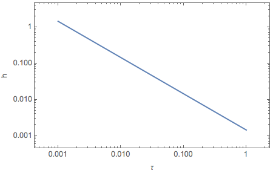
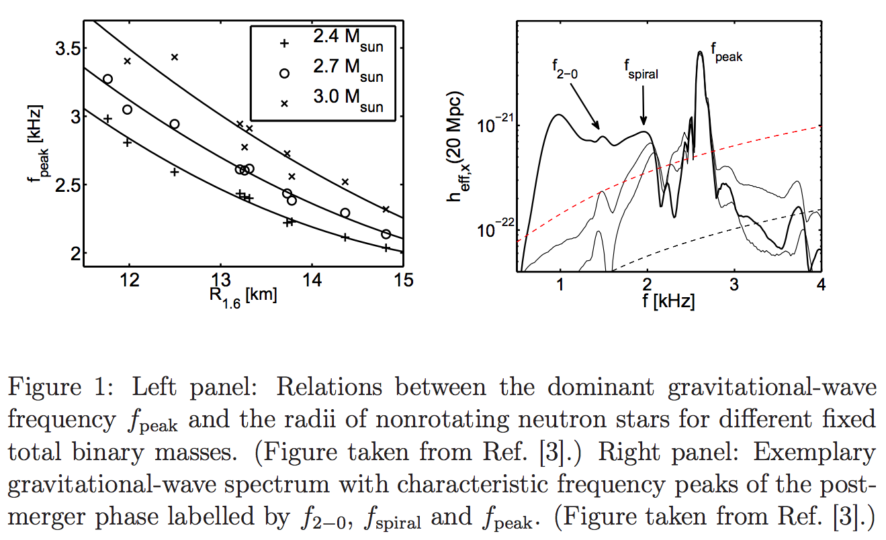

Gravitational Waves
==============================

.. admonition:: Conventions
   :class: warning

   1. We use signature :math:`+2` for the metric.
   2. :math:`\omega,k` are the frequencies from Fourier expansion of the off diagonal element of density matrix.

Basics
----------------------------

In general, we write down the components of metric for weak gravitational field as

.. math::
   g_{\alpha\beta} = \eta_{\alpha\beta} + h_{\alpha\beta},

where :math:`h_{\alpha\beta}` is the perturbation.

In general, a weak gravitational wave has two different modes, the :math:`h_+` mode [Schutz]_,

.. math::
   h_{\alpha\beta} \to \begin{pmatrix}
   0 & 0 & 0 & 0 \\
   0 & h_+ & h_\times & 0 \\
   0 & h_\times & -h_+ & 0 \\
   0 & 0 & 0 & 0
   \end{pmatrix},

where

.. math::
   h_+ &= A_{xx} \cos(\omega_{gw}(t-z))\\
   h_\times &= A_{xy} \sin(\omega_{gw}(t-z)).

.. admonition:: Binary Neutron Stary System
   :class: note

   In a binary neutron star system, which we detect at a distance :math:`r`, the gravitational waves carries the metric [Hendry2007]_

   .. math::
      h_{xx} &= -h_{yy} =h\cos(4\pi f t)\\
      h_{xy}&=h_{yx} = - h\sin (4\pi f t),

   where

   .. math::
      h = \frac{ 32\pi^2 G M R^2 f^2 }{c^4 r}.

For simplicity, we ignore the cross terms and consider only the diagonal elements in perturbation, aka :math:`h_+` polarization, the metric should be

.. math::
   g_{\alpha\beta}\to \begin{pmatrix}
   -1 & 0 & 0 & 0 \\
   0 & 1 + h_+ & 0 & 0 \\
   0 & 0 & 1-h_+ & 0 \\
   0 & 0 & 0 & 1
   \end{pmatrix}.

where

.. math::
   h_+ = A_{xx} \cos(\omega_{gw}(t-z)).

There are many sources of gravitational waves. Neutron star megers, even burst in supernova explosions.

.. admonition:: What Metric
   :class: note

   In principle, the metric near neutron star megers are complicated. For approximations, I would like to propose a Kerr metric plus the perturbations.

   However, Kerr metric is still too complicated for neutrino oscillations. I would argue that the angular momentum is not that large and we could simply use a Schwarzchild metric as the background metric.

   So the first case study would be Schwarzchild metric plus the plane wave gravitational perturbation.

   For vacuum oscillation, Schwarzchild metric has no effect on the flavor oscillations.

Some Estimations
------------------------

Magnitude of Strain
~~~~~~~~~~~~~~~~~~~~~~~~~~~

As an estimation, the power of gravitation waves drop as :math:`1/r^2`. Thus the strain drops as :math:`1/r`.

For compact binary coalescence, the circular polarized wave at distance r is [Riles2013]_

.. math::
   h(t) =  \frac{1}{r} \left( \frac{5 G^5 M^5}{2 c^{11}} \right)^{1/4} \frac{1}{(t_{\mathrm{coal}} -t)^{1/4}},

which shows that the frequency diverges at :math:`t_{\mathrm{coal}}`.

In the astrophysicists' form, we have [Riles2013]_

.. math::
   h(\tau) = (1.7\times 10^{-23}) \left( \frac{15\mathrm{Mpc}}{r} \right) \left( \frac{1 \text{ day} }{\tau} \right)^{1/4} \left( \frac{M}{1.4M_{\odot}}\right)^{5/4}.

As an estimation, we can show that at :math:`r=1000 km` from the source,

.. math::
   h(\tau) \sim 10^{-6}\left( \frac{1 \text{ day} }{\tau} \right)^{1/4} \left( \frac{M}{1.4M_{\odot}}\right)^{5/4}.

As an example, we plot the evolution as a function of :math:`\tau` for 1.4 solar mass binaries.

   Binary mergers. In the beginning, gravitational waves are very strong.

.. admonition:: Strong Field
   :class: warning

   However, the problem is, for stong waves, this estimation fails. I need to find a paper that numerically calculates the strain for strong fields.

   **And I haven't found the right paper.**

The size of the disk of neutron star mergers are of the order :math:`10 km` [Foucart2012]_.

Some Scales
~~~~~~~~~~~~~~~~~~~~

1. Vacuum frequency: :math:`\omega_v = 3.75\times 10^{-11}eV \frac{ \delta m^2 }{ 7.5\times 10^{-5} \mathrm{eV^2} } \frac{1\mathrm{MeV} }{E}`.
2. Vacuum frequency corresponds to oscillation length scale of :math:`L_v \sim 197\times 10^6\times \frac{ 1 }{ \omega_v } \approx 10^1 \mathrm{km}`.
3. The gravitational wave frequency are usually of the order kHz [Bauswein2016]_. Such a frequency corresponds to a periodic potential in space, which has a length scale of :math:`L_{GW} \sim 3\times 10^{5}\mathrm{km/s} \times 10^{-3} \mathrm{s}\sim 10^2 \mathrm{km}`.

   Gravitational wave frequencies and their strains. [Bauswein2016]_

Build a Model
------------------------------

I need a practical model to demonstrate the effect and be able to numerically solve it up to nonlinear regime of neutrino oscillations.

In any case, we could linearize the equation of motion and explore the linear regime. With the help of dispersion relation, the linear regime can be analyzed.

In principle, the equation of motion is changed due to gravitational field with derivatives becoming covariant ones. However, for fast neutrino oscillations, we can consider the local effect by ignoring the connections. I have to replace the Minkowski metric with the metric of gravitational waves. Without any calculation, I expect gravitational waves breaks the symmetrics intrinsically. For example it breaks the degeneracy of the MAA solution for axial symmetric system.

.. admonition:: Shashank's Comment
   :class: warning

   He said that a possible resonance could bring in other effects.

   **Update (20/03/2017)**:

   I think this is a very nice point. If we write down the Dirac equation for neutrino oscillations in matter [Cardall1996]_,

   .. math::
      [\gamma^\mu(\partial_\mu + i A_{f\mu} \mathscr P_L) + M_f] \psi_f = 0,

   where :math:`A_{f\mu}` is the neutrino-matter interaction.

   For stimulated oscillations, this "potential" :math:`A_{f\mu}` is periodic.

   The vacuum oscillation in gravitational field is determined by [Cardall1996]_

   .. math::
      [\gamma^\mu e^\mu_a (\partial_\mu + \Gamma_{\mu})+M]\psi=0,

   where :math:`\Gamma_\mu` is the so called spin connection, which has the form

   .. math::
      \Gamma_\mu = \frac{1}{8} [\gamma^b,\gamma^c] e^\nu_b e_{c\nu;\mu}.

   Cardall and Fuller calcualted the contribution from gravity

   .. math::
      \gamma^a e^\mu_a \Gamma_\mu = \gamma^a e_a^\mu \left[ i A_{G\mu} \left( - (-g)^{-1/2} \frac{\gamma_5}{2} \right) \right],

   where

   .. math::
      A_G^\mu = \frac{1}{4} \sqrt{-g} e_a^\mu \epsilon^{abcd} (e_{b\nu,\sigma} - e_{b\sigma,\nu})e^\nu_{c} e^\sigma_d.

   For gravitational waves, it effectively provides a potential that is periodic since :math:`-g` has periodic components.

   As for length scales, vacuum oscillations (10MeV) has length scale :math:`10^2\,\mathrm{km}`, while GW from neutron star mergers has length scale :math:`10^2\,\mathrm{km}`. They are of the same order.

   Another point is that matter effect increases the oscillation length scales.

Resonances
------------------------------

Stimulated Transitions
~~~~~~~~~~~~~~~~~~~~~~~~~~~~~

**In this section, we will try to verify Shashank's idea about resonance.**

For resonance of linear EoM, we do not need to consider neutrino self-interactions.

.. admonition:: What's the EoM
   :class: warning

   We need a Schrodinger equation formalism instead of the Dirac equation one. Here I am going to use the one derived by Cardall and Fuller [Cardall1996]_.

We need to calculate the vector potential

.. math::
   \vec A_{gw} = \frac{1}{4} \sqrt{ -g } e_a^\mu \epsilon^{abcd} ( e_{b\nu,\sigma} - e_{b\sigma,\nu} ) e_c^\nu e_d^\sigma,

where :math:`e_a^\mu` is the tetrad and :math:`g=\mathrm{det}(g_{\mu\nu})`.

First of all, we use gravitational waves in a background of Schwarzchild metric, which is mimicking the neutron star mergers.

As an approximation, use the tetrad from Schwarzchild metric, and plug in gravitational waves to :math:`\sqrt{-g}`.

The potential then is

.. math::
   \vec A_{gw} = \sqrt{-g} \vec A_{S},

where :math:`\vec A_{S}` is the potential from Schwarzchild metric. The intereting part is that

.. math::
   \sqrt{-g} = \sqrt{1- (h_+^2 + h_\times^2)}.

For neutron star megers,

.. math::
   h_+^2 + h_\times^2= h_0^2 (\cos^2 (\omega_{gw}(t-z)) + \sin^2 (\omega_{gw}(t-z)) ) = h_0^2,

which is a constant. So we observe nothing new.

.. admonition:: Are the approximations valid?
   :class: warning

   First of all, I used the tetrad from Schwarzchild metric. This is in principle of the same order of :math:`\sqrt{-g}`.

   Secondly, I used time independent equation. For gravitational waves, we need time dependent equation.

MSW-like Transition
~~~~~~~~~~~~~~~~~~~~~~~~~~~~~~

.. admonition:: Some Estimations
   :class: note

   The scale of :math:`\vec A` is determined by :math:`\dot a/a=H`. For a MSW resonance, we require the energy scale of :math:`\vec A` to go through a value that is of the order of vacuum oscillation frequency.

   For convinience of comparision with previous calculations, we use length scale instead of energy scales.

   For 1MeV neutrinos, the length scale associated with oscillations is of the order 10km. We can find the corresponding H that is of the same order of length. It turns out to be

   .. math::
      H \sim 10^3 \frac{1}{ \mathrm{s} } \sim 10^3 \frac{10^{19}\mathrm{km}}{ \mathrm{s} \mathrm{Mpc} } \sim 10^{22} \mathrm{km/s/Mpc}.

   This is a huge Hubble parameter. Not sure if it means anything anymore.

   If we consider the low energy neutrinos. But for a reasonable Hubble parameter, we have to consider very low energy even non-relativistic neutrinos. Not really something that can be worked out.

Regardless of the estimation, the formalism can be calcualted using [Cardall1996]_ and [Chirata]_.

The tetrad to be used is

.. math::
   e^0_a &= (1,0,0,0) \\
   e^1_a &= (0,1/a,0,0) \\
   e^2_a &= ( 0,0,1/(a\sqrt{k(\chi)}),0 ) \\
   e^3_a &= ( 0,0,0, 1/( a\sqrt{k(\chi)} \sin\theta ) ),

where the line element is

.. math::
   ds^2 = - dt^2 + a^2 \left[ d\chi^2 + k(\chi) (d\theta^2 + \sin^2\theta d\phi^2) \right].

Nonlinear Effect
------------------------------

To consider the nonlinear effect on neutrino flavor conversions, we can apply linear stability analysis.

Polarization Tensor
~~~~~~~~~~~~~~~~~~~~~~~~~~~~~~~~

I can use polarization tensor to solve the linear regime [Izaguirre2017]_. This method is nothing different from solving the linearized EoM for k and finding the imaginary part in it.

.. admonition:: Comments on Dispersion Relation
   :class: note

   Any dispersion relation :math:`f(\omega,k)=0` indicates whether it is possible to have imaginary parts in :math:`\omega,k`.

   What we usually do is to set :math:`\omega=0` and find :math:`k`.

   The equation of motion is simply of the form

   .. math::
      v^\mu k_\mu Q = v^\mu a_\mu,

   where :math:`Q` is the amplitude of Fourier mode. So in principle we could simply change all the Minkowski metric to the one with perturbation.

   There is another concern. The integrals also depends on the metric. But it is of a smaller effect. We need to prove this/make sense of it.

Gravitational Waves + Mode
~~~~~~~~~~~~~~~~~~~~~~~~~~~~~~~

.. admonition:: Assumptions
   :class: warning

   Assume the EoM derived by Raffelt is valid for weak gravitational field, as explained above.

   As an approximation, we do not consider other effects on Schrodinger equation but only the change in distances.

The polarization tensor

.. math::
   \Pi^\mu_\nu = g^\mu_\nu + \int \frac{d\Gamma}{4\pi} \frac{v^\mu v_\nu}{g_{\mu\nu}k^\mu v^\nu}.

Since we choose to calculate the dispersion relation in :math:`k_z` direction, :math:`g_{\mu\nu}k^\mu v^\nu=\omega - g_{33} k^z v^z`.

The first situation we demonstrate is for gravitational waves propagating in :math:`z` direction. At a certain time and z, we can write down the dispersion relation,

.. math::
   I + \begin{pmatrix}
   \frac{1}{2} I_0 & 0 & 0 & -\frac{1}{2}I_1\\
   0 & -\frac{1}{4}(1+h_+) (I_0-I_2) & 0  & 0 \\
   0 & 0 & -\frac{1}{4}(1+h_+) (I_0-I_2) & 0  \\
   \frac{1}{2}I_1 & 0 & 0 & -\frac{1}{2}I_2
   \end{pmatrix},

where :math:`h_+\sim h_0 \cos (\omega_{gw}(t-z))` is small, so we expect small effect from + mode. At least we do not expect something completely different.

Gravitational Waves x Mode
~~~~~~~~~~~~~~~~~~~~~~~~~~~~~~~

The x mode will bring in cross terms. The polarization tensor becomes

.. math::
   I + \begin{pmatrix}
   \frac{1}{2} I_0 & 0 & 0 & -\frac{1}{2}I_1\\
   0 & -\frac{1}{4}(1+h_+) (I_0-I_2) & \frac{1}{4} h_\times (I_0-I_2)  & 0 \\
   0 & \frac{1}{4}h_\times (I_0 - I_2) & -\frac{1}{4}(1+h_+) (I_0-I_2) & 0  \\
   \frac{1}{2}I_1 & 0 & 0 & -\frac{1}{2}I_2
   \end{pmatrix}.

To look at the MAA solution, we need to write down the eigenvalues for the 2 by 2 matrix in the center. We fine the relation between :math:`\omega` and :math:`k` is

.. math::
   4 &= -(1-h_+ - h_\times) (I_0-I_2)\\
   4 &= -(1-h_+ + h_\times) (I_0-I_2).

For neutron star mergers, :math:`h_\times=-h_+`. The first solution is reduced to the flat space time solution.

.. admonition:: A Lot More to Think abut
   :class: warning

   How can I make sure I am can use this method?

   Even the previous calculations are valid, gravitational waves seems to break the symmetries in the emission surface. The question to ask is **the effect of breaking emission surface symmetry anyway**.

References and Notes
-----------------------

.. [Schutz] A First Course in General Relativity, Bernard Schutz.
.. [Hendry2007] `An Introduction to General Relativity, Gravitational Waves and Detection Principles <http://star-www.st-and.ac.uk/~hz4/gr/hendry_GRwaves.pdf>`_, Dr Martin Hendry. This discussion about the gravitational waves in a binary neutron star system is for slow motion approximation.
.. [Riles2013] K. Riles, `Gravitational waves: Sources, detectors and searches <http://dx.doi.org/10.1016/j.ppnp.2012.08.001>`_, Progress in Particle and Nuclear Physics, Volume 68, January 2013, Pages 1-54, ISSN 0146-6410.
.. [Foucart2012] Francois Foucart, `Black-hole–neutron-star mergers: Disk mass predictions <http://journals.aps.org/prd/abstract/10.1103/PhysRevD.86.124007>`_, Phys. Rev. D 86, December 2012.
.. [Izaguirre2017] Izaguirre, I., Raffelt, G., & Tamborra, I. (2017). `Fast Pairwise Conversion of Supernova Neutrinos: A Dispersion Relation Approach <https://doi.org/10.1103/PhysRevLett.118.021101>`_. Physical Review Letters, 118(2), 21101.

.. [Cardall1996] Cardall, C. Y., & Fuller, G. M. (1996). `Neutrino oscillations in curved spacetime: an heuristic treatment <https://doi.org/10.1103/PhysRevD.55.7960>`_, 55(12), 7.

.. [Bauswein2016] A. Bauswein, J. Clark, N. Stergioulas, H.-T. J. (n.d.). Dynamics and gravitational-wave emission of neutron-star merger remnants, arXiv:1602.00950. Retrieved from https://arxiv.org/abs/1602.00950

.. [Chirata] `Lecture notes on Cosmology <http://www.tapir.caltech.edu/~chirata/ph217/lec01.pdf>`_

Kip Thorne wrote a review paper about gravitational waves: `The Generation of Gravitational Waves: A Review of Computational Tecniques <https://www.its.caltech.edu/~kip/scripts/PubScans/II-68.pdf>`_.

A paper about modern techniques: `Extracting Physics from Gravitational Waves <http://www.nikhef.nl/pub/services/biblio/theses_pdf/thesis_T_G_F_Li.pdf>`_.
