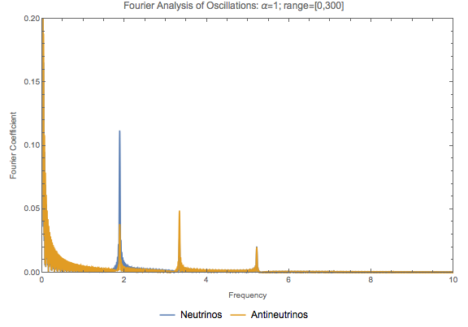

2017-10 Group Meeting
========================

2017-10-05
------------------------

Bipolar model with matter effect. (`link <http://docs.neutrino.xyz/pictures/flavor-isospin.html#bipolar-with-matter>`_)

   With :math:`\alpha=1`, :math:`\lambda=\cos 2\theta_v`, :math:`\mu=3\omega`, where everything is in unit of :math:`\omega`. Range of calculation is :math:`[0,300]`.

The frequencies are 1.95547, 3.39437, 5.25602.

The plots obviously show that the NFIS's going through three fourier modes,

.. math::
   A_1 \cos( \gamma_1 t ) + A_2 \cos( \gamma_2 t ) + A_3 \cos( \gamma_3 t ).

.. admonition:: Guess
   :class: note

   It should be

   .. math::
      \mathbf P = \sum_{i=1}^3 \mathbf P_{f,i} \cos(\gamma_i t).

Before we work out the data fitting, it would be nice if I can find the relation between the parameters and coefficients and frequencies.

I should work out :math:`\alpha=0.5,0.8,1,1.2,1.5`, :math:`\mu=0.5,1,2,3`, as well as some change in :math:`\lambda`.

.. admonition:: Observations
   :class: note

   Generally speaking, small :math:`\alpha` enhances the first frequency.

Frist we calculate :math:`\lambda=\cos 2\theta_v` and :math:`\mu=3`

For :math:`\alpha=1`

1. frequencies: {1.95547, 3.39437, 5.25602}
2. A: {0.111267, 0.0282127, 0.021448}
3. Abar: {0.0397217, 0.0496267, 0.0205751}

For :math:`\alpha=0.8`

1. frequencies: {1.50333, 3.4475, 4.96213}
2. A: {0.146606, 0.0257919, 0.0199095}
3. Abar: {0.0434389, 0.038914, 0.0167421}

For :math:`\alpha=0.6`

1. {1.16424, 3.59444, 4.72477}
2. {0.189593, 0.021267, 0.0167421}
3. {0.0459276, 0.0316742, 0.0153846}

For :math:`\alpha=0.5`

1. frequencies: {1.03651, 3.58314, 4.6279}
2. A: {0.225792, 0.0217194, 0.0134389}
3. Abar: {0.0459276, 0.0255656, 0.0104072}

So the amplitude for neutrinos seems to be changing linearly as a function of :math:`\alpha`.

Keep :math:`\alpha=1` and :math:`\lambda=\cos 2\theta_v`, while change :math:`\mu`.

For :math:`\mu=2`.

1. Frequencies: {1.46942, 2.91624, 4.38567}
2. A: {0.122172, 0.0303167, 0.0217195}
3. Abar: {0.0312217, 0.0533937, 0.0190045}

I consider the amplitudes unchanged but the frequencies are shifted to lower values.
