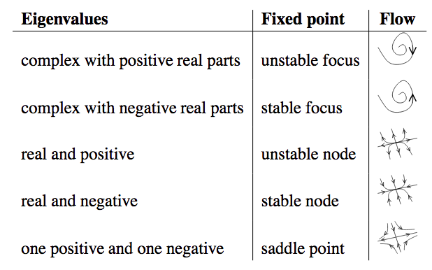

Flavor Isospin Method
==========================================

Flavor Isospin Applied
-------------------------------------------

Using flavor isospin, the equation of motion is written as

.. math::
   \frac{d\vec s}{dx} = \vec{s} \times \vec H,

where

.. math::
   \vec s = \begin{pmatrix}
   \mathrm{Re}(\psi_1^*\psi_2) \\
   \mathrm{Im}(\psi_1^*\psi_2) \\
   (\lvert \psi_1 \rvert^2 - \lvert \psi_2 \rvert^2)/2.
   \end{pmatrix}

.. admonition:: Background Matter Basis
   :class: hint

   In background matter basis the Hamiltonian vector is

   .. math::
      \vec H = \begin{pmatrix}
      \delta \lambda(x) \sin 2\theta_m \\
      0 \\
      \omega_m - \delta \lambda(x) \cos 2\theta_m
      \end{pmatrix}.

   For two perturbations, we write it as

   .. math::
      \vec H = \begin{pmatrix}
      0 \\
      0 \\
      \omega_m
      \end{pmatrix} + \begin{pmatrix}
      \delta \lambda_1(x) \sin 2\theta_m \\
      0 \\
       - \delta \lambda_1(x) \cos 2\theta_m
      \end{pmatrix} + \begin{pmatrix}
      \delta \lambda_2(x) \sin 2\theta_m \\
      0 \\
       - \delta \lambda_2(x) \cos 2\theta_m
      \end{pmatrix}.

   The initial condition is

   .. math::
      \Psi(0) = \begin{pmatrix}
      1 \\
      0
      \end{pmatrix},

   which corresponds to a flavor isospin vector

   .. math::
      \vec s(0) = \frac{1}{2} \begin{pmatrix}
      0 \\
      0 \\
      1
      \end{pmatrix}.

.. admonition:: T-basis
   :class: hint

   In this basis, the Hamiltonian is

   .. math::
      H_1 &= -\frac{\omega_m}{2} \sigma_3 - \frac{\delta \lambda}{2} \sin 2\theta_m \begin{pmatrix}
      0 & e^{2i\eta_1(x)} \\
      e^{-2i\eta_1(x)} & 0
      \end{pmatrix} \\
      & = -\frac{\omega_m}{2} \sigma_3 +\frac{\delta \lambda}{2} \sin 2\theta_m \sin 2\eta_1(x) \sigma_2  - \frac{\delta \lambda}{2} \sin 2\theta_m \cos 2\eta_1(x) \sigma_1,

   or

   .. math::
      H_2 &= - \frac{\delta \lambda}{2} \sin 2\theta_m \begin{pmatrix}
      0 & e^{2i\eta_2(x)} \\
      e^{-2i\eta_2(x)} & 0
      \end{pmatrix} \\
      &= \frac{\delta \lambda}{2} \sin 2\theta_m \sin 2\eta_2(x) \sigma_2  - \frac{\delta \lambda}{2} \sin 2\theta_m \cos 2\eta_2(x) \sigma_1,

   where the background is removed from diagonal elements in :math:`H_1` but not in :math:`H_2`.

   The corresponding vectors are

   .. math::
      \vec H_1 = \begin{pmatrix}
      \delta\lambda \sin 2\theta_m \cos 2\eta_1(x) \\
      -\delta\lambda \sin 2\theta_m \sin 2\eta_1(x)\\
      \omega_m
      \end{pmatrix},

   and

   .. math::
      \vec H_2 = \begin{pmatrix}
      \delta\lambda \sin 2\theta_m \cos 2\eta_2(x) \\
      -\delta\lambda \sin 2\theta_m \sin 2\eta_2(x)\\
      0
      \end{pmatrix}.

   Given the initial condition in background matter basis

   .. math::
      \Psi(0) = \begin{pmatrix}
      1 \\
      0
      \end{pmatrix},

   we have to apply the T transformation to get the initial condition in the T-basis

   .. math::
      \Psi_1(0) &=  \begin{pmatrix} e^{i \eta_1 (x)} & 0 \\  0 & e^{-i \eta_1 (x)}  \end{pmatrix}\Psi(0) = \begin{pmatrix} e^{i \eta_1 (x)} \\  0 \end{pmatrix} \\
      \Psi_2(0) &=  \begin{pmatrix} e^{i \eta_2 (x)} & 0 \\  0 & e^{-i \eta_2 (x)}  \end{pmatrix}\Psi(0) = \begin{pmatrix} e^{i \eta_2 (x)} \\  0 \end{pmatrix},

   which correspond to flavor isospin vectors

   .. math::
      \vec s_1(0) = \vec s_2(0) = \vec s(0) = \frac{1}{2} \begin{pmatrix}
      0 \\
      0 \\
      1
      \end{pmatrix},

   since the T transformation is unitary.

.. admonition:: Modes
   :class: hint

   For each mode of the multi-frequency case, the Hamiltonian is

   .. math::
      H = \frac{1}{2}\begin{pmatrix}
      0 & B_N e^{i(n_i k_i -\omega_m)x} \\
      B_N^* e^{-i(n_i k_i -\omega_m)x} & 0
      \end{pmatrix},

   where :math:`B_N` is either real or pure imaginary,

   .. math::
      B_N &= -(-i)^{\sum_a n_a} \tan 2\theta_m \left( \sum_a n_a k_a \right) \left( \prod_a J_{n_a}\left( \frac{A_a}{k_a}\cos 2\theta_m \right) \right)\\
      & = - \tan 2\theta_m \left( \sum_a n_a k_a \right) \left( \prod_a J_{n_a}\left( \frac{A_a}{k_a}\cos 2\theta_m \right) \right) e^{-i \sum_a n_a \pi/2}\\
      & = \rho_{N} e^{-i \sum_a n_a \pi/2}.

   The Hamiltonian vector is

   .. math::
      \vec H = \begin{pmatrix}
      \rho_N \cos\left( (n_i k_i -\omega_m)x - \sum_a n_a \pi/2 \right) \\
      -\rho_N \sin\left( (n_i k_i -\omega_m)x - \sum_a n_a \pi/2 \right) \\
      0
      \end{pmatrix}.

Equilibrium Points, Linear Stability Analysis, and Limit Cycles
-------------------------------------------------------------------------

In background matter basis, the equation of motion is

.. math::
   \frac{d}{dx}\begin{pmatrix}
   s_1 \\
   s_2 \\
   s_3
   \end{pmatrix} = \begin{pmatrix}
   s_1 \\
   s_2 \\
   s_3
   \end{pmatrix}  \times \begin{pmatrix}
   \delta \lambda(x) \sin 2\theta_m \\
   0 \\
   \omega_m - \delta \lambda(x) \cos 2\theta_m
   \end{pmatrix}.

Such a system is still not easy to solve. However, we can use phase portrait to get some information.

The fixed points are obtained by setting :math:`\vec s\times \vec H = 0 = \frac{d}{dx}\vec s`. Even though in general we need to obtain the fixed points first before infering the linear stability, this is not needed since this equation is linear to :math:`\vec s`.

The Jacobian is obtained

.. math::
   J_{mn} & = \frac{d (\vec s\times \vec H)_m}{ds_n} \\
   & = \begin{pmatrix}
   0 & H_3 & -H_2\\
   -H_3 &  0 & H_1 \\
   H_2 & -H_1 & 0
   \end{pmatrix},

which comes from the result

.. math::
   \vec s\times \vec H = \begin{pmatrix}
   s_2 H_3 - s_3 H_2 \\
   s_3 H_1 - s_1 H_3 \\
   s_1 H_2 - s_2 H_1
   \end{pmatrix}.

Plugin in the Hamiltonian in background matter basis, the eigenvalues of this Jacobian are

.. math::
   & 0 \\
   & -\frac{1}{\sqrt{2}} \sqrt{ - ( A_1 \sin (k_1 x) -\omega_m )^2 + 2 A_1 \omega_m \sin (k_1 x) (1 - \cos 2\theta_m) }\\
   & \frac{1}{\sqrt{2}} \sqrt{ - ( A_1 \sin (k_1 x) -\omega_m )^2 + 2 A_1 \omega_m \sin (k_1 x) (1 - \cos 2\theta_m) }.

For :math:`- ( A_1 \sin (k_1 x) -\omega_m )^2 + 2 A_1 \omega_m \sin (k_1 x) (1 - \cos 2\theta_m) > 0`, the eigenvalues have real parts, which means the system is a saddle point arround such equilibrium points.

   Eigenvalues of Jacobian and fixed points. Source: `Stability Analysis for ODEs by Marc R. Roussel  <http://people.uleth.ca/~roussel/nld/stability.pdf>`_
