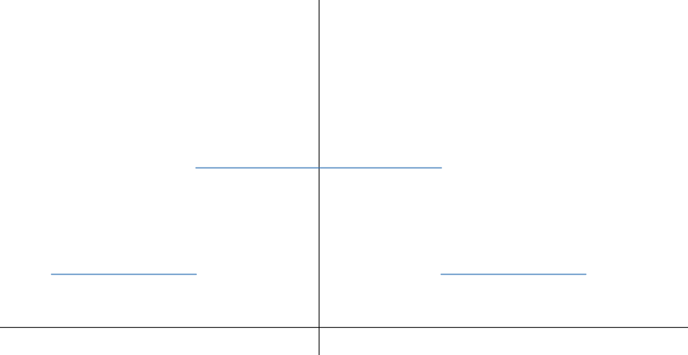

Parametric Resonance Revisted
============================================

For a matter profile

.. math::
   \lambda(x) = \lambda_0 + A\sin( k x),
   :label: parametric-resonance-matter-profile-single-frequency

the parametric resonance condition is [Krastev1989]_

.. math::
   \omega_m \sim n k,

where :math:`k=1,2,3,\cdots`.

.. admonition:: A Minimal Derivation of Parametric Resonance Condition
   :class: note

   This derivation is from [Krastev1989]_.

   On one matter profile wavelength, the accumulated phase of the system should be a multiple of :math:`2\pi`,

   .. math::
      \int_0^{2\pi/k} \omega_m = 2\pi n,

   where

   .. math::
      \omega_m = \omega_v \sqrt{ (\lambda(x)/\omega_v - \cos 2\theta_v)^2 + \sin^2 2\theta_v }.

   :math:`\omega_m` doesn't change a lot during one matter profile oscillation wavelength :math:`2\pi/k`, thus we perform the integration by treating the integrand as a constant, which returns

   .. math::
      \omega_m \frac{2\pi}{k} =2\pi n,

   which can be simplified

   .. math::
      \omega_m = n k.

For matter profile :eq:`parametric-resonance-matter-profile-single-frequency`, we already know that this is the condition of resonance from Rabi oscillation.

Castle Wall - Direct Rotation Using T Matrix
----------------------------------------------------------------

Matter profile

.. math::
   \lambda(x) = \begin{cases} \lambda_1, \quad 0 \leq \mathrm{Mod}[x] \leq X_1  \\  \lambda_2, \quad  X_1 < \mathrm{Mod}[x] < X_1+X_2  \end{cases},
   :label: parametric-resonance-castle-wall-profile

which is periodic with period :math:`X \equiv X_1 + X_2`.

We can, on first thought, rotate the system first, which gives us the Hamiltonian

.. math::
   H^{(f)} = -\frac{\omega_v}{2} \cos 2\theta_v \sigma_3 + \frac{1}{2} \omega_v \sin 2\theta_v \begin{pmatrix}
   0 & \exp\left( i\int_0^x \lambda(\tau) d\tau + 2i \eta(0) \right) \\
   \exp\left( -i\int_0^x \lambda(\tau) d\tau - 2i \eta(0) \right) & 0
   \end{pmatrix},

where :math:`\eta(0)` is the initial condition we chose for

.. math::
   \frac{d}{dx}\eta(x) = \frac{\lambda(x)}{2}.

For :math:`x<X_1`, we have

.. math::
   i\int_0^x \lambda(\tau) d\tau + 2i \eta(0) = i \lambda_1 x,

while for :math:`X_1<x<X_1+X_2`, we have

.. math::
   i\int_0^x \lambda(\tau) d\tau + 2i \eta(0) = i \lambda_1 X_1 + i \lambda_2 (x-X_1).

One of the important conclusion from the research in Rabi oscilations is that the constant phase term has no effect on the system at all. Thus even for a much larger x, we can always drop the constant phase :math:`i(\lambda_1X_1+\lambda_2X_2)N` which is obtained through integration over N periods. What's more, the term :math:`i \lambda_1 X_1` and :math:`-i\lambda_2X_1` can also be dropped.

At this point, we would conclude that the resonance condition should be obtained by setting either mode :math:`e^{i\lambda_1 x}` or :math:`e^{i\lambda_2 x}`.

.. admonition:: TO DO
   :class: warning

   1. **NUMERICAL CALCULATIONS?**
   2. :strike:`I can not relate this result with the Akhmedov condition.` (See update `Clarification of Resonance Condition <#clarification-of-the-resonance-condition>`_.)

.. _clarification-of-the-resonance-condition:

.. admonition:: Clarification of Resonance Condition
   :class: hint

   The idea of increasing in transition is initial condition related. If we set the resonance for matter density :math:`\lambda_1`, after a evolution of distance :math:`X_1`, the state of the system has changed and the corresponding flavor isospin vector is not on the direction of z axis anymore. Thus we do not have a simple prediction of evolution across :math:`X_2` unless we know the state right before this evolution.

   From this simple argument, we have a hint that the resonance could well depend on period of the matter profile.

Castle Wall Profile - Fourier Series
----------------------------------------------------------------

First Attemptation: Full Fourier Series
~~~~~~~~~~~~~~~~~~~~~~~~~~~~~~~~~~~~~~~~~~~~~~~~~~~~~~~~~~~~~~

Another approach is to decompose the system into a lot of sin or cos modes so that we can use the result we had before.

Such a periodic matter profile :eq:`parametric-resonance-castle-wall-profile` can be decomposed using Fourier series,

.. math::
   \lambda(x) = \sum_{n=-\infty}^{\infty} \Lambda_n \exp\left( \frac{i2\pi n x}{X} \right) = \sum_{n=-\infty}^{\infty} \Lambda_n \exp\left( i \omega_0 n x \right),

where :math:`\omega_0 = \frac{2\pi}{X}`. The coefficients are evaluated using the orthogonal relation of exponentials for :math:`n\neq 0`,

.. math::
   \Lambda_n &= \frac{1}{X} \int_0^X \lambda(x) e^{ - i \omega_0 n x} dx \\
   & = \frac{1}{X} \left( \int_{0}^{X_1} \lambda_1 e^{ - i \omega_0 n x} dx + \int_{X_1}^{X_1+X_2} \lambda_2 e^{ - i \omega_0 n x} dx  \right) \\
   & = \frac{1}{X} \frac{X}{-i2\pi n} \left( \lambda_1 e^{-i\omega_0 n X_1} + \lambda_2 \left( e^{-i\omega_0 n X} - e^{-i\omega_0 n X_1}  \right) \right) \\
   & = \frac{i}{2\pi n} \left( -\lambda_1 + (\lambda_1 - \lambda_2) e^{-i2\pi n X_1/X} + \lambda_2 e^{-i 2\pi n} \right).
   :label: parametric-resonance-castle-wall-fourier-coeff

For n=0, we have

.. math::
   \Lambda_0 = \frac{X_1 \lambda_1 + X_2 \lambda_2}{X}.

.. admonition:: Verification of This Result
   :class: note

   We can verify this result by setting :math:`\lambda_1 =\lambda_2 = \lambda`, which should give use the result :math:`\Lambda_n = \frac{i}{2\pi n}\lambda (e^{- i 2\pi n} - 1)`. By setting :math:`\lambda_1 =\lambda_2 = \lambda` in the last step of :eq:`parametric-resonance-castle-wall-fourier-coeff`, we have the result that matches our expectation.

   Another more complete way to verify this result is to compare the numerical results using this Fourier series and the original profile, which is shown in :numref:`parametric-resonance-reconstruction-of-castle-wall-0point01-0point02-1-1point8`.

   .. _parametric-resonance-reconstruction-of-castle-wall-0point01-0point02-1-1point8:

   .. figure:: assets/parametric-resonance/reconstruction-of-castle-wall-0point01-0point02-1-1point8.png
      :align: center

      Reconstruction of castle wall profile using Fourier series.

.. admonition:: Akhmedov's Castle Wall Parametric Resonance Condition
   :class: note

   The resonance condition is given by

   .. math::
      \frac{\tan (\omega_{m1}X_1/2)}{\tan (\omega_{m2}X_2/2)} = - \frac{\cos 2\theta_{m2}}{\cos 2\theta_{m1}} = - \frac{ \cos 2\theta_v - \lambda_1/\omega_v }{  \cos 2\theta_v - \lambda_2/\omega_v } \frac{ \sqrt{ (\lambda_2/\omega_v)^2  + 1 - 2\cos 2\theta_v \lambda_2/\omega_v } }{ \sqrt{ (\lambda_1/\omega_v)^2  + 1 - 2\cos 2\theta_v \lambda_1/\omega_v } }.

   This is rather opaque.

To find out the Rabi modes, we first rotate to the rotation frame using T matrix. Since the Hamiltonian in flavor basis is

.. math::
   H^{(f)} = -\frac{\omega_v}{2} \cos 2\theta_v \sigma_3 + \frac{\omega_v}{2} \sin 2\theta_v \sigma_1  + \frac{1}{2}  \sum_{n=-\infty}^{\infty} \Lambda_n \exp\left( i \omega_0 n x \right) \sigma_3.

We notice that the 0-mode is a constant which plays a role as the background matter profile. We should rotate to the background matter basis first because the zero mode is always there and will generate some flavor transitions. However, this is not anything special but the constant matter flavor transitions. :highlight-text:`Rotating to the background matter profile allows us to concentrate on the actual parametric effect.` To do so we rewrite the Hamiltonian

.. math::
   H^{(f)} = -\frac{\omega_v}{2} \cos 2\theta_v \sigma_3 + \frac{\omega_v}{2} \sin 2\theta_v \sigma_1  + \left( \frac{1}{2}\Lambda_0  + \frac{1}{2}  \sum_{q=-\infty, q\neq 0}^{\infty} \Lambda_q \exp\left( i \omega_0 q x \right) \right) \sigma_3,

where we treat :math:`\Lambda_0` as the background matter profile. For simplifity we define

.. math::
   \delta \lambda =  \sum_{q=-\infty, q\neq 0}^{\infty} \Lambda_q \exp\left( i \omega_0 q x \right),

so that

.. math::
   H^{(f)} = -\frac{\omega_v}{2} \cos 2\theta_v \sigma_3 + \frac{\omega_v}{2} \sin 2\theta_v \sigma_1  + \left( \frac{1}{2}\Lambda_0  + \frac{1}{2}  \delta \lambda \right) \sigma_3.

The Hamiltonian in background matter basis becomes

.. math::
   H &= - \frac{1}{2}\omega_m \sigma_3 + \frac{1}{2} \delta\lambda - \frac{1}{2} \delta \lambda \sigma_1 \\
   &= - \frac{1}{2}\omega_m \sigma_3  + \frac{1}{2} \sum_{q=-\infty, q\neq 0}^{\infty} \Lambda_q e^{i q \omega_0 x} \cos 2\theta_m \sigma_3 - \frac{1}{2} \sum_{q=-\infty, q\neq 0}^{\infty} \Lambda_q e^{i q \omega_0 x} \sin 2\theta_m \sigma_1.

.. admonition:: Rotating to Background Matter Basis
   :class: hint

   The Hamiltonian in background basis is

   .. math::
      H = U^\dagger H^{(f)} U,

   where

   .. math::
      U = \begin{pmatrix}
      \cos \theta_{\mathrm{m}} & \sin \theta_{\mathrm{m}} \\
      -\sin \theta_{\mathrm{m}} & \cos \theta_{\mathrm{m}}
      \end{pmatrix} = \cos \theta_m I + i\sin \theta_m \sigma_2.

   where :math:`\sin \theta_m` and :math:`\cos \theta_m` are the corresponding values for background matter density equals :math:`\Lambda_0`. We also know that

   .. math::
      &\frac{1}{2}\omega_v\left( \Lambda_0/\omega_v \cos 2\theta_m - \cos 2\theta_v\cos 2\theta_m - \sin 2\theta_v\sin 2\theta_m \right) \\
      =&-\frac{1}{2}\omega_m,

   and

   .. math::
      &\frac{1}{2}\Lambda_0 \sin 2\theta_m - \frac{1}{2} \omega_v \cos 2\theta_v \sin 2\theta_m + \frac{1}{2} \omega_v \sin 2\theta_v \cos 2\theta_m \\
      =& 0.

Then we go to the frame that the z component of Hamiltonina vector is stationary. The caveat here is that the rotation we would use

.. math::
   \begin{pmatrix} \psi_1 \\ \psi_2 \end{pmatrix} = \begin{pmatrix} e^{-i \eta (x)} & 0 \\  0 & e^{i \eta (x)}  \end{pmatrix} \begin{pmatrix} \psi_{s1} \\ \psi_{s2} \end{pmatrix}

is only valid for **real** :math:`\eta(x)` because complex :math:`\eta(x)` will make this transformation **non-unitary**.

:highlight-text:`So this derivation has to stop here.`

The Trick: Even Fourier Series
~~~~~~~~~~~~~~~~~~~~~~~~~~~~~~~~~~~~~~~~~~~~~~~~~~~~~~~~~~~~~~~~

.. admonition:: Fourier Series of Even and Odd Functions
   :class: note

   In general the Fourier series of a periodic function defined on :math:`\left[ -\frac{X}{2}, \frac{X}{2} \right]` is

   .. math::
      \lambda(x) = \frac{a_0}{2} + \sum_{n=1}^\infty a_n \cos(n 2\pi x/X) + \sum_{n=1}^\infty b_n \sin(n 2\pi x/X),

   where

   .. math::
      a_0 & = \frac{2}{X} \int^{X/2}_{-X/2} \lambda(x) d x \\
      a_n & = \frac{2}{X} \int_{-X/2}^{X/2} \lambda(x) \cos ( n2\pi x/X ) dx\\
      b_n & = \frac{2}{X} \int_{-X/2}^{X/2} \lambda(x) \sin( n 2\pi x/X ) dx.

   For EVEN function :math:`\lambda(x)`, we have

   .. math::
      \lambda(x) = \frac{1}{2}a_0 + \sum_{n=1}^\infty a_n \cos (n 2\pi x/X).

   Shifted castle wall profile.

We shift the castle wall profile and make it always even, so that

.. math::
   \lambda(x) = \begin{cases} \lambda_2 , &\quad -\frac{X_2}{2}-\frac{X_1}{2}\le x\le -\frac{X_1}{2} \\
   \lambda_1, &\quad -\frac{X_1}{2}\le x\le \frac{X_1}{2} \\
   \lambda_2, &\quad \frac{X_1}{2}\le x\le \frac{X_1}{2}+\frac{X_2}{2}
   \end{cases}

Fourier series of the profile is

.. math::
   \lambda(x) = \frac{1}{2}\Lambda_0 + \sum_{q=1}^{\infty} \Lambda_q \cos\left( \frac{ 2\pi q x}{X} \right) = \frac{1}{2} \Lambda_0 + \sum_{q=1}^{\infty} \Lambda_q \cos\left( \omega_0 q x \right),

where

.. math::
   \Lambda_0 &= \frac{2}{X} \int^{X/2}_{-X/2} \lambda(x) d x \\
   & = \frac{2}{X} \left(  \lambda_2 X_2 + \lambda_1 X_1   \right) \\
   \Lambda_q &= \frac{2}{X} \int_{-X/2}^{X/2} \lambda(x) \cos(n 2\pi x/X)dx \\
   & = \frac{2}{X} \left( \lambda_2 \int_{-X/2}^{-X_1/2} \cos(n 2\pi x/X)dx + \lambda_1 \int_{-X_1/2}^{X_1/2} \cos(n 2\pi x/X)dx + \lambda_2 \int_{X_1/2}^{X/2} \cos(n 2\pi x/X)dx \right) \\
   & = \frac{2}{q\pi} \left( \lambda_2\left( \sin(q\omega_0 X/2) - \sin(q\omega_0 X_1/2) \right) + \lambda_1 \sin( q\omega_0 X_1/2)  \right)  \\
   & = \frac{2}{q\pi} \left( \lambda_2\left( \sin(q \pi ) - \sin(q \pi X_1/X) \right) + \lambda_1 \sin( q\pi X_1/X)  \right)

.. admonition:: Numerical Verification
   :class: note

   .. _parametric-resonance-reconstruction-of-even-castle-wall-0point01-0point02-1-1point8:

   .. figure:: assets/parametric-resonance/reconstruction-of-even-castle-wall-0point01-0point02-1-1point8.png
      :align: center

      Reconstruction of castle wall profile using Fourier series.

Transform the system into background matter basis, so that we can inspect the stimulated transitions more clearly. As a first step, we rewrite the Hamiltonian

.. math::
   H^{(f)} = -\frac{\omega_v}{2} \cos 2\theta_v \sigma_3 + \frac{\omega_v}{2} \sin 2\theta_v \sigma_1  + \left( \frac{1}{2}\Lambda_0  + \frac{1}{2}  \delta \lambda \right) \sigma_3,

where we define

.. math::
   \delta \lambda = \sum_{q=1}^{\infty} \Lambda_q \cos\left( \omega_0 q x \right).

This profile is exactly a multi-frequency matter profile.

Rotate to the background matter basis

.. math::
   H &= - \frac{1}{2}\omega_m \sigma_3 + \frac{1}{2} \delta\lambda \sigma_3 - \frac{1}{2} \delta \lambda \sigma_1 \\
   &= - \frac{1}{2}\omega_m \sigma_3  + \frac{1}{2} \sum_{q=1}^{\infty} \Lambda_q \cos\left( \omega_0 q x \right) \cos 2\theta_m \sigma_3 - \frac{1}{2} \sum_{q=1}^{\infty} \Lambda_q \cos\left( \omega_0 q x \right) \sin 2\theta_m \sigma_1.

Refs & Notes
----------------

.. [Krastev1989] Krastev, P. I., & Smirnov, A. Y. (1989). Parametric effects in neutrino oscillations. Physics Letters B, 226(3-4), 341–346. doi:10.1016/0370-2693(89)91206-9
