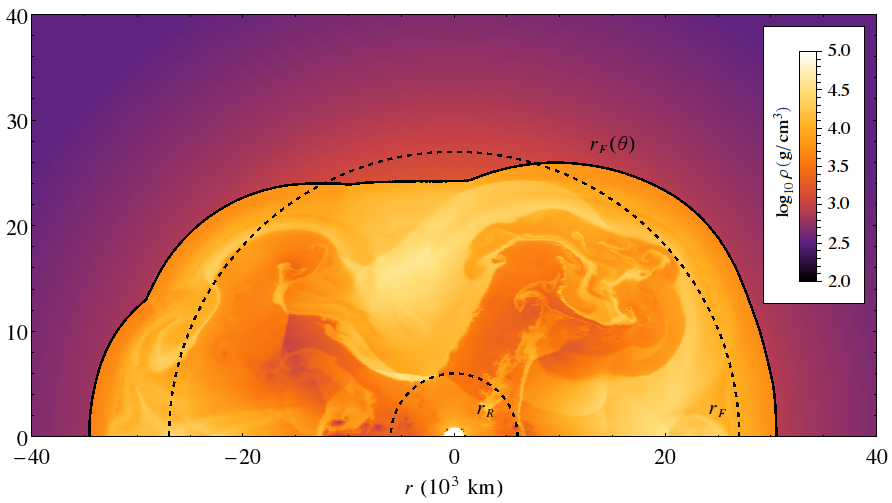

Scales
=================

We need to discuss the scales relavent to different environments.

Supernova
-----------------------

Initial Matter Density Configuration
~~~~~~~~~~~~~~~~~~~~~~~~~~~~~~~~~~~~~~~~~~~~~~~~~~~~

.. figure:: assets/scales/supernova-matter-profile-initial-configuration.png
   :align: center

   Supernova initial matter profile from [shigeyama1990]_.

.. [shigeyama1990] Shigeyama, T., & Nomoto, K. (1990). Theoretical light curve of SN 1987A and mixing of hydrogen and nickel in the ejecta. The Astrophysical Journal, 360, 242. doi:10.1086/169114

Early Stage
~~~~~~~~~~~~~~~~~~~~~~~~~~~~~~~~~~~~~~~~~~~~

One of the interesting stages is the bounce on the core.

To find out the relavent length and energy scales, we need to know

1. size of supernova,
2. matter profile.

From the 2D simulation by E. Borriello et al, the size of supernova at 2sec after the bounce is about :math:`2.7\times 10^4\mathrm{km}` [EBorriello2014]_.

   2D supernova simulation for a 15 solar mass supernova [EBorriello2014]_.

The angle averaged density on radial direction is of the order :math:`10^3\mathrm{g/cm^3}` to :math:`10^5\mathrm{g/cm^3}`.

.. figure:: assets/scales/supernova-radial-density-profile.png
   :align: center

   Supernova 2D simulation radial density (averaged over angles) [EBorriello2014]_.

.. [EBorriello2014] Borriello, E., Chakraborty, S., Janka, H.-T., Lisi, E., & Mirizzi, A. (2014). Turbulence patterns and neutrino flavor transitions in high-resolution supernova models. Journal of Cosmology and Astroparticle Physics, 2014(11), 030–030. doi:10.1088/1475-7516/2014/11/030

.. figure:: assets/scales/earth-density-profile-PREM-model.png
   :align: center

   Earth density profile from PREM model.

That was the densities. As a reference, we can calculate MSW resonance densities for some neutrino energies. The relation between neutrino energy and MSW resonance electron number density is calculated through

.. math::
   \omega_v \cos 2\theta_v = \sqrt{2} G_F n_e .

Move around the terms and we get

.. math::
   n_e &= \frac{\delta m^2 \cos 2\theta_v}{2\sqrt{2} G_F} \frac{1}{E} \\
   &= 7.49\times 10^{-15}\mathrm{GeV^3} \left(  \frac{\delta m^2}{2.6\times 10^{-3}\mathrm{eV^2}} \frac{\cos 2\theta_v}{0.95} \frac{1}{G_F/(1.17\times 10^{-5}\mathrm{GeV^{-2}})} \frac{1}{E/10\mathrm{MeV}} \right),

where we have used :math:`\delta m^2 = \delta m^2_{\mathrm{atm}}`.

Using natural units, we know that

.. math::
   1\mathrm{GeV^3} = 1.3\times 10^{41} \mathrm{cm^{-3}}.

The number density of electrons of MSW resonance is

.. math::
   n_e = 9.74\times 10^{26}\mathrm{cm^{-3}} \left(  \frac{\delta m^2}{2.6\times 10^{-3}\mathrm{eV^2}} \frac{\cos 2\theta_v}{0.95} \frac{1}{G_F/(1.17\times 10^{-5}\mathrm{GeV^{-2}})} \frac{1}{E/10\mathrm{MeV}} \right).

Assuming an electron fraction :math:`Y_e`, which is defined as the ration of electrons to baryons, the mass density is

.. math::
   \rho &= \frac{n_e}{Y_e} \times m_b \\
   & = \frac{ 9.74\times 10^{26} \mathrm{cm^{-3}} \times 1.67\times 10^{-24} \mathrm{g} }{ 0.5 } \frac{1}{ Y_e/0.5 } \left(  \frac{\delta m^2}{2.6\times 10^{-3}\mathrm{eV^2}} \frac{\cos 2\theta_v}{0.95} \frac{1}{G_F/(1.17\times 10^{-5}\mathrm{GeV^{-2}})} \frac{1}{E/10\mathrm{MeV}} \right)\\
   & =  3.25\times 10^3 \mathrm{g/cm^3} \frac{1}{ Y_e/0.5 } \left(  \frac{\delta m^2}{2.6\times 10^{-3}\mathrm{eV^2}} \frac{\cos 2\theta_v}{0.95} \frac{1}{G_F/(1.17\times 10^{-5}\mathrm{GeV^{-2}})} \frac{1}{E/10\mathrm{MeV}} \right),

where I have used :math:`\sin^2(2\theta_v) = \sin^2(2\theta_{13})=0.093` from PDG 2014.

In the case of :math:`\delta m^2 = \delta m^2_{\mathrm{sol}} \sim 7.59\times 10^{-5}\mathrm{eV^2}`, we would have a density that is two orders smaller.

Lengths
~~~~~~~~~~~~~~~~~~~

Assuming energy of neutrinos to be 10MeV, the general idea is that if the stimulated neutrino oscillations have a larger oscillation length than :math:`10^4` km, we don't really need to consider the oscillations. Otherwise, oscillations could cause depolarization or little effect at all.

In this case what should be done is to check whether what are the rel.

Another view is that to see the stimulated neutrino oscillations, we need to find a relavent neutrino energy range.
