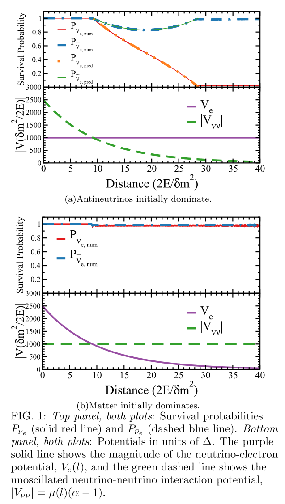

Matter Neutrino Resonance
=================================

[Malkus2014]_ proposed the matter-neutrino-resonance (MNR) transition. They considered a two flavors senario of single energy with both neutrinos and antineutrinos.

They have a system with single energy two flavor neutrinos. The equation of motion contains vacuum term, matter term, and self-interaction term. The matter density drops along z direction so the matter potential could drop. Similarly for neutrino self-interaction term. **The key to realize a possible resonance is the fact that the two potentials can have different signes, which indicates that they could cancel each other at some condition.**

In this work Malkus et al tested on two simple cases. The first one is to decrease neutrino self-interaction potential while keeping matter potential constant. Initally neutrino self-interaction dominates. When the two potential becomes the same order but with different signs, the electron neutrinos are transformed to other flavors. But the anti-neutrino doesn't change that much.

The second case they checked is to keep neutrino self-interaction constant but decrease matter potential strength.

   Electron neutrinos are suppressed [Malkus2014]_. This is different from MSW effect.

This is named Neutrino-Matter Resonance, NMR for short. [Wu2016]_ explained this phenomenon using extended adiabatic MSW solutions to the system. The idea is that the flavor isospin will remain aligned to Hamitlonian if the matter potential and neutrino self-interaction potential are varying slowly and the flavor isospin initially aligned with Hamiltonian in flavor isospin picture.

In the first case of [Malkus2014]_, the flavor isospin is initially aligned Hamiltonian because the self-interaction dominates. Just like solar potential the potential [Malkus2014] uses is decreasing exponentially. We can still consider it as slow variation. When neutrino self-interaction becomes comparable with matter potential, the Hamiltonian vector starts to change direction. In the limit that the matter potential dominates, the flavor isospin will be pointing downwards, which means a larger conversion of flavors.

References and Notes
------------------------

.. [Malkus2014] Malkus, a, Friedland, A., & McLaughlin, G. C. (2014). `Matter-Neutrino Resonance Above Merging Compact Objects <http://arxiv.org/abs/1403.5797>`_, (1), 1–6.
.. [Wu2016] Wu, M.-R., Duan, H., & Qian, Y.-Z. (2016). `Physics of neutrino flavor transformation through matter–neutrino resonances <https://doi.org/10.1016/j.physletb.2015.11.027>`_. Physics Letters B, 752, 89–94.
